# 第九章：第 9 章。现实世界的最佳实践

到目前为止，我们在本书中真的涵盖了很多内容。现在我们到了最后一章。在这里，我们将看看如何结合您学到的所有技能并创建一个可投入生产的模块。为了留下深刻印象，我们将创建一个配置和部署 Kubernetes 作为前端的模块（请注意，将 Kubernetes 作为前端运行有其限制，并不是生产中的最佳选择。模块的 UCP 组件将准备就绪）。由于将涉及大量敏感数据，我们将利用 Hiera。我们将创建一个自定义事实以自动检索 UCP 指纹，并将所有 Kubernetes 组件拆分并使用 interlock 代理我们的 API 服务。我们还将深入研究 UCP，并查看如何将 Docker 守护程序重新指向使用 UCP 集群。服务器架构将与我们在调度器章节中讨论的设计相同。我们将使用三个节点，所有节点都运行 Ubuntu 14.04，并更新内核以支持本地 Docker 网络命名空间。本章我们将涵盖以下主题：

+   Hiera

+   代码

# Hiera

在这个主题中，我们将看看如何使我们的模块无状态。我们将移动所有应用于模块的特定于节点的数据到 Hiera 中（[`docs.puppetlabs.com/hiera/3.1/`](https://docs.puppetlabs.com/hiera/3.1/)）。这背后有两个主要动机。第一个是将任何敏感数据（如密码、密钥等）从我们的模块中移除。第二个是，如果我们将节点特定数据或状态从我们的模块中移除，使它们通用化，我们可以将它们应用于任意数量的主机而不改变模块的逻辑。这为我们提供了将模块发布给 Puppet 社区其他成员的灵活性。

## 应该放在 Hiera 中的数据

当我们第一次坐下来开始开发一个新模块时，我们应该考虑的一些事情是：我们是否可以使我们的模块与操作系统无关，我们如何在多台机器上运行模块而不需要逻辑更改或额外开发，以及我们如何保护我们的敏感数据？

所有这些问题的答案都是 Hiera。

我们通过参数化我们的类来利用 Hiera。这将允许 Puppet 在目录编译开始时自动查找 Hiera。因此，让我们探讨一些您将放入 Hiera 中的数据示例。

请注意，在我们关于容器调度程序的章节中，我们简要使用了 Hiera。我们设置了以下值：

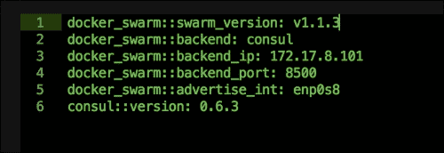

如你所见，我们设置了诸如版本之类的参数。为什么我们要在 Hiera 中设置版本，而不是直接在模块中设置？例如，如果我们设置了 Consul 的版本，我们可能在生产环境中运行的是 5.0 版本，而 Hashicorp 刚发布了 6.0 版本，通过更改 Hiera 中环境的值来进行切换（有关 Puppet 环境的更多信息，请访问 [`docs.puppetlabs.com/puppet/latest/reference/environments.html`](https://docs.puppetlabs.com/puppet/latest/reference/environments.html)）。在从开发环境到 6.0 的 Hiera 版本中，我们可以运行多个版本的应用程序，而无需进行模块开发。

同样的操作也适用于 IP 地址或 URL。例如，在开发环境的 hieradata 中，你的 Swarm 集群 URL 可以是 `dev.swarm.local`，而生产环境中则可以是 `swarm.local`。

另一种你需要分离的数据类型是密码/密钥。你不希望开发环境中的密码/密钥与生产环境中的相同。同样，Hiera 允许你对这些数据进行模糊处理。

我们可以通过 Puppet 支持的 eyaml 进一步保护这些数据。这使你可以使用密钥加密 Hiera 的 `.yaml` 文件。因此，当文件被提交到源代码管理时，它们会被加密。这有助于防止数据泄漏。有关 eyaml 的更多信息，请访问 [`puppetlabs.com/blog/encrypt-your-data-using-hiera-eyaml`](https://puppetlabs.com/blog/encrypt-your-data-using-hiera-eyaml)。

如你所见，Hiera 为你提供了将数据从模块转移到 Hiera 以外部化配置的灵活性，从而使模块保持无状态。

## Hiera 的小贴士和技巧

在使用 Hiera 时，有一些非常实用的小贴士可以参考。Puppet 允许你调用函数、查找项和查询事实。掌握这些功能会非常有用。如果这是你第一次接触，建议在继续本章节之前阅读 [`docs.puppetlabs.com/hiera/3.1/variables.html`](https://docs.puppetlabs.com/hiera/3.1/variables.html) 中的文档。

那么，让我们看一个从 Hiera 查找事实的示例。首先，为什么要这么做？一个非常好的理由是 IP 地址查找。如果你有一个类应用到三个节点，并且需要像在 `consul` 模块中那样宣传一个 IP 地址，将 IP 地址设置在 Hiera 中是行不通的，因为每台机器的 IP 地址会不同。我们创建一个名为 `node.yaml` 的文件并将 IP 地址添加到那里。问题是，现在我们将有多个 Hiera 文件。每次 Puppet 加载目录时，它都会查找所有 Hiera 文件，检查是否有值发生变化。文件越多，主服务器的负载就越大，Puppet 执行的速度也会变慢。因此，我们可以告诉 Hiera 查找我们想要宣传的事实和接口。以下是代码的示例：

```
ucpconfig::ucp_host_address: "%{::ipaddress_eth1}"

```

唯一需要注意的是，如果我们从模块中调用这个事实，我们将使用完全限定的名称`$::ipaddress_eth1`。不幸的是，Hiera 不支持使用这个名称。所以我们可以使用`::ipaddress_eth1`事实的简短名称。

# 代码

现在我们已经很好地理解了如何使我们的模块无状态，让我们开始编写代码吧。我们将把编码分成两部分。在第一部分中，我们将编写安装和配置 Docker UCP 的模块。最后的主题将是运行 Kubernetes 作为前端。

## UCP

我们需要做的第一件事是为本章创建一个新的 Vagrant 仓库。到现在为止，我们应该已经掌握了如何创建一个新的 Vagrant 仓库。一旦创建好仓库，我们将创建一个新的模块，名为`<AUTHOR>-ucpconfig`，并将其移动到 Vagrant 仓库根目录下的`modules`目录中。我们将首先通过添加下图所示的代码来设置`servers.yml`文件：

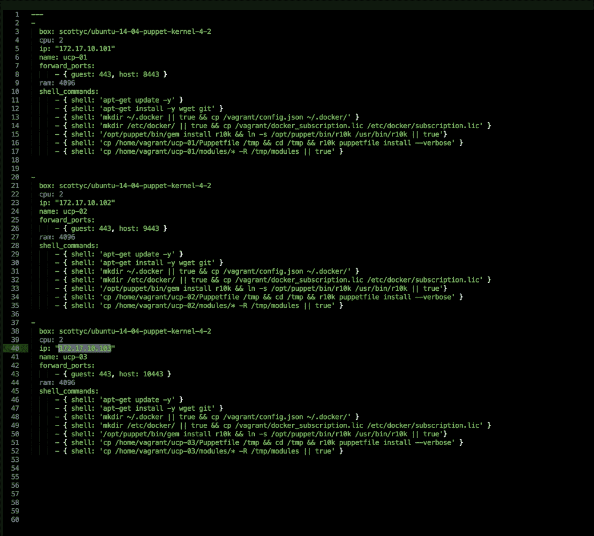

正如你所看到的，我们正在设置三台服务器，其中`ucp-01`将成为集群的主节点，另外两个节点将加入集群。我们将添加两个文件：`config.json`和`docker_subscription.lic`。其中，`config.json`将包含 Docker Hub 的授权密钥，`docker_subscription.lic`将包含我们 UCP 的试用许可证。请注意，我们在容器调度章节中已经讲解了这两个文件。如果你在设置这些文件时遇到问题，请参考该章节。

接下来我们要查看的文件是 puppetfile。我们需要将下图所示的代码添加到该文件中：

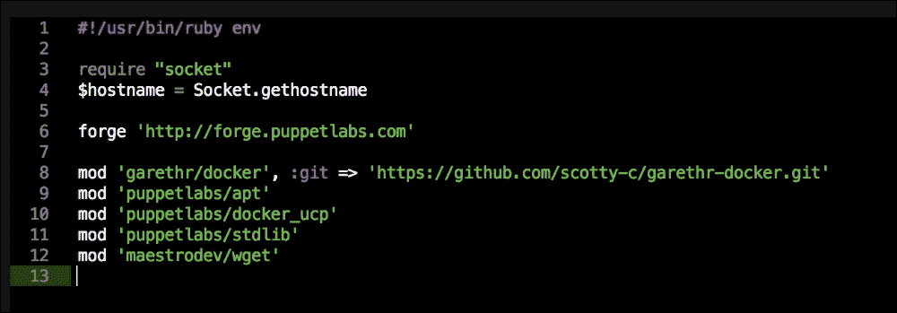

现在我们已经设置好了 Vagrant 仓库，可以继续进行我们的模块开发了。我们将需要创建四个文件：`config.pp`、`master.pp`、`node.pp`和`params.pp`。

我们首先要查看的文件是`params.pp`。我想先编写这个文件，因为它为模块的其余部分奠定了良好的基础。我们这样做如下：

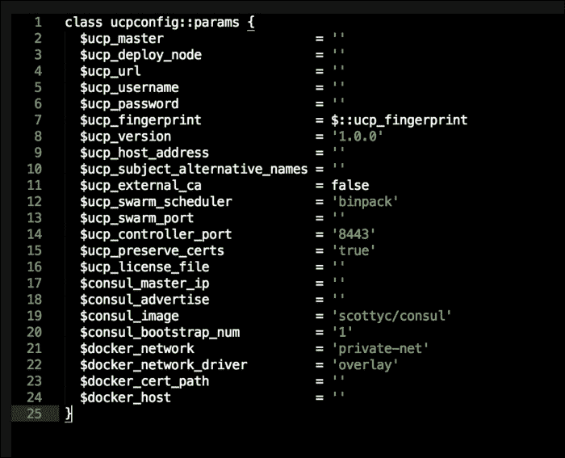

正如你所看到的，我们正在设置所有的参数。我们将深入研究每一个参数，并在将其应用到类时了解它的含义。这样，我们就能理解所设置值的背景。你可能注意到，我们将很多变量设置为空字符串。这是因为我们将使用 Hiera 来查找这些值。我也硬编码了一些值，比如 UCP 版本为 1.0.0。这只是一个默认值，如果 Hiera 中没有相应的值，就会使用这个值。然而，我们将把 UCP 的版本设置为 1.0.3。预期的行为是 Hiera 中的值会优先级更高。你会注意到我们引用了一个事实，即`$::ucp_fingerprint`。这是一个自定义的事实。它将自动传递 UCP 的指纹。如果你记得，在容器调度章节中，我们必须构建`ucp-01`来获取指纹并将其添加到 Hiera，供其他节点使用。通过自定义事实，我们将自动化这个过程。

要创建一个自定义事实，首先我们需要在模块的根目录下创建一个 `lib` 文件夹。在该文件夹下，我们将创建一个名为 `facter` 的文件夹。在该文件夹中，我们将创建一个名为 `ucp_fingerprint.rb` 的文件。在编写自定义事实时，文件名需要与事实的名称相同。我们将添加到自定义事实中的代码如下：

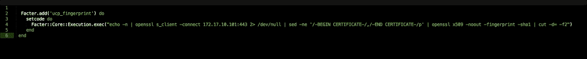

在这段代码中，你可以看到我们添加了一个 `bash` 命令来查询我们的 UCP master，以获取指纹。我在这个事实中硬编码了主机的 IP 地址。在我们的环境中，我们会编写逻辑来使其更加灵活，以便允许有多个环境、主机名等。关于自定义事实，最重要的是理解命令本身。

现在我们将返回到我们的`init.pp`文件，内容如下：

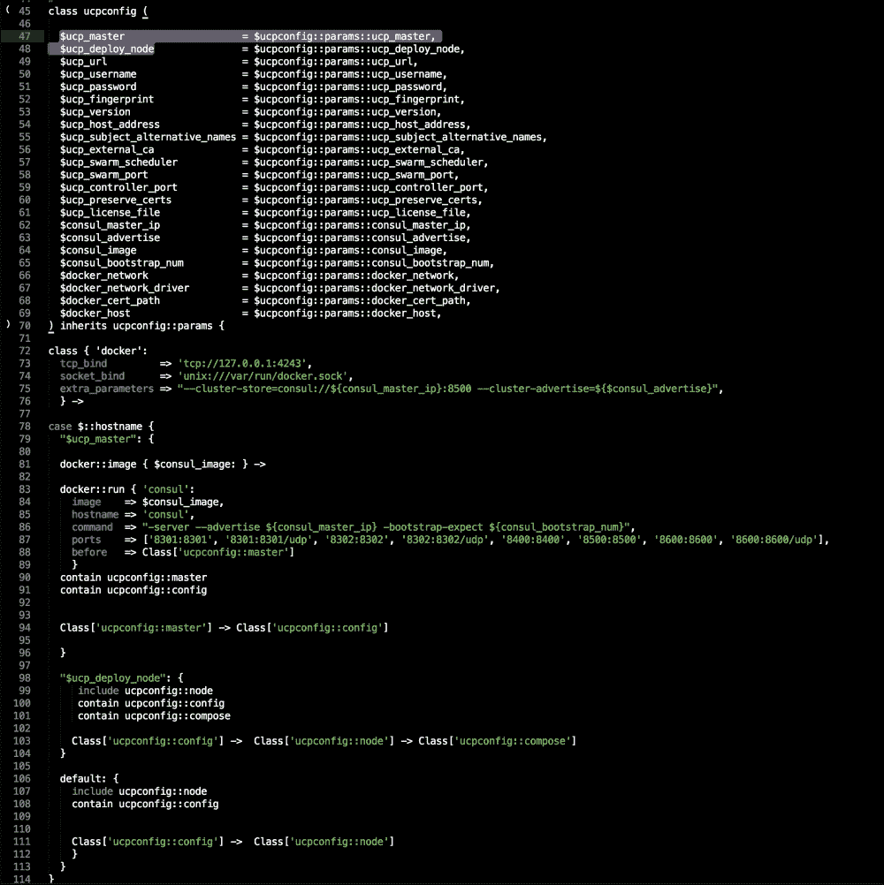

你首先可以看到的是，我们在类的顶部声明了所有的变量。这是 Puppet 查找 Hiera 并匹配我们声明的任何变量的地方。模块中的第一段代码将设置我们的 Docker 守护进程。我们将添加额外的配置来告诉守护进程它可以在哪里找到 Docker 原生网络的后端。然后，我们将在`$::hostname`事实上声明一个 case 语句。你会注意到，我们为主机名设置了一个参数。这是为了使我们的模块更加可移植。在 case 语句中，如果主机是 master，你会看到我们将使用我们的 Consul 容器作为 Docker 网络的后端。接着，我们将按顺序执行应用于节点的类。

在 case 语句中的下一个代码块中，我们为 `$::hostname` 事实声明了 `$ucp_deploy_node` 变量。我们将使用此节点来部署 Kubernetes。稍后我们会回到这个话题。我们 case 语句中的最后一段代码是 `catch all` 或 `default`。如果 Puppet 无法在我们声明的变量中找到 `$::hostname` 的事实，它将应用这些类。

现在我们将继续我们的 `master.pp` 文件，内容如下：

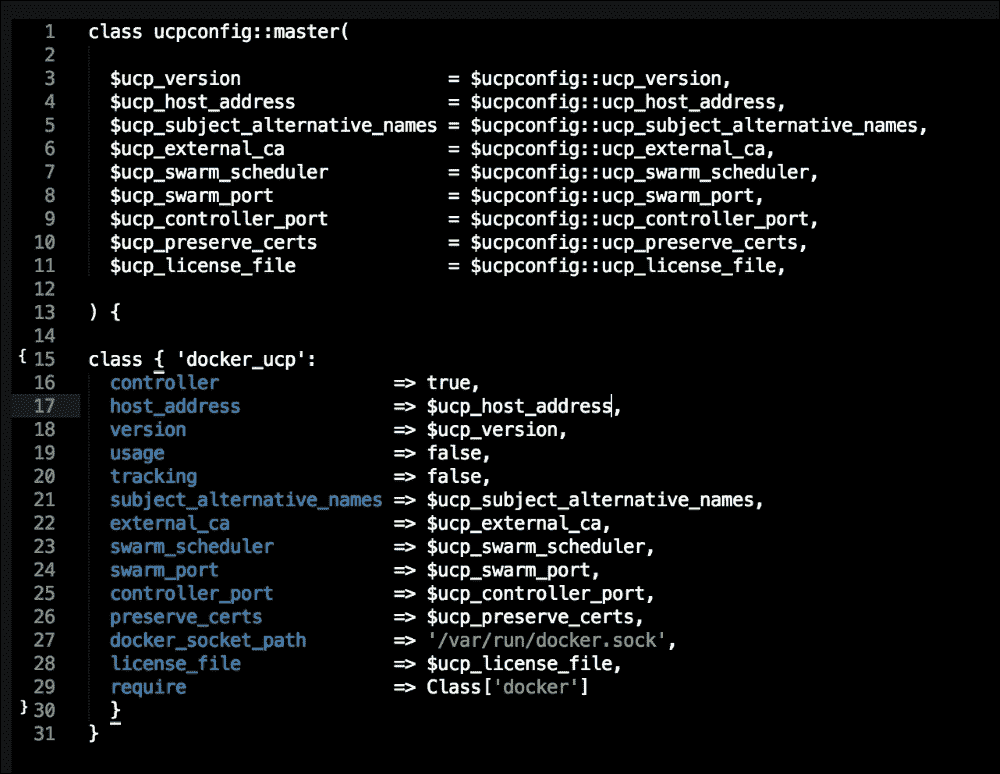

你首先会注意到的是，我们再次在这个类的顶部声明了变量。这样做是因为我们声明了很多参数，这使得我们的模块更具可读性。在复杂的模块中这样做是必须的，我真的推荐你遵循这种做法。当涉及到调试时，这会让你的工作轻松很多。正如你在下面的截图中看到的，我们将参数绑定回我们的`init.pp`文件：

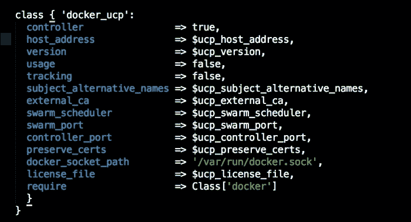

从前面的代码可以看出，我们在模块中设置的值的类型非常少。

现在我们将继续处理我们的 `node.pp` 文件，内容如下：

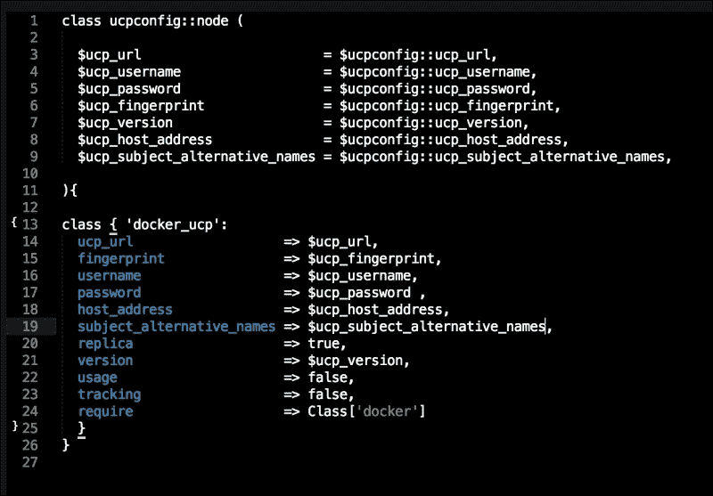

正如你所见，我们在类的顶部声明了参数，再次将它们与我们的`init.pp`文件关联。我们已经声明了大部分的值，因为我们将使用 Hiera。

现在，我们将继续我们的`config.pp`文件，如下所示：

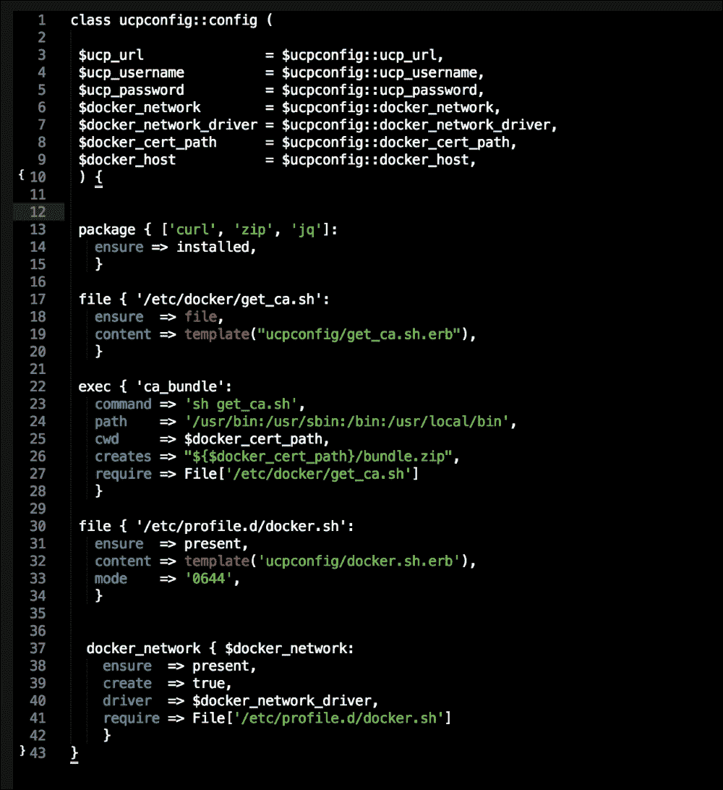

在这个类中，我们将进行一些对集群至关重要的配置。所以，我们将逐个代码块地讲解。让我们先看看第一个：

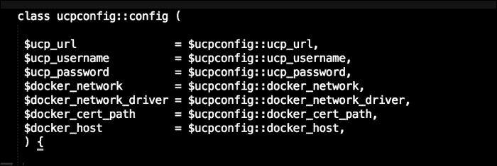

在这个代码块中，我们将声明我们的变量，就像在本模块的所有类中一样。有一点我还没有提到，那就是我们仅声明应用于其类的变量，并不是声明所有的参数。现在让我们看看下一个代码块：

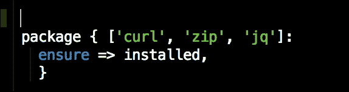

在这段代码中，我们将传递一个包数组，这些包是我们需要用来通过`curl`连接到 UCP 主节点并获取 SSL 证书包的，以便节点之间的 TLS 通信。现在，让我们看看第三个代码块：

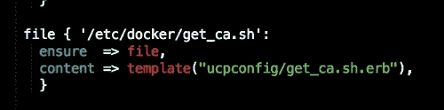

在这段代码中，我们将创建一个名为`get_ca.sh.erb`的脚本，从主节点获取证书包。首先，我们需要在模块的根目录下创建一个`templates`文件夹，然后在该文件夹中创建我们的`get_ca.sh.erb`文件。我们将向该文件中添加以下代码：

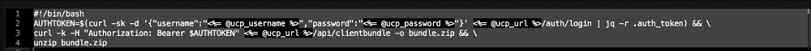

正如你在脚本中所看到的，我们需要创建一个`auth`令牌并将其传递给 API。Puppet 本身并不擅长处理这些任务，因为我们在`curl`命令中使用了变量。只要我们确保其幂等性，创建一个模板文件并运行`exec`函数是可以的。在下一个代码块中，我们将这样做：

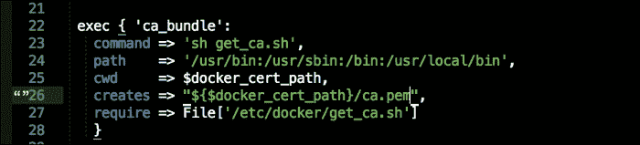

在这段代码中，我们将运行之前的脚本。你可以看到，我们设置了`command`、`path`和**cwd**（**当前工作目录**）这几个参数。下一个资源是`creates`，它告诉 Puppet 当前工作目录中应该有一个名为`ca.pem`的文件。如果 Puppet 发现该文件不存在，它将执行`exec`，如果文件存在，Puppet 将什么也不做。这将使我们的`exec`具备幂等性。

在下一个代码块中，我们将在`/etc/profile.d`中创建一个文件，该文件将把每个节点上的 Docker 守护进程指向主节点的 IP 地址，从而使我们能够在集群中调度容器：

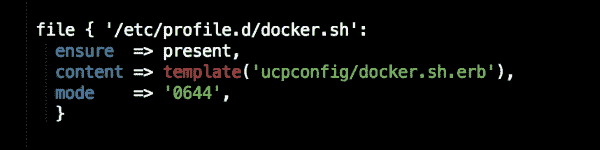

现在，让我们在`templates`目录中创建一个`docker.sh`文件。在该文件中，我们将放入以下代码：

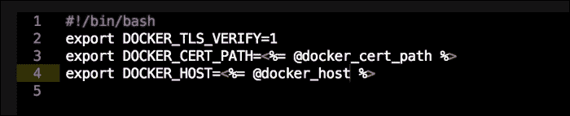

在这个文件中，我们告诉 Docker 守护进程使用 TLS，设置我们之前在类中获取的密钥文件的位置。我们设置的最后一项是 Docker 主机，它将指向 UCP 主节点。

这个类中的最后一段代码应该非常熟悉，因为我们正在设置一个 Docker 网络：

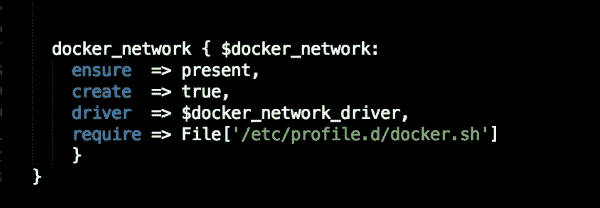

现在我们可以继续处理存放所有数据的文件——我们的 Hiera 文件。该文件位于 `hieradata` 文件夹中，该文件夹位于 Vagrant 仓库的根目录。以下截图展示了 Hiera 文件中的各种数据：

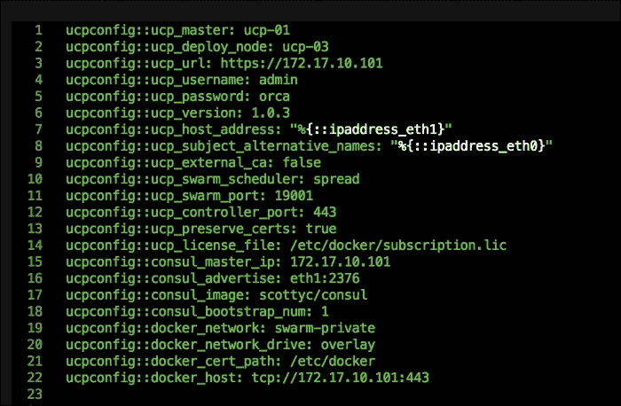

那么，让我们列出我们在这里定义的所有数据。我们将 UCP 主节点定义为 `ucp-01`，我们的部署节点为 `ucp-03`（这是我们从中部署 Kubernetes 的节点）。主节点的 UCP URL 为 `https://172.17.10.101`。当我们将节点连接到主节点时，或者获取我们的 `ca` 包和 UCP 指纹时，都将使用该 URL。我们将用户名和密码保持为 `admin` 和 `orca`。我们将使用 UCP 版本 `1.0.3`。然后，我们将使用之前在本书中讨论过的 Hiera fact 查找来设置 UCP 的主机地址和备用名称。

下一个参数将告诉 UCP 我们将使用内部 CA。接下来，我们将设置调度器使用 `spread`，定义 Swarm 和控制器的端口，告诉 UCP 保留证书，并发送 UCP 许可证文件的位置。接下来，我们将设置一些 Consul 的日期信息，例如主节点 IP、要广告的接口、要使用的镜像，以及在启动 Consul 集群时预期的节点数量。最后，我们将设置 Docker 守护进程使用的变量，例如我们的 Docker 网络名称 `swarm-private`、网络驱动程序 `overlay`、证书路径以及我们在 `docker.sh` 文件中设置的 Docker 主机，该文件位于 `/etc/profile.d/`。

如你所见，我们在 Hiera 中有大量数据。然而，正如我们之前讨论的，某些数据可能会根据不同的环境发生变化。因此，正如你所看到的，将模块设为无状态并将数据抽象到 Hiera 中，尤其是当你希望编写易于扩展的模块时，是非常有益的。

接下来，我们将以下代码添加到我们的清单文件 `default.pp` 中，该文件位于 Vagrant 仓库根目录的 `manifests` 文件夹中。以下代码定义了我们的节点定义：

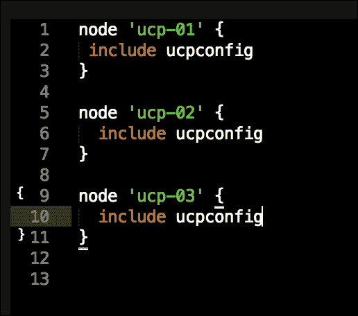

然后，我们可以打开终端并将目录切换到 Vagrant 仓库的根目录。接下来，我们将发出 `vagrant up` 命令来运行 Vagrant。当三个虚拟机构建完成后，你应该会看到以下终端输出：

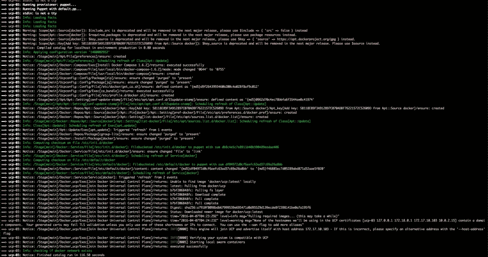

然后，我们可以登录到网址 `https://127.0.0.1:8443`：

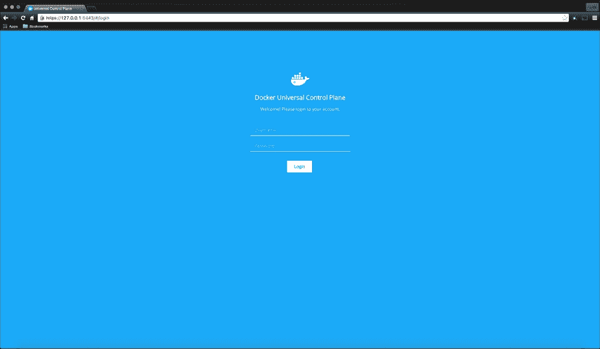

我们将使用 `admin` 用户名和 `orca` 密码进行登录。在以下截图中，我们可以看到我们的集群已启动并处于健康状态：

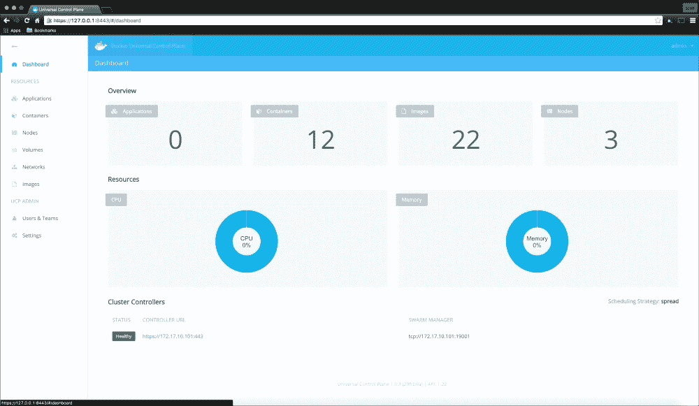

## Kubernetes

既然我想以一个精彩的方式结束，我们现在来做一些很酷的事情。我想部署一个有多个容器的应用程序，我们可以使用 interlock 来展示应用路由/负载均衡。有什么比 Kubernetes 更好的应用程序呢？正如我之前提到的，像这样运行 Kubernetes 有一些局限性，它仅限于实验室使用。我们可以从中学到的技能并将其应用到我们的 Puppet 模块中，就是应用路由/负载均衡。在我们上一节中，我们在 `init.pp` 文件的 case 语句中设置了 `$ucp_deploy_node` 参数。在那个特定的代码块中，我们有一个叫做 `compose.pp` 的类。这个类将会在我们的 UCP 集群中部署 Kubernetes。让我们看一下这个文件：

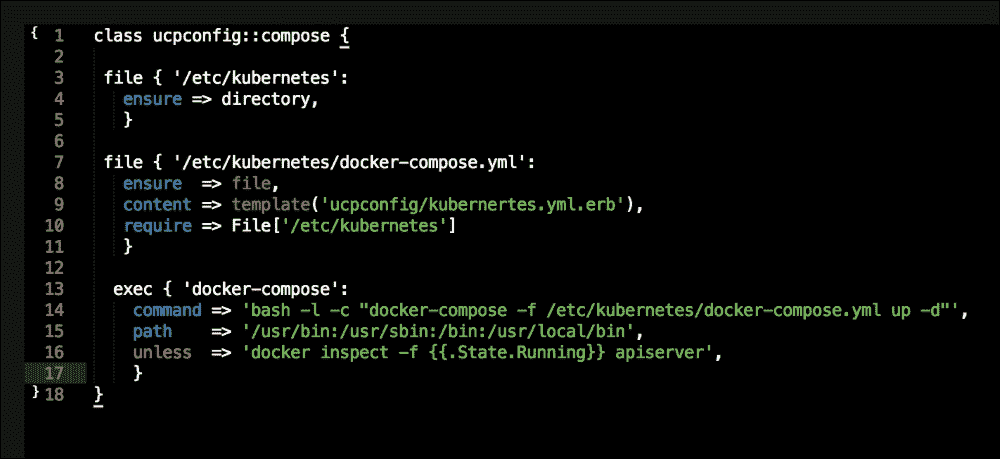

第一个资源只是创建一个名为 `kubernetes` 的目录。我们将在这里放置我们的 Docker Compose 文件。现在，你会注意到我们运行 Docker Compose 的方式有些不同。使用 exec？为什么我们要用 exec，而不是使用一个已经验证过的、完全可靠的 provider 呢？我们在这种情况下使用 exec 的原因是，我们在上次 Puppet 运行时更改了 `$PATH`。我是什么意思呢？还记得我们添加到 `/etc/profile.d/` 目录的文件吗？它更改了 `DOCKER_HOST` 指向的 shell 设置。这只会在下一次 Puppet 运行时生效，所以 Docker 守护进程不会指向集群。这就意味着所有的 Kubernetes 容器都会在同一台主机上启动。这将导致清单失败，因为我们会遇到两个容器使用 `8080` 端口时的冲突。现在，这只会在我们一次性运行整个模块时生效，也就是作为一个单独的清单。

现在，让我们看一下我们的 Docker Compose 文件：

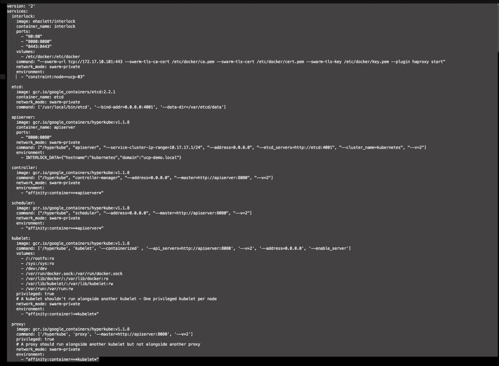

在本书中，我一直强调我更喜欢使用 Docker Compose 方法来部署我的容器应用程序。这份 Docker Compose 文件正是这一方法的完美示例。我们在这个 Compose 文件中有七个容器。我觉得这样很简单，因为所有的逻辑都摆在我们面前，我们只需要写最少的代码。现在，让我们看看代码。首先不同的是，我们声明了 `version 2`。这是因为 Docker Compose 的 1.6.2 版本已发布（[`github.com/docker/compose/releases/tag/1.6.2`](https://github.com/docker/compose/releases/tag/1.6.2)）。因此，为了利用新特性，我们需要声明我们想使用 `version 2`。

我们声明的第一个容器是 Interlock。我们将使用 Interlock 作为应用程序路由器，它会向 Kubernetes API 发起服务器请求。对于这个容器，我们将端口 `443`、`8080` 和 `8443` 转发到主机。然后，我们会将主机的 `/etc/docker` 映射到容器中。这样做的原因是我们需要密钥来连接到 Swarm API。所以，我们将利用本章早些时候安装的 bundle。

在命令资源中，我们将告诉 Interlock 哪里可以找到证书、Swarm URL，并且最后，告诉它我们要使用 `haproxy`。接下来，我们将把这个容器添加到我们的覆盖网络 `swarm-private`。接下来，在环境资源中，我们将设置一个约束，并告诉 Compose 只在 `ucp-03` 上运行 Interlock。我们这样做是为了避免与 Kubernetes API 服务的端口冲突。下一个容器是 `etcd`。自从我们在调度器章节中配置 Kubernetes 后，关于这一部分没有太大变化，因此我们将跳过。下一个容器是 `kubernetes` API 服务。需要特别注意的是，在环境资源中我们声明了 `- INTERLOCK_DATA={"hostname":"kubernetes","domain":"ucp-demo.local"}`。这是 Interlock 在发送请求到 API 时将查找的 URL。

这是我们运行 Kubernetes 的主要原因，目的是掌握应用程序路由的技能。因此，我不会继续讲解其余的容器。Kubernetes 在[`kubernetes.io/`](http://kubernetes.io/)上有详细的文档。我建议你阅读一下相关特性，并探索 Kubernetes——它非常强大，有很多东西可以学习。

现在我们已经有了所有的代码。让我们运行它吧！

为了看到完整的构建过程，我们将打开终端并将目录切换到我们 Vagrant 仓库的根目录。如果你已经根据之前的章节构建了服务器，可以运行 `vagrant destroy -f && vagrant up`；如果没有，直接运行 `vagrant up` 命令即可。一旦 Puppet 执行完毕，我们的终端应该会显示以下输出：

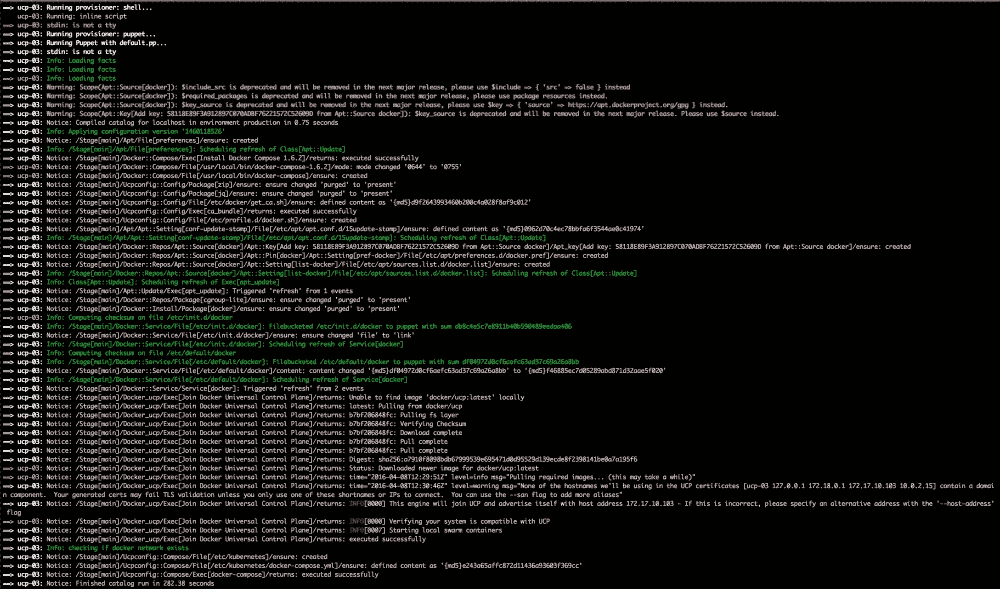

然后我们可以登录到我们的 Web UI，地址是 `https://127.0.0.1:8443`：

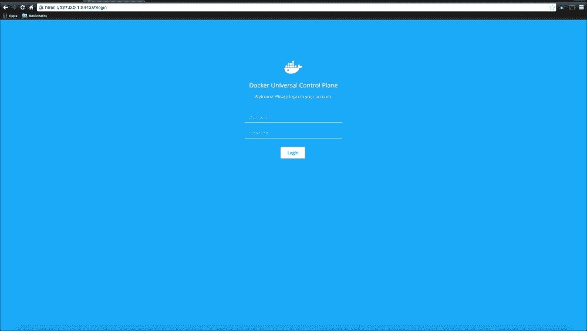

然后，我们将使用 `admin` 用户名和 `orca` 密码登录。登录成功后，我们应该能看到如下截图：

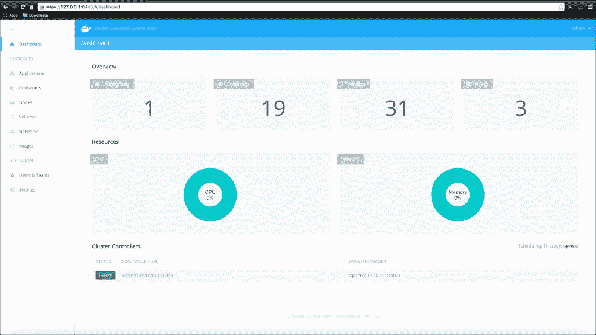

你会注意到现在我们有了一个应用程序。如果我们双击该应用程序，就可以看到 Kubernetes 已经启动并运行：

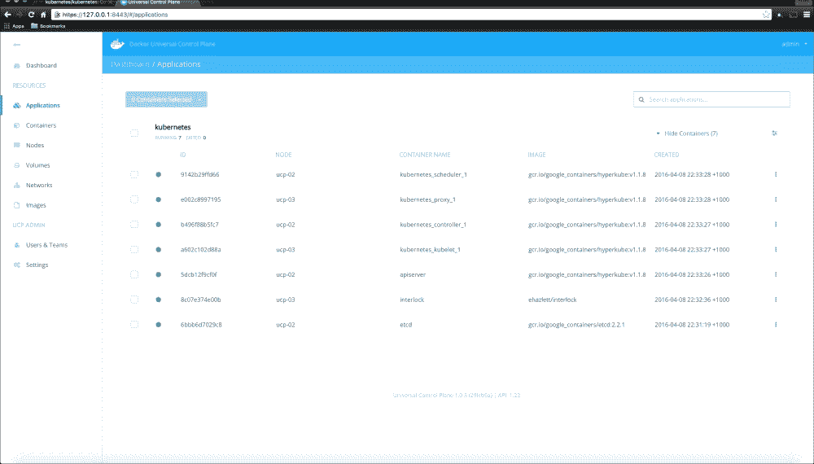

你会注意到，由于我们在 Docker Compose 文件中的环境设置，我们的容器被分布在 `ucp-02` 和 `ucp-03` 上。需要注意的一点是，Interlock 在 `ucp-03` 上，Kubernetes API 服务则在 `ucp-02` 上。

现在我们已经成功构建了一切，我们需要登录到 `ucp-03` 并下载 `kubectl` 客户端。我们可以通过发出以下命令来实现：

```
$'wget https://storage.googleapis.com/kubernetes-release/release/v1.1.8/bin/linux/amd64/kubectl'

```

那么，让我们登录到`ucp-03`，并从我们的 Vagrant 仓库根目录执行`vagrant ssh ucp-03`命令。接着，我们将切换到 root（`sudo -i`）。然后，我们将执行`wget`命令，具体见下图：

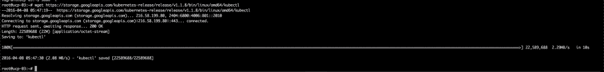

接下来，我们将通过执行以下命令使文件具有可执行权限：

```
$'chmod +x kubectl'

```

现在请记住，我们在环境设置中为`- INTERLOCK_DATA={"hostname":"kubernetes","domain":"ucp-demo.local"}` API 容器设置了一个 URL。我们需要在主机文件中设置该值。所以，使用你喜欢的编辑文件方式，如 vim、nano、sed 等，添加`172.17.10.103 kubernetes.ucp-demo.local`。该 IP 地址指向`ucp-03`，因为 Interlock 就在此处运行。

现在我们准备好测试我们的集群了。我们将通过执行`./kubectl -s kubernetes.ucp-demo.local get nodes`命令来实现。执行后，我们应该得到如下输出：

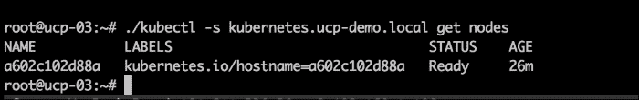

如你所见，一切都已正常运行。如果我们回到 UCP 控制台，你会看到 API 服务器正在`ucp-02`上运行（IP 地址为`172.17.10.102`）。那么，我们是如何做到这一点的呢？Interlock 正在处理`8080`上的 HTTP 请求，并将其路由到我们的 API 服务器。这告诉我们应用路由已经就绪。这个例子非常基础，但你应该尝试一下，因为使用 Interlock 你可以设计出非常流畅的解决方案。

# 总结

在本章中，我们重点讲解了如何构建一个可部署的 Puppet 模块。使用 Hiera 以及将数据与模块逻辑分离的做法，不仅适用于部署容器的模块，也适用于你编写的任何 Puppet 模块。在你的 Puppet 生涯中，总有一天你会开源一个模块或为已开源的模块做贡献。本章中学到的内容在这两种情况中都将非常有价值。最后，我们做了一些有趣的事，将 Kubernetes 作为 UCP 的前端进行部署。通过这个过程，我们还了解了应用路由/负载均衡。显然，这是一项非常重要的技能，尤其是当你的容器环境不断扩展时，避免端口冲突等问题。
