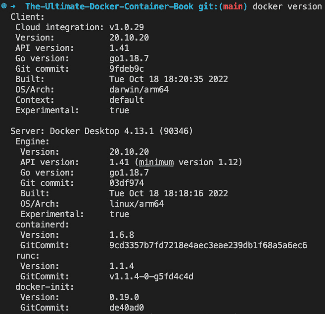

# 3

# 掌握容器

在上一章中，你学会了如何为 Docker 的高效、无摩擦使用优化你的工作环境。本章我们将动手实践，了解在使用容器时必须掌握的一切重要知识。

以下是本章将要涵盖的主题：

+   运行第一个容器

+   启动、停止和删除容器

+   检查容器

+   进入正在运行的容器

+   连接到一个正在运行的容器

+   获取容器日志

+   容器的结构

完成本章后，你将能够做以下事情：

+   基于现有镜像运行、停止和删除容器，例如 Nginx、BusyBox 或 Alpine

+   列出系统上所有的容器

+   检查运行中或停止的容器的元数据

+   获取容器内运行的应用程序产生的日志

+   在已经运行的容器中运行像 `/bin/sh` 这样的进程

+   连接终端到一个已运行的容器

+   用你自己的话向一位感兴趣的外行解释容器的基础原理

# 技术要求

本章中，你应该已经在你的 Linux 工作站、macOS 或 Windows 电脑上安装了 Docker Desktop。如果你使用的是旧版本的 Windows 或 Windows 10 家庭版，你应该安装并准备好使用 Docker Toolbox。在 macOS 上，使用终端应用程序，在 Windows 上，使用 PowerShell 控制台或 Git Bash 来尝试你将学习的命令。

# 运行第一个容器

在我们开始之前，我们需要确保 Docker 已经正确安装并准备好接受你的命令。打开一个新的终端窗口，输入以下命令（注意：不要输入 `$` 符号，它只是你的提示符占位符）：

```
$ docker version
```

如果一切正常，你应该在终端窗口中看到已安装的 Docker 客户端和服务器版本的输出。写作时，它是这样的：



图 3.1 – docker version 命令的输出

如你所见，我在我的 MacBook Air M1 笔记本上安装的版本是 `20.10.20`。

如果这对你不起作用，那么你的安装可能有问题。请确保你按照上一章的说明，正确地在系统上安装了 Docker Desktop。

好的，现在准备好看到一些操作了。请在终端窗口中输入以下命令并按下 *回车* 键：

```
$ docker container run alpine echo "Hello World"
```

当你第一次运行前面的命令时，你应该在终端窗口看到类似这样的输出：


图 3.2 – 第一次运行 Alpine 容器

哇，这么简单！我们再试一次运行同样的命令：

```
$ docker container run alpine echo "Hello World"
```

第二次、第三次或第 N 次运行前面的命令时，你应该只在终端看到以下输出：

```
Hello World
```

尝试推理为什么第一次运行命令时，输出与后续所有时间的输出不同。但如果你无法理解，也不用担心；我们将在本章接下来的部分详细解释原因。

# 启动、停止和删除容器

你在上一节成功地运行了一个容器。现在，我们想要详细探讨一下究竟发生了什么以及为什么发生。让我们再次看看我们使用的命令：

```
$ docker container run alpine echo "Hello World"
```

这个命令包含多个部分。首先，最重要的是我们有单词 `docker`。这是 Docker `container` 的名称，表示我们正在使用的上下文，比如 `container`、`image` 或 `volume`。由于我们想要运行一个容器，因此我们的上下文是 `container`。接下来是我们想要在给定上下文中执行的实际命令，即 `run`。

让我总结一下 – 到目前为止，我们有 `docker container run`，意思是，“嘿，Docker，我们想要运行一个容器。”

现在我们还需要告诉 Docker 运行哪个容器。在本例中，这是所谓的 `alpine` 容器。

Alpine Linux

`alpine` 是基于 Alpine Linux 的最小 Docker 镜像，具有完整的软件包索引，大小仅约 5 MB。它是一个由 Alpine 开源项目和 Docker 官方支持的镜像。

最后，我们需要定义在容器运行时将执行的进程或任务。在我们的例子中，这是命令的最后一部分，`echo "``Hello World"`。

以下图示可能帮助你更好地理解整个过程：


图 3.3 – 解释 docker run 命令

现在我们已经理解了运行容器的各种命令部分，让我们尝试运行另一个容器，并在其中执行不同的进程。在终端中输入以下命令：

```
$ docker container run centos ping -c 5 127.0.0.1
```

你应该在终端窗口中看到类似以下的输出：


图 3.4 – 在 CentOS 容器中运行 ping 命令

更改的是这一次我们使用的容器镜像是 `centos`，并且在 `centos` 容器中执行的进程是 `ping -c 5 127.0.0.1`，它会 ping 本地回环 IP 地址（`127.0.0.1`）五次，直到停止。

CentOS

`centos` 是 CentOS Linux 的官方 Docker 镜像，CentOS 是一个社区支持的发行版，源代码由 Red Hat 为 **Red Hat Enterprise** **Linux** (**RHEL**) 免费提供给公众。

让我们详细分析输出。第一行如下：

```
Unable to find image 'centos:latest' locally
```

这告诉我们 Docker 在本地缓存中没有找到名为 `centos:latest` 的镜像。因此，Docker 知道它必须从某个存储容器镜像的注册表中拉取镜像。默认情况下，你的 Docker 环境配置为从 Docker Hub (`docker.io`) 拉取镜像。第二行表示如下：

```
latest: Pulling from library/centos
```

接下来的三行输出如下：

```
52f9ef134af7: Pull completeDigest: sha256:a27fd8080b517143cbbbab9dfb7c8571c4...
Status: Downloaded newer image for centos:latest
```

这告诉我们 Docker 已经成功地从 Docker Hub 拉取了 `centos:latest` 镜像。输出的后续所有行都是我们在容器内运行的进程生成的，案例中的进程是 `ping` 工具。如果你到目前为止一直很专心，你可能已经注意到 `latest` 关键字出现了好几次。每个镜像都有一个版本（也称为 `tag`），如果我们没有明确指定版本，Docker 会默认认为它是 `latest`。

如果我们再次在系统上运行之前的容器，输出的前五行将会缺失，因为这时 Docker 会发现容器镜像已在本地缓存，因此无需重新下载。试试看，验证一下我刚才说的内容。

# 运行随机小知识问题容器

在本章接下来的部分，我们需要一个持续在后台运行并输出一些有趣内容的容器。这就是为什么我们选择了一个生成随机小知识问题的算法。提供免费的随机小知识 API 可以在 [`jservice.io/`](http://jservice.io/) 上找到。

现在，目标是让一个进程在容器内运行，每隔 5 秒钟生成一个新的随机小知识问题，并将问题输出到 `STDOUT`。以下脚本将实现这一目标：

```
while :do
    curl -s http://jservice.io/api/random | jq '.[0].question'
    sleep 5
done
```

如果你使用 PowerShell，前面的命令可以转换为以下内容：

```
while ($true) {  Invoke-WebRequest -Uri "http://jservice.io/api/random" -Method GET -UseBasicParsing |
  Select-Object -ExpandProperty Content |
  ConvertFrom-Json |
  Select-Object -ExpandProperty 0 |
  Select-Object -ExpandProperty question
  Start-Sleep -Seconds 5
}
```

提示

`ConvertFrom-Json` cmdlet 要求导入 `Microsoft.PowerShell.Utility` 模块。如果尚未导入，你需要在运行脚本之前执行 `Import-Module Microsoft.PowerShell.Utility`。

在终端窗口中尝试。通过按 *Ctrl* + *C* 停止脚本。输出应该类似于以下内容：


图 3.5 – 输出随机小知识

每个响应都是一个不同的小知识问题。你可能需要首先在 Linux、macOS 或 Windows 电脑上安装 `jq`。`jq` 是一个非常方便的工具，常用于优雅地过滤和格式化 JSON 输出，增加其在屏幕上的可读性。如果需要，使用你的包管理器安装 `jq`。在 Windows 上，使用 Chocolatey 时，命令如下：

```
$ choco install jq
```

在 Mac 上使用 Homebrew 时，你需要输入以下命令：

```
$ brew install jq
```

现在，让我们在 `alpine` 容器中运行这段逻辑。因为这不仅仅是一个简单的命令，我们希望将前面的脚本封装在一个脚本文件中并执行它。为了简化操作，我创建了一个名为 `fundamentalsofdocker/trivia` 的 Docker 镜像，包含了所有必要的逻辑，因此我们可以直接在这里使用它。稍后，当我们介绍 Docker 镜像时，我们将进一步分析这个容器镜像。现在，让我们直接使用它。执行以下命令将容器作为后台服务运行。在 Linux 中，后台服务也称为守护进程（daemon）：

```
$ docker container run --detach \    --name trivia fundamentalsofdocker/trivia:ed2
```

重要提示

我们使用了 `\` 字符来允许在单个逻辑命令中换行，因为它在一行上无法完全显示。这是我们使用的 Shell 脚本的一个特性。在 PowerShell 中，使用反引号（`` ` ``）代替。

还要注意，在 `zsh` 中，你可能需要按 *Shift* + *Enter*，而不仅仅是 *Enter*，在 `\` 字符后开始新的一行。否则，你会收到错误信息。

在前面的表达式中，我们使用了两个新的命令行参数，`--detach` 和 `--name`。现在，`--detach` 告诉 Docker 将容器中的进程作为 Linux 守护进程运行。

`--name` 参数则可以用来为容器指定一个明确的名称。在前面的示例中，我们选择的名称是 `trivia`。如果在运行容器时没有指定明确的容器名称，Docker 会自动为容器分配一个随机但唯一的名称。这个名称将由一个著名科学家的名字和一个形容词组成。例如，`boring_borg` 或 `angry_goldberg`。Docker 的工程师们真是太幽默了，不是吗？

最后，我们正在运行的容器是从 `fundamentalsofdocker/trivia:ed2` 镜像派生出来的。注意，我们还为容器使用了一个标签 `ed2`。这个标签只是告诉我们，这个镜像最初是为本书的第二版创建的。

一个重要的要点是，容器的名称在系统上必须是唯一的。让我们确保 `trivia` 容器已经启动并运行：

```
$ docker container ls -l
```

这应该会给我们类似以下内容：


图 3.6 – 最后运行的容器详情

前面输出中的一个重要部分是 `STATUS` 列，在这种情况下是 `Up 6 minutes`。也就是说，容器已经运行了 6 分钟。

如果你还不熟悉之前的 Docker 命令，不必担心；我们将在下一节中再讲到它。

为了完成这一部分，让我们使用以下命令停止并删除 `trivia` 容器：

```
$ docker rm --force trivia
```

前面的命令虽然强制删除了我们系统中的 `trivia` 容器，但输出中只会显示容器的名称 `trivia`。

现在，是时候学习如何列出我们系统上运行或悬挂的容器了。

# 列出容器

随着时间的推移，我们不断运行容器，系统中会有很多容器。为了找出当前在主机上运行的容器，我们可以使用 `container ls` 命令，如下所示：

```
$ docker container ls
```

这将列出所有当前正在运行的容器。这样的列表可能类似于以下内容：


图 3.7 – 系统上所有正在运行的容器列表

默认情况下，Docker 输出七列，含义如下：

| 列      | 描述     |
| --- | --- |
| `Container ID` | 这是容器唯一 ID 的简短版本。它是一个 SHA-256 值，SHA-256（安全哈希算法 256 位）是一种广泛使用的加密哈希函数，它接收一个输入并生成固定大小（256 位）的输出，称为哈希值。完整的 ID 是 64 个字符长。 |
| `Image` | 这是用来实例化此容器的容器镜像的名称。 |
| `Command` | 这是用于在容器中运行主进程的命令。 |
| `Created` | 这是容器创建的日期和时间。 |
| `Status` | 这是容器的状态（已创建、重启中、运行中、移除中、暂停中、已退出或已死）。 |
| `Ports` | 这是已映射到主机的容器端口列表。 |
| `Names` | 这是分配给容器的名称（注意：同一个容器可以有多个名称）。 |

表格 3.1 – docker container ls 命令列出的列的描述

如果我们不仅要列出当前正在运行的容器，而是要列出系统中定义的所有容器，我们可以使用`-a`或`--all`命令行参数，如下所示：

```
$ docker container ls --all
```

这将列出所有状态下的容器，例如`created`（已创建）、`running`（正在运行）或`exited`（已退出）。

有时，我们只想列出所有容器的 ID。为此，我们可以使用`-q`或`--quiet`参数：

```
$ docker container ls --quiet
```

你可能会想，这个命令什么时候有用呢？我将在这里展示一个非常有用的命令：

```
$ docker container rm --force $(docker container ls --all --quiet)
```

放松一下，深呼吸。然后，尝试找出前面的命令做了什么。在你找到答案或放弃之前，不要继续阅读。

这里是解决方案：上述命令强制删除系统上当前定义的所有容器，包括已停止的容器。`rm`命令代表“移除”，稍后会进行解释。

在上一节中，我们在列表命令中使用了`-l`参数，也就是`docker container ls -l`。尝试使用`docker help`命令找出`-l`参数的含义。你可以如下调用帮助信息：

```
$ docker container ls --help
```

既然你已经知道如何列出系统上已创建、正在运行或已停止的容器，接下来我们来学习如何停止和重启容器。

# 停止和启动容器

有时，我们希望（暂时）停止一个正在运行的容器。让我们尝试使用之前的 trivia 容器来进行操作：

1.  使用此命令再次运行容器：

    ```
    $ docker container run -d --name trivia fundamentalsofdocker/trivia:ed2
    ```

1.  现在，如果我们想停止这个容器，可以通过执行以下命令来实现：

    ```
    $ docker container stop trivia
    ```

当你尝试停止 trivia 容器时，可能会注意到这个命令执行时需要一些时间。准确地说，大约需要 10 秒钟。*为什么会这样*？ 

Docker 会向容器内运行的主进程发送 Linux 的`SIGTERM`信号。如果该进程没有对信号作出响应并自行终止，Docker 会等待 10 秒钟，然后发送`SIGKILL`，强制终止进程并停止容器。

在之前的命令中，我们使用了容器的名称来指定要停止的容器。但我们也可以使用容器 ID 来代替。

我们如何获取容器的 ID？有几种方法可以做到这一点。手动方法是列出所有正在运行的容器，并在列表中找到我们正在寻找的那个容器。从那里，我们复制它的 ID。更自动化的方式是使用一些 shell 脚本和环境变量。例如，如果我们想获取 trivia 容器的 ID，可以使用以下表达式：

```
$ export CONTAINER_ID=$(docker container ls -a | grep trivia | awk '{print $1}')
```

在 PowerShell 中，等效的命令如下所示：

```
$ CONTAINER_ID = docker container ls -a | Select-String "trivia" | Select-Object -ExpandProperty Line | ForEach-Object { $_ -split ' ' } | Select-Object -First 1$ Write-Output $CONTAINER_ID
```

注意

我们使用了`-a`（或`--all`）参数与`docker container ls`命令来列出所有容器，包括已停止的容器。由于我们刚才停止了 trivia 容器，所以在这种情况下是必要的。

现在，我们可以不使用容器名称，而是在表达式中使用`$CONTAINER_ID`变量：

```
$ docker container stop $CONTAINER_ID
```

一旦我们停止了容器，它的状态将变为`Exited`。

如果容器已停止，可以使用`docker container start`命令重新启动它。让我们用`trivia`容器做这个操作。重新启动它是个好主意，因为在本章接下来的部分我们还会用到它：

```
$ docker container start $CONTAINER_ID
```

我们也可以通过使用容器名称来启动它：

```
$ docker container start trivia
```

现在是时候讨论如何处理那些我们不再需要的已停止容器了。

# 移除容器

当我们运行`docker container ls -a`命令时，可以看到许多处于`Exited`状态的容器。如果我们不再需要这些容器，最好将它们从内存中移除；否则，它们会不必要地占用宝贵的资源。移除容器的命令如下：

```
$ docker container rm <container ID>
```

这里，`<container ID>`代表我们想要移除的容器 ID——一个 SHA-256 代码。移除容器的另一种方式如下：

```
$ docker container rm <container name>
```

这里，我们使用容器的名称。

挑战

尝试使用容器的 ID 来移除一个已停止的容器。

有时，移除容器可能会失败，因为它仍在运行。如果我们想强制移除容器，无论容器当前的状态如何，我们可以使用`-f`或`--force`命令行参数：

```
$ docker container rm <container ID> --force
```

现在我们已经学会了如何从系统中移除容器，接下来让我们学习如何检查系统中存在的容器。

# 检查容器

容器是镜像的运行时实例，具有许多与其行为相关的特征数据。为了获取有关特定容器的更多信息，我们可以使用`inspect`命令。像往常一样，我们必须提供容器 ID 或名称，以标识我们想要获取数据的容器。那么，让我们检查一下我们的示例容器。如果它还没有运行，我们必须先启动它：

```
$ docker container run --name trivia fundamentalsofdocker/ trivia:ed2
```

然后，使用此命令来检查它：

```
$ docker container inspect trivia
```

响应是一个包含详细信息的大型 JSON 对象。它看起来类似于这样：


图 3.8 – 检查 trivia 容器

请注意，前面的截图只显示了更长输出的第一部分。

请花点时间分析一下你所拥有的信息。你应该看到如下信息：

+   容器的 ID

+   容器的创建日期和时间

+   容器是从哪个镜像构建的

输出的许多部分，如 `Mounts` 和 `NetworkSettings`，现在可能没有太大意义，但我们将在本书的后续章节中讨论这些内容。你在这里看到的数据也被称为容器的 *元数据*。在本书的余下部分，我们将经常使用 `inspect` 命令作为信息来源。

有时，我们只需要一小部分整体信息，为了实现这一点，我们可以使用 `grep` 工具或过滤器。前者方法并不总是能得到预期的答案，因此让我们看看后者的方法：

```
$ docker container inspect -f "{{json .State}}" trivia \    | jq .
```

`-f` 或 `--filter` 参数用于定义 `"{{json .State}}"` 过滤器。过滤器表达式本身使用 Go 模板语法。在这个例子中，我们只想看到整个输出中的状态部分，格式为 JSON。为了更好地格式化输出，我们将结果通过管道传递给 `jq` 工具：


图 3.9 – inspect 输出的状态节点

在我们学会如何检索关于容器的大量重要且有用的元信息后，我们希望调查如何在一个运行中的容器中执行它。

# 执行进入正在运行的容器

有时候，我们希望在一个已经运行的容器内执行另一个进程。一个典型的原因可能是尝试调试一个行为异常的容器。我们如何做到这一点呢？首先，我们需要知道容器的 ID 或名称，然后我们可以定义我们想要运行的进程以及如何运行它。再次，我们使用当前正在运行的 `trivia` 容器，并通过以下命令在其中交互式地运行一个 shell：

```
$ docker container exec -i -t trivia /bin/sh
```

`-i`（或 `--interactive`）标志表示我们希望交互式地运行额外的进程，`-t`（或 `--tty`）告诉 Docker 我们希望它为我们提供一个 TTY（终端模拟器）以运行该命令。最后，我们在容器内运行的进程是 `/bin/sh`。

如果我们在终端执行上述命令，我们将看到一个新的提示符 `/app #`。我们现在处于 trivia 容器内的 Bourne shell 中。我们可以通过执行 `ps` 命令轻松证明这一点，`ps` 会列出该上下文中的所有运行进程：

```
/app # ps
```

结果应该看起来与此类似：


图 3.10 – 进入正在运行的 trivia 容器

我们可以清楚地看到，PID 为 `1` 的进程是我们定义在 trivia 容器中运行的命令。PID 为 `1` 的进程也被称为主进程。

按*Ctrl* + *D*退出容器。我们不仅可以在容器中交互执行其他进程。请考虑以下命令：

```
$ docker container exec trivia ps
```

显然，输出看起来与前面的输出非常相似：


图 3.11 – 在小知识容器内运行的进程列表

不同之处在于，我们没有使用额外的进程来运行 shell，而是直接执行了`ps`命令。我们甚至可以使用`-d`标志以守护进程的方式运行进程，并使用`-e`或`--env`标志变量在容器内定义环境变量，如下所示：

1.  运行以下命令，在一个小知识（trivia）容器内启动一个 shell，并定义一个名为`MY_VAR`的环境变量，该变量在该容器内有效：

    ```
    $ docker container exec -it \    -e MY_VAR="Hello World" \    trivia /bin/sh
    ```

1.  您将发现自己在`trivia`容器内。输出`MY_VAR`环境变量的内容，如下所示：

    ```
    /app # echo $MY_VAR
    ```

1.  您应该在终端中看到这个输出：

    ```
    Hello World
    ```


图 3.12 – 运行一个小知识容器并定义一个环境变量

1.  要退出小知识容器，请按*Ctrl* + *D*：

    ```
    /app # <CTRL-d>
    ```

很好，我们学会了如何进入运行中的容器并执行其他进程。但是还有另一种重要的与运行中容器一起工作的方法。

# 附加到正在运行的容器

我们可以使用`attach`命令将我们终端的标准输入、输出或错误（或三者的任意组合）附加到正在运行的容器中，使用容器的 ID 或名称。让我们为我们的小知识容器执行这个操作：

1.  打开一个新的终端窗口。

提示

对于这个练习，您可能希望使用比 VS Code 集成终端更好的另一个终端，因为它似乎会导致我们将要使用的键组合出现问题。在 Mac 上，例如，使用终端应用程序。

1.  在交互模式下运行`trivia` Docker 镜像的新实例：

    ```
    $ docker container run -it \    --name trivia2 fundamentalsofdocker/trivia:ed2
    ```

1.  打开另一个终端窗口，并使用这个命令将其附加到容器上：

    ```
    $ docker container attach trivia2
    ```

在这种情况下，我们将看到，大约每 5 秒，输出中会出现一个新的引用。

1.  要退出容器而不停止或杀死它，我们可以使用*Ctrl + P* `+` *Ctrl* + *Q*键组合。这样可以从容器中分离出来，同时让它在后台运行。

1.  强制停止并删除容器：

    ```
    $ docker container rm --force trivia2
    ```

让我们再运行另一个容器，这次是一个 Nginx web 服务器：

1.  按以下步骤运行 Nginx web 服务器：

    ```
    $ docker run -d --name nginx -p 8080:80 nginx:alpine
    ```

提示

在这里，我们作为守护进程运行 Alpine 版本的 Nginx，在名为`nginx`的容器中。`-p 8080:80`命令行参数在主机上打开端口`8080`，以便访问运行在容器内的 Nginx web 服务器。不用担心这里的语法问题，因为我们将在*第十章*，*使用单主机网络*中更详细地解释这个特性。

在 Windows 上，你需要批准一个 Windows 防火墙弹出的提示。你必须在防火墙中允许 Docker Desktop。

1.  让我们看看能否通过运行以下命令使用 `curl` 工具访问 Nginx：

    ```
    $ curl -4 localhost:8080
    ```

如果一切正常，你应该看到 Nginx 的欢迎页面：


图 3.13 – Nginx Web 服务器的欢迎消息

1.  现在，让我们将终端附加到 Nginx 容器，观察发生了什么：

    ```
    $ docker container attach nginx
    ```

1.  一旦你附加到容器，你最初不会看到任何内容。但现在，打开另一个终端，在这个新终端窗口中重复运行 `curl` 命令几次，例如，使用以下脚本：

    ```
    $ for n in {1..10} do; curl -4 localhost:8080 done;
    ```

或者，在 PowerShell 中使用以下命令：

```
PS> 1..10 | ForEach-Object {C:\ProgramData\chocolatey\bin\curl.exe -4 localhost:8080}
```

你应该看到 Nginx 的日志输出，类似于以下内容：


图 3.14 – Nginx 输出

1.  按 *Ctrl* + *C* 退出容器。这将分离你的终端，同时停止 Nginx 容器。

1.  要清理，请使用以下命令删除 Nginx 容器：

    ```
    $ docker container rm nginx
    ```

在接下来的章节中，我们将学习如何处理容器日志。

# 检索容器日志

任何好的应用程序的最佳实践是生成一些日志信息，开发人员和操作人员都可以用来了解应用程序在特定时间的运行情况，以及是否有任何问题，以帮助确定问题的根本原因。

在容器内运行时，应用程序最好将日志条目输出到 `STDOUT` 和 `STDERR`，而不是文件。如果日志输出被定向到 `STDOUT` 和 `STDERR`，则 Docker 可以收集这些信息并准备好供用户或任何其他外部系统使用：

1.  在 `detach` 模式下运行一个 trivia 容器：

    ```
    $ docker container run --detach \    --name trivia fundamentalsofdocker/trivia:ed2
    ```

让它运行一分钟左右，这样它就有时间生成几个 trivia 问题。

1.  要访问给定容器的日志，我们可以使用 `docker container logs` 命令。例如，如果我们想检索 `trivia` 容器的日志，可以使用以下表达式：

    ```
    $ docker container logs trivia
    ```

这将检索从应用程序存在之初生成的完整日志。

注意

停一下，等一会儿——我刚才说的并不完全正确。默认情况下，Docker 使用所谓的 `json-file` 日志驱动程序。该驱动程序将日志信息存储在文件中。如果定义了文件滚动策略，那么 `docker container logs` 仅会检索当前活动日志文件中的内容，而不会检索可能仍然存在于主机上的以前滚动过的文件。

1.  如果我们只想获取一些最新的条目，可以使用 `-t` 或 `--tail` 参数，如下所示：

    ```
    $ docker container logs --tail 5 trivia
    ```

这将仅检索容器内部进程生成的最后五条记录。

1.  有时，我们希望跟踪容器产生的日志。这可以通过使用 `-f` 或 `--follow` 参数来实现。以下表达式将输出最后五个日志项，并在容器化进程产生日志时继续跟踪：

    ```
    $ docker container logs --tail 5 --follow trivia
    ```

1.  按 *Ctrl + C* 停止跟踪日志。

1.  清理环境并使用以下命令移除不必要的容器：

    ```
    $ docker container rm --force trivia
    ```

通常，使用容器日志的默认机制不足以满足需求。我们需要另一种日志记录方式。接下来的章节将讨论这个问题。

## 日志驱动程序

Docker 包含多种日志机制，帮助我们从运行中的容器中获取信息。这些机制称为日志驱动程序。可以在 Docker 守护进程级别配置使用哪个日志驱动程序。默认的日志驱动程序是 `json-file`。目前原生支持的驱动程序如下：

| **驱动程序** | **描述** |
| --- | --- |
| `none` | 不会为特定容器产生日志输出。 |
| `json-file` | 这是默认的驱动程序。日志信息存储在文件中，并以 JSON 格式呈现。 |
| `journald` | 如果主机上正在运行 `journald` 守护进程，我们可以使用此驱动程序。它会将日志转发到 `journald` 守护进程。 |
| `syslog` | 如果主机上运行着 `syslog` 守护进程，我们可以配置此驱动程序，它将把日志消息转发到 `syslog` 守护进程。 |
| `gelf` | 使用此驱动程序时，日志消息将写入 **Graylog 扩展日志格式（GELF）** 端点。常见的此类端点包括 Graylog 和 Logstash。 |
| `fluentd` | 假设主机系统上已安装 `fluentd` 守护进程，此驱动程序会将日志消息写入该守护进程。 |
| `awslogs` | `awslogs` 日志驱动程序允许 Docker 将日志数据发送到 Amazon CloudWatch Logs。 |
| `splunk` | Splunk 日志驱动程序允许 Docker 将日志数据发送到 Splunk，这是一个流行的日志管理和分析平台。 |

表 3.2 – 日志驱动程序列表

注意

如果更改日志驱动程序，请注意，`docker container logs` 命令仅适用于 `json-file` 和 `journald` 驱动程序。Docker 20.10 及更高版本引入了 *双重日志记录*，它使用本地缓冲区，使您可以为任何日志驱动程序使用 `docker container logs` 命令。

## 使用特定容器的日志驱动程序

日志驱动程序可以在 Docker 守护进程配置文件中全局设置。但我们也可以为每个容器单独定义日志驱动程序。在以下示例中，我们运行一个 `busybox` 容器，并使用 `--logdriver` 参数配置 `none` 日志驱动程序：

1.  运行一个 `busybox` Docker 镜像实例，并在其中执行一个简单脚本，输出三次 `Hello` 消息：

    ```
    $ docker container run --name test -it \    --log-driver none \    busybox sh -c 'for N in 1 2 3; do echo "Hello $N"; done'
    ```

我们应该看到以下内容：

```
Hello 1Hello 2
Hello 3
```

1.  现在，让我们尝试获取前面容器的日志：

    ```
    $ docker container logs test
    ```

输出结果如下：

```
Error response from daemon: configured logging driver does not support reading
```

这是可以预期的，因为 `none` 驱动程序不会产生任何日志输出。

1.  让我们清理并移除 `test` 容器：

    ```
    $ docker container rm test
    ```

在结束关于日志的这一部分时，我们将讨论一个相对高级的话题，即如何更改默认的日志驱动程序。

## 高级话题 – 更改默认日志驱动程序

让我们更改 Linux 主机的默认日志驱动程序。最简单的方式是在真实的 Linux 主机上执行此操作。为此，我们将使用带有 Ubuntu 镜像的 Vagrant。Vagrant 是由 HashiCorp 开发的一个开源工具，通常用于构建和维护便携的虚拟软件开发环境。请按照以下说明进行操作：

1.  打开一个新的终端窗口。

1.  如果你之前没有做过，在你的 Mac 和 Windows 机器上，你可能需要首先安装一个虚拟机管理程序（如 VirtualBox）。如果你使用的是 Windows 的专业版，也可以使用 Hyper-V：

    +   在带有 Intel CPU 的 Mac 上安装 VirtualBox，可以通过以下 Homebrew 命令：

        ```
        $ brew install --cask virtualbox
        ```

    +   在 Windows 上，使用 Chocolatey，执行以下操作：

        ```
        $ choco install -y virtualbox
        ```

注意

在带有 M1/M2 CPU 的 Mac 上，在撰写时，你需要安装 VirtualBox 的开发者预览版。请按照这里的说明进行操作：[`www.virtualbox.org/wiki/Downloads`](https://www.virtualbox.org/wiki/Downloads)。

1.  使用你的包管理器（如 Windows 上的 Chocolatey 或 Mac 上的 Homebrew）在计算机上安装 Vagrant。在我的 MacBook Air M1 上，命令如下：

    ```
    $ brew install --cask vagrant
    ```

在 Windows 机器上，相应的命令如下：

```
$ choco install -y vagrant
```

1.  安装成功后，使用以下命令确保 Vagrant 可用：

    ```
    $ vagrant –version
    ```

在撰写时，Vagrant 会回复以下内容：

```
Vagrant 2.3.2
```

1.  在终端中，执行以下命令以初始化一个带有 Vagrant 的 Ubuntu 22.04 虚拟机：

    ```
    $ vagrant init bento/ubuntu-22.04
    ```

这是生成的输出：


图 3.15 – 基于 Ubuntu 22.04 初始化 Vagrant 虚拟机

Vagrant 会在当前文件夹中创建一个名为 `Vagrantfile` 的文件。你可以选择使用编辑器分析该文件的内容。

注意

在带有 M1/M2 CPU 的 Mac 上，在撰写时，`bento/ubuntu-22.4` 镜像无法使用。一个似乎有效的替代方案是 `illker/ubuntu-2004`。

1.  现在，使用 Vagrant 启动该虚拟机：

    ```
    $ vagrant up
    ```

1.  使用安全外壳协议（`ssh`）从笔记本电脑连接到虚拟机：

    ```
    $ vagrant ssh
    ```

完成后，你将进入虚拟机并可以在其中开始使用 Docker。

1.  一旦进入 Ubuntu 虚拟机，我们需要编辑 Docker 守护进程配置文件并触发 Docker 守护进程重新加载该配置文件：

    1.  导航到 `/etc/docker` 文件夹：

    ```
    $ cd /etc/docker
    ```

    1.  按如下方式运行 `vi`：

    ```
    $ vi daemon.json
    ```

    1.  输入以下内容：

    ```
    {    "Log-driver": "json-log",    "log-opts": {        "max-size": "10m",        "max-file": 3    }}
    ```

    1.  上述定义指示 Docker 守护进程使用 `json-log` 驱动程序，最大日志文件大小为 10 MB，在文件被滚动之前，并且系统上可以存在的最大日志文件数为三个，超出后最旧的文件将被清除。

    1.  通过首先按 *Esc*，然后输入 `:w:q`（表示 *保存并退出*），最后按 *Enter* 键来保存并退出 `vi`。

    1.  现在，我们必须向 Docker 守护进程发送一个 `SIGHUP` 信号，以便它能够读取配置文件中的更改：

    ```
    $ sudo kill -SIGHUP $(pidof dockerd)
    ```

    1.  请注意，前面的命令只会重新加载配置文件，而不会重新启动守护进程。

1.  通过运行一些容器并分析日志输出，来测试你的配置。

1.  完成以下实验后，记得清理系统：

    ```
    $ vagrant destroy [name|id]
    ```

很好！上一节是一个高级主题，展示了如何在系统级别更改日志驱动程序。现在，让我们谈谈容器的结构。

# 容器的结构

许多人错误地将容器与虚拟机进行比较。然而，这种比较是值得怀疑的。容器不仅仅是轻量级的虚拟机。那么，容器的正确描述是什么呢？

容器是运行在宿主系统上的特别封装和安全的进程。容器利用了 Linux 操作系统中许多可用的特性和原语。最重要的特性是**命名空间**和**控制组**（简称 **cgroups**）。所有在容器中运行的进程仅共享底层宿主操作系统的同一个 Linux 内核。这与虚拟机有本质的不同，因为每个虚拟机都包含其自己的完整操作系统。

一个典型容器的启动时间可以用毫秒来衡量，而虚拟机（VM）通常需要几秒钟到几分钟才能启动。虚拟机通常是长时间运行的。每个运维工程师的主要目标之一就是最大化虚拟机的正常运行时间。与此相反，容器是短暂的。它们来得快，去得也快。

首先，让我们高层次地概述一下使我们能够运行容器的架构。

## 架构

这里是一个架构图，展示了这一切是如何组合在一起的：


图 3.16 – Docker 的高层架构

在前面图表的下半部分，我们有 Linux 操作系统及其 cgroups、命名空间和层次能力，以及其他操作系统功能，这些我们在这里不需要明确提及。接下来，是一个中间层，包含 `containerd` 和 `runc`。在所有这些之上，现在是 Docker 引擎。Docker 引擎提供了一个 RESTful 接口，外部世界可以通过任何工具访问，如 Docker CLI、Docker Desktop 或 Kubernetes 等。

现在，让我们更详细地描述一下主要的构建块。

## 命名空间

Linux 的命名空间在 Docker 使用容器之前就已经存在了多年。**命名空间**是对全局资源的抽象，例如文件系统、网络访问、进程树（也称为 PID 命名空间）或系统组 ID 和用户 ID。Linux 系统在初始化时会创建每种命名空间类型的单一实例。初始化后，可以创建或加入额外的命名空间。

Linux 命名空间起源于 2002 年的 2.4.19 内核。在 3.8 版本内核中引入了用户命名空间，随之而来的是命名空间可以被容器使用。

如果我们将一个正在运行的进程，比如说在文件系统命名空间中，那么这将提供一个错觉，即进程拥有自己完整的文件系统。当然，这不是真的；这只是一个虚拟文件系统。从主机的角度看，包含的进程获得了整体文件系统的受保护的子部分。就像一个文件系统中的文件系统：


图 3.17 – 命名空间解释

同样适用于所有其他全局资源，例如存在命名空间的用户 ID 命名空间就是另一个例子。现在我们有了用户命名空间，我们可以在系统上多次定义 `jdoe` 用户，只要它们位于各自的命名空间中。

PID 命名空间是使得一个容器内的进程无法看到或与另一个容器内的进程交互的机制。一个进程在容器内可能具有看似的 PID 1，但如果我们从主机系统上检查它，它将具有普通的 PID，例如 `334`：


图 3.18 – Docker 主机上的进程树

在每个命名空间中，我们可以运行一对多的进程。当我们谈论容器时，这一点非常重要，这一点我们已经在已运行的容器中执行另一个进程时体验到了。

## 控制组

Linux 控制组（cgroups）用于限制、管理和隔离在系统上运行的一组进程的资源使用。资源包括 CPU 时间、系统内存、网络带宽或这些资源的组合。

谷歌工程师最初在 2006 年实现了这一功能。控制组功能在 Linux 内核主线中被合并到 2.6.24 版本中，该版本于 2008 年 1 月发布。

使用 cgroups，管理员可以限制容器可以消耗的资源。通过这种方式，我们可以避免例如经典的吵闹邻居问题，即运行在容器中的恶意进程占用所有 CPU 时间或大量内存，并因此使得所有运行在主机上的其他进程无法正常运行，无论它们是否被容器化。

## 联合文件系统

**联合文件系统** (**unionfs**) 构成了所谓容器镜像的基础。在下一章中，我们将详细讨论容器镜像。目前，我们只想稍微了解一下 unionfs 是什么，以及它是如何工作的。unionfs 主要用于 Linux，允许将不同文件系统中的文件和目录叠加在一起，形成一个单一的连贯文件系统。在这种情况下，单独的文件系统被称为分支。当合并的分支中有相同路径的目录时，这些目录的内容将在新的虚拟文件系统中的单一合并目录中一起显示。在合并分支时，会指定分支之间的优先级。通过这种方式，当两个分支包含相同的文件时，最终文件系统中会显示优先级更高的文件。

## 容器管道

Docker Engine 构建的基础由两个组件组成，`runc` 和 `containerd`。

最初，Docker 是以单体方式构建的，并包含运行容器所需的所有功能。随着时间的推移，这种方式变得过于僵化，Docker 开始将一些功能拆分为独立的组件。两个重要的组件是`runc`和`containerd`。

### runc

runc 是一个轻量级、可移植的容器运行时。它全面支持 Linux 命名空间，并原生支持 Linux 上所有的安全特性，如 SELinux、AppArmor、seccomp 和 cgroups。

runC 是一个根据**开放容器倡议** (**OCI**) 规范生成和运行容器的工具。它是一个正式指定的配置格式，由**开放容器项目** (**OCP**) 在 Linux 基金会的支持下管理。

### containerd

runC 是容器运行时的低级实现；containerd 在其之上构建，添加了更高级的功能，如镜像传输与存储、容器执行与监控，以及网络和存储附加。通过这些，containerd 管理容器的完整生命周期。containerd 是 OCI 规范的参考实现，是目前最流行和广泛使用的容器运行时。

Containerd 于 2017 年捐赠并被 CNCF 接受。OCI 规范有其他的实现方式，其中一些包括 CoreOS 的`rkt`、Red Hat 的 CRI-O 和 Linux Containers 的 LXD。然而，containerd 目前仍然是最流行的容器运行时，并且是 Kubernetes 1.8 及更高版本和 Docker 平台的默认运行时。

# 概要

在这一章中，你学习了如何使用基于现有镜像的容器。我们展示了如何运行、停止、启动和删除容器。接着，我们检查了容器的元数据，提取了它的日志，并了解了如何在一个已经运行的容器中运行任意进程。最后，我们深入探讨了容器的工作原理以及它们利用底层 Linux 操作系统的哪些特性。

在下一章中，你将学习什么是容器镜像，以及我们如何构建和分享自己的自定义镜像。我们还将讨论构建自定义镜像时常用的最佳实践，例如最小化镜像大小和利用镜像缓存。敬请期待！

# 进一步阅读

以下文章提供了与本章讨论主题相关的更多信息：

+   在[`docs.docker.com/get-started/`](https://docs.docker.com/get-started/)开始使用容器

+   获取 Docker 容器命令的概览，详见[`dockr.ly/2iLBV2I`](http://dockr.ly/2iLBV2I)

+   了解如何通过用户命名空间来隔离容器，详见[`dockr.ly/2gmyKdf`](http://dockr.ly/2gmyKdf)

+   了解如何限制容器的资源，详见[`dockr.ly/2wqN5Nn`](http://dockr.ly/2wqN5Nn)

# 问题

为了评估你的学习进度，请回答以下问题：

1.  哪两个重要的 Linux 概念是容器的启用因素？

1.  容器可能处于哪些状态？

1.  哪个命令帮助我们查找当前在 Docker 主机上运行的容器？

1.  哪个命令用于仅列出所有容器的 ID？

# 答案

这是本章提出问题的一些示例答案：

1.  Linux 首先引入了**命名空间**和**cgroups**来使容器成为可能。容器广泛使用这两个概念。命名空间用于封装并保护容器内部定义和/或运行的资源。cgroups 用于限制容器内部进程可使用的资源，如内存、带宽或 CPU。

1.  Docker 容器的可能状态如下：

    +   `created`：已创建但尚未启动的容器

    +   `restarting`：正在重启的容器

    +   `running`：当前正在运行的容器

    +   `paused`：进程已暂停的容器

    +   `exited`：已运行并完成的容器

    +   `dead`：Docker 引擎尝试并未成功停止的容器

1.  我们可以使用以下命令（或旧的较短版本`docker ps`）：

    ```
    $ docker container ls
    ```

这用于列出当前在我们的 Docker 主机上运行的所有容器。请注意，这不会列出已停止的容器，若要查看这些容器，需要额外使用`--all`（或`-a`）参数。

1.  要列出所有容器的 ID（无论是运行中还是已停止），我们可以使用以下命令：

    ```
    $ docker container ls -a -q
    ```

这里，`-q`表示仅输出 ID，`-a`告诉 Docker 我们要查看所有容器，包括已停止的容器。
