# 第四章：4

# 创建和管理容器镜像

在上一章中，我们学习了什么是容器，以及如何运行、停止、删除、列出和检查容器。我们提取了一些容器的日志信息，运行了其他进程在已经运行的容器内，最后我们深入了解了容器的结构。每次我们运行容器时，都会使用容器镜像来创建它。在本章中，我们将熟悉这些容器镜像。我们将学习它们是什么，如何创建它们，以及如何分发它们。

本章将涵盖以下主题：

+   什么是镜像？

+   创建镜像

+   提升与迁移 —— 将传统应用程序容器化

+   共享或运输镜像

完成本章后，你将能够做到以下几点：

+   列举容器镜像的三个最重要特征

+   通过交互式更改容器层并提交它来创建自定义镜像

+   编写一个简单的 Dockerfile 来生成自定义镜像

+   使用`docker image save`导出现有镜像，并使用`docker image load`将其导入到另一个 Docker 主机中

+   编写一个两步的 Dockerfile，通过仅将最终结果包含在最终镜像中，来最小化生成镜像的大小

# 什么是镜像？

在 Linux 中，一切皆文件。整个操作系统是一个包含文件和文件夹的文件系统，这些文件存储在本地磁盘上。在查看容器镜像时，记住这一点非常重要。正如我们将看到的，镜像是一个包含文件系统的大 tar 包。更具体地说，它包含一个分层文件系统。

tar 包

tar 包（也称为`.tar`归档文件）是一个包含多个文件或目录的单一文件。它是一种常见的归档格式，用于分发软件包和其他文件集合。`.tar`归档文件通常使用 gzip 或其他压缩格式进行压缩，以减小文件大小。tar 包广泛应用于类 Unix 操作系统，包括 Linux 和 macOS，并可以通过`tar`命令解压。

## 分层文件系统

容器镜像是创建容器的模板。这些镜像不仅仅由一个单一的块组成，而是由许多层次构成。镜像中的第一层也称为**基础层**。我们可以在下图中看到这一点：

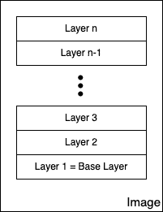

图 4.1 – 镜像作为层叠堆栈

每一层都包含文件和文件夹。每一层只包含相对于底层的文件系统的变化。Docker 使用联合文件系统——如在*第三章*《容器基础》一书中所讨论的——从一组层中创建一个虚拟文件系统。存储驱动程序处理这些层之间相互作用的细节。不同的存储驱动程序在不同情况下有各自的优缺点。

容器镜像的各个层都是不可变的。不可变意味着一旦生成，该层就无法更改。唯一可能影响层的操作是其物理删除。层的这种不可变性非常重要，因为它打开了大量的机会，正如我们将要看到的。

在下图中，我们可以看到一个自定义的 Web 应用程序的图片，使用 Nginx 作为 Web 服务器：

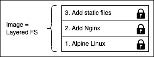

图 4.2 – 基于 Alpine 和 Nginx 的示例自定义镜像

我们这里的基础层是 Alpine Linux 发行版。然后，在其上，我们有一个**添加 Nginx**层，在 Alpine 的基础上添加了 Nginx。最后，第三层包含构成 Web 应用程序的所有文件，例如 HTML、CSS 和 JavaScript 文件。

正如之前所述，每个镜像都从一个基础镜像开始。通常，这个基础镜像是 Docker Hub 上找到的官方镜像之一，如 Linux 发行版 Alpine、Ubuntu 或 CentOS。然而，也可以从零开始创建一个镜像。

注意

Docker Hub 是一个公共的容器镜像注册表。它是一个理想的中央枢纽，非常适合分享公共容器镜像。该注册表可以在这里找到：[`hub.docker.com/`](https://hub.docker.com/)。

每个层只包含相对于前一组层的更改增量。每个层的内容都映射到主机系统上的一个特殊文件夹中，通常是 `/var/lib/docker/` 的子文件夹。

由于层是不可变的，它们可以被缓存而永远不会过期。这是一个巨大的优势，正如我们将要看到的。

## 可写的容器层

正如我们所讨论的，容器镜像由一堆不可变或只读的层组成。当 Docker 引擎从这样的镜像创建容器时，它在这堆不可变层的顶部添加一个可写的容器层。我们的堆栈现在如下所示：

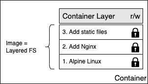

图 4.3 – 可写的容器层

容器层被标记为**读/写** (**r/w**)。镜像层的不可变性的另一个优点是，它们可以在从该镜像创建的许多容器之间共享。所需的只是为每个容器创建一个薄薄的可写容器层，如下图所示：


图 4.4 – 多个容器共享相同的镜像层

当然，这种技术极大地减少了消耗的资源。此外，这有助于减少容器的加载时间，因为只有在将镜像层加载到内存中后才需要创建薄薄的容器层，而这仅在第一个容器中发生。

## 写时复制

Docker 在处理镜像时使用写时复制技术。写时复制是一种共享和复制文件的高效策略。如果某一层使用了低层中的某个文件或文件夹，那么它会直接使用该文件。如果某一层想要修改低层中的某个文件，那么它首先会将该文件复制到目标层，然后再进行修改。在下图中，我们可以看到这意味着什么：

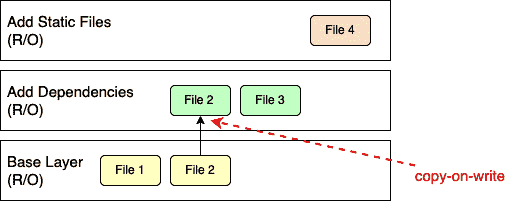

图 4.5 – 使用写时复制的 Docker 镜像

第二层需要修改基础层中的**文件 2**。因此，它将文件复制到当前层并进行修改。现在，假设我们站在前面图示中的顶层。这个层将使用基础层中的**文件 1**以及第二层中的**文件 2**和**文件 3**。

## 图形驱动程序

图形驱动程序是实现联合文件系统的关键。图形驱动程序也称为存储驱动程序，用于处理分层容器镜像。图形驱动程序将多个镜像层合并为容器的挂载命名空间的根文件系统。换句话说，驱动程序控制镜像和容器在 Docker 主机上的存储和管理方式。

Docker 支持多种不同的图形驱动程序，采用可插拔架构。首选的驱动程序是**overlay2**，其次是**overlay**。

现在我们了解了镜像是什么，我们将学习如何自己创建 Docker 镜像。

# 创建 Docker 镜像

在系统上创建新的容器镜像有三种方式。第一种是通过交互式地构建一个容器，容器中包含你想要的所有修改和新增内容，然后将这些更改提交到一个新的镜像中。第二种，也是最重要的方式，是使用 Dockerfile 描述新镜像的内容，然后利用该 Dockerfile 作为清单来构建镜像。最后，第三种创建镜像的方式是通过从 tarball 导入镜像到系统中。

现在，让我们详细了解这三种方式。

## 交互式镜像创建

我们创建自定义镜像的第一种方式是通过交互式构建一个容器。也就是说，我们从想要作为模板的基础镜像开始，并交互式地运行该容器。假设我们使用的是 Alpine 镜像：

1.  运行该容器的命令如下：

    ```
    $ docker container run -it \    --name sample \    alpine:3.17 /bin/sh
    ```

上述命令基于 `alpine:3.17` 镜像运行一个容器。

1.  我们通过附加 `-it` 参数以交互模式运行容器，通过 `--name` 参数将其命名为 `sample`，最后在容器内运行一个 shell，命令是 `/bin/sh`。

在你运行上述命令的终端窗口中，应该能看到类似以下内容：

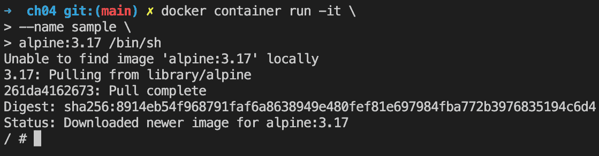

图 4.6 – 交互模式下的 Alpine 容器

默认情况下，Alpine 容器没有安装`curl`工具。假设我们想创建一个新的自定义镜像，其中安装了`curl`。

1.  在容器内，我们可以运行以下命令：

    ```
    / # apk update && apk add curl
    ```

前述命令首先更新了 Alpine 包管理器`apk`，然后安装了`curl`工具。该命令的输出应该大致如下：

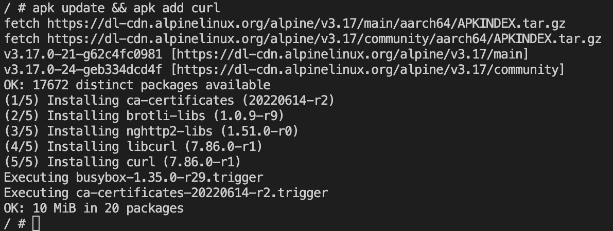

图 4.7 – 在 Alpine 上安装 curl

1.  现在，我们确实可以使用`curl`，如下所示的代码片段所示：

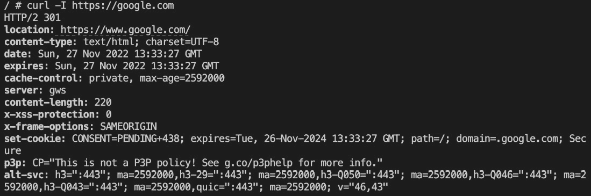

图 4.8 – 在容器内使用 curl

使用前述命令，我们已访问了 Google 首页，并通过`-I`参数告诉`curl`只输出响应头。

1.  一旦我们完成了自定义配置，可以通过在提示符下输入`exit`或按 Ctrl + D 来退出容器。

1.  现在，如果我们使用`docker container ls -a`命令列出所有容器，我们会看到我们的示例容器的状态为`Exited`，但仍然存在于系统中，如下所示的代码块所示：

    ```
    $ docker container ls -a | grep sample
    ```

1.  这应该输出类似于以下内容的内容：

    ```
    5266d7da377c   alpine:3.17    "/bin/sh"                2 hours ago      Exited (0) 48 seconds ago
    ```

1.  如果我们想查看相对于基础镜像我们的容器发生了哪些变化，可以使用`docker container diff`命令，如下所示：

    ```
    $ docker container diff sample
    ```

1.  输出应展示在容器文件系统上所做的所有修改列表，如下所示：

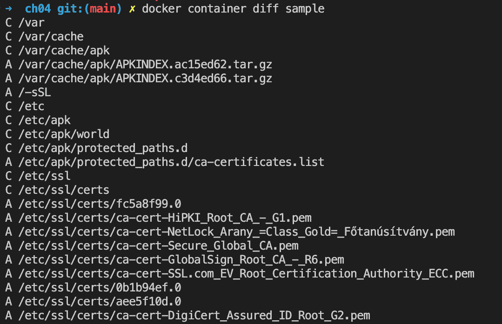

图 4.9 – docker diff 命令的输出（截断）

我们已将前述输出进行了简化，以提高可读性。在列表中，`A`代表添加，`C`代表更改。如果有任何删除的文件，它们会以`D`为前缀。

1.  现在，我们可以使用`docker container commit`命令来保存我们的修改，并从中创建一个新镜像，如下所示：

    ```
    $ docker container commit sample my-alpine
    ```

前述命令在作者计算机上生成的输出如下：

```
sha256:5287bccbb3012ded35e7e992a5ba2ded9b8b5d0...
```

使用前述命令时，我们指定了新镜像的名称为`my-alpine`。前述命令生成的输出对应于新生成镜像的 ID。

1.  我们可以通过列出系统上的所有镜像来验证这一点，如下所示：

    ```
    $ docker image ls
    ```

我们可以如下所示查看该镜像的 ID：

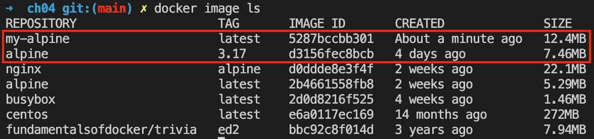

图 4.10 – 列出所有 Docker 镜像

我们可以看到名为`my-alpine`的镜像具有预期的 ID `5287bccbb301`（对应完整哈希码的前半部分），并自动获得了`latest`标签，因为我们没有显式地定义标签。在这种情况下，Docker 总是默认为`latest`标签。

1.  如果我们想查看自定义镜像的构建过程，可以使用`history`命令，如下所示：

    ```
    $ docker image history my-alipine
    ```

这将打印出我们镜像所包含的所有层，具体如下：

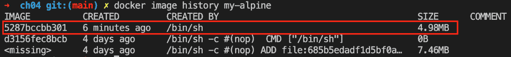

图 4.11 – my-alpine Docker 镜像的历史

上面输出中的顶层 —— 用红色标记 —— 就是我们刚刚通过添加 `curl` 包所创建的层。其他两行来自原始构建的 Alpine 3.17 Docker 镜像。它是在 4 天前创建并上传的。

现在我们已经看到如何交互式地创建 Docker 镜像，让我们看看如何使用 Dockerfile 以声明式的方式做到这一点。

## 使用 Dockerfiles

手动创建自定义镜像，如本章前面所示，在进行探索、创建原型或编写可行性研究时非常有用。但它有一个严重的缺点：这是一个手动过程，因此不可重复或不可扩展。它也容易出错，就像任何其他由人类手动执行的任务一样。一定有更好的方法。

这就是所谓的 Dockerfile 发挥作用的地方。`Dockerfile` 是一个文本文件，默认名称为 `Dockerfile`。它包含了构建自定义容器镜像的指令。这是一种声明式的镜像构建方式。

声明式与命令式

一般来说，在计算机科学中，尤其是在 Docker 中，你通常使用声明式的方式来定义任务。你描述预期的结果，并让系统去决定如何实现这个目标，而不是一步步地给系统提供实现该目标的指令。后者是命令式方法。

让我们看一个示例 Dockerfile，如下所示：

```
FROM python:3.12RUN mkdir -p /app
WORKDIR /app
COPY ./requirements.txt /app/
RUN pip install -r requirements.txt
CMD ["python", "main.py"]
```

这是一个 Dockerfile，用于将 Python 3.12 应用程序容器化。如我们所见，文件有六行，每一行都以 `FROM`、`RUN` 或 `COPY` 等关键字开头。

注意

通常约定将关键字写成大写字母，但这并不是强制要求。

Dockerfile 的每一行都会在生成的镜像中产生一个层。在下图中，镜像的展示方式与本章前面的图有所不同，显示为一个层叠的镜像堆栈。这里，基础层显示在顶部。不要被这个图形弄混淆。实际上，基础层总是在堆栈中位于最底部：

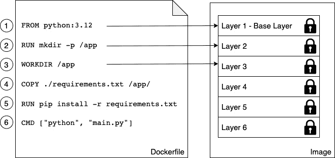

图 4.12 – Dockerfile 与镜像中的层之间的关系

现在，让我们更详细地看看每个关键字。

### FROM 关键字

每个 Dockerfile 都以 `FROM` 关键字开头。通过它，我们定义了从哪个基础镜像开始构建我们的自定义镜像。例如，如果我们想从 CentOS 7 开始构建，我们会在 Dockerfile 中加入以下这一行：

```
FROM centos:7
```

在 Docker Hub 上，所有主要的 Linux 发行版都有经过精心挑选或官方发布的镜像，此外，还有很多重要的开发框架或语言的镜像，如 Python、Node.js、Ruby、Go 等等。根据我们的需求，我们应该选择最合适的基础镜像。

例如，如果我想将一个 Python 3.12 应用程序容器化，我可能会选择相关的官方`python:3.12`镜像。

如果我们想从头开始，也可以使用以下语句：

```
FROM scratch
```

这在构建超简小镜像时非常有用，这些镜像仅包含一个二进制文件——例如——实际的静态链接可执行文件，如`Hello-World`。`scratch`镜像是一个空的基础镜像。

`FROM scratch`实际上在 Dockerfile 中是一个无操作命令，因此不会在最终的容器镜像中生成层。

### RUN 关键字

下一个重要的关键字是`RUN`。`RUN`的参数是任何有效的 Linux 命令，例如以下内容：

```
RUN yum install -y wget
```

上述命令使用`yum` CentOS 包管理器将`wget`包安装到正在运行的容器中。假设我们的基础镜像是 CentOS 或**红帽企业 Linux**（**RHEL**）。如果我们的基础镜像是 Ubuntu，那么命令会类似如下：

```
RUN apt-get update && apt-get install -y wget
```

它会像这样，因为 Ubuntu 使用`apt-get`作为包管理器。同样，我们也可以使用`RUN`定义一个类似的命令，如下所示：

```
RUN mkdir -p /app && cd /app
```

我们也可以这样做：

```
RUN tar -xJC /usr/src/python --strip-components=1 -f python.tar.xz
```

这里，前者在容器中创建一个`/app`文件夹并切换到该目录，后者将一个文件解包到指定位置。完全可以，并且推荐你使用多行物理行来格式化 Linux 命令，例如这样：

```
RUN apt-get update \  && apt-get install -y --no-install-recommends \
    ca-certificates \
    libexpat1 \
    libffi6 \
    libgdbm3 \
    libreadline7 \
    libsqlite3-0 \
   libssl1.1 \
  && rm -rf /var/lib/apt/lists/*
```

如果我们使用多行命令，我们需要在行末加上反斜杠（`\`），以指示 shell 命令将在下一行继续。

提示

尝试找出前面的命令在做什么。

### COPY 和 ADD 关键字

`COPY`和`ADD`关键字非常重要，因为最终我们想在现有的基础镜像上添加一些内容，使其成为一个自定义镜像。通常，这些内容可能是一些源文件——比如说——一个 Web 应用程序，或者一些已编译应用程序的二进制文件。

这两个关键字用于将文件和文件夹从主机复制到我们正在构建的镜像中。两个关键字非常相似，唯一的区别是`ADD`关键字还允许我们复制并解包`TAR`文件，并可以提供 URI 作为复制文件和文件夹的源。

让我们看一些这两个关键字使用的示例，如下所示：

```
COPY . /appCOPY ./web /app/web
COPY sample.txt /data/my-sample.txt
ADD sample.tar /app/bin/
ADD http://example.com/sample.txt /data/
```

在前面的代码行中，以下内容适用：

+   第一行将当前目录中的所有文件和文件夹递归地复制到容器镜像中的`app`文件夹。

+   第二行将`web`子文件夹中的所有内容复制到目标文件夹`/app/web`。

+   第三行将单个文件`sample.txt`复制到目标文件夹`/data`，同时将其重命名为`my-sample.txt`。

+   第四条语句将`sample.tar`文件解包到目标文件夹`/app/bin`。

+   最后，最后一条语句将远程文件`sample.txt`复制到目标文件`/data`。

在源路径中允许使用通配符。例如，下面的语句将所有以`sample`开头的文件复制到镜像中的`mydir`文件夹：

```
COPY ./sample* /mydir/
```

从安全角度来看，重要的是要知道，默认情况下，镜像中的所有文件和文件夹都会执行`ADD`和`COPY`，我们可以使用可选的`--chown`标志来更改文件在镜像中的所有权，如下所示：

```
ADD --chown=11:22 ./data/web* /app/data/
```

上述语句将复制所有以`web`开头的文件，并将它们放入镜像中的`/app/data`文件夹，同时将用户 11 和组 22 赋予这些文件。

我们不仅可以使用数字，也可以使用用户名和组名，但这些实体必须已经在镜像的根文件系统中的`/etc/passwd`和`/etc/group`中定义；否则，镜像的构建将失败。

### `WORKDIR`关键字

`WORKDIR`关键字定义了当从我们的自定义镜像运行容器时使用的工作目录或上下文。所以，如果我想将上下文设置为镜像中的`/app/bin`文件夹，我在 Dockerfile 中的表达式应该如下所示：

```
WORKDIR /app/bin
```

在前面的行之后，镜像内发生的所有活动都将使用这个目录作为工作目录。需要特别注意的是，下面两段来自 Dockerfile 的代码并不相同：

```
RUN cd /app/binRUN touch sample.txt
```

将前面的代码与以下代码进行对比：

```
WORKDIR /app/binRUN touch sample.txt
```

前者将在镜像文件系统的根目录创建文件，而后者将在预期位置`/app/bin`文件夹中创建文件。只有`WORKDIR`关键字会在镜像的各个层之间设置上下文。单独使用`cd`命令不会在层之间持久化。

注意

在 Dockerfile 中多次更改当前工作目录是完全可以的。

### `CMD`和`ENTRYPOINT`关键字

`CMD`和`ENTRYPOINT`关键字是特殊的。其他所有 Dockerfile 中定义的关键字都是在 Docker 构建器构建镜像时执行的，而这两个关键字定义的是当容器从我们定义的镜像启动时将发生的操作。当容器运行时，它需要知道容器内将运行的进程或应用程序。这正是`CMD`和`ENTRYPOINT`的用途——告诉 Docker 启动进程是什么，以及如何启动该进程。

现在，`CMD`和`ENTRYPOINT`之间的区别非常微妙，说实话，大多数用户并不完全理解它们或以预期的方式使用它们。幸运的是，在大多数情况下，这不是问题，容器仍然会运行；只是处理起来没有想象中的那么直接。

为了更好地理解如何使用这两个关键字，让我们分析一下一个典型的 Linux 命令或表达式是什么样的。我们以`ping`工具为例，如下所示：

```
$ ping -c 3 8.8.8.8
```

在前面的表达式中，`ping` 是命令，`-c 3 8.8.8.8` 是该命令的参数。我们在这里看另一个表达式：[点击这里查看](http://example.com/downloads/script.sh)：

```
$ wget -O - http://example.com/downloads/script.sh
```

在前面的表达式中，`wget` 是命令，`-O - http://example.com/downloads/script.sh` 是参数。

处理完这个之后，我们可以回到 `CMD` 和 `ENTRYPOINT`。`ENTRYPOINT` 用于定义表达式的命令，而 `CMD` 用于定义命令的参数。因此，一个使用 Alpine 作为基础镜像并将 `ping` 定义为容器中运行的进程的 Dockerfile 可能如下所示：

```
FROM alpine:3.17ENTRYPOINT [ "ping" ]
CMD [ "-c", "3", "8.8.8.8" ]
```

对于 `ENTRYPOINT` 和 `CMD`，其值格式化为一个字符串的 JSON 数组，其中每个项对应于通过空格分隔的表达式中的各个令牌。这是定义 `CMD` 和 `ENTRYPOINT` 的推荐方式，也称为 exec 形式。

或者，我们可以使用所谓的 shell 形式，如下所示：

```
CMD command param1 param2
```

我们现在可以根据前面的 Dockerfile 构建一个名为 `pinger` 的镜像，如下所示：

```
$ docker image build -t pinger .
```

这是前面命令生成的输出：

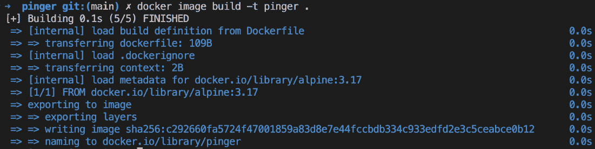

图 4.13 – 构建 pinger Docker 镜像

然后，我们可以从刚才创建的 pinger 镜像中运行一个容器，像这样：

```
$ docker container run --rm -it pinger
```


图 4.14 – pinger 容器的输出

在前面的命令中，我们使用了 `--rm` 参数，定义了容器在其中的应用程序结束后会自动删除。

这样做的好处是，现在我可以在创建新容器时，通过在 `docker container run` 表达式的末尾添加新值来覆盖我在 Dockerfile 中定义的 CMD 部分（记住，它是 `["-c", "3","8.8.8.8"]`），像这样：

```
$ docker container run --rm -it pinger -w 5 127.0.0.1
```

这将使容器对回环 IP 地址（`127.0.0.1`）进行 5 秒的 ping 操作。

如果我们想覆盖 Dockerfile 中 `ENTRYPOINT` 定义的内容，我们需要在 `docker container run` 表达式中使用 `--entrypoint` 参数。假设我们想在容器中执行一个 shell，而不是 `ping` 命令。我们可以使用以下命令：

```
$ docker container run --rm -it --entrypoint /bin/sh pinger
```

然后，我们将进入容器内。输入 `exit` 或按 *Ctrl + D* 退出容器。

如我之前提到的，我们不一定要遵循最佳实践，通过 `ENTRYPOINT` 定义命令，通过 `CMD` 定义参数；相反，我们可以将整个表达式作为 `CMD` 的值，它也能正常工作，如以下代码块所示：

```
FROM alpine:3.17CMD wget -O - http://www.google.com
```

在这里，我甚至使用了 shell 形式来定义 CMD。但如果 `ENTRYPOINT` 未定义，发生什么情况呢？如果你不定义 `ENTRYPOINT`，它将默认为 `/bin/sh -c`，无论 `CMD` 的值是什么，它都会作为字符串传递给 shell 命令。前面的定义因此会导致进入以下代码来在容器内运行该进程：

```
/bin/sh -c "wget -O - http://www.google.com"
```

因此，`/bin/sh` 是容器内运行的主进程，它将启动一个新的子进程来运行 `wget` 工具。

### 一个复杂的 Dockerfile

到目前为止，我们已经讨论了在 Dockerfile 中常用的最重要的关键字。现在，让我们看一个现实且稍微复杂的 Dockerfile 示例。对感兴趣的朋友来说，可能会注意到它看起来与我们在本章中展示的第一个 Dockerfile 非常相似。以下是它的内容：

```
FROM node:19-buster-slimRUN mkdir -p /app
WORKDIR /app
COPY package.json /app/
RUN npm install
COPY . /app
ENTRYPOINT ["npm"]
CMD ["start"]
```

好的，那么这里到底发生了什么？这是一个用于构建 Node.js 应用程序镜像的 Dockerfile；我们可以从使用的基础镜像 `node:19-buster-slim` 推断出这一点。接着，第二行是一个指令，用于在镜像的文件系统中创建一个 `/app` 文件夹。第三行定义了镜像中的工作目录或上下文为这个新的 `/app` 文件夹。然后，在第四行，我们将一个 `package.json` 文件复制到镜像中的 `/app` 文件夹内。此后，在第五行，我们在容器内执行 `npm install` 命令；记住，我们的上下文是 `/app` 文件夹，所以 `npm` 会在那里找到我们在第四行复制的 `package.json` 文件。

一旦所有的 Node.js 依赖项安装完毕，我们将从主机的当前文件夹中复制其余的应用程序文件到镜像的 `/app` 文件夹内。

最后，在最后两行中，我们定义了从这个镜像运行容器时的启动命令。在我们的例子中，它是 `npm start`，将启动 Node.js 应用程序。

### 构建镜像

让我们看一个具体的示例并构建一个简单的 Docker 镜像，如下所示：

1.  导航到示例代码库。通常它应该位于你的主文件夹中：

    ```
    $ cd ~/The-Ultimate-Docker-Container-Book
    ```

1.  为*第四章*创建一个新的子文件夹并进入：

    ```
    $ mkdir ch04 && cd ch04
    ```

1.  在前面的文件夹中，创建一个 `sample1` 子文件夹并进入，如下所示：

    ```
    $ mkdir sample1 && cd sample1
    ```

1.  使用你喜欢的编辑器在这个示例文件夹中创建一个名为 `Dockerfile` 的文件，内容如下：

    ```
    FROM centos:7RUN yum install -y wget
    ```

1.  保存文件并退出编辑器。

1.  回到终端窗口，我们现在可以使用前面的 Dockerfile 作为清单或构建计划来构建一个新的容器镜像，如下所示：

    ```
    $ docker image build -t my-centos .
    ```

请注意，前面的命令末尾有一个句点（`.`）：

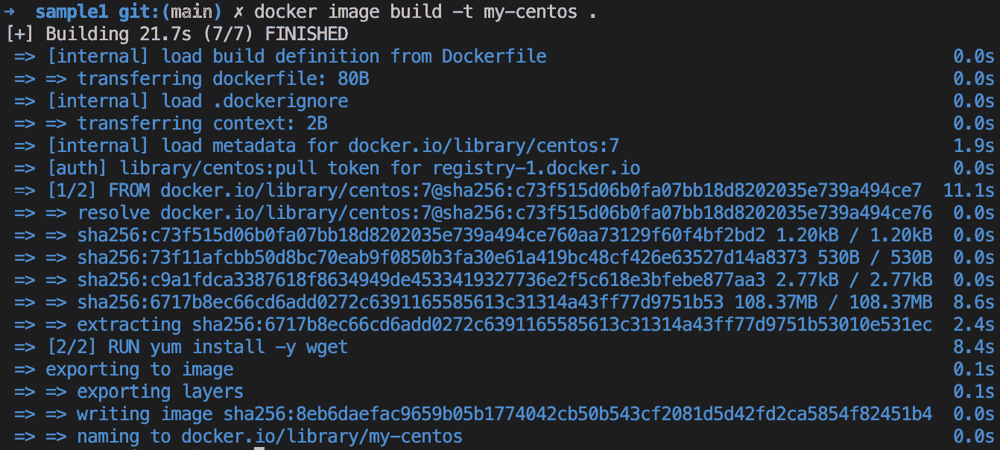

图 4.15 – 从 CentOS 构建我们的第一个自定义镜像

上一个命令的意思是 Docker 构建器使用当前目录中的 Dockerfile 创建一个名为 `my-centos` 的新镜像。这里，命令末尾的句点指定了当前目录。我们也可以将前面的命令写成以下形式，结果是一样的：

```
$ docker image build -t my-centos -f Dockerfile .
```

在这里，我们可以省略 `-f` 参数，因为构建器假定 Dockerfile 的文件名就是 `Dockerfile`。只有当我们的 Dockerfile 名称不同或不在当前目录时，才需要使用 `-f` 参数。

让我们分析一下在 *图 4.15* 中显示的输出。这些输出是由 Docker 构建工具生成的：

1.  首先，我们有以下一行：

    ```
    [+] Building 21.7s (7/7) FINISHED
    ```

这一行是在构建过程结束时生成的，尽管它看起来是第一行。它告诉我们构建大约花费了 22 秒，并且执行了 7 个步骤。

1.  现在，让我们跳过接下来的几行，直到我们到达这一行：

    ```
    => [1/2] FROM docker.io/library/centos:7@sha256:c73f51...
    ```

这一行告诉我们构建器当前正在执行 Dockerfile 的哪一行（第 1 行，共 2 行）。我们可以看到这就是 Dockerfile 中的 `FROM centos:7` 语句。这是声明基础镜像，我们希望在其上构建我们的自定义镜像。接下来，构建器会从 Docker Hub 拉取该镜像，如果它在本地缓存中尚不存在的话。

1.  现在，继续执行下一步。我已经将它缩短得比前一步还要简洁，专注于最关键的部分：

    ```
    => [2/2] RUN yum install -y wget
    ```

这是我们在 Dockerfile 中的第二行，我们希望使用 `yum` 包管理器来安装 `wget` 工具。

1.  最后几行如下所示：

    ```
    => exporting to image                              0.1s=> => exporting layers                             0.1s=> => writing image sha256:8eb6daefac9659b05b17740...=> => naming to docker.io/library/my-centos
    ```

在这里，构建器完成了镜像的构建，并提供了该镜像的 `sha256` 代码 `8eb6daefac9...`。

这告诉我们，生成的自定义镜像已被赋予 ID `8eb6daefac9...`，并且已标记为 `my-centos:latest`。

现在我们已经分析了 Docker 镜像构建过程的工作原理以及涉及的步骤，让我们谈谈如何通过引入多步骤构建来进一步优化这个过程。

### 多步骤构建

为了演示为什么一个包含多个构建步骤的 Dockerfile 有用，让我们做一个示例 Dockerfile。让我们以一个用 C 语言编写的 Hello World 应用程序为例：

1.  打开一个新的终端窗口并导航到本章的文件夹：

    ```
    $ cd The-Ultimate-Docker-Container-Book/ch04
    ```

1.  在你的章节文件夹中创建一个名为 `multi-step-build` 的新文件夹：

    ```
    $ mkdir multi-step-build
    ```

1.  打开 VS Code 来处理这个文件夹：

    ```
    $ code multi-step-build
    ```

1.  在这个文件夹中创建一个名为 `hello.c` 的文件，并添加以下代码：

    ```
    #include <stdio.h>int main (void){    printf ("Hello, world!\n");    return 0;}
    ```

1.  现在，我们要将这个应用程序容器化，并编写一个包含以下内容的 Dockerfile：

    ```
    FROM alpine:3.12RUN apk update && \    apk add --update alpine-sdkRUN mkdir /appWORKDIR /appCOPY . /appRUN mkdir binRUN gcc -Wall hello.c -o bin/helloCMD /app/bin/hello
    ```

1.  接下来，让我们构建这个镜像：

    ```
    $ docker image build -t hello-world .
    ```

由于构建器需要安装 Alpine **软件开发工具包**（**SDK**），其中包括我们需要的 C++ 编译器来构建应用程序，因此这会产生相当长的输出。

1.  构建完成后，我们可以列出镜像并查看显示的大小，如下所示：

    ```
    $ docker image ls | grep hello-world
    ```

在作者的情况下，输出如下所示：

```
hello-world   latest   42c0c7086fbf   2 minutes ago   215MB
```

生成的镜像大小为 215 MB，显然太大了。最终，它只是一个 Hello World 应用程序。镜像之所以如此之大，是因为它不仅包含了 Hello World 的二进制文件，还包括了所有编译和链接应用程序所需的工具。但是在生产环境中运行应用程序时，这种做法并不理想。理想情况下，我们只希望镜像中包含最终的二进制文件，而不是整个 SDK。

正因为如此，我们应该将 Dockerfile 定义为多阶段构建。我们有一些阶段用于构建最终的工件，然后在最终阶段中，我们使用最小必要的基础镜像并将工件复制到其中。这将生成非常小的 Docker 镜像。让我们来做一下：

1.  在你的文件夹中创建一个新的 Dockerfile，命名为 `Dockerfile.multi-step`，并添加以下内容：

    ```
    FROM alpine:3.12 AS buildRUN apk update && \    apk add --update alpine-sdkRUN mkdir /appWORKDIR /appCOPY . /appRUN mkdir binRUN gcc hello.c -o bin/helloFROM alpine:3.12COPY --from=build /app/bin/hello /app/helloCMD /app/hello
    ```

在这里，我们有第一个阶段，别名为 `build`，用于编译应用程序；然后，第二个阶段使用相同的 `alpine:3.12` 基础镜像，但没有安装 SDK，只是从 `build` 阶段复制二进制文件，使用 `--from` 参数，将其复制到最终的镜像中。

1.  让我们按照如下方式再次构建镜像：

    ```
    $ docker image build -t hello-world-small \    -f Dockerfile.multi-step .
    ```

1.  让我们通过以下命令来比较镜像的大小：

    ```
    $ docker image ls | grep hello-world
    ```

在这里，我们得到了以下输出：

```
hello-world-small latest 72c... 20 seconds ago 5.34MBhello-world latest 42c... 10 minutes ago 215
```

我们已经将镜像的大小从 215 MB 降到了 5.34 MB。这相当于减少了约 40 倍的大小。更小的镜像有许多优势，比如为黑客提供更小的攻击面、更低的内存和磁盘消耗、更快的容器启动时间，以及减少从镜像仓库（如 Docker Hub）下载镜像所需的带宽。

### Dockerfile 最佳实践

在编写 Dockerfile 时，有一些推荐的最佳实践需要考虑，具体如下：

+   首先，我们需要考虑的是，容器本身是暂时性的。所谓暂时性，是指容器可以被停止和销毁，接着可以构建一个新的容器并用最少的设置和配置投入使用。这意味着我们应该尽量减少初始化容器内应用程序所需的时间，以及终止或清理应用程序所需的时间。

+   下一个最佳实践告诉我们，我们应该按照一定顺序排列 Dockerfile 中的各个命令，以便尽可能利用缓存。构建镜像的一个层可能会花费相当长的时间——有时需要几秒钟，甚至几分钟。在开发应用程序时，我们需要多次构建应用程序的容器镜像。我们希望将构建时间保持在最短。

当我们重新构建一个先前构建的镜像时，只有那些发生变化的层才会重新构建，但如果某一层需要重新构建，那么所有后续的层也需要重新构建。这一点非常重要，请记住。考虑以下示例：

```
FROM node:19RUN mkdir -p /app
WORKIR /app
COPY . /app
RUN npm install
CMD ["npm", "start"]
```

在这个例子中，Dockerfile 中第五行的`npm install`命令通常需要较长的时间。一个经典的 Node.js 应用程序有许多外部依赖，这些依赖都在此步骤中下载并安装。完成这个步骤可能需要几分钟。因此，我们希望避免每次重建镜像时都运行`npm install`，但开发人员在应用程序开发过程中会经常更改源代码。这意味着第四行的`COPY`命令每次都会发生变化，因此这个层必须重新构建。但正如我们之前讨论的，这也意味着所有后续层必须重新构建，其中包括`npm install`命令。为避免这种情况，我们可以稍微修改 Dockerfile，得到如下内容：

```
FROM node:19RUN mkdir -p /app
WORKIR /app
COPY package.json /app/
RUN npm install
COPY . /app
CMD ["npm", "start"]
```

在第四行，我们仅复制了`npm install`命令需要的单个文件作为源文件，即`package.json`文件。在典型的开发过程中，这个文件很少发生变化。因此，`npm install`命令也只在`package.json`文件变化时执行。所有其他频繁变化的内容都会在执行`npm install`命令之后添加到镜像中。

另一个最佳实践是保持构成镜像的层数相对较小。镜像的层数越多，图形驱动程序需要处理的工作就越多，必须将这些层合并成一个根文件系统，供相应的容器使用。当然，这会耗费时间，因此，镜像的层数越少，容器的启动时间就越快。

那么，我们如何保持层数较低呢？记住，在 Dockerfile 中，每个以`FROM`、`COPY`或`RUN`等关键字开头的行都会创建一个新层。减少层数的最简单方法是将多个独立的`RUN`命令合并为一个。例如，假设我们的 Dockerfile 中有如下内容：

```
...RUN apt-get update
RUN apt-get install -y ca-certificates
RUN rm -rf /var/lib/apt/lists/*
...
```

我们可以将它们合并成一个单一的连接表达式，如下所示：

```
...RUN apt-get update \
    && apt-get install -y ca-certificates \
    && rm -rf /var/lib/apt/lists/*
...
```

前者将在生成的镜像中产生三个层，而后者只会创建一个层。

接下来的三条最佳实践都会导致更小的镜像。这为什么很重要呢？较小的镜像减少了从注册表下载镜像所需的时间和带宽。它们还减少了在 Docker 主机上本地存储镜像副本所需的磁盘空间以及加载镜像所需的内存。最后，更小的镜像也意味着更小的攻击面，降低了黑客攻击的风险。以下是提到的最佳实践：

+   有助于减小镜像大小的第一个最佳实践是使用`.dockerignore`文件。我们希望避免将不必要的文件和文件夹复制到镜像中，保持镜像尽可能精简。`.dockerignore`文件的作用与`.gitignore`文件类似，熟悉 Git 的人会很容易理解。在`.dockerignore`文件中，我们可以配置模式，排除某些文件或文件夹在构建镜像时被包含在上下文中。

+   下一项最佳实践是避免向镜像的文件系统中安装不必要的软件包。再次强调，这是为了保持镜像尽可能精简。

+   最后但同样重要的是，建议使用多阶段构建，这样生成的镜像会尽可能小，并且只包含运行应用程序或应用服务所需的最基本内容。

在下一节中，我们将学习如何从先前保存的镜像创建 Docker 镜像。实际上，这可能看起来像是在恢复一个镜像。

## 保存和加载镜像

创建新容器镜像的第三种方式是通过从文件导入或加载它。容器镜像不过是一个 tarball。为了演示这一点，我们可以使用 `docker image save` 命令将现有镜像导出为 tarball，像这样：

```
$ mkdir backup$ docker image save -o ./backup/my-alpine.tar my-alpine
```

上述命令会将我们之前构建的 `my-alpine` 镜像导出到名为 `./backup/my-alpine.tar` 的文件中：

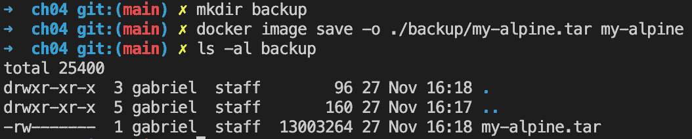

图 4.16 – 将镜像导出为 tarball

另一方面，如果我们已经有一个现有的 tarball 并希望将其导入系统作为镜像，我们可以使用 `docker image load` 命令，如下所示：

```
$ docker image load -i ./backup/my-alpine.tar
```

上述命令的输出应如下所示：

```
Loaded image: my-alpine:latest
```

通过这些内容，我们已经学会了三种不同的构建 Docker 镜像的方法。我们可以通过交互方式、通过定义 Dockerfile，或者通过从 tarball 导入到我们的系统中来实现。

在下一节中，我们将讨论如何为现有的传统应用程序创建 Docker 镜像，从而在容器中运行它们，并从中受益。

# 提升与迁移 – 将传统应用容器化

我们不总是能从头开始开发一个全新的应用程序。更多时候，我们会面临一个巨大的传统应用程序组合，这些应用程序已经在生产环境中运行，并且为公司或公司客户提供关键价值。这些应用程序通常是有机发展起来的，结构非常复杂。文档稀缺，没人愿意去触碰这样的应用程序。常常，“*永远不要碰一个正在运行的系统*”这句话适用。然而，市场需求发生变化，因此需要更新或重写这些应用程序。由于资源和时间的限制，或者因为成本过高，完全重写往往不可行。我们该如何处理这些应用程序呢？我们是否可以将它们 Docker 化，并从容器带来的好处中受益？

结果证明我们可以做到。在 2017 年，Docker 向其企业客户推出了一款名为**现代化传统应用**（**MTA**）的程序，本质上承诺帮助客户将他们现有的或传统的 Java 和.NET 应用程序容器化，而无需更改一行代码。MTA 的重点是 Java 和.NET 应用程序，因为它们在典型企业中的传统应用程序占据了大部分份额。但它也可以用于任何用其他语言和平台编写的应用程序，例如 C、C++、Python、Node.js、Ruby、PHP 或 Go 等等。

让我们假设一下这样的遗留应用程序。假设我们有一个 10 年前编写的旧 Java 应用程序，并且在接下来的 5 年中不断进行更新。该应用程序基于 2006 年 12 月发布的 Java SE 6。它使用环境变量和属性文件进行配置。像用户名和密码这样的机密信息，通常通过一个机密库（例如 HashiCorp Vault）来提取，用于数据库连接字符串中。

现在，让我们更详细地描述一下提升和迁移遗留应用程序的每个必要步骤。

## 分析外部依赖

现代化过程的第一步之一是发现并列出遗留应用程序的所有外部依赖：

+   它使用数据库吗？如果使用，是什么数据库？连接字符串是什么样子的？

+   它是否使用外部 API，如信用卡审批或地理定位 API？API 密钥和密钥密码是什么？

+   它是从**企业服务总线**（**ESB**）消费数据，还是向其发布数据？

这些只是想到的几个可能的依赖项，实际上还有很多其他依赖。这些是应用程序与外部世界的连接点，我们需要意识到它们并创建一个清单。

## 源代码和构建指令

下一步是定位所有源代码和其他资产，例如图像、CSS 和 HTML 文件，这些文件都是应用程序的一部分。理想情况下，它们应该位于一个文件夹中。这个文件夹将成为我们的项目根目录，并且可以根据需要包含多个子文件夹。这个项目根目录将在我们为遗留应用程序创建容器镜像时作为上下文。请记住，Docker 构建器只会包括属于该上下文的文件；在我们的例子中，根项目文件夹就是上下文。

但是，确实有一个选项，可以在构建过程中从不同位置下载或复制文件，使用`COPY`或`ADD`命令。请参考在线文档，了解如何使用这两个命令的详细信息。如果遗留应用程序的源代码无法轻松包含在一个本地文件夹中，则此选项非常有用。

一旦我们了解了所有组成最终应用程序的部分，我们需要调查应用程序是如何构建和打包的。在我们的案例中，这很可能是通过使用`make`来完成的。

再次提醒，让我们扩展我们的清单并记录下使用的确切构建命令。当我们编写 Dockerfile 时，需要使用这些信息。

## 配置

应用程序需要进行配置。在配置过程中提供的信息可能包括——例如——使用的应用程序日志类型、连接数据库的连接字符串，以及服务的主机名，例如企业服务总线（ESBs）或外部 API 的 URI，仅举几例。

我们可以区分几种配置类型，如下所示：

+   **构建时**：这是在构建应用程序及/或其 Docker 镜像时需要的信息。在创建 Docker 镜像时必须提供这些信息。

+   `开发`与`预发布`或`生产`。这种配置在启动容器时应用于应用程序——例如，在生产环境中。

+   **运行时**：这是应用程序在运行时检索到的信息，例如访问外部 API 的机密信息。

## 机密信息

每个关键任务的企业应用程序都需要以某种形式处理机密信息。最常见的机密信息是访问数据库所需的连接信息，这些数据库用于持久化应用程序生成或使用的数据。其他机密信息包括访问外部 API 所需的凭证，例如信用评分查询 API。需要注意的是，在这里我们谈论的是应用程序本身需要向其使用或依赖的服务提供商提供的机密，而不是由应用程序用户提供的机密。此处的行动者是我们的应用程序，它需要经过外部权威和服务提供商的身份验证和授权。

传统应用程序获取机密信息的方式有多种。最差且最不安全的提供机密信息的方式是硬编码机密或从配置文件或环境变量中读取机密信息，在这些地方它们是明文可见的。更好的方式是在运行时从一个专门的机密存储读取这些机密，该存储会加密机密信息并通过安全连接提供给应用程序，例如**传输层** **安全性**（**TLS**）。

再次提醒，我们需要创建一个清单，列出我们的应用程序使用的所有机密信息以及它们的获取方式。因此，我们需要问自己：我们的机密信息从哪里来？是通过环境变量或配置文件，还是通过访问外部密钥存储，如 HashiCorp Vault、AWS Secrets Manager 或 Azure Key Vault？

## 编写 Dockerfile

一旦我们完成了前几节讨论的所有项目的完整清单，我们就准备编写 Dockerfile 了。但我想提醒你：不要期望这是一项一次性完成的任务。你可能需要几轮修改，直到最终制作出你的 Dockerfile。Dockerfile 可能会很长且看起来不太美观，但这不是问题，只要我们能够得到一个有效的 Docker 镜像。等我们有了一个可工作的版本后，随时可以对 Dockerfile 进行微调。

### 基础镜像

让我们从确定想要使用的基础镜像开始，并从中构建我们的镜像。是否有一个符合我们要求的官方 Java 镜像？记住，我们的应用程序基于 Java SE 6。如果有这样的基础镜像，那么我们应该使用它。否则，我们将希望从一个 Linux 发行版开始，比如 Red Hat、Oracle 或 Ubuntu。在后者的情况下，我们将使用该发行版的合适包管理器（`yum`、`apt`或其他）来安装所需版本的 Java 和 Maven。为此，我们可以在 Dockerfile 中使用`RUN`关键字。记住，`RUN`允许我们在构建过程中执行镜像中的任何有效 Linux 命令。

### 汇总源代码

在这一步，我们确保所有成功构建应用程序所需的源文件和其他工件都成为镜像的一部分。这里，我们主要使用 Dockerfile 中的两个关键字：`COPY`和`ADD`。最初，镜像内部源文件的结构应该与主机上的结构相同，以避免任何构建问题。理想情况下，你应该有一个`COPY`命令，它将主机上的所有根项目文件夹复制到镜像中。对应的 Dockerfile 代码片段可以像这样简单：

```
WORKDIR /appCOPY . .
```

注意

别忘了提供一个`.dockerignore`文件，该文件位于项目的根文件夹，列出了所有不应成为构建上下文一部分的项目根文件夹中的文件和（子）文件夹。

如前所述，你也可以使用`ADD`关键字将源代码和其他工件下载到 Docker 镜像中，这些源文件和工件不在构建上下文中，而是位于一个通过 URI 可以访问的地方，如下所示：

```
ADD http://example.com/foobar ./
```

这将会在镜像的工作目录中创建一个`foobar`文件夹，并从 URI 中复制所有内容。

### 构建应用程序

在这一步，我们确保创建最终的工件，这些工件构成我们可执行的遗留应用程序。通常，这个工件是一个`JAR`或`WAR`文件，可能包含一些附加的 JAR 文件，也可能不包含。Dockerfile 的这一部分应模仿你在容器化之前传统的构建应用程序方式。因此，如果你使用的是 Maven 作为构建自动化工具，那么对应的 Dockerfile 代码片段可能看起来像这样简单：

```
RUN mvn --clean install
```

在这个步骤中，我们可能还希望列出应用使用的环境变量，并提供合理的默认值。但绝不要为提供给应用的机密环境变量（例如数据库连接字符串）设置默认值！使用`ENV`关键字定义你的变量，像这样：

```
ENV foo=barENV baz=123
```

同时，声明应用正在监听的所有端口，并且这些端口需要通过`EXPOSE`关键字从容器外部访问，像这样：

```
EXPOSE 5000EXPOSE 15672/tcp
```

接下来，我们将解释`start`命令。

### 定义启动命令

通常，如果是独立应用，Java 应用会使用类似`java -jar <mainapplication jar>`的命令启动。如果是 WAR 文件，那么`start`命令可能会有所不同。因此，我们可以定义`ENTRYPOINT`或`CMD`来使用此命令。最终的 Dockerfile 中的语句可能如下所示：

```
ENTRYPOINT java -jar pet-shop.war
```

但通常情况下，这种做法过于简单，我们需要执行一些预先运行的任务。在这种情况下，我们可以编写一个脚本文件，包含需要执行的一系列命令，用来准备环境并运行应用。这样的文件通常叫做`docker-entrypoint.sh`，但你可以根据自己的需要自由命名。确保文件是可执行的——例如，在主机上运行以下命令：

```
chmod +x ./docker-entrypoint.sh
```

Dockerfile 的最后一行将如下所示：

```
ENTRYPOINT ./docker-entrypoint.sh
```

既然你已经得到了关于如何容器化遗留应用的提示，那么现在是时候总结一下，问问自己，值得付出这番努力吗？

## 为什么要费劲？

在这一点上，我能看到你正在挠头，心里想：为什么要费劲呢？为什么要花这么大的力气去容器化一个遗留应用呢？这样做有什么好处？

原来，**投资回报率**（**ROI**）是巨大的。Docker 的企业客户在 2018 年和 2019 年的 DockerCon 等会议上公开披露，他们在容器化传统应用时看到了以下两个主要的好处：

+   维护成本节省超过 50%

+   新版本部署之间的时间减少最多可达 90%

通过减少维护开销节省的成本可以直接再投资，用于开发新特性和新产品。在传统应用的新版本发布过程中节省的时间使得企业变得更加灵活，能够更快速地响应不断变化的客户需求或市场需求。

现在我们已经详细讨论了如何构建 Docker 镜像，是时候学习如何通过软件交付管道的各个阶段来传输这些镜像了。

# 共享或传输镜像

为了能够将我们自定义的镜像传输到其他环境，我们需要给它一个全局唯一的名称。这个操作通常称为**镜像标签**。然后，我们需要将镜像发布到一个中央位置，其他感兴趣或有权限的方可以从该位置拉取镜像。这些中央位置称为**镜像注册表**。

在接下来的章节中，我们将更详细地描述这一过程是如何工作的。

## 镜像标记

每个镜像都有一个所谓的标签。标签通常用于为镜像版本化，但它的用途远不止版本号。如果我们在操作镜像时没有明确指定标签，那么 Docker 会默认使用最新标签。这在从 Docker Hub 拉取镜像时非常重要，如以下示例所示：

```
$ docker image pull alpine
```

上述命令将从 Docker Hub 拉取`alpine:latest`镜像。如果我们想明确指定标签，可以这样做：

```
$ docker image pull alpine:3.5
```

这将拉取带有标签`3.5`的 Alpine 镜像。

## 解密镜像命名空间

到目前为止，我们已经拉取了各种镜像，并没有太多关心这些镜像的来源。你的 Docker 环境已配置好，默认情况下，所有镜像都从 Docker Hub 拉取。我们也只是从 Docker Hub 拉取了所谓的官方镜像，例如 `alpine` 或 `busybox`。

现在，是时候拓宽视野，学习如何命名镜像的命名空间了。定义镜像的最通用方法是使用其完全限定名，格式如下：

```
<registry URL>/<User or Org>/<name>:<tag>
```

让我们更详细地看一下：

| **命名空间部分** | **描述** |
| --- | --- |

| `<``registry URL>` | 这是我们希望从中拉取镜像的注册表的 URL。默认情况下，这是`docker.io`。更一般来说，这可以是[`registry.acme.com`](https://registry.acme.com)。除了 Docker Hub，还有许多公共注册表可以从中拉取镜像。以下是一些示例，顺序不分先后：

+   Google，网址为[`cloud.google.com/container-registry`](https://cloud.google.com/container-registry)

+   Amazon AWS Amazon **弹性容器注册表**（**ECR**），网址为[`aws.amazon.com/ecr/`](https://aws.amazon.com/ecr/)

+   Microsoft Azure，网址为[`azure.microsoft.com/en-us/services/container-registry/`](https://azure.microsoft.com/en-us/services/container-registry/)

+   Red Hat，网址为[`access.redhat.com/containers/`](https://access.redhat.com/containers/)

+   Artifactory，网址为[`jfrog.com/integration/artifactorydocker-registry/`](https://jfrog.com/integration/artifactorydocker-registry/)

|

| `<User>` 或 `<Org>` | 这是在 Docker Hub 上定义的个人或组织的私有 Docker ID —— 或者在任何其他注册表上，例如 `microsoft` 或 `oracle`。 |
| --- | --- |
| `<``name>` | 这是镜像的名称，通常也称为仓库。 |
| `<``tag>` | 这是镜像的标记。 |

让我们来看一个示例，如下所示：

```
https://registry.acme.com/engineering/web-app:1.0
```

这里，我们有一个镜像 `web-app`，它被标记为版本 `1.0`，并属于 `engineering` 组织，存储在私有注册表 `https://registry.acme.com` 上。

现在，有一些特殊的约定：

+   如果我们省略注册表 URL，Docker Hub 会被自动采用

+   如果我们省略标签，则会自动使用 `latest` 标签

+   如果它是 Docker Hub 上的官方镜像，则无需用户或组织命名空间

下面是一些表格形式的示例：

| **镜像** | **描述** |
| --- | --- |
| `alpine` | Docker Hub 上的官方 `alpine` 镜像，标签为 `latest`。 |
| `ubuntu:22.04` | Docker Hub 上的官方 `ubuntu` 镜像，标签或版本为 `22.04`。 |
| `hashicorp/vault` | Docker Hub 上一个名为 `hashicorp` 的组织的 `vault` 镜像，标签为 `latest`。 |
| `acme/web-api:12.0` | 与 `acme` 组织关联的 `web-api` 镜像版本 `12.0`，该镜像位于 Docker Hub 上。 |
| `gcr.io/jdoe/sample-app:1.1` | Google 容器注册表中属于 ID 为 `jdoe` 的个人的 `sample-app` 镜像，标签为 `1.1`。 |

现在我们已经知道了 Docker 镜像的完全限定名称是如何定义的，以及它的各个部分，那么接下来我们来讨论一些我们可以在 Docker Hub 上找到的特殊镜像。

## 解释官方镜像

在前面的表格中，我们提到了“官方镜像”几次。这个需要做一下解释。

镜像存储在 Docker Hub 注册表的仓库中。官方仓库是一组托管在 Docker Hub 上的仓库，这些仓库由个人或组织策划，这些个人或组织同时也负责镜像中打包的软件。我们来看看这个意味着什么。Ubuntu Linux 发行版背后有一个官方组织。这个团队还提供包含他们的 Ubuntu 发行版的官方 Docker 镜像版本。

官方镜像旨在提供基本的操作系统仓库、流行编程语言运行时镜像、常用数据存储和其他重要服务的镜像。

Docker 赞助了一个团队，负责审核并发布所有在 Docker Hub 公共仓库中策划的镜像。此外，Docker 还会扫描所有官方镜像的漏洞。

## 将镜像推送到注册表

创建自定义镜像是完全没问题的，但总有那么一刻，我们希望将镜像共享或部署到目标环境中，比如测试、**质量保证**（**QA**）或生产系统。为此，我们通常会使用容器注册表。最流行的公共注册表之一是 Docker Hub。它是你 Docker 环境中的默认注册表，也是我们迄今为止拉取所有镜像的注册表。

在注册表中，我们通常可以创建个人或组织账户。例如，作者在 Docker Hub 上的账户是 `gnschenker`。个人账户适合个人使用。如果我们想要专业使用这个注册表，可能会想要在 Docker Hub 上创建一个组织账户，比如 `acme`。后者的优势在于，组织可以有多个团队，并且各个团队可以拥有不同的权限。

为了能够将镜像推送到我在 Docker Hub 上的账户，我需要相应地给它打标签。假设我想将最新版本的 Alpine 镜像推送到我的账户，并为其添加标签 `1.0`。我可以按照以下方式操作：

1.  使用以下命令为现有镜像 `alpine:latest` 打标签：

    ```
    $ docker image tag alpine:latest gnschenker/alpine:1.0
    ```

在这里，Docker 不会创建一个新镜像，而是创建对现有镜像`alpine:latest`的新引用，并将其命名为`gnschenker/alpine:1.0`。

1.  现在，为了能够推送镜像，我需要按照如下方式登录我的账户：

    ```
    $ docker login -u gnschenker -p <my secret password>
    ```

1.  确保将`gnschenker`替换为你自己的 Docker Hub 用户名，并将`<my secret password>`替换为你的密码。

1.  登录成功后，我可以像这样推送镜像：

    ```
    $ docker image push gnschenker/alpine:1.0
    ```

我将在终端窗口中看到类似这样的输出：

```
The push refers to repository [docker.io/gnschenker/alpine]04a094fe844e: Mounted from library/alpine
1.0: digest: sha256:5cb04fce... size: 528
```

对于每个我们推送到 Docker Hub 的镜像，系统会自动创建一个仓库。一个仓库可以是私有的也可以是公开的。任何人都可以从公开仓库拉取镜像。而从私有仓库拉取镜像，只有在你登录到注册表并且拥有必要权限的情况下，才能进行拉取。

# 总结

在本章中，我们讨论了什么是容器镜像，以及我们如何构建和发布它们。正如我们所看到的，镜像可以通过三种不同的方式创建——手动创建、自动创建，或者通过将 tarball 导入系统。我们还学习了构建自定义镜像时常用的一些最佳实践。最后，我们简要介绍了如何通过将镜像上传到容器镜像注册表（如 Docker Hub）来分享或发布自定义镜像。

在下一章中，我们将介绍 Docker 卷，它们可以用于持久化容器的状态。我们还将展示如何为容器内运行的应用程序定义单独的环境变量，以及如何使用包含整个配置设置的文件。

# 问题

请尝试回答以下问题以评估你的学习进度：

1.  如何创建一个从 Ubuntu 版本 22.04 继承的 Dockerfile，并且安装`ping`并在容器启动时运行`ping`？默认的 ping 地址应为`127.0.0.1`。

1.  如何创建一个新的容器镜像，使用`alpine:latest`作为基础镜像，并在其上安装`curl`？将新镜像命名为`my-alpine:1.0`。

1.  创建一个 Dockerfile，使用多个步骤来创建一个最小大小的 Hello World 应用镜像，使用 C 或 Go 编写。

1.  请列出 Docker 容器镜像的三个基本特征。

1.  你想将名为`foo:1.0`的镜像推送到你的`jdoe`个人账户上的 Docker Hub。以下哪个解决方案是正确的？

    1.  `$ docker container` `push foo:1.0`

    1.  `$ docker image tag` `foo:1.0 jdoe/foo:1.0`

    1.  `$ docker image` `push jdoe/foo:1.0`

    1.  `$ docker login -u jdoe -p <``your password>`

    1.  `$ docker image tag` `foo:1.0 jdoe/foo:1.0`

    1.  `$ docker image` `push jdoe/foo:1.0`

    1.  `$ docker login -u jdoe -p <``your password>`

    1.  `$ docker container tag` `foo:1.0 jdoe/foo:1.0`

    1.  `$ docker container` `push jdoe/foo:1.0`

    1.  `$ docker login -u jdoe -p <``your password>`

    1.  `$ docker image push` `foo:1.0 jdoe/foo:1.0`

# 答案

以下是本章问题的可能答案：

1.  Dockerfile 可能如下所示：

    ```
    FROM ubuntu:22.04RUN apt-get update && \apt-get install -y iputils-pingCMD ping 127.0.0.1
    ```

请注意，在 Ubuntu 中，`ping` 工具是 `iputils-ping` 包的一部分。你可以使用以下命令构建名为 pinger 的镜像——例如：

```
$ docker image build -t mypinger .
```

1.  Dockerfile 可能是这样的：

    ```
    FROM alpine:latestRUN apk update && \apk add curl
    ```

使用以下命令构建镜像：

```
$ docker image build -t my-alpine:1.0 .
```

1.  一个 Go 应用的 Dockerfile 可能是这样的：

    ```
    FROM golang:alpineWORKDIR /appADD . /appRUN go env -w GO111MODULE=offRUN cd /app && go build -o goappENTRYPOINT ./goapp
    ```

你可以在 `~/The-Ultimate-Docker-Container-Book/sample-solutions/ch04/answer03` 文件夹中找到完整的解决方案。

1.  一个 Docker 镜像具有以下特性：

    +   它是不可变的

    +   它由一个或多个层组成

    +   它包含运行打包应用所需的文件和文件夹

1.  正确答案是 *C*。首先，你需要登录到 Docker Hub；然后，你必须使用用户名正确地标记镜像。最后，你必须推送镜像。
