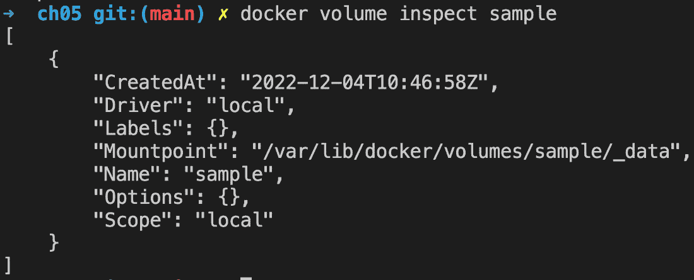

# 5

# 数据卷和配置

在上一章中，我们学习了如何构建和共享我们的容器镜像。重点放在如何构建尽可能小的镜像，只包含容器化应用程序所需的工件。

在本章中，我们将学习如何使用有状态容器——即那些消耗和生成数据的容器。我们还将学习如何在运行时和镜像构建时，通过使用环境变量和配置文件来配置容器。

以下是我们将讨论的主题列表：

+   创建和挂载数据卷

+   容器之间的数据共享

+   使用主机卷

+   定义图像中的卷

+   配置容器

完成本章内容后，您将能够执行以下操作：

+   创建、删除和列出数据卷

+   将现有数据卷挂载到容器中

+   使用数据卷从容器内部创建持久数据

+   使用数据卷在多个容器之间共享数据

+   使用数据卷将任何主机文件夹挂载到容器中

+   在访问数据卷中的数据时，为容器定义访问模式（读/写或只读）

+   配置在容器中运行的应用程序的环境变量

+   通过使用构建参数化 Dockerfile

# 技术要求

对于本章内容，您需要在机器上安装 Docker Desktop。本章没有随附代码。

在开始之前，我们需要在代码库中为*第五章*创建一个文件夹：

1.  使用此命令导航到您从 GitHub 检出代码的文件夹：

    ```
    $ cd ~/The-Ultimate-Docker-Container-Book
    ```

注意

如果您没有在默认位置检出 GitHub 仓库，则前面的命令可能会有所不同。

1.  为*第五章*创建一个子文件夹并进入该文件夹：

    ```
    $ mkdir ch05 && cd ch05
    ```

让我们开始吧！

# 创建和挂载数据卷

所有有意义的应用程序都消耗或生成数据。然而，理想情况下，容器应该是无状态的。我们该如何处理这个问题呢？一种方法是使用 Docker 卷。卷允许容器消耗、生成和修改状态。卷的生命周期超出了容器的生命周期。当使用卷的容器终止时，卷仍然存在。这对状态的持久性非常有利。

## 修改容器层

在深入讨论卷之前，先来讨论一下如果容器中的应用程序更改了容器文件系统中的某些内容会发生什么。在这种情况下，所有的更改都发生在我们在*第四章*中介绍的可写容器层中，*创建和管理容器镜像*。让我们快速演示一下：

1.  运行一个容器并在其中执行一个脚本，脚本创建一个新文件，如下所示：

    ```
    $ docker container run --name demo \   alpine /bin/sh -c 'echo "This is a test" > sample.txt'
    ```

1.  上述命令创建了一个名为 `demo` 的容器，并在该容器内创建了一个名为 `sample.txt` 的文件，文件内容为 `This is a test`。容器在执行 `echo` 命令后退出，但仍保留在内存中，供我们进行调查。

1.  让我们使用 `diff` 命令，找出与原始镜像的文件系统相比，容器的文件系统发生了哪些变化，如下所示：

    ```
    $ docker container diff demo
    ```

输出应该类似于下图所示：

```
A /sample.txt
```

1.  一个新文件，如字母 `A` 所示，已被添加到容器的文件系统中，这符合预期。由于所有来自底层镜像（在本例中为 Alpine）的层都是不可变的，更改只能发生在可写的容器层中。

与原始镜像相比发生变化的文件将标记为 `C`，而被删除的文件将标记为 `D`。

现在，如果我们从内存中移除容器，它的容器层也会被删除，所有的更改将不可逆地丢失。如果我们希望我们的更改能够持续存在，即使容器已经被销毁，这就不是一个解决方案。幸运的是，我们有更好的选择，那就是 Docker 卷。让我们来了解一下它们。

## 创建卷

当在 macOS 或 Windows 计算机上使用 Docker Desktop 时，容器并不是直接在 macOS 或 Windows 上运行，而是在 Docker Desktop 创建的（隐藏的）虚拟机中运行。

为了展示底层数据结构是如何以及在何处创建到相应的文件系统（macOS 或 Windows）中的，我们需要发挥一些创造力。另一方面，如果我们在 Linux 计算机上做相同的事情，一切都会简单直接。

让我们先做一个简单的练习来创建一个卷：

1.  打开一个新的终端窗口并输入以下命令：

    ```
    $ docker volume create sample
    ```

你应该会看到这样的响应：

```
sample
```

在这里，创建的卷的名称将是输出内容。

默认的卷驱动程序是所谓的**本地驱动程序**，它将数据存储在主机文件系统中。

1.  查找数据在主机上存储位置的最简单方法是使用 `docker volume inspect` 命令检查我们刚创建的卷。实际位置可能因系统而异，因此这是找到目标文件夹的最安全方法。让我们使用这个命令：

    ```
    $ docker volume inspect sample
    ```

我们应该看到类似这样的内容：



图 5.1 – 检查名为 sample 的 Docker 卷

主机文件夹可以在输出中的 `Mountpoint` 下找到。在我们的例子中，文件夹是 `/var/lib/docker/volumes/sample/_data`。

1.  另外，我们可以通过 Docker Desktop 的仪表板来创建卷：

    1.  打开 Docker Desktop 的仪表板。

    1.  在左侧，选择 **Volumes** 标签。

    1.  在右上角，点击 **Create** 按钮，如下图所示：


图 5.2 – 使用 Docker Desktop 创建一个新的 Docker 卷

1.  输入`sample-2`作为新卷的名称，并点击**创建**。你现在应该看到这个：


图 5.3 – 在 Docker Desktop 中显示的 Docker 卷列表

还有一些第三方的卷驱动程序，以插件的形式提供。我们可以在`create`命令中使用`--driver`参数来选择不同的卷驱动程序。

其他卷驱动程序使用不同类型的存储系统来支持卷，比如云存储、**网络文件系统**（**NFS**）驱动、软件定义存储等。不过，其他卷驱动程序的正确使用讨论超出了本书的范围。

## 挂载卷

一旦我们创建了一个命名卷，我们可以通过以下步骤将其挂载到容器中：

1.  为此，我们可以在`docker container run`命令中使用`--volume`或`-v`参数，如下所示：

    ```
    $ docker container run --name test -it \     -v sample:/data \     alpine /bin/sh
    ```

如果你在一个干净的 Docker 环境中工作，那么此命令生成的输出应该类似于这个：

```
Unable to find image 'alpine:latest' locally latest:Pulling from library/alpine
050382585609: Pull complete
Digest: sha256: 8914eb54f968791faf6a86...
Status: Downloaded newer image for alpine:latest
/ #
```

否则，你应该只会看到运行在 Alpine 容器中的 Bourne shell 提示符：

```
/ #
```

前面的命令将示例卷挂载到容器内的`/data`文件夹。

1.  在容器内，我们现在可以在`/data`文件夹中创建文件，如下所示：

    ```
    / # cd /data/ # echo "Some data" > data.txt/ # echo "Some more data" > data2.txt
    ```

1.  如果我们导航到包含该卷数据的主机文件夹并列出其内容，我们应该能够看到容器中刚刚创建的两个文件。但这在 Mac 或 Windows 电脑上会稍微复杂一些，将在*访问 Docker 卷*一节中详细解释。敬请期待。

1.  通过按*Ctrl* + *D*退出工具容器。

1.  现在，让我们删除悬挂的`test`容器：

    ```
    $ docker container rm test
    ```

1.  接下来，我们必须基于 CentOS 运行另一个命令。这一次，我们甚至将卷挂载到另一个容器文件夹`/app/data`，如下所示：

    ```
    $ docker container run --name test2 -it --rm \     -v sample:/app/data \     centos:7 /bin/bash
    ```

你应该看到类似于这样的输出：

```
Unable to find image 'centos:7' locally7: Pulling from library/centos
8ba884070f61: Pull complete
Digest: sha256:a799dd8a2ded4a83484bbae769d9765...
Status: Downloaded newer image for centos:7
[root@275c1fe31ec0 /]#
```

前面的输出的最后一行表明我们处于运行在 CentOS 容器中的 Bash shell 提示符下。

1.  一旦进入 CentOS 容器，我们可以导航到我们已挂载卷的`/app/data`文件夹，并列出其内容，如下所示：

    ```
    [root@275c1fe31ec0 /]# cd /app/data[root@275c1fe31ec0 /]# ls –l
    ```

如预期的那样，我们应该看到这两个文件：

```
-rw-r--r-- 1 root root 10 Dec  4 14:03 data.txt-rw-r--r-- 1 root root 15 Dec  4 14:03 data2.txt
```

这就是数据在 Docker 卷中持久化超出容器生命周期的决定性证据，此外，卷可以被其他容器（甚至与第一个使用它的容器不同的容器）重复使用。

需要注意的是，我们在容器中挂载 Docker 卷的文件夹被排除在联合文件系统之外。也就是说，任何在此文件夹及其子文件夹中的更改都不会成为容器层的一部分，而是会被持久化到由卷驱动程序提供的支持存储中。这一点非常重要，因为当容器停止并从系统中删除时，容器层会被删除。

1.  使用*Ctrl* + *D*退出 CentOS 容器。

太好了——我们已经学会了如何将 Docker 卷挂载到容器中！接下来，我们将学习如何从系统中删除现有的卷。

## 删除卷

卷可以使用 `docker volume rm` 命令删除。重要的是要记住，删除卷会不可逆地销毁其中的所有数据，因此这是一个危险命令。在这方面，Docker 给我们提供了一些帮助，因为它不允许我们删除正在被容器使用的卷。始终确保在删除或移除卷之前，要么备份好其中的数据，要么确认不再需要这些数据。接下来，让我们按照以下步骤学习如何删除卷：

1.  以下命令删除我们之前创建的示例卷：

    ```
    $ docker volume rm sample
    ```

1.  执行前面的命令后，请再次确认主机上的文件夹是否已删除。你可以使用以下命令列出系统上定义的所有卷：

    ```
    $ docker volume ls
    ```

确保 `sample` 卷已经被删除。

1.  现在，亦请从系统中删除 `sample-2` 卷。

1.  要删除所有正在运行的容器以清理系统，请运行以下命令：

    ```
    $ docker container rm -v -f $(docker container ls -aq)
    ```

1.  请注意，使用 `-v` 或 `--volume` 标志在移除容器时，可以要求系统同时删除与该容器关联的匿名卷。当然，这只有在该卷仅被该容器使用时才有效。

在接下来的部分中，我们将展示如何在使用 Docker Desktop 时访问卷的底层文件夹。

## 访问 Docker 卷

现在，让我们假设我们正在使用 macOS 操作系统。这个操作系统不是基于 Linux，而是基于其他 Unix 变种。让我们看看是否能找到 `sample` 和 `sample-2` 卷的数据结构，正如 `docker volume inspect` 命令告诉我们的那样：

1.  首先，让我们创建两个命名的 Docker 卷，可以使用命令行或通过 Docker Desktop 仪表板执行相同的操作：

    ```
    $ docker volume create sample$ docker volume create sample-2
    ```

1.  在你的终端中，尝试导航到该文件夹：

    ```
    $ cd /var/lib/docker/volumes/sample/_data
    ```

在作者的 MacBook Air 上，执行前面的命令后返回了以下响应：

```
cd: no such file or directory: /var/lib/docker/volumes/sample/_data
```

由于 Docker 并非在 Mac 上本地运行，而是运行在一个精简的虚拟机内，正如本章前面提到的，因此这种情况是可以预期的。

同样，如果你使用的是 Windows 机器，你将无法在 `inspect` 命令所指示的位置找到数据。

事实证明，在 Mac 上，Docker 创建的虚拟机的数据可以在 `~/Library/Containers/com.docker.docker/Data/vms/0` 文件夹中找到。

要访问这些数据，我们需要以某种方式进入这个虚拟机。在 Mac 上，我们有两种方式可以实现。第一种是使用 `terminal screen` 命令，但这非常特定于 macOS，因此我们在这里不讨论。第二种方式是通过特殊的 `nsenter` 命令访问 Mac 上 Docker 的文件系统，该命令应在 Linux 容器（如 Debian）内执行。这在 Windows 上也有效，因此我们将展示使用第二种方式所需的步骤。

1.  要运行一个可以检查系统上底层主机文件系统的容器，请使用以下命令：

    ```
    $ docker container run -it --privileged --pid=host \    debian nsenter -t 1 -m -u -n -i sh
    ```

在运行容器时，我们在容器内执行以下命令：

```
nsenter -t 1 -m -u -n -i sh
```

如果这听起来很复杂，不用担心；随着我们继续阅读这本书，你会逐渐明白。如果有一个要记住的要点，那就是要意识到正确使用容器有多么强大。

1.  在这个容器中，我们现在可以列出所有定义的卷，使用`/ # ls -l /var/lib/docker/volumes`。我们得到的结果应该类似于此：


图 5.4 – 通过 nsenter 列出 Docker 卷

1.  接下来，导航到表示卷挂载点的文件夹：

    ```
    / # cd /var/lib/docker/volumes/sample/_data
    ```

1.  然后列出其内容，如下所示：

    ```
    /var/lib/docker/volumes/sample/_data # ls –l
    ```

这应该输出如下内容：

```
total 0
```

文件夹目前是空的，因为我们还没有在卷中存储任何数据。

1.  类似地，对于我们的`sample-2`卷，我们可以使用以下命令：

    ```
    / # cd /var/lib/docker/volumes/sample-2/_data/var/lib/docker/volumes/sample-2/ # ls –l
    ```

这应该输出如下内容：

```
total 0
```

再次，这表示文件夹目前是空的。

1.  接下来，让我们从 Alpine 容器中在`sample`卷中生成两个带数据的文件。首先，打开一个新的终端窗口，因为另一个窗口被我们的`nsenter`会话阻塞。

1.  要运行容器并将`sample`卷挂载到容器的`/data`文件夹中，请使用以下代码：

    ```
    $ docker container run --rm -it \    -v sample:/data alpine /bin/sh
    ```

1.  在容器内的`/data`文件夹中生成两个文件，如下所示：

    ```
    / # echo "Hello world" > /data/sample.txt/ # echo "Other message" > /data/other.txt
    ```

1.  通过按*Ctrl* + *D*退出 Alpine 容器。

1.  回到`nsenter`会话，使用以下命令再次尝试列出示例卷的内容：

    ```
    / # cd /var/lib/docker/volumes/sample/_data/ # ls -l
    ```

这一次，你应该看到如下内容：

```
total 8-rw-r--r--    1 root    root    10 Dec  4 14:03 data.txt
-rw-r--r--    1 root    root    15 Dec  4 14:03 data2.txt
```

这表示我们已将数据写入主机的文件系统。

1.  让我们尝试在这个特殊容器中创建一个文件，然后列出文件夹的内容，如下所示：

    ```
    / # echo "I love Docker" > docker.txt
    ```

1.  现在，让我们看看我们得到了什么：

    ```
    / # ls –l
    ```

这给我们带来了类似于这样的结果：

```
total 12-rw-r--r--    1 root    root    10 Dec  4 14:03 data.txt
-rw-r--r--    1 root    root    15 Dec  4 14:03 data2.txt
-rw-r--r--    1 root    root    14 Dec  4 14:25 docker.txt
```

1.  让我们看看能否从挂载示例卷的容器中看到这个新文件。在一个新的终端窗口中运行此命令：

    ```
    $ docker container run --rm \    -v sample:/data \    centos:7 ls -l /data
    ```

这应该输出如下内容：

```
total 12-rw-r--r-- 1 root root 10 Dec  4 14:03 data.txt
-rw-r--r-- 1 root root 15 Dec  4 14:03 data2.txt
-rw-r--r-- 1 root root 14 Dec  4 14:25 docker.txt
```

上述输出显示我们可以直接向支持卷的主机文件夹添加内容，然后从挂载该卷的容器中访问它。

1.  要退出我们的特殊特权容器，可以按*Ctrl* + *D*两次。

我们现在已经使用两种不同的方法创建了数据：

+   从一个挂载了示例卷的容器中

+   使用特殊特权文件夹访问 Docker Desktop 使用的隐藏虚拟机，并直接写入示例卷的后备文件夹

在接下来的部分中，我们将学习如何在容器之间共享数据。

# 容器之间共享数据

容器就像是运行在其中的应用程序的沙盒。这大多数时候是有益的并且是我们期望的，它可以保护运行在不同容器中的应用程序相互隔离。它还意味着，容器内应用程序可见的整个文件系统对于该应用程序来说是私有的，其他运行在不同容器中的应用程序无法干扰它。

然而，有时我们希望在容器之间共享数据。比如，运行在**容器 A**中的应用程序生成了一些数据，而这些数据将被运行在**容器 B**中的另一个应用程序使用。我们如何实现这个目标呢？我相信你已经猜到了——我们可以为此目的使用 Docker 卷。我们可以创建一个卷并将其挂载到容器 A，以及容器 B。这样，应用程序 A 和 B 都可以访问相同的数据。

现在，正如每次多个应用程序或进程同时访问数据时一样，我们必须非常小心，以避免数据不一致。为了避免并发问题，如竞争条件，理想情况下我们应该只有一个应用程序或进程在创建或修改数据，而所有其他并发访问这些数据的进程只能读取它。

竞争条件

竞争条件是计算机编程中可能发生的一种情况，当程序或进程的输出受到事件的顺序和时机的影响，以一种不可预测或意外的方式。在竞争条件中，程序的两个或多个部分同时尝试访问或修改相同的数据或资源，结果取决于这些事件的时机。这可能导致不正确或不一致的输出、错误或崩溃。

我们可以强制容器内的进程只能读取卷中的数据，通过将该卷挂载为只读模式。下面是我们如何做到这一点：

1.  执行以下命令：

    ```
    $ docker container run -it --name writer \    -v shared-data:/data \    .alpine /bin/sh
    ```

在这里，我们创建了一个名为`writer`的容器，并在默认的读写模式下挂载了一个卷`shared-data`。

1.  尝试在此容器中创建一个文件，像这样：

    ```
    # / echo "I can create a file" > /data/sample.txt
    ```

它应该成功。

1.  按下*Ctrl* + *D* 或输入`exit`并按*Enter*键退出此容器。

1.  然后，执行以下命令：

    ```
    $ docker container run -it --name reader \    -v shared-data:/app/data:ro \    ubuntu:22.04 /bin/bash
    ```

这里我们有一个名为`reader`的容器，它将相同的卷挂载为**只读**（**ro**）。

1.  首先，确保你可以在第一个容器中看到创建的文件，像这样：

    ```
    $ ls -l /app/data
    ```

这应该会给你类似这样的结果：

```
total 4-rw-r--r-- 1 root root 20 Jan 28 22:55 sample.txt
```

1.  然后，尝试创建一个文件，像这样：

    ```
    # / echo "Try to break read/only" > /app/data/data.txt
    ```

它将失败，并显示以下消息：

```
bash: /app/data/data.txt: Read-only file system
```

这是预期的，因为该卷被挂载为只读模式。

1.  让我们通过在命令提示符下输入`exit`来退出容器。回到主机后，让我们清理所有容器和卷，如下所示：

    ```
    $ docker container rm -f $(docker container ls -aq)$ docker volume rm $(docker volume ls -q)
    ```

**练习**：仔细分析之前的命令，尝试理解它们到底做了什么以及如何工作。

接下来，我们将展示如何将来自 Docker 主机的任意文件夹挂载到容器中。

# 使用主机卷

在某些场景中，例如开发新的容器化应用程序或当容器化应用程序需要使用某个特定文件夹中的数据（例如由遗留应用程序生成的数据）时，使用挂载特定主机文件夹的卷非常有用。让我们来看以下示例：

```
$ docker container run --rm -it \    -v $(pwd)/src:/app/src \
    alpine:latest /bin/sh
```

上述表达式交互式地启动一个带有 shell 的 Alpine 容器，并将当前目录中的`src`子文件夹挂载到容器的`/app/src`目录。我们需要使用`$(pwd)`（或者`pwd`），即当前目录，因为在使用卷时，我们始终需要使用绝对路径。

开发人员在工作时经常使用这些技术，尤其是当他们在容器中运行应用程序时，希望确保容器始终包含代码的最新更改，而无需在每次更改后重新构建镜像和重新运行容器。

让我们做一个示例来展示它是如何工作的。假设我们要创建一个简单的静态网站，并使用 Nginx 作为我们的 Web 服务器，如下所示：

1.  首先，让我们在主机上创建一个新的子文件夹。最好将它创建在我们在本章开始时创建的章节文件夹中。在那里，我们将放置我们的 Web 资产，如 HTML、CSS 和 JavaScript 文件。使用以下命令来创建子文件夹并导航到它：

    ```
    $ cd ~/The-Ultimate-Docker-Container-Book/ch05$ mkdir my-web && cd my-web
    ```

1.  然后，创建一个简单的网页，像这样：

    ```
    $ echo "<h1>Personal Website</h1>" > index.xhtml
    ```

1.  现在，添加一个 Dockerfile，里面包含构建包含我们示例网站的镜像的指令。向文件夹中添加一个名为`Dockerfile`的文件，并写入以下内容：

    ```
    FROM nginx:alpineCOPY . /usr/share/nginx/html
    ```

Dockerfile 从最新的 Alpine 版本的 Nginx 开始，然后将当前主机目录中的所有文件复制到容器的`/usr/share/nginx/html`文件夹中。这是 Nginx 期望 Web 资产所在的位置。

1.  现在，让我们使用以下命令构建镜像：

    ```
    $ docker image build -t my-website:1.0 .
    ```

请不要忘记在上面的命令末尾加上句点（`.`）。此命令的输出将类似于以下内容：


图 5.5 – 为示例 Nginx Web 服务器构建 Docker 镜像

1.  最后，我们将从这个镜像运行一个容器。我们将以分离模式运行该容器，如下所示：

    ```
    $ docker container run -d \    --name my-site \    -p 8080:80 \    my-website:1.0
    ```

注意`-p 8080:80`参数。我们还没有讨论这个，但我们将在*第十章*中详细讲解，*使用* *单主机网络*。目前，只需要知道它将 Nginx 监听传入请求的容器端口`80`映射到你笔记本电脑的`8080`端口，这样你就可以访问应用程序了。

1.  现在，打开浏览器标签页并导航到`http://localhost:8080/index.xhtml`；你应该能看到你的网站，目前它只有一个标题，**个人网站**。

1.  现在，使用你最喜欢的编辑器编辑`index.xhtml`文件，使其看起来像这样：

    ```
    <h1>Personal Website</h1><p>This is some text</p>
    ```

1.  现在，保存并刷新浏览器。哦！那不行。浏览器仍然显示`index.xhtml`文件的上一个版本，只包含标题。所以，让我们停止并删除当前容器，然后重建镜像并重新运行容器，如下所示：

    ```
    $ docker container rm -f my-site$ docker image build -t my-website:1.0 .$ docker container run -d \    --name my-site \    -p 8080:80 \    my-website:1.0
    ```

1.  再次刷新浏览器。这次，新内容应该会显示出来。好吧，这次行得通了，但过程中的摩擦太大。想象一下，每次对你的网站进行简单更改时都需要这样做。这是不可持续的。

1.  现在是时候使用主机挂载的卷了。再次删除当前容器，并使用卷挂载重新运行它，像这样：

    ```
    $ docker container rm -f my-site$ docker container run -d \    --name my-site \    -v $(pwd):/usr/share/nginx/html \    -p 8080:80 \    my-website:1.0
    ```

注意

如果你在 Windows 上工作，将会显示一个弹出窗口，提示 Docker 需要访问硬盘，你需要点击 **共享** **访问** 按钮。

1.  现在，将一些内容附加到`index.xhtml`文件中并保存。然后，刷新浏览器。你应该能看到变化。这正是我们想要实现的效果；我们也称之为编辑并继续体验。你可以在网页文件中做任意更改，并立即在浏览器中看到结果，而不需要重新构建镜像或重新启动包含你网站的容器。

1.  当你玩完你的网页服务器并希望清理系统时，可以使用以下命令删除容器：

    ```
    $ docker container rm -f my-site
    ```

重要的是要注意，现在的更新是双向传播的。如果你在主机上进行更改，它们会传播到容器中，反之亦然。同样重要的是，当你将当前文件夹挂载到容器的目标文件夹`/usr/share/nginx/html`时，已经存在的内容会被主机文件夹的内容替换。

在下一节中，我们将学习如何定义在 Docker 镜像中使用的卷。

# 在镜像中定义卷

如果我们回顾一下在*第四章*《创建与管理容器镜像》中学到的内容，我们会看到：每个容器的文件系统，在启动时，是由基础镜像的不可变层以及特定于该容器的可写容器层组成。容器内运行的进程对文件系统所做的所有更改都会保存在这个容器层中。一旦容器停止并从系统中删除，相应的容器层也会从系统中删除并不可恢复地丢失。

一些应用程序，如运行在容器中的数据库，需要将其数据持久化，超出容器的生命周期。在这种情况下，它们可以使用卷。为了更加明确，我们来看一个具体的例子。MongoDB 是一个流行的开源文档数据库。许多开发者将 MongoDB 作为他们应用程序的存储服务。MongoDB 的维护者创建了一个镜像并发布在 Docker Hub 上，可以用来在容器中运行数据库实例。这个数据库会产生需要长期持久化的数据，但 MongoDB 的维护者并不知道谁在使用这个镜像以及如何使用它。因此，他们无法影响数据库用户启动容器时使用的 `docker container run` 命令。那么，他们如何定义卷呢？

幸运的是，有一种在 Dockerfile 中定义卷的方法。用于定义卷的关键字是 `VOLUME`，我们可以添加一个单独文件夹的绝对路径，或是一个用逗号分隔的路径列表。这些路径代表容器文件系统中的文件夹。让我们来看几个卷定义的示例，如下所示：

```
VOLUME /app/dataVOLUME /app/data, /app/profiles, /app/config
VOLUME ["/app/data", "/app/profiles", "/app/config"]
```

上面代码片段中的第一行定义了一个单一卷，并将其挂载到 `/app/data`。第二行定义了三个卷，作为一个逗号分隔的列表。最后一行定义的内容与第二行相同，但这次其值是以 JSON 数组的格式表示的。

当容器启动时，Docker 会自动为 Dockerfile 中定义的每个路径创建一个卷，并将其挂载到容器的相应目标文件夹。由于每个卷都是由 Docker 自动创建的，它将有一个 SHA-256 作为其 ID。

在容器运行时，Dockerfile 中定义为卷的文件夹将被排除在联合文件系统之外，因此这些文件夹中的任何更改不会影响容器层，而是持久化到相应的卷中。现在，操作工程师的责任是确保卷的后端存储得到了妥善的备份。

我们可以使用 `docker image inspect` 命令来获取 Dockerfile 中定义的卷的信息。让我们通过以下步骤看看 MongoDB 给我们提供了什么：

1.  首先，我们将使用以下命令拉取镜像：

    ```
    $ docker image pull mongo:5.0
    ```

1.  然后，我们将检查这个镜像，并使用 `--format` 参数只提取大量数据中的关键部分，如下所示：

    ```
    $ docker image inspect \    --format='{{json .ContainerConfig.Volumes}}' \    mongo:5.0 | jq .
    ```

注意命令末尾的 `| jq .`。我们将 `docker image inspect` 的输出通过管道传输到 `jq` 工具，该工具将输出格式化得非常整齐。

提示

如果你还没有在系统上安装 `jq`，可以在 macOS 上使用 `brew install jq` 或在 Windows 上使用 `choco install jq` 来安装它。

上面的命令将返回如下结果：

```
{    "/data/configdb": {},
    "/data/db": {}
}
```

如我们所见，MongoDB 的 Dockerfile 定义了两个卷，分别位于 `/data/configdb` 和 `/data/db`。

1.  现在，让我们在后台以守护进程的方式运行一个 MongoDB 实例，如下所示：

    ```
    $ docker run --name my-mongo -d mongo:5.0
    ```

1.  现在我们可以使用`docker container inspect`命令获取有关已创建的卷的其他信息。使用此命令仅获取卷信息：

    ```
    $ docker inspect --format '{{json .Mounts}}' my-mongo | jq .
    ```

上述命令应该会输出类似于以下内容的结果（已缩短）：


图 5.6 – 检查 MongoDB 卷

`Source`字段提供了主机目录的路径，MongoDB 在容器内产生的数据将存储在该路径下。

离开之前，使用以下命令清理 MongoDB 容器：

```
$ docker rm -f my-mongo
```

关于卷的内容暂时就这些。在下一节中，我们将探讨如何配置运行在容器中的应用程序以及容器镜像构建过程本身。

# 配置容器

很多时候，我们需要为容器内部运行的应用程序提供一些配置。配置通常用于允许同一个容器在非常不同的环境中运行，例如开发、测试、预发布或生产环境。在 Linux 中，配置值通常通过环境变量提供。

我们已经了解到，运行在容器中的应用程序与其主机环境完全隔离。因此，我们在主机上看到的环境变量与容器内看到的环境变量是不同的。

让我们通过查看主机上定义的内容来证明这一点：

1.  使用此命令显示为您的终端会话定义的所有环境变量列表：

    ```
    $ export
    ```

在作者的 macOS 上，输出大致如下（已缩短）：

```
...COLORTERM=truecolor
COMMAND_MODE=unix2003
...
HOME=/Users/gabriel
HOMEBREW_CELLAR=/opt/homebrew/Cellar
HOMEBREW_PREFIX=/opt/homebrew
HOMEBREW_REPOSITORY=/opt/homebrew
INFOPATH=/opt/homebrew/share/info:/opt/homebrew/...:
LANG=en_GB.UTF-8
LESS=-R
LOGNAME=gabriel
...
```

1.  接下来，让我们在 Alpine 容器中运行一个 Shell：

    1.  使用以下命令运行容器：

    ```
    $ docker container run --rm -it alpine /bin/sh
    ```

提醒一下，我们使用了`--rm`命令行参数，这样在停止容器后我们就不必手动删除悬空的容器。

1.  然后，使用以下命令列出我们可以看到的环境变量：

```
/ # export
```

这应该会产生以下输出：

```
export HOME='/root'export HOSTNAME='91250b722bc3'
export PATH='/usr/local/sbin:/usr/local/bin:...'
export PWD='/'
export SHLVL='1'
export TERM='xterm'
```

上述输出与我们在主机上直接看到的内容不同。

1.  按 *Ctrl* + *D* 离开并停止 Alpine 容器。

接下来，我们为容器定义环境变量。

## 为容器定义环境变量

现在，好消息是我们可以在容器启动时传递一些配置值。我们可以使用`--env`（或简写形式`-e`）参数，格式为`--env <key>=<value>`，其中`<key>`是环境变量的名称，`<value>`是该变量的值。假设我们希望在容器中运行的应用程序可以访问名为`LOG_DIR`的环境变量，其值为`/var/log/my-log`。我们可以通过以下命令实现：

```
$ docker container run --rm -it \    --env LOG_DIR=/var/log/my-log \
    alpine /bin/sh
/ #
```

上述代码启动了一个 Alpine 容器中的 Shell，并在运行的容器内定义了所请求的环境变量。为了证明这一点，我们可以在 Alpine 容器内执行以下命令：

```
/ # export | grep LOG_DIR
```

输出应如下所示：

```
export LOG_DIR='/var/log/my-log'
```

输出结果如预期那样。现在我们可以在容器中使用所请求的环境变量，并且它们具有正确的值。当然，我们在运行容器时可以定义多个环境变量。只需要重复使用`--env`（或`-e`）参数。请查看以下示例：

```
$ docker container run --rm -it \    --env LOG_DIR=/var/log/my-log \
    --env MAX_LOG_FILES=5 \
    --env MAX_LOG_SIZE=1G \
    alpine /bin/sh
```

运行前面的命令后，我们会停留在 Alpine 容器中的命令提示符下：

```
/ #
```

使用以下命令列出环境变量：

```
/ # export | grep LOG
```

我们将看到以下内容：

```
export LOG_DIR='/var/log/my-log'export MAX_LOG_FILES='5'
export MAX_LOG_SIZE='1G'
```

现在，让我们来看一下在需要配置多个环境变量的情况下如何操作。

## 使用配置文件

复杂的应用程序可能有许多环境变量需要配置，因此，我们运行对应容器的命令可能会变得非常繁琐。为此，Docker 允许我们通过文件传递一组环境变量定义。我们在`docker container run`命令中使用`--env-file`参数来实现这一点。

让我们试一下，如下所示：

1.  进入我们在本章开始时创建的`chapter 5`源文件夹：

    ```
    $ cd ~/The-Ultimate-Docker-Container-Book/ch05
    ```

1.  创建一个名为`config-file`的子文件夹并进入该文件夹，如下所示：

    ```
    $ mkdir config-file && cd config-file
    ```

1.  使用你喜欢的编辑器，在此文件夹中创建一个名为`development.config`的文件。将以下内容添加到文件中并保存，如下所示：

    ```
    LOG_DIR=/var/log/my-logMAX_LOG_FILES=5MAX_LOG_SIZE=1G
    ```

请注意我们如何按`<key>=<value>`格式，在每行中定义一个环境变量，其中，`<key>`是环境变量的名称，`<value>`表示要与该变量关联的值。

1.  现在，在`config-file`子文件夹中，让我们运行一个 Alpine 容器，将该文件作为环境文件传递，并在容器内运行`export`命令，以验证文件中列出的变量是否已确实作为环境变量创建在容器内，如下所示：

    ```
    $ docker container run --rm -it \    --env-file ./development.config \    alpine sh -c "export | grep LOG"
    ```

确实，变量已经定义，我们可以在生成的输出中看到：

```
export LOG_DIR='/var/log/my-log'export MAX_LOG_FILES='5'
export MAX_LOG_SIZE='1G'
```

这正是我们预期的结果。

接下来，让我们看看如何为所有给定 Docker 镜像的容器实例定义环境变量的默认值。

## 在容器镜像中定义环境变量

有时，我们希望为环境变量定义一些默认值，确保这些变量在每个容器实例中都存在。我们可以通过以下步骤，在用于创建该镜像的 Dockerfile 中进行定义：

1.  进入我们在本章开始时创建的`chapter 5`源文件夹：

    ```
    $ cd ~/The-Ultimate-Docker-Container-Book/ch05
    ```

1.  创建一个名为`config-in-image`的子文件夹并进入该文件夹，如下所示：

    ```
    $ mkdir config-in-image && cd config-in-image
    ```

1.  使用你喜欢的编辑器，在`config-in-image`子文件夹中创建一个名为`Dockerfile`的文件。将以下内容添加到文件中并保存：

    ```
    FROM alpine:latestENV LOG_DIR=/var/log/my-logENV MAX_LOG_FILES=5ENV MAX_LOG_SIZE=1G
    ```

1.  使用前面的 Dockerfile 创建一个名为`my-alpine`的容器镜像，如下所示：

    ```
    $ docker image build -t my-alpine .
    ```

注意

别忘了前一行末尾的句号！

1.  从该镜像运行一个容器实例，并输出容器内部定义的环境变量，如下所示：

    ```
    $ docker container run --rm -it \    my-alpine sh -c "export | grep LOG"
    ```

你应该在输出中看到以下内容：

```
export LOG_DIR='/var/log/my-log'export MAX_LOG_FILES='5'
export MAX_LOG_SIZE='1G'
```

这正是我们所预期的。

1.  不过，值得庆幸的是，我们完全不需要拘泥于这些变量值。我们可以通过在`docker container run`命令中使用`--env`参数来覆盖其中一个或多个变量。使用此命令：

    ```
    $ docker container run --rm -it \    --env MAX_LOG_SIZE=2G \    --env MAX_LOG_FILES=10 \    my-alpine sh -c "export | grep LOG"
    ```

1.  现在，看看以下命令及其输出：

    ```
    export LOG_DIR='/var/log/my-log'export MAX_LOG_FILES='10'export MAX_LOG_SIZE='2G'
    ```

1.  我们还可以通过使用环境文件和`--env-file`参数在`docker container run`命令中覆盖默认值。请自己尝试一下。

在下一节中，我们将介绍在 Docker 镜像构建时使用的环境变量。

## 构建时的环境变量

有时，我们希望能够定义一些在构建容器镜像时有效的环境变量。假设你想定义一个`BASE_IMAGE_VERSION`环境变量，然后在 Dockerfile 中作为参数使用。想象一下以下的 Dockerfile：

```
ARG BASE_IMAGE_VERSION=12.7-stretchFROM node:${BASE_IMAGE_VERSION}
WORKDIR /app
COPY packages.json .
RUN npm install
COPY . .
CMD npm start
```

我们使用`ARG`关键字来定义一个默认值，该默认值将在每次从前面的 Dockerfile 构建镜像时使用。在本例中，这意味着我们的镜像使用的是`node:12.7-stretch`基础镜像。

现在，如果我们想为某些特定目的（例如测试）创建一个特殊的镜像，我们可以在镜像构建时通过使用`--build-arg`参数来覆盖这个变量，如下所示：

```
$ docker image build \    --build-arg BASE_IMAGE_VERSION=12.7-alpine \
    -t my-node-app-test .
```

在这种情况下，生成的`my-node-test:latest`镜像将从`node:12.7-alpine`基础镜像构建，而不是从`node:12.7-stretch`默认镜像构建。

总结来说，通过`--env`或`--env-file`定义的环境变量在容器运行时有效。通过 Dockerfile 中的`ARG`或`docker container build`命令中的`--build-arg`定义的变量在容器镜像构建时有效。前者用于配置容器内运行的应用程序，而后者用于参数化容器镜像的构建过程。

到此为止，我们已经完成了本章的内容。

# 总结

在本章中，我们介绍了 Docker 卷，它可以用于持久化容器产生的状态，并使其具有持久性。我们还可以使用卷为容器提供来自各种来源的数据。我们学习了如何创建、挂载和使用卷。我们还学习了多种定义卷的技术，如通过名称、挂载主机目录或在容器镜像中定义卷。

在本章中，我们还讨论了如何配置环境变量，以供运行在容器内的应用程序使用。我们展示了如何在`docker container run`命令中显式地逐个定义这些变量，或者将它们作为配置文件中的集合来定义。最后，我们学习了如何通过使用构建参数来参数化容器镜像的构建过程。

在下一章中，我们将介绍一些常用的技术，这些技术可以让开发人员在容器中运行时对其代码进行演进、修改、调试和测试。

# 进一步阅读

以下文章提供了更深入的信息：[`dockr.ly/2EUjTml`](http://dockr.ly/2EUjTml)

+   *使用* *卷*：[`dockr.ly/2EUjTml`](http://dockr.ly/2EUjTml)

+   *管理 Docker 中的数据*：[`dockr.ly/2EhBpzD`](http://dockr.ly/2EhBpzD)

+   **Play with Docker**（**PWD**）上的*Docker 卷*：[`bit.ly/2sjIfDj`](http://bit.ly/2sjIfDj)

+   `nsenter` —Linux 手册页，链接：[`bit.ly/2MEPG0n`](https://bit.ly/2MEPG0n)

+   *设置环境* *变量*：[`dockr.ly/2HxMCjS`](https://dockr.ly/2HxMCjS)

+   *理解 ARG 和 FROM* *如何交互*：[`dockr.ly/2OrhZgx`](https://dockr.ly/2OrhZgx)

# 问题

请尝试回答以下问题，以评估您的学习进度：

1.  如何使用默认驱动程序创建一个名为`my-products`的数据卷？

1.  如何使用 Alpine 镜像运行容器，并将`my-products`卷以只读模式挂载到`/data`容器文件夹中？

1.  如何找到与`my-products`卷关联的文件夹并导航到它？同时，如何创建一个包含内容的`sample.txt`文件？

1.  如何运行另一个 Alpine 容器，将`my-products`卷挂载到`/app-data`文件夹中，且为读写模式？在该容器内，导航到`/app-data`文件夹并创建一个包含内容的`hello.txt`文件。

1.  如何将主机卷（例如，`~/my-project`）挂载到容器中？

1.  如何从系统中删除所有未使用的卷？

1.  容器中运行的应用程序所看到的环境变量列表与应用程序直接在主机上运行时是相同的。

    1.  正确

    1.  错误

1.  您的应用程序将在容器中运行，需要大量的环境变量进行配置。运行容器并提供所有这些信息的最简单方法是什么？

# 答案

以下是本章问题的答案：

1.  要创建一个命名卷，请运行以下命令：

    ```
    $ docker volume create my-products
    ```

1.  执行以下命令：

    ```
    $ docker container run -it --rm \    -v my-products:/data:ro \    alpine /bin/sh
    ```

1.  要实现此结果，请执行以下操作：

    1.  要获取卷在主机上的路径，请使用此命令：

    ```
    $ docker volume inspect my-products | grep Mountpoint
    ```

    1.  这应该会产生以下输出：

    ```
    "Mountpoint": "/var/lib/docker/volumes/my-products/_data"
    ```

    1.  现在，执行以下命令运行一个容器并在其中执行`nsenter`：

    ```
    $ docker container run -it --privileged --pid=host \    debian nsenter -t 1 -m -u -n -i sh
    ```

    1.  导航到包含`my-products`卷数据的文件夹：

    ```
    / # cd /var/lib/docker/volumes/my-products/_data
    ```

    1.  在此文件夹中创建一个包含文本`"I love Docker"`的文件：

    ```
    / # echo "I love Docker" > sample.txt
    ```

    1.  按*Ctrl* + *D*退出`nsenter`及其容器。

    1.  执行以下命令以验证在主机文件系统中生成的文件是否确实是卷的一部分，并且可以访问我们将挂载此卷的容器：

    ```
    $ docker container run --rm \    --volume my-products:/data \    alpine ls -l /data
    ```

前述命令的输出应类似于以下内容：

```
total 4-rw-r--r--    1 root     root    14 Dec  4 17:35 sample.txt
```

我们确实可以看到该文件。

1.  可选：运行修改版的命令，输出`sample.txt`文件的内容。

1.  执行以下命令：

    ```
    $ docker run -it --rm -v my-products:/data:ro alpine /bin/sh/ # cd /data/data # cat sample.txt
    ```

在另一个终端中执行此命令：

```
$ docker run -it --rm -v my-products:/app-data alpine /bin/sh/ # cd /app-data
/app-data # echo "Hello other container" > hello.txt
/app-data # exit
```

1.  执行以下命令：

    ```
    $ docker container run -it --rm \    -v $HOME/my-project:/app/data \    alpine /bin/sh
    ```

1.  退出两个容器，然后在主机上执行以下命令：

    ```
    $ docker volume prune
    ```

1.  答案是*False*（B）。每个容器都是一个沙盒，因此有其独立的环境。

1.  在配置文件中收集所有环境变量及其相应的值，然后通过`docker container run`命令中的`--env-file`命令行参数提供给容器，如下所示：

    ```
    $ docker container run --rm -it \    --env-file ./development.config \    alpine sh -c "export"
    ```
