# 第七章：7

# 测试运行在容器中的应用程序

在前面的章节中，我们已经学习了如何将用任何语言编写的应用程序容器化，例如 Node.js、Python、Java、C# 和 .NET。我们都知道，仅仅编写代码并将其部署到生产环境是不够的。我们还需要确保代码没有错误，并且能够按预期执行。这通常被归纳为**质量保证**，简称 **QA**。

实践中反复证明，修复生产中发现的应用程序 bug 要比在开发过程中发现并修复 bug 成本高昂。我们希望避免这种情况。最具成本效益的方法是让编写代码的开发人员同时编写自动化测试，确保新代码或修改后的代码具有高质量，并且能够完全按照业务需求或功能规格中的验收标准执行。

以下是我们将在本章中讨论的主题列表：

+   在容器中运行应用程序的测试好处

+   不同类型的测试

+   常用的工具和技术

+   设置测试环境的最佳实践

+   调试和排查问题的技巧

+   在容器中运行应用程序时测试的挑战和注意事项

+   案例研究

阅读完本章后，你将能够做以下事情：

+   向对容器中运行的应用程序感兴趣的外行解释测试的好处

+   设置一个生产环境，允许你为运行在容器中的应用程序或服务编写和执行测试

+   为运行在容器中的代码开发单元测试和集成测试

+   在容器中运行单元测试和集成测试，测试目标是应用程序代码

+   运行一个专门的容器，进行功能测试，作为黑盒作用于你的应用程序

+   管理应用程序的依赖关系并创建测试数据

# 技术要求

在本章中，你需要在你的 Mac、Windows 或 Linux 机器上安装 Docker Desktop、终端和 VS Code。因为我们将与代码进行交互，所以你应该在你从 GitHub 克隆的代码仓库中准备一个章节文件夹：

1.  导航到你克隆的与本书配套的 GitHub 仓库所在的文件夹。通常，你可以按以下方式操作：

    ```
    $ cd ~/The-Ultimate-Docker-Container-Book
    ```

1.  在该目录中创建一个章节文件夹并导航到它：

    ```
    $ mkdir ch07 && cd ch07
    ```

和往常一样，你可以在 `sample-solutions/ch07` 子文件夹中找到本章所有练习的完整示例解决方案。

# 在容器中测试应用程序的好处

在本节中，我们将讨论在容器中测试应用程序的好处，包括能够复制生产环境、配置和设置的简便性以及更快的测试执行速度。

但在我们开始之前，让我们稍微停一下，问问自己，为什么我们要进行测试？

## 为什么我们要进行测试？

每个在软件开发领域工作的人员都知道，需要以快速的节奏实施和发布新的或更改过的应用功能。总是有持续的压力要求快速实现新代码并将其发布到生产环境中。但编写功能规格的业务分析师和编写实际代码来实现这些规格的软件工程师，毕竟也是普通人。在巨大的压力下工作的人容易犯错误。这些错误可能是微妙的，也可能是相当严重的。这些错误最终会在生产环境中运行的应用程序中表现出来。我们的客户将会发现这些问题，这将产生后果。

## 手动测试与自动化测试

大多数编写商业应用程序的公司都会有一支手动软件测试团队。这些人员会拿到产品工程团队为他们准备的最新版本的应用程序，并对该应用程序执行一套手动回归测试。如果手动测试人员发现缺陷，他们会在类似 Jira 的工具中报告这个缺陷，并理想地写下所有开发人员修复该缺陷时需要的详细信息。这包括被测试应用程序的确切版本、测试人员发现缺陷之前所做的步骤，以及缺陷的一些证据，例如截图、错误信息、堆栈跟踪和日志条目。这些由手动测试人员编写的缺陷报告将成为产品工程团队的待办事项的一部分。

然后，产品工程团队会与测试人员一起，定期（例如每日）对所有新的缺陷报告进行筛查，并决定需要多快解决某个特定的缺陷。通常会使用 P1、P2、P3 和 P4 的分类，其中 P1 是需要立即修复的最高严重性缺陷，P4 则是优先级较低、可以在团队有空时处理的缺陷。

如果应用程序是典型的企业应用，包含多个在云端运行的服务，那么测试人员就需要一个特殊的环境来进行回归测试。这个环境通常被称为**用户验收测试**，简称**UAT**。这种企业应用的完整测试套件通常包含几百个测试用例。执行一个单独的测试用例需要手动测试人员花费相当多的时间。并且并不罕见，专门的手动测试团队需要几周时间才能完成一次完整的测试。在此期间，UAT 环境会被占用。无法将新版本部署到此环境，因为否则测试人员将不得不重新开始他们的回归测试。应用程序中的每一个变更都可能引入新的缺陷，只有在每个新版本上执行完整的回归测试套件，我们才能确保捕捉到所有问题。

只有在手动测试人员完成所有回归测试，并且没有发现更严重的 bug 后，当前版本的应用程序才能发布到生产环境。

我敢打赌，你可以想象，UAT（用户验收测试）被阻塞好几周会给软件开发过程带来一些重大问题。你的许多产品工程团队将积累大量新的代码，包括新功能和修复的漏洞，而这些代码由于手动测试人员还在测试旧版本，导致无法发布到生产环境。但是，积累大量代码变更的同时，也增加了风险。发布一段经历过许多变更的软件，比起我们持续发布包含最小变更的新版本，风险要大得多。

解决这个问题的唯一真正方法是缩短回归测试周期。我们需要将其从几周缩短到几分钟或几个小时。这样，我们就可以以持续的方式测试和发布小批量的变更。但没有人类能测试得这么快。解决方案就是完全依赖自动化测试。没错，我是这么说的：我们应该完全依赖自动化的回归和验收测试。

我们学到了什么？手动测试不可扩展，且非常枯燥，因为测试人员必须一遍又一遍地重复相同的测试，并且容易出错，因为人类所做的一切并非自动化，因此每次都无法做到完全重复。

这是否意味着我们必须解雇所有的手动测试人员？不一定。手动测试人员不应该执行验收测试和回归测试，而应执行探索性测试。手动测试人员是人类，他们应该利用这一事实以及他们的创造力，去发现应用程序中尚未被发现的潜在缺陷。正如*探索性测试*一词所暗示的那样，这些测试并不遵循特定的脚本，而是随机进行，仅由测试人员的专业经验和他们对应用程序所在业务领域的理解所指导。如果测试人员发现了一个 bug，他们会为其写一个工单，之后这个工单将被整理并加入开发团队的待办事项中。

## 为什么我们要在容器中测试？

运行容器中测试有几个常见的好处：

+   **隔离**：在容器中运行测试可以为测试环境与主机系统之间提供一定的隔离级别，这对于确保测试结果的一致性和可重复性非常有用。

+   **环境一致性**：容器允许你将整个测试环境（包括依赖、库和配置）打包成一个独立的单元，这可以帮助确保测试环境在不同的开发环境中保持一致。

+   **易用性**：容器可以简化设置和运行测试的过程，因为你不必手动在主机系统上安装和配置所有必要的依赖和库。

+   **可移植性**：容器可以轻松地在不同环境之间迁移，这对于在不同环境或平台上运行测试非常有用。

+   **可扩展性**：容器通过允许并行运行测试或在多台机器上运行测试，使得扩展测试基础设施变得更加容易。

总体而言，在容器中运行测试有助于提高测试过程的可靠性、一致性和可扩展性，并使得设置和维护与主机系统隔离的测试环境变得更加容易。

# 不同类型的测试

本节概述了在容器中运行的应用程序上可以执行的不同类型的测试，包括单元测试、集成测试和验收测试。

## 单元测试

单元测试的主要目标是验证*单元*，即代码中的一个小的、孤立的部分的功能。为了检查代码是否准确且按预期工作，开发者通常会在创建或修改代码时编写单元测试。这些测试随后会作为开发过程的一部分定期执行。

单元测试不依赖于其他资源或组件，旨在测试代码的独立部分。这使得开发者能够快速发现并解决代码中的错误，同时使得测试运行快速且简单。

通常，促进单元测试创建、运行和报告的工具和测试框架用于生成单元测试。这些工具通常提供自动测试发现、测试执行和测试结果报告等功能，并使开发者能够使用特定的语法或结构来创建单元测试。

完善的测试方法应包括单元测试，因为它们使开发者能够验证代码在最细粒度级别上是有效的，并按预期工作。通常，单元测试作为**持续集成**（**CI**）过程的一部分执行，这是一个每次代码变更提交到版本控制系统时自动执行代码变更的工作流程。

## 集成测试

被称为*集成测试*的软件测试用于检查不同系统或组件如何作为一个整体协同工作。它通常在单元测试之后进行，涉及检查应用程序或系统的各个部分如何相互交互。

集成测试旨在检查不同单元或组件如何协同工作。它们通常用于确认应用程序或系统的各个组件是否能够按预期工作。测试多个软件组件的集成或软件程序与外部资源（如数据库或 API）的集成是这类测试的例子。

由于执行测试需要设置和配置多个组件或系统，因此集成测试通常比单元测试更加复杂和耗时。为了使测试能够执行并生成报告，它们还可能需要使用专门的测试工具和框架。

与单元测试一样，集成测试是全面测试方法中的一个重要组成部分，因为它使开发人员能够确认多个系统或组件能够按预期一起工作。

## 接受测试

这种软件测试被称为*接受测试*，它确保系统或应用程序适合其预定用途，并满足所有要求。它通常是在所有其他类型的测试（如单元测试和集成测试）之后进行，是测试过程中的最后一步。

接受测试通常由一个不同的团队或测试小组进行，这个小组的任务是从最终用户的角度评估系统或应用程序。这些测试的目的是确保系统或程序易于使用，符合预期用户的需求，并且具有良好的用户体验。

功能测试（确保应用程序或系统正确执行所需功能）、可用性测试（确保应用程序或系统易于使用）和性能测试只是接受测试中可能包括的几种测试类型示例（用于验证应用程序或系统在不同负载条件下的表现）。

接受测试是软件开发过程中的一个关键步骤，因为它使开发人员能够确认系统或应用程序已经准备好部署，并满足预定客户的需求。尽管强烈建议采用自动化的接受测试技术来辅助测试过程，但通常它是由测试人员手动进行的。

在本章中，我们将讨论一种特殊类型的接受测试，称为*黑盒测试*。与单元测试和集成测试相比，黑盒测试的主要区别在于，它们从一个明显以业务为导向的角度来审视被测试系统。理想情况下，接受测试，以及其中的黑盒测试，应该反映出由业务分析师或产品负责人编写的功能规格中的接受标准。通常，接受测试的编写方式是将要测试的组件视为一个黑盒。该组件的内部实现不重要，也不应当重要。测试代码只能通过组件的公共接口访问该组件或系统。通常，公共接口是 API 或组件消费或生成的消息。

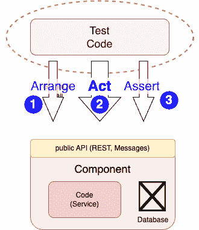

图 7.1 – 接受测试与被测试系统交互

在前述图中，我们可以看到测试代码是如何以流行的**Arrange-Act-Assert**（**AAA**）格式组织的。首先，我们设置边界条件（arrange）。接下来，我们指定要在被测试系统上执行的操作（act）。最后，我们验证操作的结果是否符合预期（assert）。**被测试系统**（**SUT**）是具有公共接口的组件，可以是 REST API，或者是它从消息总线中消费的消息。大多数情况下，SUT 还有一个数据库，用于存储其状态。

在下一节中，我们将介绍用于测试的工具和技术。

# 常用工具和技术

现在让我们讨论一些常用的工具和技术，这些工具和技术用于测试运行在容器中的应用程序，如 Docker、Kubernetes 和**持续集成与交付**（**CI/CD**）平台。

## 实现示例组件

在本节中，我们将实现一个示例组件，稍后我们将使用它来演示如何编写和执行测试，特别是如何结合自动化测试和使用 Docker 容器的优势。我们将使用最新版本的 Java 和 Spring Boot 来实现该示例组件。

这个示例组件代表了一个简单的 REST API，背后有一些 CRUD 逻辑。创建和管理动物物种及相关种群的任务相对简单，不需要更复杂的建模。为了简单起见，我们使用内存数据库 H2。这意味着每次组件重启时，之前的数据会被清除。如果你想改变这一点，可以配置 H2 使用后备文件来进行持久化：

1.  使用**spring initializr**页面 [`start.spring.io`](https://start.spring.io) 来启动 Java 项目。配置完成后，页面应该如下所示：

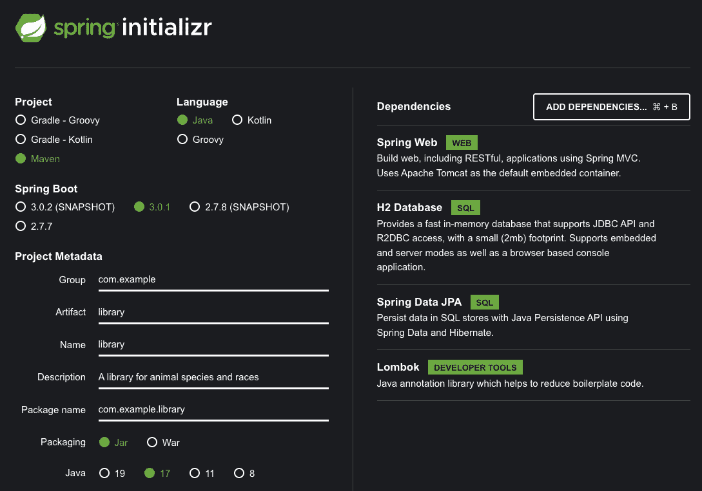

图 7.2 – 启动图书馆项目

注意我们已在前述图右侧添加了四个依赖项。

1.  下载启动代码并将文件解压到章节文件夹`.../ch07`中。现在，你应该能看到一个名为`library`的子文件夹，里面包含我们可以用来实现 API 的代码起始点。

1.  在 VS Code 中打开该项目。

1.  在`src/main/java/com/example/library`文件夹中找到`LibraryApplication.java`文件。它是一个典型的启动类，包含 Spring Boot 基础的 Java 应用程序的`main`函数。

1.  在此文件夹内，分别创建三个子文件夹，命名为`controllers`、`models`和`repositories`。它们将包含我们图书馆的逻辑。

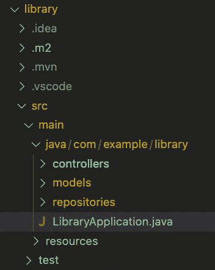

图 7.3 – 图书馆 API 的项目结构

1.  首先，我们定义应用程序中使用的模型。向`models`文件夹添加以下简单数据类：

    1.  向名为`Race.java`的文件中添加以下内容：

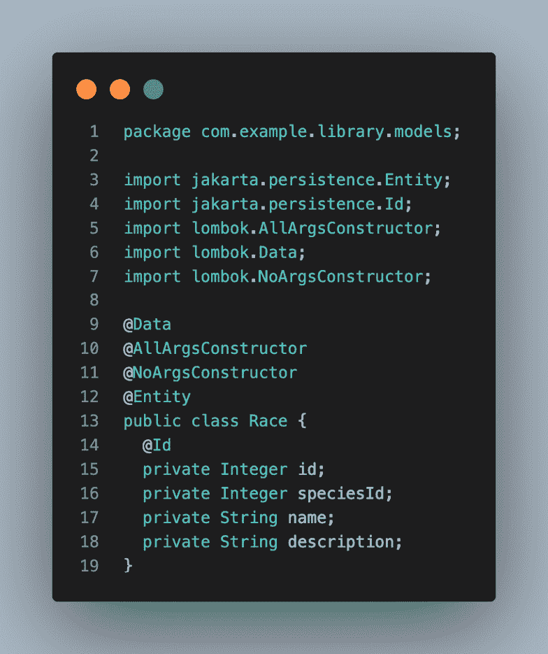

图 7.4 – 种族数据类

1.  向名为`Species.java`的文件中添加以下内容：

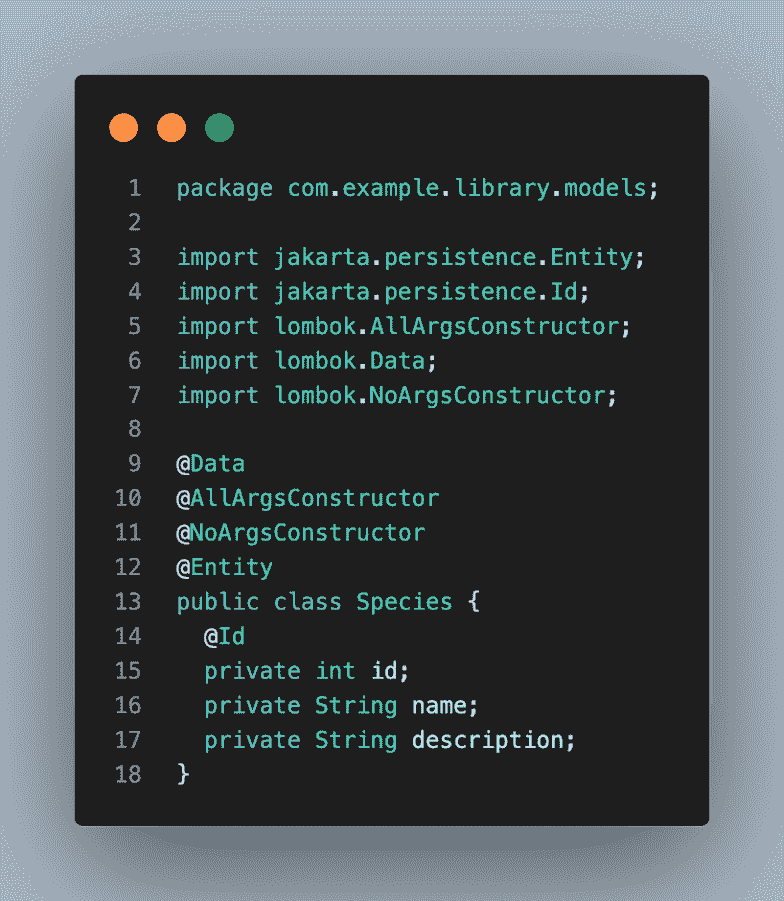

图 7.5 – 种类数据类

注意，我们使用`@Entity`注解来标记这些类为（数据库）实体，并且我们用`@Id`注解装饰它们各自的`id`属性，以告诉 Spring Boot 该属性表示每个实体的唯一 ID。

1.  接下来，我们将实现用于持久化数据和从数据库中检索数据的仓库。向`repositories`文件夹中添加以下内容：

    1.  一个名为`RaceRepository.java`的文件，内容如下：

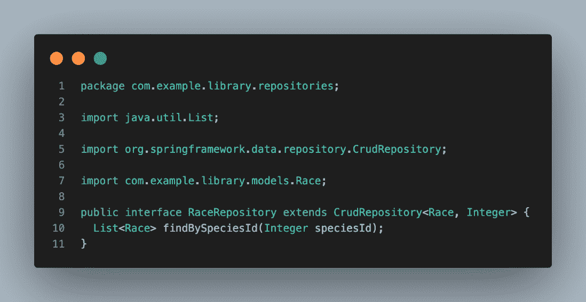

图 7.6 – 种族仓库的代码

注意第 10 行，我们添加了一个自定义的`findBySpeciesId`方法，它将允许我们检索所有分配给特定`speciesId`的种族。

1.  一个名为`SpeciesRepository.java`的文件，内容如下：

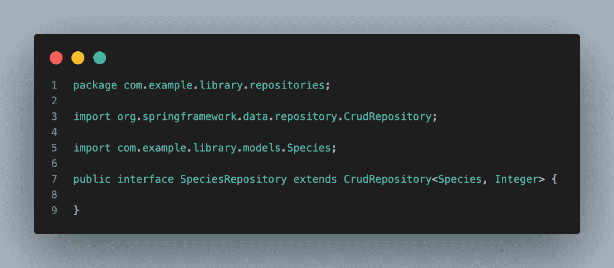

图 7.7 – 种族仓库的代码

1.  然后，我们定义了两个 REST 控制器，通过这些控制器我们可以与应用程序进行交互。向`controllers`文件夹中添加以下内容：

    1.  一个名为`RacesController.java`的文件，内容如下：

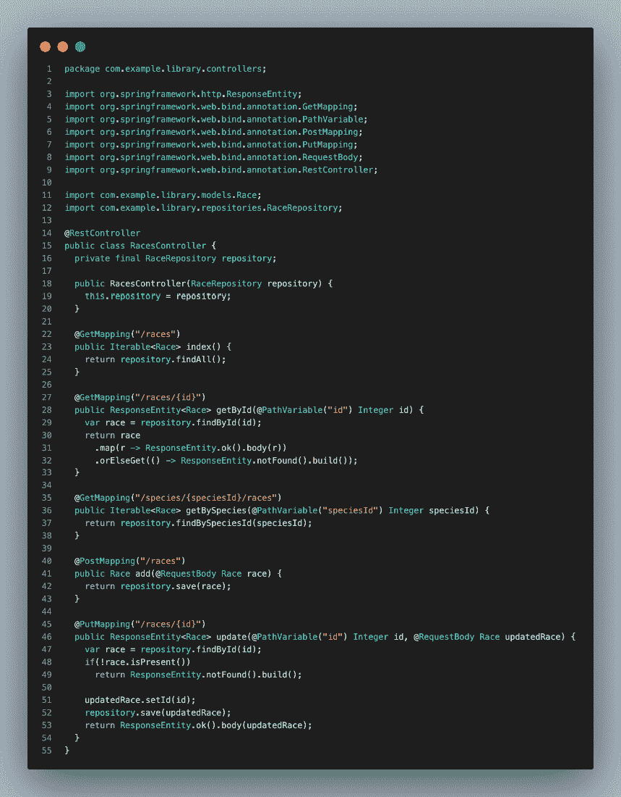

图 7.8 – 种族控制器的代码

你可以在这里找到完整的代码：[`github.com/PacktPublishing/The-Ultimate-Docker-Container-Book/blob/main/sample-solutions/ch07/library/src/main/java/com/example/library/controllers/RacesController.java`](https://github.com/PacktPublishing/The-Ultimate-Docker-Container-Book/blob/main/sample-solutions/ch07/library/src/main/java/com/example/library/controllers/RacesController.java)。

1.  一个名为`SpeciesController.java`的文件，代码如下：

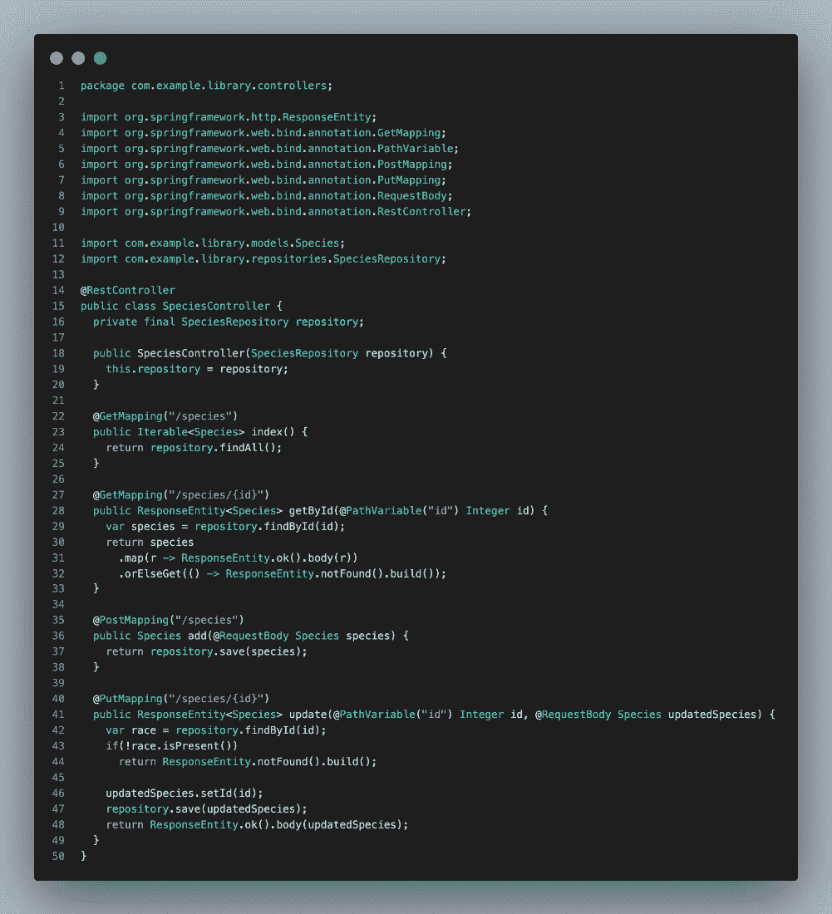

图 7.9 – 种族控制器的代码

你可以在这里找到完整的代码：[`github.com/PacktPublishing/The-Ultimate-Docker-Container-Book/blob/main/sample-solutions/ch07/library/src/main/java/com/example/library/controllers/SpeciesController.java`](https://github.com/PacktPublishing/The-Ultimate-Docker-Container-Book/blob/main/sample-solutions/ch07/library/src/main/java/com/example/library/controllers/SpeciesController.java)。

1.  最后，我们需要进行一些应用程序配置。我们可以在`application.properties`文件中进行配置，你可以在`src/main/resources`文件夹中找到此文件。将以下内容添加到该文件中，这将配置我们在本示例中将使用的数据库：

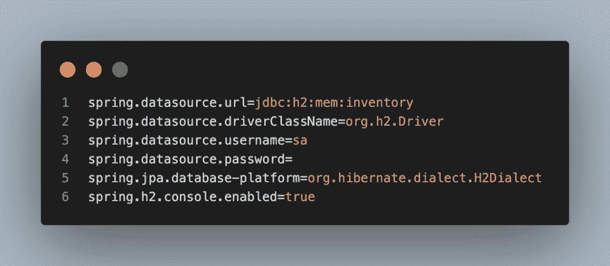

图 7.10 – 应用程序配置

我们使用的是 H2 内存数据库，用户名为`sa`，没有密码。我们还确保在应用程序中启用了 H2 控制台，以便通过浏览器轻松检查数据（第 6 行）。

1.  现在打开`LibraryApplication`类，并点击主方法上方的**Run**链接以启动应用程序。观察终端中生成的输出：

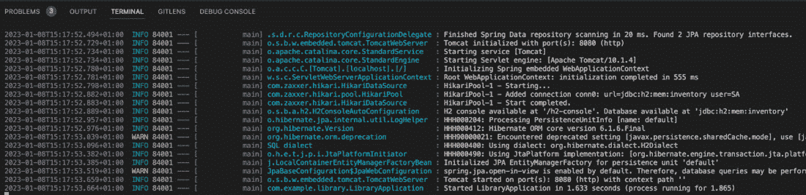

图 7.11 – 记录运行中库应用程序的输出

阅读日志输出并尽量理解每一行。前述输出的倒数第二行告诉我们，应用程序可以通过端口`8080`访问，这是 Spring Boot 应用程序的默认端口。还请注意有一行显示`H2 console available at ‘/h2-console’. Database available at ‘jdbc:h2:mem:inventory’`，这表明我们现在可以在浏览器中打开`localhost:8080/h2-console`来访问 H2 控制台，并通过它访问我们的内存数据库。

1.  使用 VS Code 中的 Thunder 客户端、Postman，或者终端中的`curl`命令向数据库添加物种。这里我们使用`curl`：

    ```
    $ curl -X POST -d '{"id": 1, "name": "Elephant"}' \    -H 'Content-Type: application/json' \    localhost:8080/species
    ```

响应应如下所示：

```
{"id":1,"name":"Elephant","description":null}
```

1.  再次使用`curl`（或任何其他工具）列出存储在系统中的物种：

    ```
    $ curl localhost:8080/species
    ```

输出应如下所示：

```
[{"id":1,"name":"Elephant","description":null}]
```

它是一个包含一个元素的 JSON 数组。

1.  尝试所有我们实现的两个控制器支持的其他`REST`调用，例如使用`PUT`更新现有物种，以及`GET`、`POST`和`PUT`用于`/races`端点。

1.  完成后，确保停止应用程序。

接下来，我们需要将应用程序打包成容器并运行：

1.  在库项目的根目录下添加一个 Dockerfile，内容如下：

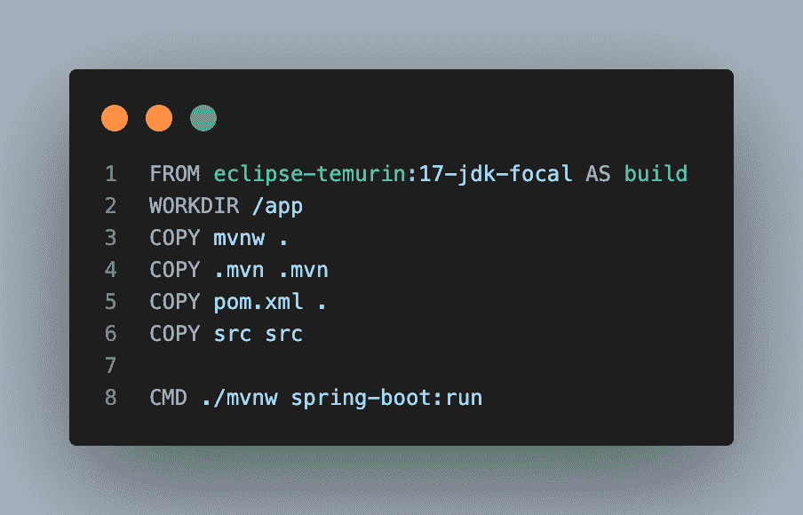

图 7.12 – 库组件的 Dockerfile

1.  使用以下命令在`ch07`文件夹中创建一个 Docker 镜像：

    ```
    $ docker image build -t library library
    ```

1.  使用以下命令运行容器：

    ```
    $ docker container run -d --rm \    -p 8080:8080 library
    ```

1.  通过使用与上一节相同的命令，测试当前在容器中运行的组件是否仍按预期工作。

1.  完成后，停止包含库组件的容器。我们建议使用 VS Code 的 Docker 插件来操作，或者使用 Docker Desktop 的仪表板。

现在我们有了一个可工作的示例应用程序，可以继续讨论如何使用单元测试、集成测试和黑盒测试来测试这个 REST API。我们从单元测试和/或集成测试开始。

## 实现和运行单元测试与集成测试

现在我们已经有了一个可以工作的组件，是时候为它编写一些测试了。在这一部分，我们重点关注单元测试和集成测试。Spring Boot 使得入门变得非常简单：

1.  在`src/test/java/com/example/library`文件夹中，添加一个`LibraryUnitTests.java`文件，内容如下：

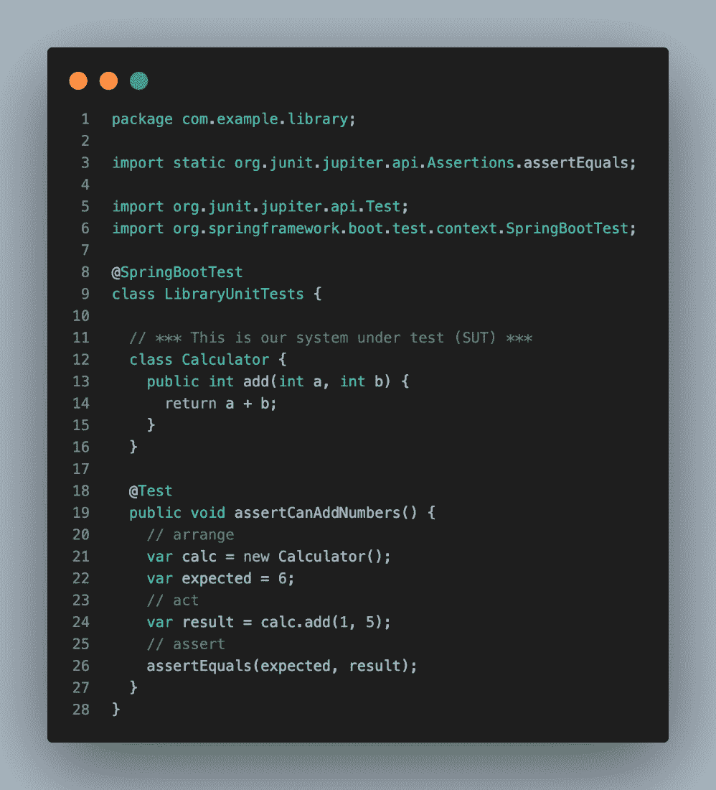

图 7.13 – 为库项目编写的示例单元测试

请注意，我们在我们的 `Test` 类中添加了一个私有的 `Calculator` 类。这仅用于演示目的，并且更容易展示如何编写单元测试。通常，应该测试代码库中的类和方法。

提示

始终建议按照类似的方式组织您的测试，这样可以更轻松地让其他人（包括自己）阅读和理解这些测试。在这种情况下，我们选择了由 Arrange、Act 和 Assert 组成的 AAA 语法。或者，您也可以使用 Given-When-Then 语法。

1.  如果您在 VS Code 编辑器上安装了 **Test Runner for Java** 扩展程序，现在应该在测试方法旁边看到一个绿色的三角形（上述图像中的第 19 行）。单击它来运行测试。结果应该如下所示：

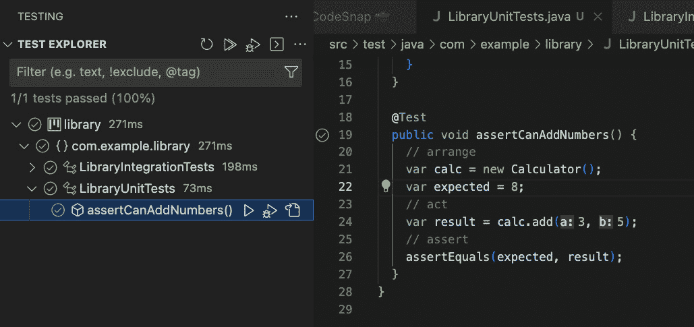

图 7.14 – 第一次测试运行的结果

注意

或者，您可以使用以下命令从命令行运行测试：

`$ ./``mvnw test`

1.  现在让我们添加一个示例集成测试。为此，在放置单元测试的同一文件夹中添加一个名为 `LibraryIntegrationTests.java` 的文件。我们将使用 Spring Boot 提供的 `MockMvc` 辅助类来模拟我们的应用程序运行在 web 服务器上，并通过其 REST 端点进行访问。向测试类中添加以下内容：

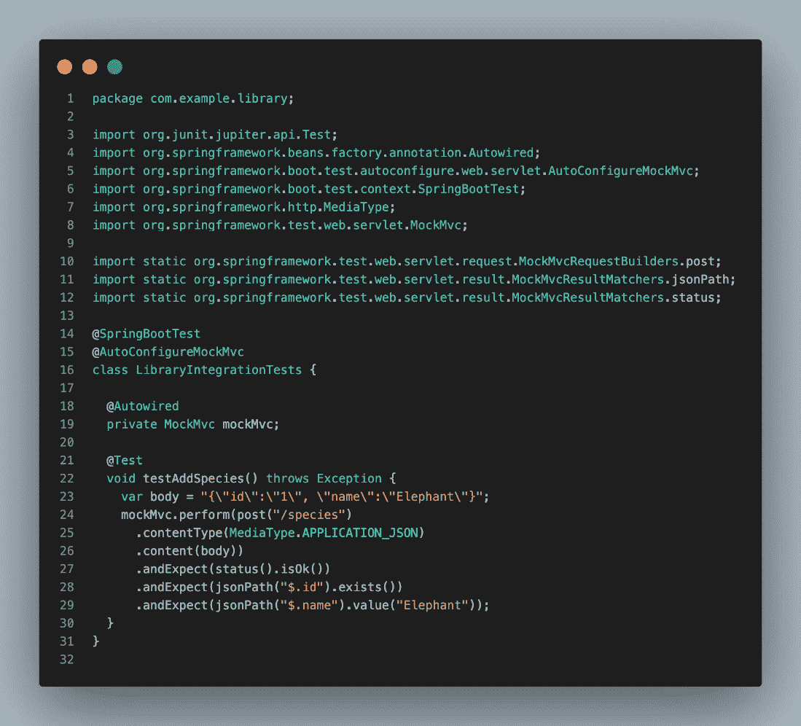

图 7.15 – 为库项目编写的示例集成测试

1.  以与单元测试相同的方式运行上述测试。确保测试通过。

我们已经完成了准备工作，现在可以将组件打包到一个容器中，并在同一个容器中运行单元测试和集成测试。为此，请按照以下步骤操作：

1.  现在让我们在我们的库项目根目录下添加一个 Dockerfile，并加入以下内容。这个内容和我们之前的 Java 示例中使用的是一样的：


图 7.16 – 用于库项目的 Dockerfile

1.  然后，让我们使用这个 Dockerfile 构建一个镜像：

    ```
    $ docker image build -t library .
    ```

1.  使用以下命令在容器中运行测试：

    ```
    $ docker container run --rm \    -v $HOME/.m2:/root/.m2    library ./mvnw test
    ```

请注意我们使用的卷映射。我们正在将本地 Maven 仓库（位于 `$HOME/.m2`）与容器共享，因此在构建应用程序时，Maven 不必首先下载所有依赖项，因为它们已经存在于我们的本地缓存中。这显著改善了整体体验。

还请注意，我们在 Dockerfile 中覆盖了 `CMD` 命令（在上述图像中的第 8 行），使用 `./mvnw test` 来运行测试，而不是运行应用程序。

1.  观察生成的输出。输出的最后几行应该像这样，表明已经运行了测试：

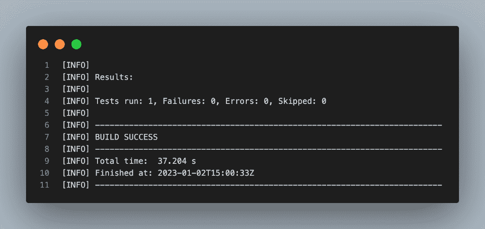

图 7.17 – 容器内测试运行的输出

就像你现在在本地笔记本电脑上在容器内运行单元测试和集成测试一样，你也可以在 CI/CD 管道的 CI 阶段运行它。一个简单的 Shell 脚本就足以自动化你刚才手动做的事情。

## 实现并运行黑盒测试

由于黑盒测试必须将被测试单元（SUT）视为一个封闭系统，因此测试不应在与组件相同的容器内运行。建议将测试代码放入自己的专用测试容器中运行。

还建议不要将黑盒测试和组件的代码混合在一起，而是严格分开。我们将通过使用与组件不同的语言来编写测试来展示这一点。这次，我们将使用 C#。任何语言都可以，例如 Kotlin、Node.js 或 Python。

在这个例子中，我们将使用.NET 和 C#来实现组件测试：

1.  在`ch07`文件夹中，执行以下命令来创建测试项目：

    ```
    $ dotnet new xunit -o library-component-tests
    ```

这将使用流行的`xunit`测试库在`library-component-tests`子文件夹中创建一个测试项目。

1.  尝试使用以下命令运行测试：

    ```
    $ dotnet test library-component-tests
    ```

（缩短后的）输出应如下所示：

```
Passed!  - Failed:  0, Passed:  1, Skipped:  0, Total:  1, …
```

这表明所有测试都通过了。当然，默认情况下，项目中此时只有一个空的示例测试。

1.  使用以下命令在 VS Code 中打开该项目：

    ```
    $ code library-component-tests
    ```

1.  定位并打开`UnitTest1.cs`文件。在文件顶部，添加以下语句：

    ```
    using System.Text.Json;
    ```

1.  在`namespace`声明后，添加以下记录定义：

    ```
    public record Species(int id, string name, string description);
    ```

1.  现在添加一个名为`can_add_species`的新方法，如下所示：

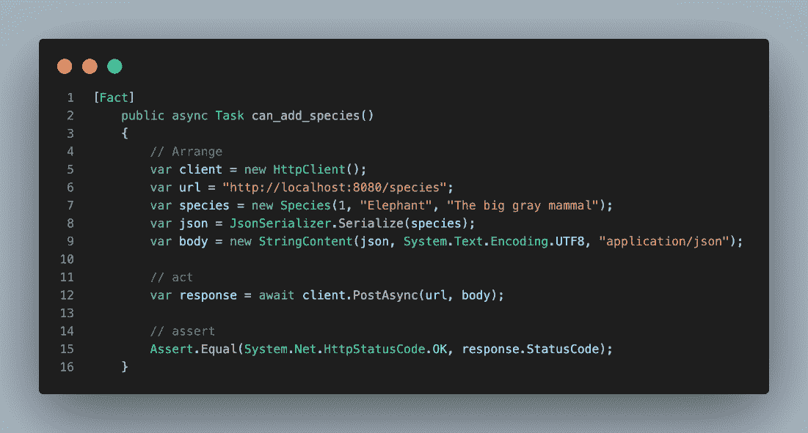

图 7.18 – 添加物种的组件测试

在这里，我们使用`HttpClient`类将类型为`Species`的数据对象发布到`/species`端点。然后，我们断言操作的 HTTP 响应代码为`OK (200)`。注意我们是如何使用 AAA 规范来构造我们的测试的。

1.  添加另一个名为`can_get_a_species_by_id`的方法，内容如下：

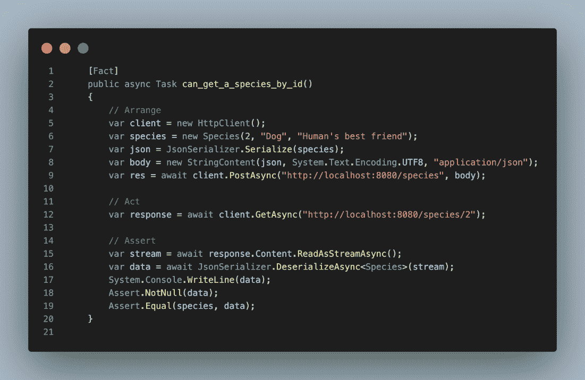

图 7.19 – 按 ID 读取物种的组件测试

1.  在继续并运行测试之前，请确保`library`组件正在运行并监听端口`8080`。否则，测试将失败，因为预期的端点没有人监听。使用以下命令：

    ```
    $ docker container run --rm \    -v $HOME/.m2:/root/.m2    library
    ```

1.  使用以下命令运行测试：

    ```
    $ dotnet test
    ```

确保两个测试都通过。

1.  `library`组件。

1.  完成后，停止`library`组件。

接下来，我们将展示如何在容器中运行测试：

1.  向 .NET 测试项目的根目录添加一个包含以下内容的 Dockerfile：

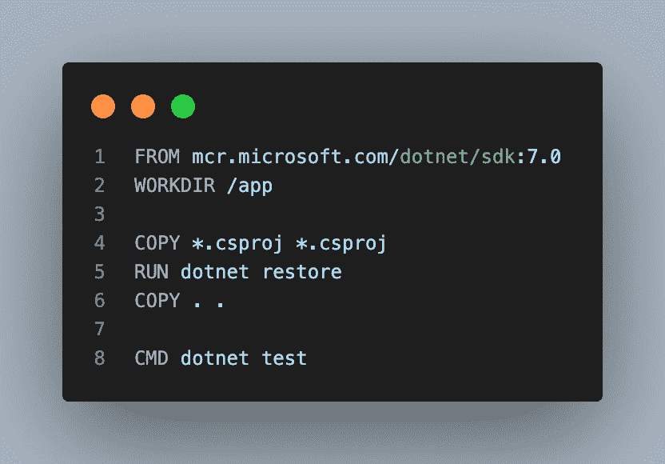

图 7.20 – 组件测试的 Dockerfile

1.  使用此 Dockerfile 创建一个镜像。在`ch07`文件夹内，使用以下命令：

    ```
    $ docker image build -t library-component-tests \    library-component-tests
    ```

1.  再次检查是否已经为库组件创建了 Docker 镜像。如果没有，可以在 `ch07` 文件夹中使用以下命令来创建：

    ```
    $ docker image build -t library library
    ```

1.  现在我们已经为库组件和组件测试分别创建了 Docker 镜像，接下来需要分别运行它们的容器：

    1.  要运行库组件，请使用以下命令：

    ```
    $ docker container run -d --rm \    -p 8080:8080 library
    ```

    1.  要运行组件测试，请使用以下命令：

    ```
    $ docker container run library-component-tests
    ```

请注意，测试已经执行并且全部通过。

1.  完成后，移除这两个容器。可以使用 VS Code 中的 Docker 插件或 Docker Desktop 的仪表板来执行此操作。

好吧，这真是一次很棒的操作。我们展示了如何为使用 Spring Boot 3 编写的 Java 组件编写单元测试和集成测试。我们在本地笔记本电脑上以及在容器内运行了这些测试。然后我们展示了如何在 .NET 7 中创建一些黑盒测试，使用 C# 编写并在我们的库组件上运行它们。我们同样在本地笔记本电脑上执行了这些操作，然后将组件和黑盒测试分别运行在各自的容器中。

接下来，我们将讨论如何最佳地设置测试环境。

# 设置测试环境的最佳实践

本节中，我们希望列出一些设置容器中应用程序测试环境的最佳实践，包括网络隔离、数据管理和资源约束等方面的考虑：

+   **使用独立的测试环境**：一般来说，使用独立的测试环境来运行容器中的测试，而不是在与生产环境相同的主机上运行测试，是个好主意。这样可以避免潜在的问题或中断影响生产环境。

+   **隔离测试网络**：为了确保测试环境与生产环境相互隔离，使用独立的网络进行测试是一个好主意。可以通过使用独立的虚拟网络，或者在容器运行时使用网络命名空间或覆盖网络来实现。

+   **谨慎管理测试数据**：在容器中测试应用程序时，重要的是要小心管理测试数据，以确保测试的可靠性和可重复性。这可以通过使用测试数据生成工具、快照测试数据或使用独立的测试数据库来实现。

+   **使用资源约束**：为了确保测试的可靠性和一致性，使用资源约束（例如 CPU、内存）来限制容器可用资源是一个好主意。这有助于防止资源争用，并确保测试不受外部因素（如主机系统的负载）影响。

+   **使用容器编排工具**：为了管理大量容器并确保它们的一致部署和扩展，使用如 Kubernetes 或 Docker Swarm 等容器编排工具是一个好主意。这些工具可以帮助自动化容器的部署和扩展过程，并提供自动回滚和自愈等功能。

+   **监控测试环境**：为了确保你的测试环境运行顺利，并发现可能出现的问题，使用监控工具来跟踪容器的性能和资源使用情况是一个好主意。这可以帮助你识别并修复可能影响测试可靠性的问题。

在测试过程中，你可能会遇到一些麻烦和难以解释的测试失败情况。在接下来的部分，我们将提供一些在这种情况下可以采取的应对措施。

# 调试和排除故障的技巧

在我们容器化环境中运行自动化测试时，可能会时不时遇到一些看似奇怪的行为和神秘失败的测试。以下是一些调试和排除故障的技巧，用于解决测试应用程序时可能出现的问题：

+   `docker container logs` 查看特定容器的日志。

+   **使用调试器**：如果错误信息或日志输出不足以诊断问题，你可以使用调试器在运行时检查应用程序的状态。许多集成开发环境（IDE），如我们常用的 VS Code、Visual Studio 和 IntelliJ，都内置了对在容器中运行应用程序调试的支持。

+   `docker container exec` 在容器内运行命令并检查其环境。

+   **使用容器运行时调试器**：一些容器运行时（如 Docker）提供了调试容器本身问题的工具（例如资源使用和网络问题）。这些工具对于诊断容器运行时特定的问题非常有帮助。

+   **使用容器化调试环境**：如果你在本地开发环境中难以复现问题，可以使用容器化的调试环境（例如调试器容器）来更接近地复制生产环境。

+   **检查已知问题**：如果你在应用程序中使用了第三方库或依赖项，值得检查是否存在任何已知问题或错误，这些问题可能会导致出现问题。许多库和依赖项在其网站或文档中维护已知问题和解决方法的列表。

+   **寻求帮助**：如果你无法自行诊断问题，不要犹豫，向社区寻求帮助，例如 Stack Overflow 或你使用的库和工具的维护者。网上有许多资源可以利用。

现在让我们讨论一下测试过程中可能出现的一些挑战，以及我们在测试时应该考虑的事项。

# 测试在容器中运行的应用程序时的挑战和注意事项

除了测试在容器中运行的应用程序所带来的诸多优势，我们还需要简要讨论一下这种测试方式中涉及的挑战和注意事项，例如如何处理依赖关系和管理测试数据：

+   **隔离**：在容器中测试应用程序可以提供一定程度的隔离，将测试环境与主机系统分开，这有助于确保测试结果的一致性和可重复性。然而，这种隔离也可能使调试问题和识别根本原因变得更加困难，因为你可能无法访问主机系统及其资源。

+   **环境一致性**：在使用容器时，确保不同开发环境之间的测试环境一致性可能是一个挑战。主机系统、容器运行时和网络配置的差异都会影响应用程序的行为和测试结果。

+   **数据管理**：在容器化环境中管理测试数据可能是一个挑战，因为你可能需要确保测试数据在所有容器之间一致并可用，或者确保数据得到适当的隔离，且在测试之间不被共享。

+   **资源限制**：在容器中测试应用程序可能会消耗大量资源，因为你可能需要同时运行多个容器以测试不同的场景。这可能导致资源竞争，并可能需要仔细的资源管理，以确保测试的可靠性和一致性。

+   **集成测试**：测试多个容器之间的集成可能具有挑战性，因为你可能需要协调多个容器的启动和关闭，并确保它们能够相互通信。

+   **性能测试**：测试运行在容器中的应用程序的性能可能会很困难，因为性能可能会受到主机系统、容器运行时和网络配置的影响。

总体而言，在容器中测试应用程序需要精心规划和考虑，以确保测试环境的一致性和可靠性，并确保测试结果具有意义且可操作。

在本章结束之前，让我们来看几个公司使用容器化测试的案例研究。

# 案例研究

在本章的最后一部分，我们展示了一些成功实施容器中应用程序测试策略的组织的案例研究和实例：

1.  一家知名在线商店引入了一种自动化测试技术，以提高其软件开发过程的有效性和效率。通过自动化执行功能测试、集成测试和验收测试，该公司显著减少了测试应用程序所需的时间和精力。因此，它能够更迅速且可靠地为客户提供新功能和升级。

1.  一家金融服务公司使用自动化测试来提高其交易平台的可靠性和稳定性。通过自动执行单元、集成和验收测试，该公司能够在开发初期发现并修复问题，从而减少了停机风险并提升了客户满意度。

1.  一家医疗保健组织使用自动化测试来确保其**电子病历**（**EMR**）系统的准确性和可靠性。通过自动执行功能性和可接受性测试，该公司能够快速识别并解决问题，提高了 EMR 系统的可靠性和可信度，并降低了错误和患者伤害的风险。

自动化测试的优势，如更好的质量、更快的开发和部署周期、更高的可靠性和更高的客户满意度，都是通过这些案例研究来说明的。

# 总结

在本章中，我们了解了容器中运行应用程序的测试的好处，讨论了不同类型的测试，介绍了一些常用的测试工具和技术，并提供了设置测试环境的最佳实践。我们还列出了调试和故障排除的技巧，讨论了在容器中测试应用程序时的挑战和注意事项，并以案例研究总结本章内容。

在下一章中，我们将介绍一些在容器化复杂分布式应用程序时，或使用 Docker 自动化复杂任务时，有用的杂项技巧、窍门和概念。

# 问题

为了评估你的学习，请在继续下一章之前尝试回答以下问题：

1.  我们如何在容器内运行单元测试？

1.  我们在生产环境中使用的 Docker 镜像是否应该包含测试代码？请给出理由。

1.  我们通常在哪些地方运行容器内的单元测试和集成测试？

1.  列举在容器中运行单元测试和集成测试的一些优势。

1.  如果在容器中运行测试，你可能会遇到哪些挑战？

# 答案

以下是本章问题的示例答案：

1.  我们已经学习了如何在容器中运行应用。我们看到了用 Node.js、Python、Java 和 .NET C# 编写的示例。我们了解了如何构建 Dockerfile 来创建镜像。具体来说，我们已经学习了如何定义在从该镜像创建容器时要执行的启动命令。对于 Java 应用，这可能如下所示：

    ```
    CMD java -jar /app/my-app.jar
    ```

对于一个 Node.js 应用，可能如下所示：

```
CMD node index.js
```

要运行应用的单元测试，我们只需要使用不同的启动命令。

1.  我们强烈建议不要将测试代码发布到生产环境中。测试会膨胀 Docker 镜像，带来一些负面副作用，例如：

    +   提供了更大的攻击面，容易遭受黑客攻击

    +   容器启动时间较长，因为从存储加载镜像到容器主机的内存需要更长时间。

    +   由于镜像的体积增大，下载时间较长，网络使用量也更高。

1.  单元测试和集成测试通常在开发者将代码推送到如 GitHub 这样的代码仓库之前，在开发者的本地机器上运行。一旦代码被推送到 GitHub 或任何其他远程代码仓库，通常 CI/CD 管道就会启动，并执行 CI 阶段。该阶段的一部分是对应用程序执行所有单元测试和集成测试。通常，这些测试是在所谓的构建代理上执行的。在许多情况下，这是一个沙盒环境，可以运行 Docker 容器。因此，CI 阶段使用与开发者在本地运行测试相同的技术来在构建代理中运行测试。需要注意的是，除了某些特殊的冒烟测试外，其他测试绝不会在生产环境中运行，因为这样可能会产生不良的副作用。

1.  在容器中运行测试的最重要优势之一是隔离性。我们可以在任何能够运行容器的环境中运行测试，无需担心首先在主机上安装框架或库。

另一个重要的优势是，容器中的测试本身是开箱即用的可重复的。每次启动包含应用代码和测试的容器时，边界条件都是相同的。通过这种方式，我们保证了测试执行的一致性。如果我们在主机上本地运行测试，我们将更难保证这一点。

1.  我们在容器中运行测试时可能面临的挑战如下：

    +   排查和调试失败的测试可能更加困难。

    +   当需要多个容器进行必要的设置时，集成测试可能更加具有挑战性。

    +   容器化环境中的资源（如 CPU、内存和网络带宽）可以受到限制（通过 cgroup 设置），从而对测试运行产生负面影响。
