# 8

# 提高生产力的 Docker 技巧与窍门

本章介绍了在容器化复杂分布式应用程序或使用 Docker 自动化复杂任务时有用的各种技巧、窍门和概念。你还将学习如何利用容器运行整个开发环境。以下是我们将要讨论的主题列表：

+   保持 Docker 环境的整洁

+   使用 `.dockerignore` 文件

+   在容器中执行简单的管理员任务

+   限制容器的资源使用

+   避免以 `root` 用户身份运行容器

+   在 Docker 内部运行 Docker

+   优化构建过程

+   扫描漏洞和密钥

+   在容器中运行开发环境

阅读完本章后，你将学会如何完成以下操作：

+   成功地恢复被彻底破坏的 Docker 环境

+   使用 `.dockerignore` 文件来加速构建，减少镜像大小并增强安全性

+   运行各种工具以执行计算机上的任务，无需安装它们

+   限制容器化应用程序在运行时使用的资源数量

+   通过避免以 root 用户身份运行容器来加固系统

+   通过在 Docker 容器内运行 Docker，启用高级场景

+   加速并改进自定义 Docker 镜像的构建过程

+   扫描你的 Docker 镜像，查找常见的漏洞、暴露点以及不小心包含的密钥

+   在本地或远程运行的容器中运行完整的开发环境

让我们开始吧！

# 技术要求

在本章中，如果你想跟着代码一起操作，你需要在本地机器上安装 Docker Desktop 和 Visual Studio Code 编辑器。

在开始之前，我们先创建一个文件夹，用于存放在本书这部分内容中将要使用的示例文件。打开一个新的终端窗口，并导航到你克隆示例代码的文件夹。通常，该文件夹是 `~/The-Ultimate-Docker-Container-Book`：

```
$ cd ~/The-Ultimate-Docker-Container-Book
```

创建一个名为 `ch08` 的新子文件夹，并进入该文件夹： *第八章* ：

```
$ mkdir ch08 && cd ch08
```

现在你已经准备好了，我们开始介绍如何保持 Docker 环境整洁的技巧与窍门。

你可以在此找到示例代码：[`github.com/PacktPublishing/The-Ultimate-Docker-Container-Book/tree/main/sample-solutions/ch08`](https://github.com/PacktPublishing/The-Ultimate-Docker-Container-Book/tree/main/sample-solutions/ch08)。

# 保持 Docker 环境的整洁

首先，我们要学习如何删除悬挂镜像。悬挂的 Docker 镜像是指没有与任何标签镜像或容器关联的未使用镜像。它通常发生在使用与现有镜像相同标签构建新镜像时。Docker 会保留旧镜像而不是删除它，但会移除标签引用，从而使镜像没有正确的标签。

悬空镜像（Dangling images）是指没有被任何容器或标签镜像引用的镜像，它们占用磁盘空间却没有提供任何好处。特别是在频繁构建和更新镜像的环境中，悬空镜像会随着时间积累。因此，最好定期删除它们。以下是执行此操作的命令：

```
$ docker image prune -f
```

请注意，我们在 `prune` 命令中添加了 `-f`（或 `--force`）参数。这是为了防止 CLI 在执行时询问你是否确定删除那些多余的层。

停止的容器也可能浪费宝贵的资源。如果你确定这些容器不再需要，应该将它们删除。你可以使用以下命令单独删除它们：

```
$ docker container rm <container-id|container-name>
```

你也可以通过使用以下命令批量删除它们：

```
$ docker container prune --force
```

在删除容器时的命令中，`<container-id|container-name>` 表示我们可以使用容器的 ID 或名称来标识该容器。

未使用的 Docker 卷也可能很快占满磁盘空间。在开发环境或 **持续集成**（**CI**）环境中，创建大量大多是临时的卷时，养成清理卷的好习惯非常重要。但我必须警告你，Docker 卷用于存储数据，通常这些数据需要比容器的生命周期更长。特别是在生产或类似生产的环境中，这些数据往往至关重要。因此，使用以下命令清理 Docker 主机上的卷时，请确保自己 100%确信操作是正确的：

```
$ docker volume prune   WARNING! This will remove all local volumes not used by at least one container.
   Are you sure you want to continue? [y/N]
```

我们建议使用没有 `-f`（或 `--force`）标志的命令。这个标志是一个危险且终极的操作，最好给自己一个重新考虑的机会。如果没有该标志，CLI 会输出你在前一个命令中看到的警告。你必须明确确认，输入 `y` 然后按下 *Enter* 键。

在生产或类似生产的系统中，你应该避免使用前面的命令，而是通过以下命令逐一删除不需要的卷：

```
$ docker volume rm <volume-name>
```

我还应该提到，有一个命令可以清理 Docker 网络。但由于我们尚未正式介绍网络功能，因此我将在 *第十章*中讲解，*使用* *单主机网络*。

在下一节中，我们将展示如何排除一些文件夹和文件，使其不包含在 Docker 镜像的构建上下文中。

# 使用 `.dockerignore` 文件

`.dockerignore` 文件是一个文本文件，告诉 Docker 在从 Dockerfile 构建 Docker 镜像时忽略某些文件和目录。这类似于 Git 中的 `.gitignore` 文件。

使用 `.dockerignore` 文件的主要好处是它可以显著加速 Docker 构建过程。当 Docker 构建一个镜像时，它首先将当前目录中的所有文件（即“构建上下文”）发送到 Docker 守护进程。如果该目录包含不必要的巨大文件或文件夹（如日志文件、本地环境变量、缓存文件等），这些文件可以被忽略，从而加速构建过程。

此外，使用 `.dockerignore` 文件有助于提高安全性并保持干净的代码实践。例如，它可以防止可能包含敏感信息的文件（如包含私钥的 `.env` 文件）被包含在 Docker 镜像中。它还可以通过避免不必要的文件来保持 Docker 镜像的最小化大小，这在部署镜像或跨网络传输时尤其有利。

这是一个 `.dockerignore` 文件的示例：

```
# Ignore everything**
# Allow specific directories
!my-app/
!scripts/
# Ignore specific files within allowed directories
my-app/*.log
scripts/temp/
```

在这个示例中，除了 `my-app/` 和 `scripts/` 目录中的文件外，其他所有文件都被忽略。然而，`my-app/` 目录中的日志文件和 `scripts/temp/` 子目录中的所有文件都被忽略。这种粒度的控制为开发者提供了对 Docker 构建上下文中包含内容的精细控制。

总结来说，使用 `.dockerignore` 文件是 Docker 构建的最佳实践，它可以加速构建、减小镜像大小，并通过排除不必要或敏感的文件来提高安全性。在下一节中，我们将展示如何在 Docker 容器内执行简单的管理任务。

# 在容器内执行简单的管理任务

在本节中，我们将提供一些示例，展示你可能希望在容器内而不是在本地计算机上执行的任务。

## 运行 Perl 脚本

假设你需要从一个文件中去除所有前导空格，你找到以下这个非常实用的 Perl 脚本来完成这个任务：

```
$ cat sample.txt | perl -lpe 's/^\s*//'
```

结果发现，你的工作机器上没有安装 Perl。你该怎么办？安装 Perl 吗？嗯，这当然是一个选择，实际上大多数开发者或系统管理员都会这么做。但等一下，你的机器上已经安装了 Docker。我们不能利用 Docker 来避免安装 Perl 吗？而且我们能在任何支持 Docker 的操作系统上做到这一点吗？没错，我们可以。接下来就是这样做的：

1.  进入章节的代码文件夹：

    ```
    $ cd ~/The-Ultimate-Docker-Container-Book/ch08
    ```

1.  创建一个名为 `simple-task` 的新子文件夹，并进入该文件夹：

    ```
    $ mkdir simple-task && cd simple-task
    ```

1.  从该文件夹中打开 VS Code：

    ```
    $ code .
    ```

1.  在这个文件夹中，创建一个名为 `sample.txt` 的文件，并添加以下内容：

    ```
               1234567890              This is some text               another line of text         more textfinal line
    ```

请注意每行开头的空格。保存文件。

1.  现在，我们可以运行一个已安装 Perl 的容器。幸运的是，Docker Hub 上有一个官方的 Perl 镜像。我们将使用该镜像的 slim 版本。正常的 Perl Docker 镜像与 slim 版本的主要区别在于它们的大小和镜像中包含的组件。两个镜像都提供 Perl 运行环境，但它们针对不同的使用场景进行了优化：

    ```
    $ docker container run --rm -it \    -v $(pwd):/usr/src/app \    -w /usr/src/app \    perl:slim sh -c "cat sample.txt | perl -lpe 's/^\s*//'"
    ```

前述命令交互式地运行一个 Perl 容器（`perl:slim`），将当前文件夹的内容映射到容器的 `/usr/src/app` 文件夹，并将容器内部的工作目录设置为 `/usr/src/app`。在容器内执行的命令如下：

```
sh -c "cat sample.txt | perl -lpe 's/^\s*//'"
```

它基本上启动一个 Bourne shell 并执行我们所需的 Perl 命令。

1.  分析前述命令生成的输出。它应该如下所示：

    ```
    1234567890This is some textanother line of textmore textfinal line
    ```

也就是说，所有尾随空格已被删除。

我们无需在机器上安装 Perl，就能够实现我们的目标。好的一点是，脚本运行完后，容器会从系统中被移除，不会留下任何痕迹，因为我们在 `docker container run` 命令中使用了 `--rm` 标志，这会自动删除已停止的容器。

提示

如果这还不能说服你，因为如果你在 macOS 上，你已经安装了 Perl，那么考虑一下你正在运行一个名为 `your-old-perl-script.pl` 的 Perl 脚本，这个脚本是旧版的，并且与你系统上安装的最新版本的 Perl 不兼容。你会尝试在机器上安装多个版本的 Perl 并可能破坏某些东西吗？不，你只需运行一个容器，容器中包含与脚本兼容的（旧版）Perl，如下所示：

`$ docker container run -it --``rm \`

`-v $(``pwd):/usr/src/app \`

`-w /``usr/src/app \`

`perl:<old-version>` `perl your-old-perl-script.p`l

这里，`<old-version>` 对应于你需要运行脚本的 Perl 版本标签。

在下一节中，我们将演示如何运行 Python 脚本。

## 运行 Python 脚本

很多人使用快速且粗糙的 Python 脚本或小型应用程序来自动化一些用 Bash 等语言不易编码的任务。如果 Python 脚本是用 Python 3.x 编写的，而你机器上仅安装了 Python 2.7 或根本没有安装任何版本，那么最简单的解决方法就是在容器中执行该脚本。假设有一个简单的例子，Python 脚本用于计算给定文件中的行数、单词数和字母数，并将结果输出到控制台：

1.  仍然在 `simple-task` 文件夹中，添加一个 `stats.py` 文件，并添加以下内容：

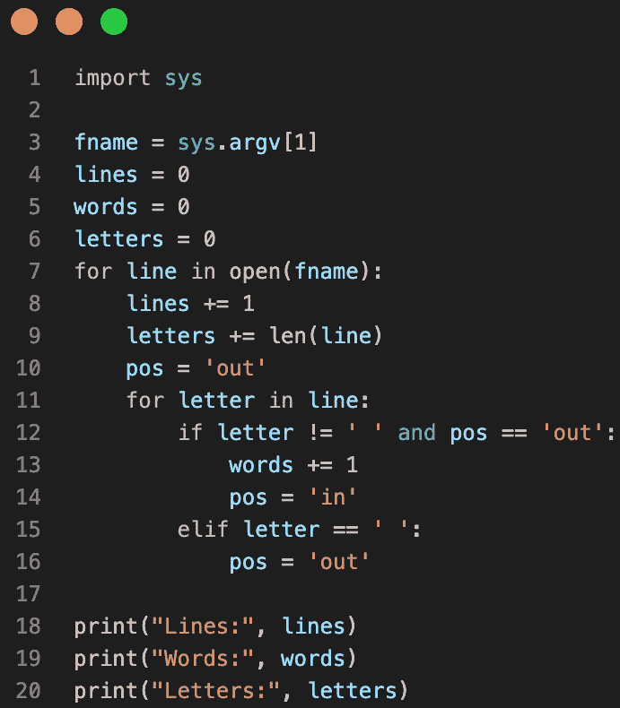

图 8.1 – 用于计算示例文本统计数据的 Python 脚本

1.  保存文件后，你可以使用以下命令运行它：

    ```
    $ docker container run --rm -it \    -v $(pwd):/usr/src/app \    -w /usr/src/app \     python:3-alpine python stats.py sample.txt
    ```

1.  请注意，在此示例中，我们正在重用之前 *运行 Perl 脚本* 部分中的 `sample.txt` 文件。在我的例子中，输出如下：

    ```
    Lines: 5Words: 13Letters: 121
    ```

这种方法的优点是，之前的 Perl 脚本和最后的 Python 脚本现在可以在任何安装了操作系统的计算机上运行，只要该机器是 Docker 主机，并且能够运行容器。

接下来，我们将学习如何限制系统上运行的容器可以消耗的资源数量。

# 限制容器的资源使用

容器的一个重要特性，除了封装应用程序进程外，还包括限制单个容器最多可以消耗的资源量。这包括 CPU 和内存消耗。让我们来看看如何限制内存（RAM）使用量：

```
$ docker container run --rm -it \       --name stress-test \
       --memory 512M \
       ubuntu:22.04 /bin/bash
```

进入容器后，安装 `stress` 工具，我们将用它来模拟内存压力：

```
/# apt-get update && apt-get install -y stress
```

打开另一个终端窗口，执行 `docker stats` 命令，观察所有正在运行的 Docker 容器的资源消耗。你应该会看到如下内容：

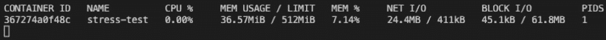

图 8.2 – 显示资源受限容器的 Docker stats

查看 `MEM USAGE` 和 `LIMIT`。目前，容器仅使用了 `36.57MiB` 的内存，并且限制为 `512MiB`。后者对应我们为该容器配置的内存限制。现在，让我们使用 `stress` 工具来模拟三个工人，它们将使用 `malloc()` 函数按 `256MiB` 的块分配内存。在容器内运行以下命令：

```
/# stress -m 3
```

上述命令通过创建三个子进程来给系统内存施加压力，这些进程会使用`malloc()`分配内存并持续触碰内存，直到系统内存耗尽。在运行 `docker stats` 的终端中，观察 `MEM USAGE` 的值如何接近但从不超过 `LIMIT`。这正是我们期望从 Docker 中看到的行为。Docker 使用 Linux **cgroups** 来强制执行这些限制。

什么是 cgroups？

Linux **cgroups**，即**控制组**，是一种内核级特性，允许将进程组织成层次结构的组，并在这些组之间分配、限制和监控系统资源，如 CPU、内存、磁盘 I/O 和网络。Cgroups 提供了一种管理和限制进程资源使用的方法，确保资源公平分配，并防止单个进程独占系统资源。

我们也可以类似地使用 `--cpu` 选项限制容器可以消耗的 CPU 数量。

通过此操作，工程师可以避免在繁忙的 Docker 主机上出现“噪声邻居”问题，在这种问题中，单个容器通过消耗过多的资源而导致所有其他容器处于资源匮乏状态。

# 避免以 root 身份运行容器

大多数在容器内运行的应用程序或服务不需要 `root` 权限。在这种情况下，为了提高安全性，运行这些进程时使用最小必要权限是非常有帮助的。这些应用程序不应该以 `root` 身份运行，也不应假设它们具有 `root` 级别的权限。

再次通过一个示例来说明我们的意思。假设我们有一个包含机密内容的文件。我们希望使用 `chmod` 工具在基于 Unix 的系统上保护该文件，使得只有具有 `root` 权限的用户可以访问它。假设我以 `demo` 用户身份登录开发主机，因此我的提示符是 `demo@dev $`。我可以使用 `sudo su` 来模拟超级用户身份。不过，我需要输入超级用户密码：

```
demo@dev $ sudo su   Password: <root password>
   root@dev $
```

现在，作为 `root` 用户，我可以创建名为 `top-secret.txt` 的文件并保护它：

```
root@dev $ echo "You should not see this." > top-secret.txtroot@dev $ chmod 600 ./top-secret.txt
root@dev $ exit
demo@dev $
```

如果我以 `demo` 用户身份尝试访问该文件，将发生以下情况：

```
cat: ./top-secret.txt: Permission denied
```

我收到一条 `Permission denied` 消息，这正是我们想要的。除了 `root` 用户外，没有其他用户可以访问此文件。现在，让我们构建一个包含此加密文件的 Docker 镜像，当从中创建容器时，尝试输出 `secrets` 文件的内容。Dockerfile 可能如下所示：

```
FROM ubuntu:22.04COPY ./top-secret.txt /secrets/
# simulate use of restricted file
CMD cat /secrets/top-secret.txt
```

我们可以使用以下命令（作为 `root` 用户！）从该 Dockerfile 构建镜像：

```
demo@dev $ sudo suPassword: <root password>
root@dev $ docker image build -t demo-image .
root@dev $ exit
demo@dev $
```

然后，通过运行上一步骤构建的镜像，我们得到以下结果：

```
demo@dev $ docker container run demo-image
```

上述命令将生成以下输出：

```
You should not see this.
```

好的，尽管我在主机上模拟了 `demo` 用户并且在该用户帐户下运行容器，但容器内运行的应用程序自动以 `root` 身份运行，因此具有对受保护资源的完全访问权限。这很糟糕，所以让我们解决这个问题！我们不使用默认设置，而是定义容器内的一个明确用户。修改后的 Dockerfile 如下所示：

```
FROM ubuntu:22.04RUN groupadd -g 3000 demo-group |
       && useradd -r -u 4000 -g demo-group demo-user
USER demo-user
COPY ./top-secret.txt /secrets/
# simulate use of restricted file
CMD cat /secrets/top-secret.txt
```

我们使用 `groupadd` 工具定义一个新的组 `demo-group`，组 ID 为 `3000`。然后，使用 `useradd` 工具将一个新的用户 `demo-user` 添加到该组中。该用户在容器内的 ID 为 `4000`。最后，通过 `USER demo-user` 语句，我们声明所有后续操作都应该以 `demo-user` 身份执行。

重新构建镜像——再次以 `root` 身份——然后尝试从中运行容器：

```
demo@dev $ sudo suPassword: <root password>
root@dev $ docker image build -t demo-image .
root@dev $ exit
demo@dev $ docker container run demo-image \
     cat: /secrets/top-secret.txt:
Permission denied
```

正如你在最后一行看到的，容器内运行的应用程序具有受限权限，无法访问需要 root 级别权限的资源。顺便问一下，如果我以 `root` 身份运行容器，你觉得会发生什么？试试看！

在接下来的部分，我们将展示如何从容器内部自动化 Docker 操作。

# 在容器内运行 Docker

有时，我们可能希望运行一个托管应用程序的容器，该应用程序自动化某些 Docker 任务。我们如何实现呢？Docker 引擎和 Docker CLI 安装在宿主机上，但应用程序运行在容器内。其实，Docker 一开始就提供了从宿主机将 Linux 套接字绑定挂载到容器中的方法。在 Linux 中，套接字是进程间非常高效的数据通信端点，通常在同一宿主机上运行的进程间进行通信。Docker CLI 使用套接字与 Docker 引擎进行通信，通常称为 **Docker 套接字**。如果我们能让容器内的应用程序访问 Docker 套接字，那么我们可以在这个容器内安装 Docker CLI，然后就可以使用这个本地安装的 Docker CLI 来自动化容器特定的任务。

重要提示

在这里，我们不是在讨论在容器内运行 Docker 引擎，而仅仅是运行 Docker CLI，并将 Docker 套接字从宿主机绑定挂载到容器中，以便 CLI 可以与宿主机上运行的 Docker 引擎进行通信。这是一个重要的区别。

在容器内运行 Docker 引擎通常不建议使用，原因有很多，包括安全性、稳定性和潜在的性能问题。这种做法通常称为 **Docker-in-Docker** 或 **DinD**。主要的关注点如下：

+   **安全性**：在容器内运行 Docker 引擎需要提升的权限，如在特权模式下运行容器或挂载 Docker 套接字。这可能会使宿主系统面临潜在的安全风险，因为被攻破的容器可能会控制宿主机的 Docker 守护进程，并提升权限，从而影响其他容器和宿主机本身。

+   **稳定性**：容器设计上是为了实现隔离、轻量和短暂的运行。将 Docker 引擎运行在容器内可能会产生复杂的依赖关系，增加冲突或失败的可能性，尤其是在管理宿主机和嵌套容器环境之间的存储、网络和进程命名空间时。

+   **性能**：在容器内运行 Docker 引擎可能会引入性能开销，因为它增加了另一层虚拟化，特别是在存储和网络方面。这可能导致延迟增加和吞吐量下降，特别是在管理大量容器或处理高性能应用程序时。

+   **资源管理**：Docker-in-Docker 可能会使有效管理和分配资源变得具有挑战性，因为嵌套容器可能无法继承其父容器的资源限制和约束，这可能导致资源争用或宿主机上资源过度分配。

为了说明这一概念，让我们看一个使用前述技术的示例。我们将使用上一章中构建的`library`组件的副本（见*第七章*）来进行演示：

1.  导航到章节文件夹：

    ```
    $ cd ~/The-Ultimate-Docker-Container-Book/ch08
    ```

1.  将`library`组件从`ch07`目录复制到此文件夹：

    ```
    $ cp -r ../ch07/library .
    ```

1.  在 VS Code 中打开该组件：

    ```
    $ code library
    ```

1.  向项目根目录添加一个名为`pipeline.sh`的新文件，并将以下代码添加到其中，该代码实现了 Docker 镜像的构建、测试和推送自动化：

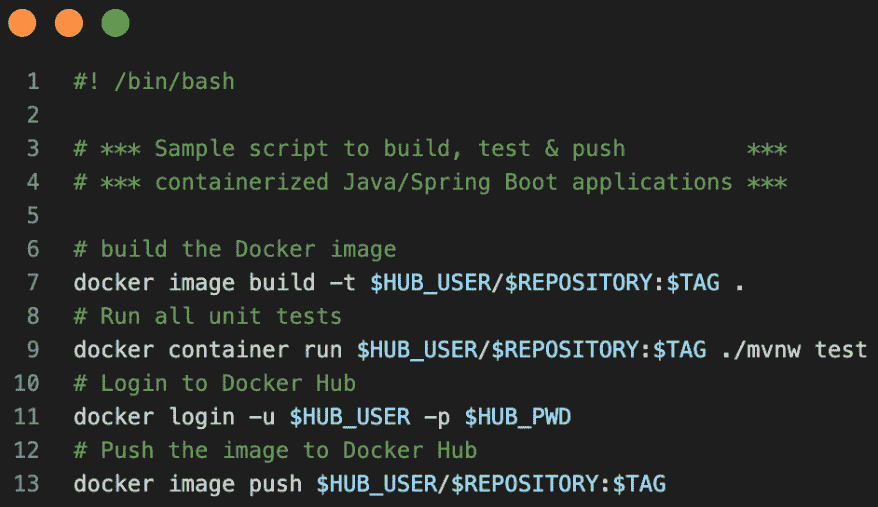

图 8.3 – 构建、测试并推送 Java 应用的脚本

请注意，我们使用了四个环境变量：`$HUB_USER`和`$HUB_PWD`是 Docker Hub 的凭证，`$REPOSITORY`和`$TAG`是我们希望构建的 Docker 镜像的名称和标签。最终，我们将需要在`docker container run`命令中传递这些环境变量的值，以便它们可以在容器内的任何进程中使用。

1.  保存文件并使其可执行：

    ```
    $ chmod +x ./pipeline.sh
    ```

我们希望在构建器容器中运行`pipeline.sh`脚本。由于该脚本使用 Docker CLI，因此我们的构建器容器必须安装 Docker CLI，并且为了访问 Docker 引擎，构建器容器必须绑定挂载 Docker 套接字。

让我们开始为构建器容器创建 Docker 镜像：

1.  向项目根目录添加一个名为`Dockerfile.builder`的文件，并将以下内容添加到其中：

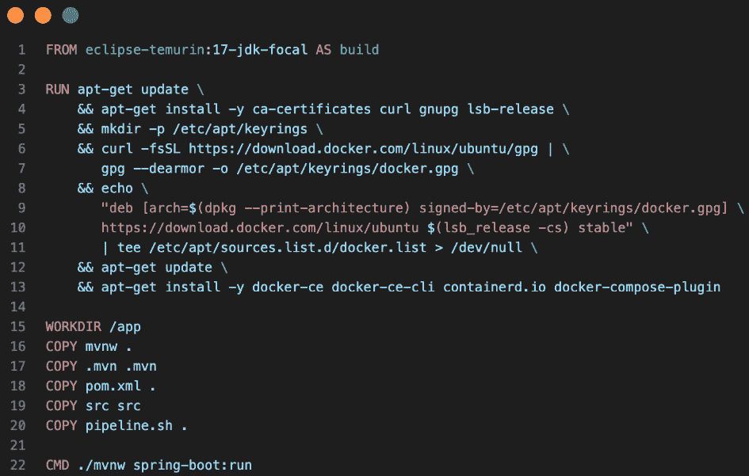

图 8.4 – 构建器的 Dockerfile

请注意从第 3 行开始的长`RUN`命令。此命令用于在容器中安装 Docker。有关此命令的更多详细信息，您可以参考 Docker 在线文档：[`docs.docker.com/engine/install/ubuntu/`](https://docs.docker.com/engine/install/ubuntu/)。

1.  使用这个 Dockerfile 构建 Docker 镜像非常简单：

    ```
    $ docker image build -f Dockerfile.builder -t builder .
    ```

1.  我们现在准备好尝试使用真实 Java 应用程序的`builder`命令了；例如，我们可以使用在`ch08/library`文件夹中定义的示例应用程序。确保用您自己的 Docker Hub 凭证替换 `<user>` 和 `<password>`：

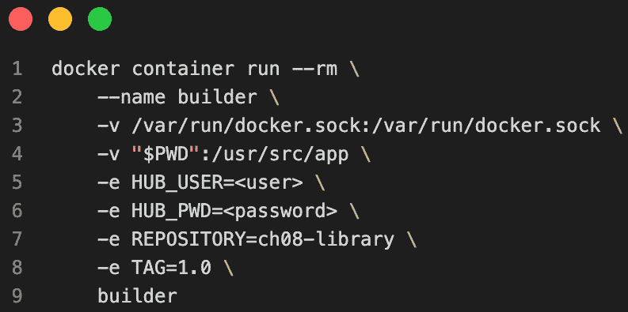

图 8.5 – 构建器的 Docker 运行命令

请注意，在前面的命令中，我们通过`-v /var/run/docker.sock:/var/run/docker.sock`将 Docker 套接字挂载到容器中。如果一切顺利，您应该已经为示例应用程序构建了容器镜像，测试已经运行，并且镜像已经推送到 Docker Hub。这只是许多非常有用的使用场景之一，在这些场景中，将 Docker 套接字绑定挂载非常重要。

特别提示给那些想在 Windows 计算机上尝试 Windows 容器的用户：在 Windows 上的 Docker Desktop 中，你可以通过绑定挂载 Docker 的 **命名管道** 来创建一个类似的环境，而不是套接字。在 Windows 上，命名管道大致相当于 Unix 系统上的套接字。假设你正在使用 PowerShell 终端，当运行托管 Jenkins 的 Windows 容器时，绑定挂载命名管道的命令如下所示：

```
PS> docker container run `       --name jenkins `
       -p 8080:8080 `
       -v \\.\pipe\docker_engine:\\.\pipe\docker_engine `
       friism/jenkins
```

请注意特殊语法`\\.\pipe\docker_engine`，用于访问 Docker 的命名管道。

在本节中，我们展示了如何通过将 Docker 套接字挂载到相应的容器中，从容器内运行 Docker。

接下来，我们将重新探讨如何使你的 Docker 构建尽可能快速，以减少开发周期中的摩擦。

# 优化构建过程

Docker 构建过程可以且应该得到优化。这将减少软件开发生命周期中的很多摩擦。

许多 Docker 初学者在编写第一个 Dockerfile 时会犯以下错误：

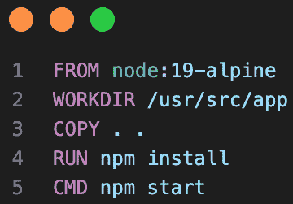

图 8.6 – 未优化的 Node.js 应用程序 Dockerfile

你能发现这个典型的 Node.js 应用程序 Dockerfile 中的薄弱点吗？在*第四章*《创建和管理容器镜像》中，我们了解到，一个镜像由一系列的层组成。Dockerfile 中的每一行（逻辑行）都会创建一个层，`CMD` 和/或 `ENTRYPOINT` 关键字的行除外。我们还了解到，Docker 构建器会尽力通过缓存层并在后续构建中重用未发生变化的层来优化构建过程。但缓存机制仅使用发生变化之前的缓存层，所有之后的层都需要重新构建。也就是说，Dockerfile 的上述结构会使得镜像层缓存失效——或者我们常听到的说法是，*破坏*了镜像层缓存！

为什么？嗯，根据经验，你肯定知道 `npm install` 命令在一个典型的 Node.js 应用程序中，尤其是有很多外部依赖的情况下，可能是一个非常耗时的操作。执行这个命令的时间可能从几秒钟到好几分钟不等。也就是说，每当其中一个源文件发生变化，而我们知道在开发过程中这种情况经常发生，Dockerfile 中的第 3 行会导致相应的镜像层发生变化。因此，Docker 构建器不能从缓存中重用该层，也不能重用由 `RUN npm install` 创建的后续层。代码的任何细微变化都会导致 `npm install` 被完全重新执行。这是可以避免的。包含外部依赖列表的 `package.json` 文件很少发生变化。根据这些信息，让我们来修复 Dockerfile：

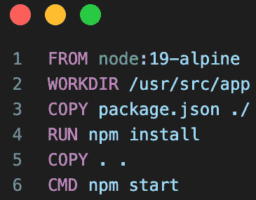

图 8.7 – 优化后的 Node.js 应用程序 Dockerfile

这次，在第 3 行，我们只将 `package.json` 文件复制到容器中，该文件很少发生变化。因此，随后的 `npm install` 命令也很少需要执行。第 5 行的 `COPY` 命令是一个非常快速的操作，因此在代码发生变化后，只需要重新构建这一层，重建镜像的时间缩短到几乎为零。

同样的原则适用于大多数语言或框架，如 Python、.NET 或 Java。避免破坏你的镜像层缓存！

# 扫描漏洞和机密信息

究竟什么是漏洞，或者更准确地说，**常见漏洞与暴露**（**CVE**）是什么？

一个公开已知的信息安全问题的数据库称为 **常见漏洞与暴露**。每个漏洞在数据库中的条目都有一个唯一的标识符。这个列表由专家不断审查和更新，任何新的漏洞或暴露都会在发现后立即加入。

现在，我们可以使用专业软件（如 Snyk）扫描 Docker 镜像的各个层，以查找已知存在 CVE 的软件库。如果我们发现镜像存在缺陷，我们应该通过切换到更新版本的有问题的库来修复问题，然后重新构建镜像。

但我们的工作还没有完成。安全专家经常会发现新的 CVE，正如前面提到的那样。因此，之前安全的软件库可能因为新公开的 CVE 而突然变得脆弱。

这意味着我们必须确保定期检查所有活跃的 Docker 镜像，通知我们的开发人员和安全专家这个问题，并采取其他措施确保问题尽快解决。

有几种方法可以扫描 Docker 镜像中的漏洞和机密信息：

+   使用像 Clair、Anchore 或 Trivy 这样的漏洞扫描工具。这些工具可以扫描 Docker 镜像，并将其与已知漏洞的数据库进行对比，以识别潜在的安全风险。

+   使用如 Aquasec 或 Sysdig 等工具扫描镜像中的机密信息。这些工具可以检测并提醒敏感信息，如私钥、密码以及可能无意中提交到镜像中的其他敏感数据。

+   结合使用两种工具，例如 Docker Bench for Security，它检查部署 Docker 容器到生产环境中时的常见最佳实践。

+   使用如 OpenSCAP 等工具，它可以执行漏洞扫描、安全配置评估以及对 Docker 镜像的合规性检查。

需要注意的是，保持镜像更新并只使用官方和可信的镜像始终是一种良好的实践。

在接下来的章节中，我们将研究如何发现 Docker 镜像中的漏洞。

## 使用 Snyk 扫描 Docker 镜像

Snyk 是一个安全平台，可用于扫描 Docker 镜像中的漏洞。以下是使用 Snyk 扫描 Docker 镜像漏洞的示例：

1.  首先，我们需要在机器上安装 Snyk CLI。我们可以通过运行以下命令来完成：

    ```
    $ npm install -g snyk
    ```

1.  一旦安装了 Snyk，我们可以通过运行以下命令并按照提示完成身份验证：

    ```
    $ snyk auth
    ```

1.  接下来，我们可以运行以下命令来扫描特定的 Docker 镜像漏洞：

    ```
    $ snyk test --docker <image-name>
    ```

上述命令将对指定的 Docker 镜像进行漏洞扫描，并在控制台中打印结果。结果将显示发现的漏洞数量、每个漏洞的严重性，以及受影响的包和版本。

1.  我们还可以使用`--file`标志来扫描一个 Dockerfile，而不是扫描已经构建好的镜像：

    ```
    $ snyk test --file=path/to/Dockerfile
    ```

1.  此外，如果我们是多个组织的成员，我们还可以使用`--org`标志来指定一个组织：

    ```
    $ snyk test --docker <image-name> --org=my-org
    ```

1.  最后，我们可以使用`--fix`标志来自动修复扫描中发现的漏洞，方法是运行以下命令：

    ```
    $ snyk protect --docker <image-name>
    ```

请注意，此功能仅适用于通过 Dockerfile 构建的镜像，它将更新 Dockerfile 中的新包版本，并且你需要重新构建镜像才能利用此修复。

注意

Snyk 的免费计划有限制扫描次数，并且不包括*Protect*功能。你需要升级到付费计划才能访问此功能。

## 使用 docker scan 扫描 Docker 镜像中的漏洞

在本节中，我们将再次使用 Snyk 扫描 Docker 镜像中的漏洞。Snyk 应该已经随 Docker Desktop 的安装包一同安装：

1.  使用以下命令进行检查：

    ```
    $ docker scan --version
    ```

输出结果应类似于此：

```
Version:    v0.22.0Git commit: af9ca12
Provider:   Snyk (1.1054.0)
```

1.  让我们尝试扫描作者 Docker Hub 账户中的示例`whoami`应用。首先，确保你在本地缓存中有`whoami`镜像：

    ```
    $ docker image pull gnschenker/whoami:1.0
    ```

1.  扫描镜像中的漏洞：

    ```
    $ docker scan gnschenker/whoami:1.0
    ```

1.  你将被询问以下内容：

    ```
    Docker Scan relies upon access to Snyk, a third party provider, do you consent to proceed using Snyk? (y/N)
    ```

请回答`y`。

上述扫描的结果在我的电脑上看起来是这样的：

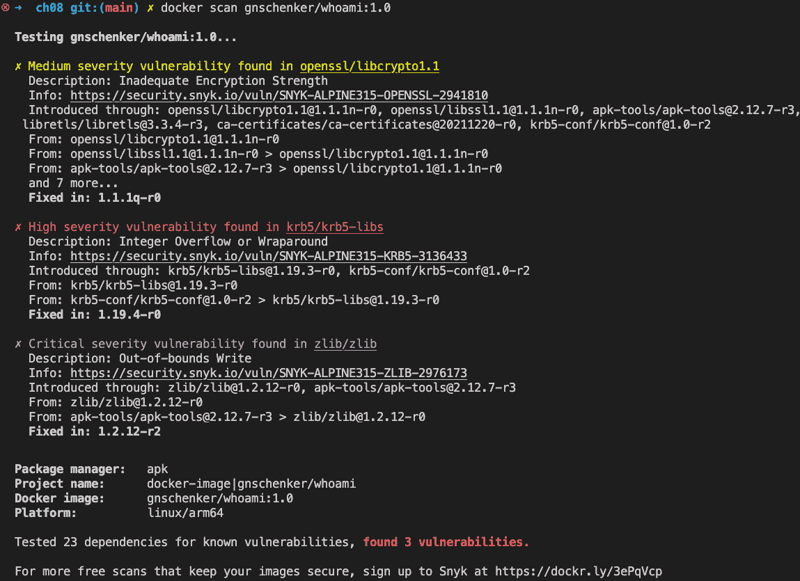

图 8.8 – 扫描 gnschenker/whoami:1.0 Docker 镜像

如你所见，在该版本的镜像中发现了三处漏洞：其中一个为*中等*级别，一个为*高*级别，一个为*严重*级别。显然，我们应尽快解决严重漏洞。让我们现在就来做：

1.  首先，我们复制原始的`whoami`项目，包括用于构建该镜像的 Dockerfile。你可以在`~/``The-Ultimate-Docker-Container-Book/sample-solutions/``ch14`文件夹中找到该副本。

1.  打开 Dockerfile 并检查它。我们为.NET SDK 和运行时都使用了版本`6.0-alpine`。让我们看看 Microsoft 是否已经更新了这个版本中的漏洞。

1.  导航到`…/``ch08/whoami`文件夹。

1.  使用此命令构建一个新的 Docker 镜像版本：

    ```
    $ docker image build -t gnschenker/whoami:1.0.1 .
    ```

请注意，你可能需要将 `gnschenker` 替换为你自己的 Docker 账户名。

1.  扫描新镜像：

    ```
    $ docker scan gnschenker/whoami:1.0.1
    ```

这次，输出应该如下所示：

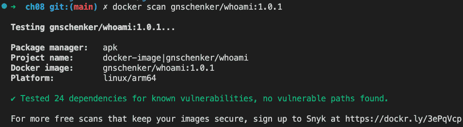

图 8.9 – 扫描重建的 whoami Docker 镜像

如你所见，这次镜像不含任何漏洞。我们现在应该指示 DevOps 使用这个新版本的镜像。我们可以在生产环境中进行滚动更新，应该不会有问题，因为应用本身并未更改。

在接下来的章节中，我们将学习如何在容器中运行一个完整的开发环境。

# 在容器中运行你的开发环境

假设你只有一个安装了 Docker Desktop 的工作站，但无法在该工作站上添加或更改其他任何内容。现在你想进行一些概念验证并使用 Java 编写一些示例应用程序。不幸的是，Java 和 SpringBoot 并未安装在你的电脑上。你该怎么办？如果你能在容器中运行一个完整的开发环境，包括代码编辑器和调试器，会怎么样？同时，你还能将代码文件保留在主机上呢？

容器真是太棒了，天才工程师们为这种问题提供了解决方案。

注

微软和社区一直在不断更新 VS Code 和插件。因此，你的 VS Code 版本可能比本书编写时使用的版本更新。因此，可能会有稍微不同的体验。有关如何使用 Dev 容器的更多细节，请参考官方文档：[`code.visualstudio.com/docs/devcontainers/containers`](https://code.visualstudio.com/docs/devcontainers/containers)。

我们将使用 Visual Studio Code，这个我们最喜欢的代码编辑器，来演示如何在容器中运行一个完整的 Java 开发环境：

1.  但首先，我们需要安装必要的 VS Code 扩展。打开 VS Code 并安装名为 **Remote Development** 的扩展：

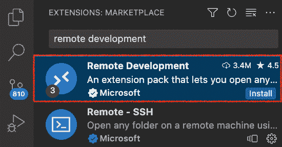

图 8.10 – 将 Remote Development 扩展添加到 VS Code

1.  然后，点击 Visual Studio Code 窗口左下角的绿色快速操作状态栏项。在弹出的对话框中，选择 **Remote-Containers** | **在容器中打开文件夹...**：

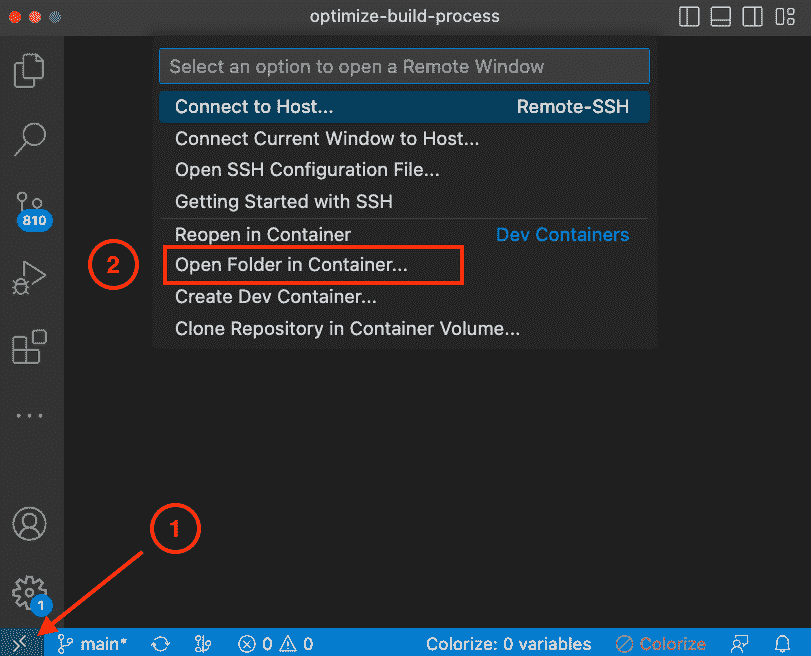

图 8.11 – 在容器中打开文件夹

1.  选择你想在容器中使用的项目文件夹。在我们的例子中，我们选择了 `~/``The-Ultimate-Docker-Container-Book/ch08/library` 文件夹。

1.  会弹出一个对话框，询问你如何创建开发容器。在列表中，选择 **From ‘Dockerfile’**：

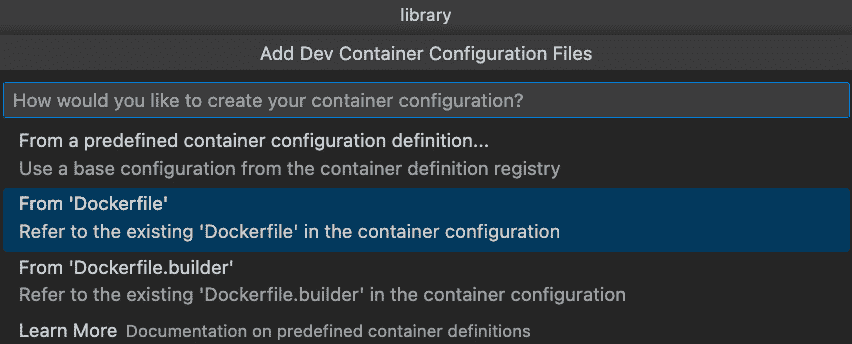

图 8.12 – 选择创建开发容器的方法

1.  当要求你添加其他要安装的功能时，只需点击 **OK** 继续。此时，我们不需要任何特别的功能。

VS Code 现在将开始准备环境，首次启动可能需要几分钟时间。

1.  一旦环境准备好，你应该注意到左下角的提示符已经变成如下所示：

    ```
    Dev Container: Existing Dockerfile @ <folder-path>
    ```

这表明，VS Code 确实已根据 `library` 文件夹中的 Dockerfile 运行了一个容器，并允许你在其中工作。

1.  由于 VS Code 识别这是一个 Java 项目，你将被要求安装 Java 扩展包。点击 `dev` 容器，注意，只有 UI 仍然在你的笔记本电脑上运行，因此扩展包将被安装在容器内部的引擎中。你会在打开 **EXTENSIONS** 面板时注意到，在 **DEV CONTAINER** 下列出了远程扩展。在我们的例子中，安装 Java 扩展包后，我们现在安装了以下八个远程扩展：

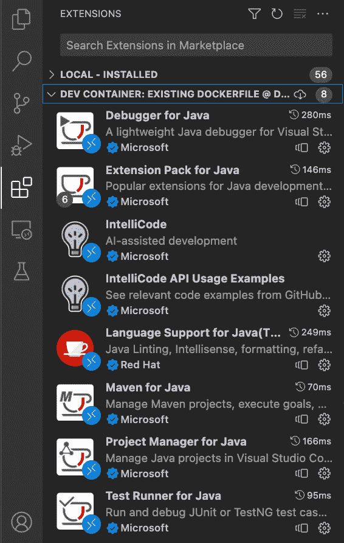

图 8.13 – 在开发容器中安装的远程扩展

1.  在 VS Code 内打开终端，按 *Shift* + *Ctrl* + *‘*，并注意到提示符显示我们正处于 `dev` 容器内，而不是直接在 Docker 主机上运行：

    ```
    root@c96b82891be7:/workspaces/.../ch08/library#
    ```

请注意，为了提高可读性，我们已简化了前面的提示。

1.  现在，尝试通过在 `LibraryApplication` 类中找到 `main` 方法并点击方法上方的 **Run** 链接来运行 Java 应用程序。应用程序应该像往常一样启动，但请注意，我们的上下文是在开发容器内，而不是直接在工作机器上。

或者，我们也可以通过命令行使用以下命令来启动应用程序：

```
$ ./mvnw spring-boot:run
```

1.  现在，向 `controllers` 文件夹添加一个名为 `DefaultController.java` 的文件，并添加以下内容：

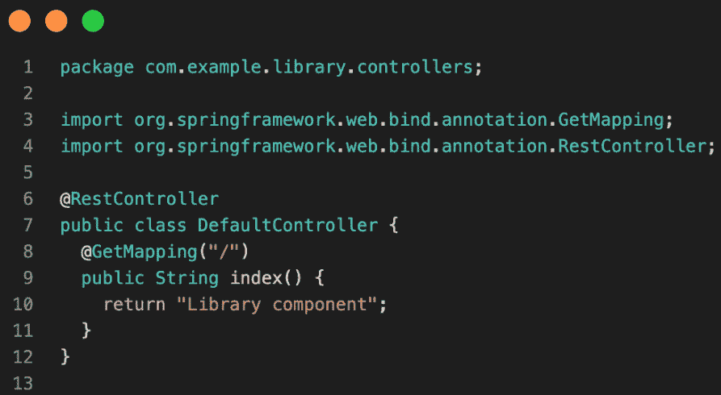

图 8.14 – 在开发容器内添加默认控制器 [工作中](http://localhost:8080)

1.  重启应用程序，并在浏览器中打开 `http://localhost:8080`。应该会显示 `Library component` 消息，符合预期。

1.  实验完成后，点击 VS Code 左下角的绿色区域，并从弹出菜单中选择 **Open folder locally**，退出开发容器并将项目本地打开。

1.  注意到项目中添加了一个新的文件夹 `.devcontainer`，其中包含一个 `devcontainer.json` 文件。该文件包含从此项目运行开发容器所需的配置。请阅读 VS Code 的文档，了解此文件为你提供的功能。

这些是一些对专业人士有用的技巧和窍门，适用于容器的日常使用。还有更多内容，可以去 Google 查找，值得一试。

# 总结

在本章中，我们介绍了在容器化复杂的分布式应用程序时或使用 Docker 自动化复杂任务时有用的各种技巧、窍门和概念。我们还学习了如何利用容器在其中运行完整的开发环境。

在下一章中，我们将介绍分布式应用架构的概念，并讨论成功运行分布式应用所需的各种模式和最佳实践。

# 问题

这里有一些你应该尝试回答的问题，以评估你的进展：

1.  列出你希望在容器内运行完整开发环境的原因。

1.  为什么应该避免以 `root` 用户身份在容器内运行应用程序？

1.  为什么你会将 Docker 套接字绑定到容器中？

1.  在清理 Docker 资源以腾出空间时，为什么需要特别小心处理卷？

1.  为什么你会希望在 Docker 容器内运行某些管理员任务，而不是在主机机器上本地运行？

# 答案

以下是本章问题的示例答案：

1.  你可能正在使用资源或能力有限的工作站，或者你的工作站可能被公司锁定，禁止安装任何未经官方批准的软件。有时，你可能需要使用尚未被公司批准的语言或框架来做概念验证或实验（但如果概念验证成功，未来可能会被批准）。

1.  将 Docker 套接字绑定到容器内是推荐的方法，当容器化应用程序需要自动化某些与容器相关的任务时。这可以是像 Jenkins 这样的自动化服务器，用于构建、测试和部署 Docker 镜像。

1.  大多数业务应用程序不需要 `root` 级别的权限就能完成工作。因此，从安全的角度来看，强烈建议以最少必要的访问权限运行此类应用程序。任何不必要的提升权限可能会被黑客在恶意攻击中利用。通过以非 `root` 用户身份运行应用程序，你可以使潜在黑客更难以侵入你的系统。

1.  卷包含数据，而数据的生命周期通常需要超出容器或应用程序的生命周期。数据通常是关键任务，需要安全存储数天、数月甚至数年。当你删除一个卷时，你会不可逆地删除与之关联的数据。因此，在删除卷时，请确保你知道自己在做什么。

1.  你可能希望在 Docker 容器内运行某些管理员任务，而不是在主机机器上本地运行，有几个原因：

    +   **隔离性**：容器提供了与宿主机的隔离，这样在容器中运行管理任务可以帮助防止与宿主机上其他进程或依赖项的冲突。

    +   **可移植性**：容器设计为轻量级和可移植，允许在不同环境中轻松部署管理任务。这对于需要在多个环境或多台机器上运行的任务尤其有用。

    +   **一致性**：容器为运行管理任务提供了一个一致的环境，无论宿主机的配置如何。这有助于确保任务以可预测和可重复的方式运行，从而减少错误并提高效率。

    +   **版本管理**：容器允许对管理任务进行轻松的版本控制，这使得任务可以回滚或向前推进。这对于测试、故障排除和生产环境非常有用。

    +   **安全性**：在容器中运行管理任务有助于通过将任务与宿主机隔离，并且更容易限制任务的权限和访问，从而提高安全性。

    +   **可扩展性**：容器可以轻松地进行水平扩展和缩减，允许你增加或减少管理任务所需的资源。

请注意，这并不是一个详尽无遗的列表，不同的使用场景可能需要不同的方法。在容器中运行管理任务与直接在宿主机上运行之间，权衡其利弊是非常重要的，你需要选择最适合特定使用场景的方法。

# 第三部分：编排基础

到了*第三部分*结束时，你将熟悉 Docker 化的分布式应用程序和容器编排器的概念，并能够使用 Docker Swarm 部署和运行你的应用程序。

+   *第九章*，*学习分布式应用架构*

+   *第十章*，*使用单主机网络*

+   *第十一章*，*使用 Docker Compose 管理容器*

+   *第十二章*，*传输日志和监控容器*

+   *第十三章*，*介绍容器编排*

+   *第十四章*，*介绍 Docker Swarm*

+   *第十五章*，*在 Docker Swarm 上部署和运行分布式应用程序*
