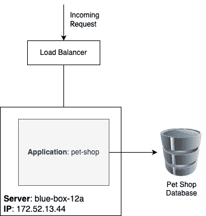
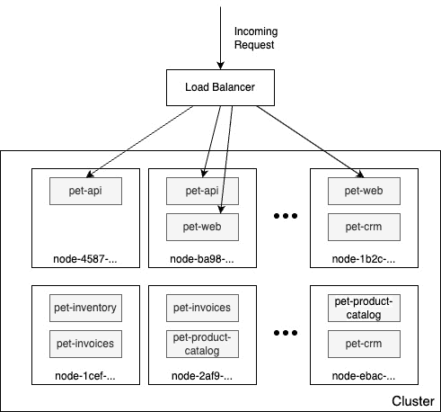
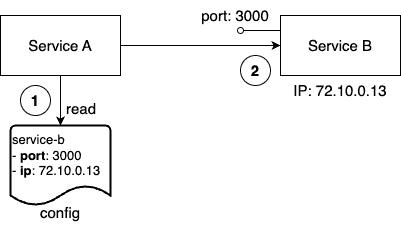
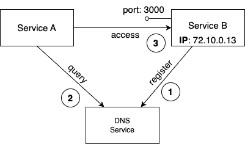
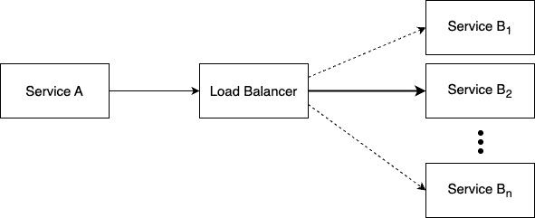
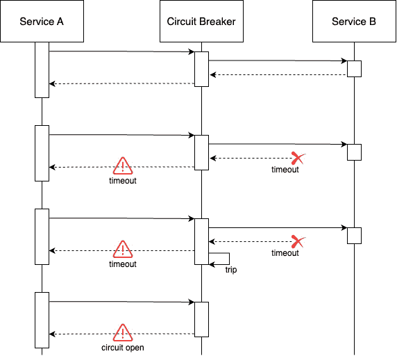
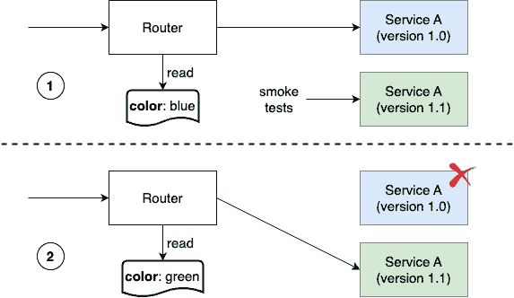
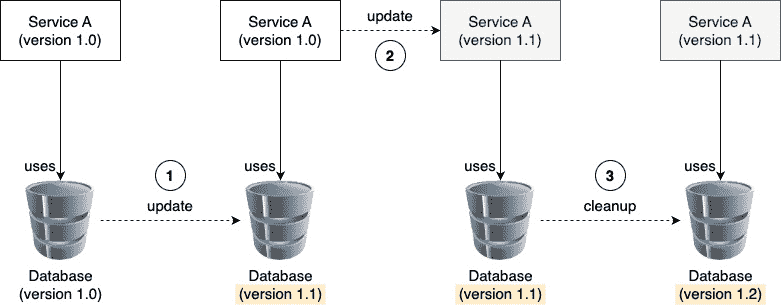

# 9

# 学习分布式应用架构

本章介绍了分布式应用架构的概念，并讨论了成功运行分布式应用所需的各种模式和最佳实践。它还将讨论在生产环境中运行这种应用所需要满足的额外要求。你可能会想，这和 Docker 容器有什么关系？你问得对，乍一看，这两者似乎没有什么关系。但正如你将很快看到的，当你引入托管应用或应用服务的容器时，你的应用很快就会由多个容器组成，这些容器将运行在计算机集群或虚拟机的不同节点上；于是，你就开始处理一个分布式应用了。我们认为，了解分布式应用带来的复杂性并帮助你避免最常见的陷阱是很有意义的。

下面是我们将要讨论的主题列表：

+   什么是分布式应用架构？

+   模式与最佳实践

+   在生产环境中运行

阅读本章后，你将能够完成以下任务：

+   草拟一个分布式应用的高层架构图，并指出关键的设计模式

+   识别设计不当的分布式应用可能带来的陷阱

+   列举常见的分布式系统问题处理模式

+   至少列举出四种需要在生产就绪的分布式应用中实现的模式

让我们开始吧！

# 什么是分布式应用架构？

在本节中，我们将解释当我们谈论分布式应用架构时的含义。首先，我们需要确保我们使用的所有单词或缩写都有明确的含义，并且大家都在讲相同的语言。

## 定义术语

在本章及后续章节中，我们将讨论一些可能对每个人来说都不太熟悉的概念。为了确保我们大家都在讲相同的语言，下面我们将简要介绍并描述这些概念或词汇中最重要的内容：

| **关键词** | **描述** |
| --- | --- |
| 虚拟机 | **虚拟机**（**VM**）是一个在主机计算机上运行的物理计算机的软件模拟。它提供一个独立的操作系统和资源，允许多个操作系统在单一物理机器上运行。 |
| 集群 | 集群是一个由多个相互连接的服务器组成的群体，它们作为一个整体协作工作，为应用提供高可用性、可扩展性和更高的性能。集群中的节点通过网络连接，共享资源，从而提供统一的、高可用的解决方案。 |
| 节点 | 集群节点是集群计算系统中的一台单独服务器。它提供计算资源，并与其他节点一起协作执行任务，作为一个统一的系统，为应用提供高可用性和可扩展性。 |
| 网络 | 网络是一组互联的设备，可以交换数据和信息。网络可以用于连接计算机、服务器、移动设备和其他类型的设备，并允许它们相互通信并共享资源，如打印机和存储设备。在我们这个例子中，更具体地说，这些是集群中各个节点之间以及这些节点上运行的程序之间的物理和软件定义的通信路径。 |
| 端口 | 端口是网络连接设备中的通信端点，如计算机或服务器。它允许设备通过特定的网络协议（如 TCP 或 UDP）接收和发送数据到网络中的其他设备。每个端口都有一个唯一的编号，用于标识它，不同的服务和应用程序使用特定的端口进行通信。 |
| 服务 | 不幸的是，这是一个非常含糊的术语，其真正含义取决于使用的上下文。如果我们在应用程序的上下文中使用“服务”一词，比如应用服务，它通常意味着这是一个实现有限功能集的软件，其他应用程序部分将使用这些功能。随着本书的进展，其他类型的服务也会被讨论，这些服务具有稍微不同的定义。 |

简单来说，分布式应用架构是单体应用架构的对立面，但首先看一下单体架构也并不无道理。传统上，大多数业务应用程序都是以一种方式编写的，结果可以被看作是一个运行在数据中心某个命名服务器上的单一、紧密耦合的程序。它的所有代码被编译成一个单一的二进制文件，或者是几个需要共同部署的紧密耦合的二进制文件。应用程序运行所在的服务器——或者更广泛地说——主机的名称或静态 IP 地址在这个上下文中也很重要。让我们来看一下下面的图，它更精确地说明了这种类型的应用架构：

图 9.1 – 单体应用架构

在前面的图示中，我们可以看到一个名为 `blue-box-12a` 的服务器，IP 地址为 `172.52.13.44`，它运行着一个名为 `pet-shop` 的应用程序，这是一个由主模块和几个紧密耦合的库组成的单体架构。

现在，让我们看看以下图示：

图 9.2 – 分布式应用架构

在这里，突然间，我们不再只有一个命名服务器；相反，我们有许多服务器，它们没有人类友好的名称，而是一些独特的 ID，如 `pet-api`、`pet-web` 和 `pet-inventory`。此外，每个服务在这个服务器或主机的集群中运行多个实例。

你可能会想，为什么我们在一本关于 Docker 容器的书中讨论这些内容，你问得很对。虽然我们将要探讨的所有话题同样适用于容器尚不存在的世界，但重要的是要意识到，容器和容器编排引擎能够以更高效和更直接的方式解决所有这些问题。在容器化的世界中，许多曾经在分布式应用架构中非常难以解决的问题变得相当简单。

# 模式和最佳实践

分布式应用架构有许多显著的优点，但与单体应用架构相比，它也有一个非常重要的缺点——前者远比后者复杂。为了驯服这种复杂性，业界提出了一些重要的最佳实践和模式。在接下来的章节中，我们将更详细地探讨其中一些最重要的内容。

## 松散耦合的组件

处理复杂主题的最佳方法一直是将其拆分成更容易管理的小问题。例如，一次性建造一座房子会非常复杂。将房子从简单的部件构建出来，然后将这些部件组合成最终结果会容易得多。

同样的原则也适用于软件开发。如果我们将一个非常复杂的应用程序拆分成多个较小的组件，这些组件可以互相协作，共同构成整个应用程序，那么开发这些组件会变得容易得多。如果这些组件之间是松散耦合的，那么开发它们将更加容易。意味着组件 A 对组件 B 和 C 的内部工作没有任何假设，它只关心如何通过一个定义良好的接口与这两个组件进行通信。

如果每个组件都有一个定义良好且简单的公共接口，通过该接口与系统中的其他组件以及外部世界进行通信，那么这将使我们能够单独开发每个组件，而不依赖于其他组件。在开发过程中，系统中的其他组件可以通过存根或模拟对象轻松替换，从而使我们能够测试我们的组件。

## 有状态与无状态

每个有意义的业务应用程序都会创建、修改或使用数据。在 IT 中，数据的同义词是**状态**。一个创建或修改持久数据的应用服务称为**有状态组件**。典型的有状态组件包括数据库服务或创建文件的服务。另一方面，不创建或修改持久数据的应用组件称为**无状态组件**。

在分布式应用架构中，无状态组件比有状态组件要容易处理得多。无状态组件可以轻松地进行横向扩展和收缩。此外，它们可以在集群中的完全不同节点上迅速且无痛地被销毁并重新启动——这一切都因为它们没有与之相关的持久数据。

鉴于此，设计一个大多数应用服务是无状态的系统是非常有帮助的。最好将所有有状态的组件推到应用程序的边界，并限制其使用数量。管理有状态的组件很困难。

## 服务发现

当我们构建由多个独立组件或服务组成的应用程序，并且这些组件相互通信时，我们需要一种机制来允许各个组件在集群中找到彼此。相互找到通常意味着你需要知道目标组件运行在哪个节点上，以及它在哪个端口上监听通信。通常，节点通过**IP 地址**和**端口**来标识，端口只是一个在定义范围内的数字。

从技术上讲，我们可以告诉**服务 A**，它希望与目标**服务 B**进行通信，目标的 IP 地址和端口是什么。例如，这可以通过配置文件中的一项条目来实现：

图 9.3 – 组件是硬接线的

虽然在一个运行在一个或仅几个知名且精心管理的服务器上的单体应用程序中，这种方式可能非常有效，但在分布式应用架构中，它就会崩溃。首先，在这种情况下，我们有很多组件，手动跟踪它们变成了一场噩梦。这是不可扩展的。此外，通常，服务 A 应该或者永远不应该知道其他组件运行在哪个集群节点上。它们的位置甚至可能不稳定，因为组件 B 可能会由于与应用无关的各种原因，从节点*X*迁移到另一个节点*Y*。因此，我们需要另一种方式，允许服务 A 定位服务 B，或者任何其他服务。通常，会使用一个外部权威来感知系统在任何给定时刻的拓扑结构。

这个外部权威或服务知道当前属于集群的所有节点及其 IP 地址；它知道所有正在运行的服务以及它们的运行位置。通常，这种服务被称为**DNS 服务**，其中 DNS 代表**域名系统**。正如我们将看到的，Docker 在其底层引擎中实现了一个 DNS 服务。Kubernetes——我们将在*第十三章*中讨论的第一大容器编排系统——也使用 DNS 服务来促进集群中组件之间的通信：

图 9.4 – 组件咨询外部定位服务

在上面的图中，我们可以看到服务 A 如何想要与服务 B 进行通信，但不能直接进行。首先，它必须查询外部权限，即注册服务（这里称为**DNS 服务**），以获取服务 B 的位置信息。注册服务会返回请求的信息，并提供服务 A 可以用来访问服务 B 的 IP 地址和端口号。服务 A 随后使用这些信息并与服务 B 建立通信。当然，这只是一个低层次的简单示意图，但它有助于我们理解服务发现的架构模式。

## 路由

路由是将数据包从源组件发送到目标组件的机制。路由分为不同的类型。所谓的 OSI 模型（更多信息请参考本章最后的*进一步阅读*部分）用于区分不同类型的路由。在容器和容器编排的上下文中，第 2 层、第 3 层、第 4 层和第 7 层的路由是相关的。我们将在后续章节中更详细地探讨路由。现在，我们只需知道，第 2 层路由是最低级别的路由，它将一个 MAC 地址连接到另一个 MAC 地址，而第 7 层路由，也称为应用层路由，是最高级别的路由。例如，应用层路由用于将带有目标标识符的请求——也就是像[`acme.com/pets`](https://acme.com/pets)这样的 URL——路由到系统中的适当目标组件。

## 负载均衡

负载均衡在**服务 A**需要与**服务 B**进行通信时使用，例如在请求-响应模式中，但后者运行在多个实例中，如下图所示：

图 9.5 – 服务 A 的请求正在被负载均衡到服务 B

如果我们的系统中有多个服务实例（例如，服务 B）在运行，我们希望确保这些实例能够平等地分配工作负载。这个任务是一个通用任务，这意味着我们不希望调用方去做负载均衡，而是希望有一个外部服务来拦截调用并决定将请求转发到哪个目标服务实例。这个外部服务称为负载均衡器。负载均衡器可以使用不同的算法来决定如何将传入的请求分配给目标服务实例。最常用的算法叫做轮询算法。这个算法会重复地分配请求，从实例 1 开始，然后是实例 2，一直到实例*n*。当最后一个实例被处理完后，负载均衡器会重新从实例 1 开始。

在前面的示例中，负载均衡器也有助于高可用性，因为来自服务 A 的请求会被转发到健康的服务 B 实例。负载均衡器还负责定期检查每个 B 实例的健康状况。

## 防御性编程

在为分布式应用开发服务时，重要的是要记住，服务不是独立的，它依赖于其他应用服务，甚至依赖于第三方提供的外部服务，如信用卡验证服务或股票信息服务，仅举两例。所有这些其他服务都是我们正在开发的服务之外的。我们无法控制它们的正确性或在任何给定时刻的可用性。因此，在编写代码时，我们需要始终假设最坏的情况，并期望最好的结果。假设最坏的情况意味着我们必须明确处理潜在的故障。

### 重试

当存在外部服务可能暂时不可用或响应不足的情况时，可以使用以下程序。当调用其他服务失败或超时时，调用代码应以一种结构化的方式进行，使得在短暂等待时间后重复同一调用。如果调用再次失败，等待时间应比上次稍长，再次尝试。调用应重复直到达到最大次数，每次增加等待时间。之后，服务应放弃并提供降级服务，具体可能意味着返回一些过时的缓存数据或根本不返回数据，具体取决于情况。

### 日志记录

对服务执行的重要操作应始终进行日志记录。日志信息需要进行分类，以便具有实际价值。常见的分类包括*调试*、*信息*、*警告*、*错误*和*致命*。日志信息应由一个中央日志聚合服务收集，而不是存储在集群的单个节点上。聚合日志易于解析和过滤相关信息。这些信息对于快速定位分布式系统中多部件运行时的故障或异常行为的根本原因至关重要。

### 错误处理

如前所述，分布式应用中的每个应用服务都依赖于其他服务。作为开发人员，我们应该始终预期最坏的情况，并做好适当的错误处理。最重要的最佳实践之一是尽早失败。编写服务时，要确保无法恢复的错误尽早被发现，并且一旦检测到此类错误，服务应立即失败。但不要忘记将有意义的信息记录到`STDERR`或`STDOUT`，以供开发人员或系统操作员在以后跟踪系统故障时使用。此外，还应向调用者返回一个有帮助的错误信息，尽可能准确地说明调用失败的原因。

一个快速失败的示例是始终检查调用者提供的输入值。值是否在预期范围内并且完整？如果不是，就不要尝试继续处理，而是立即终止操作。

## 冗余

一个关键任务系统必须始终可用，全天候、全年无休。停机是不可接受的，因为它可能会导致公司巨大的机会损失或声誉损害。在一个高度分布式的应用中，至少有一个组件发生故障的可能性是不可忽视的。我们可以说，问题不在于某个组件是否会发生故障，而是故障何时发生。

为了避免当系统中的某个组件发生故障时导致停机，每个系统部分都需要冗余。这不仅包括应用组件，还包括所有基础设施部分。这意味着，如果我们有一个支付服务作为应用的一部分，那么我们需要对该服务进行冗余部署。最简单的方式是在集群的不同节点上运行该服务的多个实例。同样的原则也适用于边缘路由器或负载均衡器。我们不能承受这些服务出现故障。因此，路由器或负载均衡器必须是冗余的。

## 健康检查

我们多次提到，在分布式应用架构中，由于其包含多个组件，单个组件发生故障的可能性非常高，而且这只是时间问题。因此，我们必须对系统中的每个组件进行冗余部署。负载均衡器会将流量分配到服务的各个实例上。

但现在，另一个问题出现了。负载均衡器或路由器如何知道某个服务实例是否可用？它可能已经崩溃，或者可能没有响应。为了解决这个问题，我们可以使用所谓的**健康检查**。负载均衡器，或者代表它的其他系统服务，会定期轮询所有服务实例并检查它们的健康状况。基本问题是，*你还在吗？你健康吗？* 每个问题的答案要么是*是*，要么是*否*，如果实例不再响应，则健康检查会超时。

如果组件的回答是*否*或发生超时，系统将终止对应实例并启动一个新的实例替代。如果所有这些都是自动化完成的，我们就可以说系统实现了自愈功能。负载均衡器不再周期性地轮询组件的状态，责任可以反过来，组件可以要求定期向负载均衡器发送存活信号。如果某个组件在预定的较长时间内未发送存活信号，则假定其处于不健康状态或已经死亡。

有些情况下，上述描述的方式中的任何一种都更为合适。

## 熔断器模式

断路器是一种机制，用于避免由于多个关键组件的级联故障而导致分布式应用程序崩溃。断路器帮助我们避免一个失败的组件通过多米诺效应拖垮其他依赖服务，就像电气系统中的断路器保护房屋免于由于故障的插入式电器而导致燃烧，中断电源线一样，分布式应用程序中的断路器在服务 A 到服务 B 的连接不响应或者故障时会中断连接。

这可以通过将受保护的服务调用封装在一个断路器对象中来实现。该对象会监控失败情况。一旦失败次数达到某个阈值，断路器将被触发。所有后续对断路器的调用都将返回错误，而根本不会进行受保护的调用：

图 9.6 – 断路器模式

在上图中，我们有一个断路器，在调用服务 B 时接收到第二个超时后被触发。

### 速率限制器

在断路器的背景下，速率限制器是一种控制系统或服务处理请求速率的技术。通过限制在特定时间窗口内允许的请求数量，速率限制器有助于防止过载，并确保服务的稳定性和可用性。这种机制在减少突发流量冲击的影响、保护后端系统免受压倒性影响以及避免分布式系统中级联故障方面非常有用。通过将速率限制与断路器结合使用，系统能够有效地保持最佳性能，并优雅地处理需求的突然增加。

### 防火墙

除此之外，在断路器的背景下，防火墙是一种用于隔离系统中的组件或资源的弹性模式，确保一个区域的故障不会对整个系统造成级联效应。通过将资源分区并将操作隔离到独立的单元中，防火墙有助于防止单点故障导致整个服务崩溃。这种机制有助于维持系统稳定性，提高容错能力，并确保关键操作即使在本地化故障时也能继续正常运行。与断路器结合使用时，防火墙有助于构建更加健壮和弹性的系统，能够处理故障并保持整体系统性能。

# 在生产中运行

要成功地在生产环境中运行分布式应用程序，我们需要考虑一些超出前述部分介绍的最佳实践和模式的特定领域。一个具体的领域就是自省和监控。让我们详细讨论最重要的方面。

## 日志记录

一旦分布式应用进入生产环境，就无法进行实时调试。但我们如何找出应用故障的根本原因呢？解决这个问题的方法是，应用在运行时会生成大量且有意义的日志信息。我们在前面的章节中简要讨论了这个话题，但由于其重要性，值得再次强调。开发人员需要在其应用服务中添加必要的代码，以便输出有用的信息，例如发生错误时或遇到潜在的异常或不希望出现的情况时。通常，这些信息会输出到`STDOUT`和`STDERR`，然后由系统守护进程收集，写入本地文件或转发到中心化日志聚合服务。

如果日志中有足够的信息，开发人员可以利用这些日志来追踪系统错误的根本原因。

在分布式应用架构中，由于其包含许多组件，日志记录的重要性比单体应用中更为突出。单个请求在应用各个组件中的执行路径可能非常复杂。同时，记住这些组件是分布在多个节点集群中的。因此，记录所有重要信息是合理的，并且需要在每个日志条目中添加一些内容，比如事件发生的确切时间、事件发生的组件以及运行该组件的节点，等等。此外，日志信息应该聚合到一个中心位置，以便开发人员和系统运维人员能够方便地进行分析。

## 跟踪

跟踪（Tracing）用于找出单个请求是如何在分布式应用中流转的，以及该请求在每个组件上花费了多少时间。如果收集了这些信息，它可以作为仪表盘的一个数据源，显示系统的行为和健康状态。

## 监控

运维工程师喜欢通过仪表盘查看系统的实时关键指标，这些指标可以让他们一眼看到应用的整体健康状态。这些指标可以是非功能性指标，如内存和 CPU 使用率、系统或应用组件的崩溃次数、节点的健康状态等，也可以是功能性、因此是应用特定的指标，如订单系统中的结账次数或库存服务中的缺货商品数量。

最常见的用于汇总仪表盘数据的基本数据来源是日志信息。这些数据可以是系统日志，主要用于非功能性指标，或是应用级日志，用于功能性指标。

## 应用更新

一家公司的竞争优势之一是能够迅速应对市场变化。部分原因在于能够快速调整应用程序，以满足新的和变化的需求或添加新功能。我们能够多快地更新应用程序，就越有优势。如今，许多公司每天会推出多次新功能或修改功能。

由于应用程序更新频繁，这些更新必须是无干扰的。在升级时，我们不能让系统停机进行维护。所有的更新都必须无缝且透明地进行。

### 滚动更新

更新应用程序或应用服务的一种方式是使用滚动更新。这里的假设是需要更新的软件运行在多个实例上。只有这样，我们才能使用这种更新方式。

发生的情况是，系统停止当前服务的一个实例，并用新服务的实例替换它。一旦新实例准备好，它将开始接收流量。通常，新实例会被监控一段时间，以检查它是否按预期工作；如果成功，当前服务的下一个实例将被停用并替换为新的实例。这个模式会一直重复，直到所有服务实例都被替换。

由于在任何给定时间总是会有一些实例在运行，无论是当前的还是新的，应用程序始终处于可用状态。无需停机时间。

### 蓝绿部署

在蓝绿部署中，当前版本的应用服务，称为**蓝色**，处理所有应用流量。接着，我们在生产系统上安装新版本的应用服务，称为**绿色**。这个新服务还没有和应用的其他部分连接。

一旦绿色服务安装完成，我们可以对这个新服务执行**冒烟测试**。如果测试通过，路由器可以配置为将所有之前发送到蓝色服务的流量转发到新的绿色服务。然后，密切观察绿色服务的表现，如果所有成功标准都满足，蓝色服务可以被淘汰。但如果由于某些原因，绿色服务出现了意外或不希望出现的行为，路由器可以重新配置，将所有流量返回到蓝色服务。然后可以删除绿色服务并进行修复，之后可以使用修复后的版本重新执行蓝绿部署。

图 9.7 – 蓝绿部署

接下来，我们来看一下金丝雀发布。

### 金丝雀发布

金丝雀发布是指在系统中并行安装当前版本的应用服务和新版本的发布。它类似于蓝绿部署。最初，所有流量仍然会通过当前版本路由。然后，我们配置路由器，使其将总体流量的一个小百分比（例如 1%）引导到新版本的应用服务。随后，密切监控新服务的行为，以确定它是否按预期工作。如果所有成功标准都满足，则将路由器配置为将更多流量（例如这次是 5%）引导到新服务。同样，继续密切监控新服务的行为，如果成功，将更多流量引导到新服务，直到达到 100%。一旦所有流量都被引导到新服务并且其稳定了一段时间，旧版本的服务可以被停用。

为什么我们称之为金丝雀发布？它的名字来源于煤矿工人，他们会使用金丝雀作为矿井中的早期警报系统。金丝雀对有毒气体特别敏感，如果金丝雀死了，矿工们就知道他们必须立即撤离矿井。

### 不可逆的数据变更

如果我们的更新过程的一部分是执行不可逆的状态变更，例如在后端关系型数据库中进行不可逆的架构变更，那么我们需要特别小心处理。只要采用正确的方法，就可以在没有停机的情况下执行此类变更。需要特别注意的是，在这种情况下，我们不能同时部署需要新数据结构的代码变更和数据变更。相反，整个更新过程必须分为三个不同的步骤。在第一步，我们推出向后兼容的架构和数据变更。如果这一步成功，我们将在第二步推出新代码。再次，如果第二步成功，我们将在第三步清理架构，移除向后兼容性。

图 9.8 – 推出不可逆的数据或架构变更

上面的图表展示了数据及其结构如何更新，应用代码如何更新，以及数据和数据结构如何清理。

### 大规模改变数据结构

随着时间的推移，应用程序可能会生成大量数据。在大规模数据结构更改中，指的是改变存储在数据库或其他类型数据存储系统中大量数据的格式、组织或布局的过程。这可能涉及添加、删除或修改数据结构中的字段、表或其他元素。目标是针对特定的用例或业务需求优化数据，同时保持数据的准确性和完整性。这个过程通常涉及分析现有的数据结构，规划和测试更改，然后以受控方式执行更新。在大规模的数据结构更改中，必须有一个明确定义的策略、强有力的测试和验证流程，以及足够的资源，包括技术专长和备份系统，以最小化在迁移过程中发生数据丢失或损坏的风险。

在动态数据迁移场景中，数据在使用过程中会实时更新，这使得迁移过程变得更加复杂和具有挑战性。这种类型的迁移需要更复杂的方法，以确保在整个迁移过程中数据的一致性和完整性。解决方案应能够跟踪源系统中对数据所做的更改，并在目标系统中复制这些更改，同时最小化停机时间和数据丢失。这可能涉及使用专门的工具，如数据复制或镜像软件，或采用多步骤过程，包括数据同步和对账。此外，必须制定强有力的测试和验证程序，并且有清晰的回滚计划，以最小化在迁移过程中发生数据丢失或损坏的风险。

### 回滚与前进

如果我们的应用服务在生产环境中频繁更新，迟早会出现某个更新的问题。也许在修复某个 bug 时，开发人员引入了新的 bug，这个问题没有被所有的自动化测试，甚至可能是手动测试，捕获到，因此应用程序出现异常。在这种情况下，我们必须将服务回滚到之前的正常版本。在这方面，回滚就是从灾难中恢复。

再次强调，在分布式应用架构中，问题不是是否需要回滚，而是何时需要回滚。因此，我们需要确保始终能够回滚到构成我们应用程序的任何服务的先前版本。回滚不能是事后想到的，它必须是我们部署过程中的一个经过测试和验证的部分。

如果我们使用蓝绿部署来更新服务，那么回滚应该相对简单。我们所需要做的就是将路由器从新的绿色版本切换回先前的蓝色版本。

如果我们遵循持续交付，并且我们的代码主分支始终处于可部署状态，那么我们还可以考虑进行向前滚动部署，而不是回滚部署。通常，解决生产问题并立即推出修复要比试图将系统回滚到先前的状态更快。特别是在先前的变更引入了某些向后不兼容时，向前滚动部署技术显得尤为重要。

# 总结

本章中，我们学习了什么是分布式应用架构，以及哪些模式和最佳实践对成功运行分布式应用是有帮助或必要的。我们还讨论了在生产环境中运行这种应用所需要的内容。

在下一章中，我们将深入探讨仅限单一主机的网络连接。我们将讨论如何让位于同一主机上的容器相互通信，以及如何在必要时让外部客户端访问容器化应用程序。

# 进一步阅读

以下文章提供了更深入的信息，涉及本章中所涉及的内容：

+   *电路* *断路器*： [`bit.ly/1NU1sgW`](http://bit.ly/1NU1sgW)

+   *OSI 模型* *解释*： [`bit.ly/1UCcvMt`](http://bit.ly/1UCcvMt)

+   *蓝绿* *部署*： [`bit.ly/2r2IxNJ`](http://bit.ly/2r2IxNJ)

# 问题

请回答以下问题，以评估你对本章内容的理解：

1.  为什么分布式应用架构中的每个部分都必须具备冗余性？请用几句话简要解释。

1.  为什么我们需要 DNS 服务？请用三到五句话解释。

1.  什么是电路断路器，为什么需要它？

1.  单体应用和分布式或多服务应用之间有哪些重要的区别？

1.  什么是蓝绿部署？

# 答案

以下是本章问题的可能答案：

1.  在分布式应用架构中，软件和基础设施的每个部分在生产环境中都需要具备冗余性，因为应用的持续运行时间至关重要。一个高度分布式的应用由许多部分组成，随着部分数量的增加，某个部分发生故障或异常的可能性也会增加。可以确保的是，给定足够的时间，每个部分最终都会发生故障。为了避免应用出现中断，我们需要对每个部分进行冗余处理，无论是服务器、网络交换机，还是在容器中的集群节点上运行的服务。

1.  在高度分布式、可扩展且具有容错能力的系统中，应用的单个服务可能会因为扩展需求或组件故障而移动。因此，我们不能将不同的服务硬性耦合在一起。需要访问服务 B 的服务 A 不应该需要知道关于服务 B 的细节，如其 IP 地址。它应该依赖外部提供者来获取这些信息。DNS 就是这样一个位置信息提供者。服务 A 只需要告诉 DNS 它想与服务 B 进行通信，DNS 服务将处理具体细节。

1.  熔断器是一种防止分布式应用中的组件出现级联故障的手段。如果某个组件失败或行为异常，类似于电路中的熔断器，软件驱动的熔断器会切断客户端与失败服务之间的通信。如果失败的服务被调用，熔断器会直接向客户端组件报告错误。这允许系统从故障中恢复或自我修复。

1.  单体应用比多服务应用更容易管理，因为它只包含一个单一的部署包。另一方面，单体应用通常更难以扩展，以应对某一特定领域的需求增加。在分布式应用中，每个服务可以单独扩展，每个服务可以运行在优化的基础设施上，而单体应用需要在适应所有或大多数功能的基础设施上运行。然而，随着时间的推移，这已不再是一个大问题，因为所有主要的云提供商都提供了非常强大的服务器和/或虚拟机。这些服务器相对便宜，并且可以轻松处理大多数普通业务线或 Web 应用的负载。

如果单体应用没有很好地模块化，维护和更新要比多服务应用更困难，后者的每个服务都可以独立更新和部署。单体应用通常是一个庞大、复杂且紧耦合的代码堆积。即使是小的修改，也可能产生意想不到的副作用。（微）服务，理论上是自包含的、简单的组件，像黑盒子一样运行。依赖的服务不知道该服务的内部工作原理，因此不依赖它。

注意

现实往往没有那么理想——在许多情况下，微服务是紧耦合的，并表现得像分布式巨型单体应用。遗憾的是，后者是团队或公司最糟糕的状态，因为它结合了两者世界的缺点，一方面是单体应用，另一方面是分布式应用。

1.  蓝绿部署是一种软件部署方式，允许在不停止服务的情况下部署应用程序或应用服务的新版本。如果，假设服务 A 需要更新新版本，那么当前运行的版本称为蓝色版本。新版本的服务会被部署到生产环境中，但尚未与其他应用程序集成。这一新版本被称为绿色版本。一旦部署成功，并且冒烟测试显示它已经准备好上线，负责将流量引导至蓝色版本的路由器将重新配置，切换到绿色版本。绿色版本的行为会被观察一段时间，如果一切正常，蓝色版本将被停用。另一方面，如果绿色版本出现问题，路由器可以简单地切换回蓝色版本，绿色版本可以进行修复并稍后重新部署。
