# 11

# 使用 Docker Compose 管理容器

在上一章中，我们学到了很多关于容器网络如何在单一 Docker 主机上工作的知识。我们介绍了**容器网络模型**（**CNM**），它构成了所有 Docker 容器之间网络通信的基础，随后我们深入探讨了 CNM 的不同实现，特别是桥接网络。最后，我们介绍了 Traefik，一个反向代理，用于在容器之间实现复杂的 HTTP 应用级路由。

本章介绍了由多个服务组成的应用程序的概念，每个服务都运行在一个容器中，以及 Docker Compose 如何通过声明式方法让我们轻松构建、运行和扩展这样的应用程序。

本章涵盖以下主题：

+   解密声明式与命令式的容器编排方式

+   运行一个多服务应用程序

+   使用 Docker Compose 构建镜像

+   使用 Docker Compose 运行应用程序

+   扩展服务

+   构建和推送一个应用程序

+   使用 Docker Compose 覆盖

完成本章后，你将能够做到以下几点：

+   简要解释定义和运行应用程序时，命令式方法与声明式方法的主要区别

+   用你自己的话描述容器和 Docker Compose 服务之间的区别

+   为一个简单的多服务应用程序编写 Docker Compose YAML 文件

+   使用 Docker Compose 构建、推送、部署和拆除一个简单的多服务应用程序

+   使用 Docker Compose 扩展应用程序服务的规模

+   使用覆盖定义环境特定的 Docker Compose 文件

# 技术要求

本章配套的代码可以在这里找到：[`github.com/PacktPublishing/The-Ultimate-Docker-Container-Book/tree/main/sample-solutions/ch11`](https://github.com/PacktPublishing/The-Ultimate-Docker-Container-Book/tree/main/sample-solutions/ch11)。

在开始之前，让我们确保你已经准备好一个文件夹，用来存放你将在本章实现的代码：

1.  进入你之前克隆的与本书配套的代码仓库所在的文件夹。通常这个文件夹是你主文件夹中的 `The-Ultimate-Docker-Container-Book` 文件夹：

    ```
    $ cd ~/The-Ultimate-Docker-Container-Book
    ```

1.  创建一个名为`ch11`的子文件夹并进入该文件夹：

    ```
    $ mkdir ch11 && cd ch11
    ```

过去，你需要在系统上安装一个单独的 docker-compose 工具。但现在不再需要，因为 Docker CLI 最近进行了扩展，已经包含了 docker-compose 工具之前提供的所有功能及更多功能。

如果你感兴趣，你可以在这里找到旧版 `docker-compose` 工具的详细安装说明：[`docs.docker.com/compose/install/`](https://docs.docker.com/compose/install/)。

# 解密声明式与命令式的容器编排方式

Docker Compose 是 Docker 提供的一个工具，主要用于在单个 Docker 主机上运行和协调容器。它的应用场景包括但不限于开发、**持续集成**（**CI**）、自动化测试、手动 QA 或演示。最近，Docker Compose 已经被嵌入到正常的 Docker CLI 中。

Docker Compose 使用 YAML 格式的文件作为输入。默认情况下，Docker Compose 期望这些文件被命名为`docker-compose.yml`，但也可以使用其他名称。`docker-compose.yml`文件的内容被称为描述和运行一个可能包含多个容器的容器化应用程序的声明式方式。

*那么，声明式是什么意思？*

首先，声明式是命令式的反义词。嗯，这并没有太大帮助。既然我介绍了另一个定义，那么我需要解释一下这两个词：

+   **命令式**：这是一种通过指定系统必须遵循的精确步骤来解决问题的方法。

如果我以命令式的方式告诉系统（例如 Docker 守护进程）如何运行一个应用程序，那么这意味着我必须一步一步地描述系统需要做什么，并且如果发生一些意外情况，系统应该如何反应。我必须非常明确和精确地给出指示，覆盖所有的边界情况，并且说明如何处理它们。

+   **声明式**：这是一种不要求程序员指定精确步骤来解决问题的方法。

声明式方法意味着我告诉 Docker 引擎我希望应用程序达到的目标状态，而它必须自行弄清楚如何实现这个目标状态，并且在系统偏离目标状态时如何将其恢复。

Docker 明确推荐在处理容器化应用程序时采用声明式方法。因此，Docker Compose 工具也采用了这种方法。

# 运行多服务应用程序

在大多数情况下，应用程序并不只包含一个单一的整体模块，而是由多个协同工作的应用服务组成。在使用 Docker 容器时，每个应用服务运行在自己的容器中。当我们想要运行这样一个多服务的应用程序时，当然可以使用大家熟悉的`docker container run`命令来启动所有参与的容器，这也是我们在前几章中做过的。但这最多只能算是低效的做法。有了 Docker Compose 工具，我们可以通过声明式的方式，在一个使用 YAML 格式的文件中定义应用程序。

让我们创建并分析一个简单的`docker-compose.yml`文件：

1.  在本章的文件夹（`ch11`）内，创建一个名为`step1`的子文件夹并进入：

    ```
    $ mkdir step1 && cd step1
    ```

1.  在此文件夹内，添加一个名为`docker-compose.yml`的文件，并将以下代码片段添加到文件中：

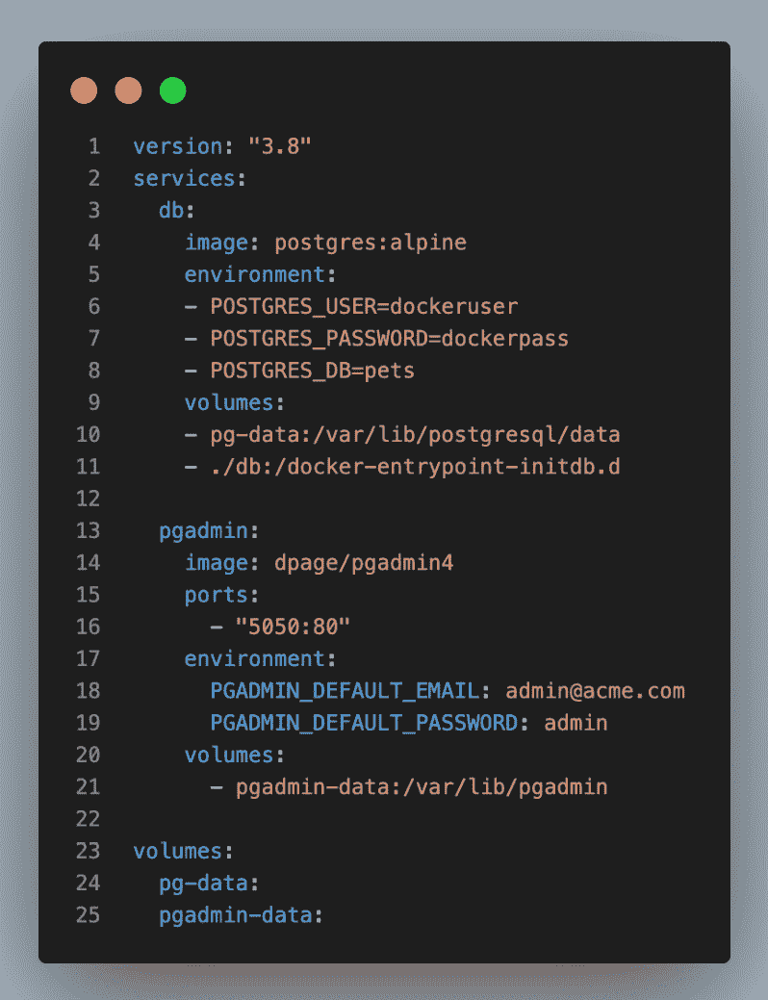

图 11.1 – 简单的 Docker Compose 文件

文件中的各行解释如下：

+   第 1 行：`version` – 在这一行中，我们指定了要使用的 Docker Compose 格式版本。在撰写本文时，这是版本 `3.8`。

+   第 2 至第 21 行：`services` – 在这一部分，我们在 `services` 块中指定了构成我们应用程序的服务。在我们的示例中，我们有两个应用程序服务，分别命名为 `db` 和 `pgadmin`。

+   第 3 至第 11 行：`db` – `db` 服务使用的镜像名称为 `postgres:alpine`，这是基于 Alpine Linux 的 PostgreSQL 数据库的最新版本：

    +   第 4 行：`image` – 在这里，我们定义了用于该服务的 Docker 镜像。如前所述，我们使用的是带有 `alpine` 标签的精选 `postgres` 镜像。由于没有指定版本号，它将使用基于 Alpine 的 PostgreSQL 镜像的最新稳定版本。

    +   第 5 至第 8 行：`environment` – 在这里，我们定义了在运行中的 PostgreSQL 服务内可以访问的环境变量。在此，我们定义了默认的用户名、密码和数据库名称。

    +   第 9 至第 11 行：`volumes` – 我们定义了两个卷映射。

    +   第 10 行：我们将一个名为 `pg-data` 的卷映射到 `/var/lib/postgresql/data` 容器文件夹。这是 PostgreSQL 默认存储数据的位置。这样，数据将被持久化到 `pg-data` 卷中，并且在 `db` 服务重启后仍然存在。

    +   第 11 行：在这种情况下，我们将主机文件夹 `./db` 映射到一个名为 `/docker-entrypoint-initdb.d` 的容器文件夹。这是 PostgreSQL 在首次启动数据库时期望运行的初始化文件所在的文件夹。在我们的例子中，我们将使用它来定义一个名为 `init-db.sql` 的数据库初始化脚本。

+   第 13 至第 21 行：`pgadmin` – `pgadmin` 服务使用的 Docker 镜像包含了一个流行的 PostgreSQL 和类似数据库的管理工具 `Pg4Admin`。我们将一个名为 `pgadmin-data` 的卷挂载到 `db` 服务的容器中：

    +   第 14 行：`image` – 此服务使用的是 `dpage/pgadmin4` 镜像。请注意，我们没有为该镜像定义任何标签，因此它将自动使用最新版本。

    +   第 15 至第 16 行：`ports` – 在这里，我们定义了要映射到主机的容器端口。在这种情况下，我们将默认的 `Pg4Admin` 端口 `80` 映射到主机端口 `5050`。这样，我们就可以通过浏览器窗口访问这个端口的管理工具，稍后我们将看到这一点。

    +   第 17 至第 19 行：`environment` – 在这里，我们定义了在运行中的 `Pg4Admin` 工具容器内可以访问的环境变量。这是我们登录工具时所需的电子邮件和密码。

    +   第 20 至第 21 行：`volumes` – 我们将一个名为 `pgadmin-data` 的 Docker 卷映射到容器内的 `/var/lib/pgadmin` 文件夹。这是该工具存储其数据的位置，使得即使工具容器重启，数据也能得以保留。

+   第 23–25 行：`volumes` – 任何服务使用的卷必须在此部分声明。在我们的示例中，这是文件的最后一部分。当应用程序首次运行时，Docker 将创建名为`pg-data`和`pgadmin-data`的卷，然后，在后续运行中，如果卷仍然存在，它们将被重用。如果应用程序由于某种原因崩溃并且必须重新启动，则之前的数据仍然可用，并准备好供重新启动的数据库服务使用。

1.  在`step1`文件夹中创建一个名为`db`的文件夹，并添加一个名为`init-db.sql`的文件，其内容如下：

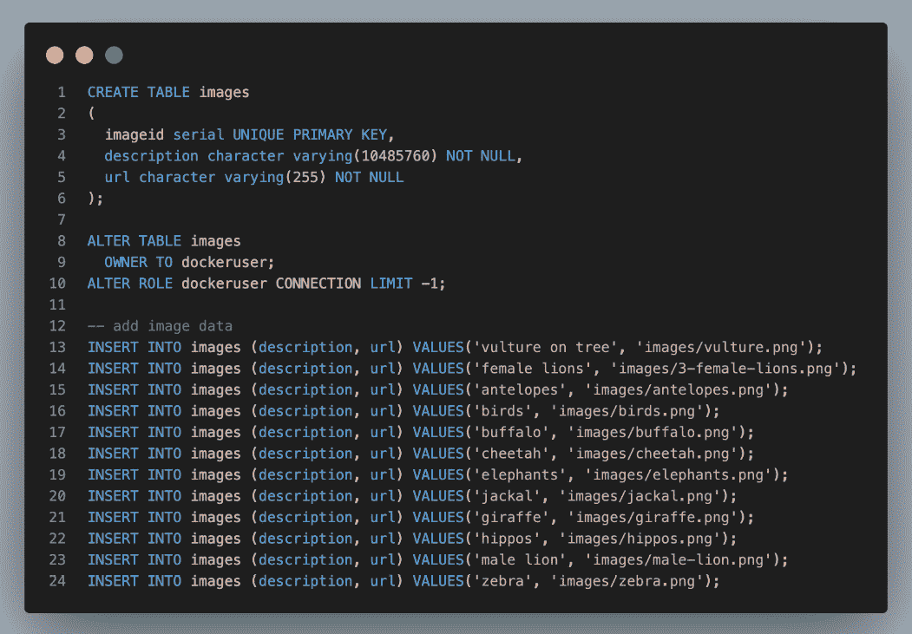

图 11.2 – 数据库初始化脚本

如果你不想键入所有前面的内容，你可以在这里找到该文件：[`github.com/PacktPublishing/The-Ultimate-Docker-Container-Book/blob/main/sample-solutions/ch11/step1/db/init-db.sql`](https://github.com/PacktPublishing/The-Ultimate-Docker-Container-Book/blob/main/sample-solutions/ch11/step1/db/init-db.sql)。稍后你会看到，这个文件将用于初始化我们的数据库，并添加一些初始架构和数据。

1.  接下来，让我们看看如何通过 Docker Compose 运行服务。请从包含`docker-compose.yml`文件的`step1`文件夹中执行以下命令：

    ```
    $ docker compose up
    ```

让我们分析上一个命令生成的输出：

+   前几行告诉我们，Docker 正在拉取`db`和`pgadmin`服务的镜像

+   接下来的几行指示 Docker 正在自动创建一个名为`step1_default`的新网络

+   两个名为`step1_pgadmin-data`和`step1-pg-data`的卷

+   两个容器实例分别称为`step1-db-1`和`step1-pgadmin-1`


图 11.3 – 为 Docker Compose 应用程序创建资源

注意以上所有资源都添加了`step1_`前缀。这是`docker-compose.yml`所在的文件夹名称，应用程序启动的地方，与下划线字符结合使用。

+   现在，让我们看一下蓝色输出中的第三部分。在这里，数据库正在启动：

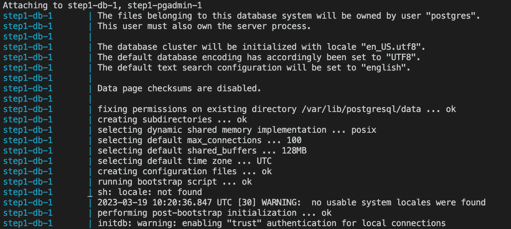

图 11.4 – 启动数据库

+   数据库初始化的第二部分看起来像这样：

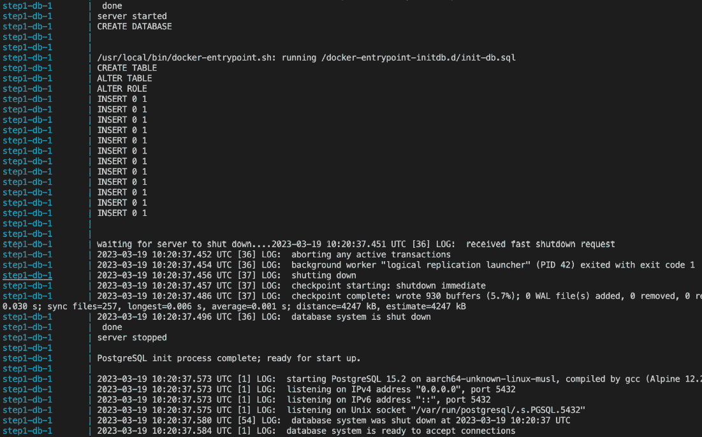

图 11.5 – 使用提供的脚本初始化数据库

+   我们已经简化了输出的第二部分。它展示了数据库如何完成其初始化过程。我们可以具体看到我们的初始化脚本`init-db.sql`是如何应用的，它定义了一个数据库并添加了一些数据。

+   输出的最后一行告诉我们，PostgreSQL 数据库现在已经启动并运行，准备接受传入的连接。连接预计会发生在端口 `5432`，这一点可以从前面输出中的倒数第四和倒数第五行看出。

提示

如果由于某些原因你的卷映射不起作用——可能在卷映射部分有拼写错误等——你可以通过使用 `docker compose down -v` 命令重新开始，其中 `-v` 参数指示 Docker 删除与此应用程序相关的所有卷。

+   最后是 `pgadmin` 工具的初始化，显示为黄色：

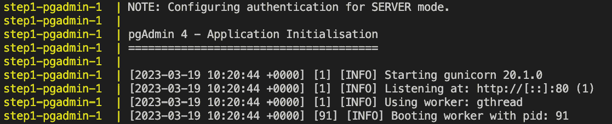

图 11.6 – 启动 pgadmin 工具

1.  现在我们准备好了。让我们打开一个新的浏览器窗口并访问 `http://localhost:5050`。当系统提示时，使用在 `docker-compose.yml` 文件中为 `pgadmin` 工具定义的用户名（邮箱）和密码登录，即邮箱为 `admin@acme.com`，密码为 `admin`。添加一个名为 `demo` 的服务器，并填写以下连接详情：

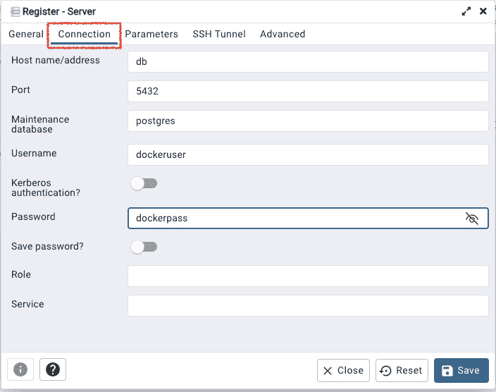

图 11.7 – Pg4Admin 连接详情

请注意，主机名/地址 `db` 对应于我们在 docker-compose 文件中定义的数据库服务名称。端口 `5432` 是 PostgreSQL 数据库使用的默认端口，用户名和密码也对应我们在 docker-compose 文件中为数据库定义的内容。

1.  一旦连接到数据库，确保你能找到 `pets` 数据库及其中的 `images` 表。使用该工具检索 `images` 表中的所有记录。你应该能找到我们在 `init-db.sql` 初始化脚本中定义的 12 条记录。

1.  在继续之前，你可以通过在终端窗口中按下 *Ctrl* + *C* 停止应用程序，确保该应用程序仍在运行。然后，运行以下命令：

    ```
    $ docker compose down -v
    ```

这是为了确保应用容器、网络和卷被移除。你应该在终端中看到以下输出：

```
[+] Running 5/5⠿ Container step1-pgadmin-1    Removed             0.0s
⠿ Container step1-db-1         Removed             0.0s
⠿ Volume step1_pgadmin-data    Removed             0.0s
⠿ Volume step1_pg-data         Removed             0.1s
⠿ Network step1_default        Removed             0.1s
```

特别要注意使用 `-v` 命令行参数，它告诉 Docker 强制删除由应用程序创建和使用的卷。请谨慎使用此参数，因为它会销毁所有已持久化到这些卷中的数据。

很棒，成功了。你已经学会了如何使用 `docker-compose.yml` 文件声明式地定义由多个服务组成的应用程序，并通过简单的 `docker compose` `up` 命令启动它。

接下来，你将学习如何使用 Docker Compose 构建自定义镜像。

# 使用 Docker Compose 构建镜像

为了演示如何使用 Docker Compose 构建 Docker 镜像，我们需要一个小型应用程序。请按以下步骤操作：

1.  在章节文件夹（`ch11`）中，创建一个子文件夹 `step2` 并进入该文件夹：

    ```
    mkdir step2 && cd step2
    ```

1.  从之前的练习中，复制包含数据库初始化脚本的`db`文件夹到`step2`文件夹，并且也复制`docker-compose.yml`文件：

    ```
    $ cp -r ../step1/db .$ cp ../docker-compose.yml .
    ```

1.  在`step2`文件夹中创建一个名为`web`的文件夹。这个文件夹将包含一个简单的 Express.js 网页应用程序。

1.  在这个文件夹中添加一个名为`package.json`的文件，并添加以下内容：

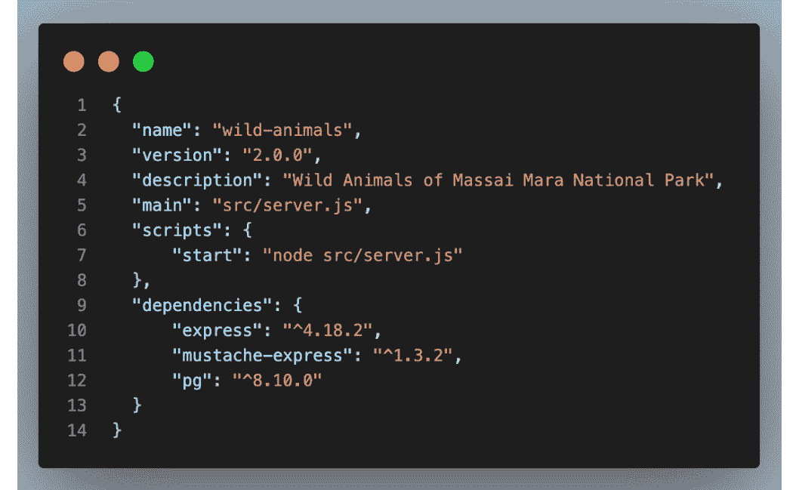

图 11.8 – 示例网页应用程序的 package.json 文件

注意

如果你不喜欢自己打字，总是可以从样例解决方案中下载文件：[`github.com/PacktPublishing/The-Ultimate-Docker-Container-Book/tree/main/sample-solutions/ch11/step2`](https://github.com/PacktPublishing/The-Ultimate-Docker-Container-Book/tree/main/sample-solutions/ch11/step2)。

1.  在`web`文件夹中创建一个名为`src`的文件夹。

1.  在`src`文件夹中添加一个名为`server.js`的文件，并添加以下内容：

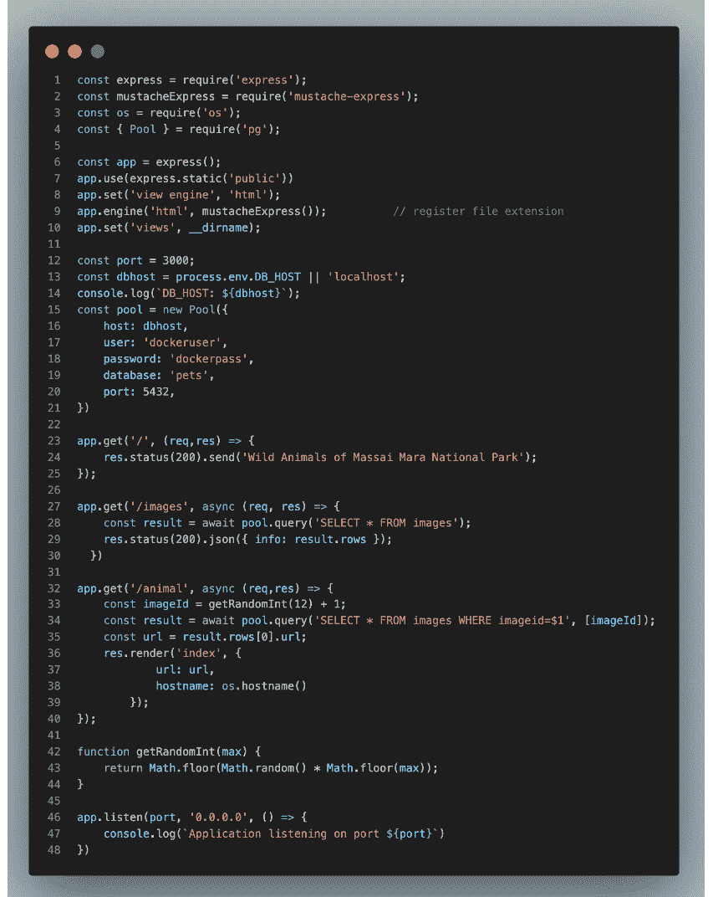

图 11.9 – 示例网页应用程序的 server.js 文件

这个文件包含了我们简单网页应用程序的完整逻辑。特别感兴趣的是第 32 至 40 行关于`/animal`端点的逻辑。还请注意，我们使用类型为`Pool`的常量`pool`连接到 PostgreSQL 数据库（第 15 至 21 行）。用户名、密码和数据库名称应与我们为数据库定义的相匹配。

1.  在`src`文件夹中添加另一个名为`index.xhtml`的文件，并添加以下内容：

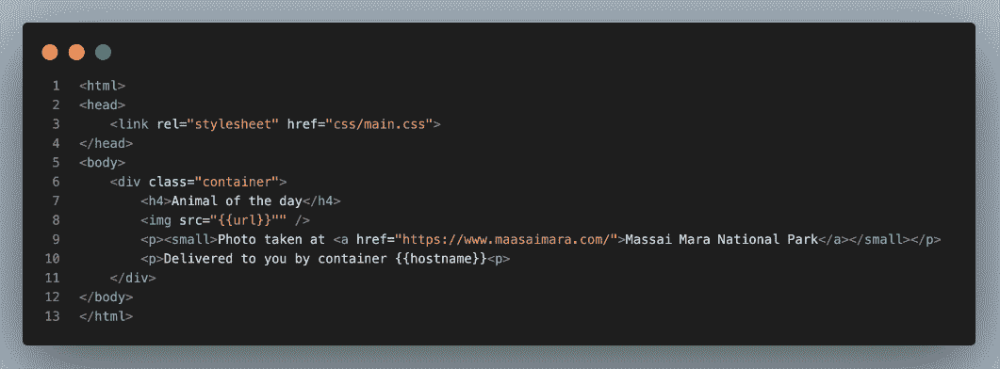

图 11.10 – 示例网页应用程序的 index.xhtml 文件

这个文件用作展示野生动物图片的模板。

1.  在`web`文件夹中添加一个名为`public/css`的文件夹：

    ```
    mkdir -p public/css
    ```

1.  在这个`public/css`文件夹中添加一个名为`main.css`的文件，我们将用它来为我们的示例网页应用程序添加样式。将以下内容添加到文件中：

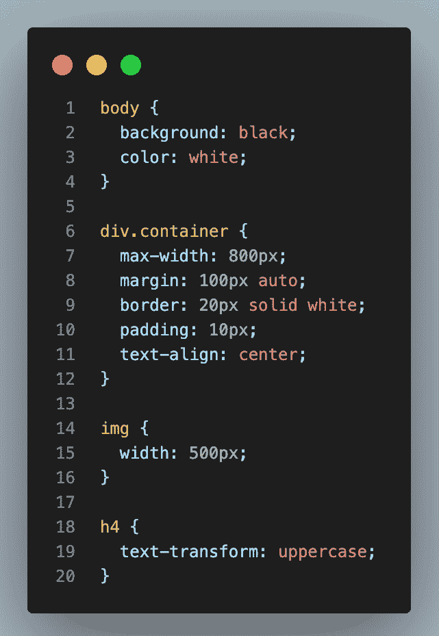

图 11.11 – 示例网页应用程序的 main.css 文件

1.  现在我们需要一些真实的图片来展示。最简单的方法是从 GitHub 复制我们的示例图片：

    1.  在`public`文件夹中创建一个名为`images`的文件夹。

    1.  然后，将所有图片下载到这个`images`文件夹中，你可以在这里找到：[`github.com/PacktPublishing/The-Ultimate-Docker-Container-Book/tree/main/sample-solutions/ch11/step2/web/public/images`](https://github.com/PacktPublishing/The-Ultimate-Docker-Container-Book/tree/main/sample-solutions/ch11/step2/web/public/images)。

1.  现在我们需要对从`step1`文件夹复制过来的`docker-compose.yml`文件进行小小的修改。在`step2`文件夹中找到`docker-compose.yml`文件，打开它，在第 4 行之后添加这个片段：

    ```
    ports:- 5432:5432
    ```

结果应该看起来像这样：

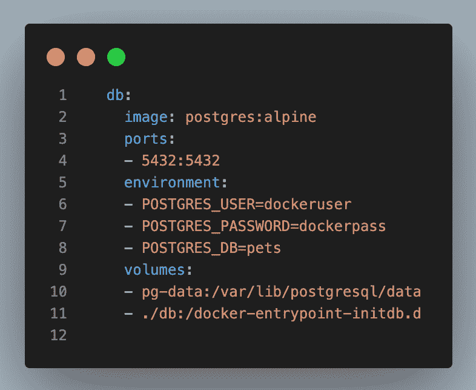

图 11.12 – 向 db 服务添加主机端口映射

这样，我们就可以从主机上运行的任何应用程序访问数据库。我们将在接下来的步骤中使用这个功能。

1.  现在，我们准备好运行并测试这个应用程序了：

    1.  使用 docker-compose 文件和以下命令运行数据库：

    ```
    $ docker compose up db --detach
    ```

    我们告诉 Docker Compose 仅启动 db 服务，并以 `detach` 模式运行，`--detach` 参数表示这一点。

    1.  导航到 `web` 文件夹：

    ```
    $ cd web
    ```

    1.  使用以下命令安装所有依赖：

    ```
    $ npm install
    ```

    1.  使用以下命令运行应用程序：

    ```
    $ npm run start
    ```

    你应该看到这个：

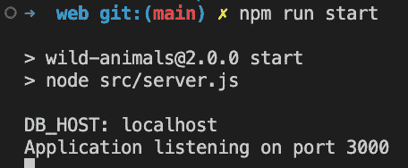

图 11.13 – 本地运行 web 应用程序

1.  打开浏览器标签并访问 [`localhost:3000/animal`](http://localhost:3000/animal)，你应该看到类似的内容：

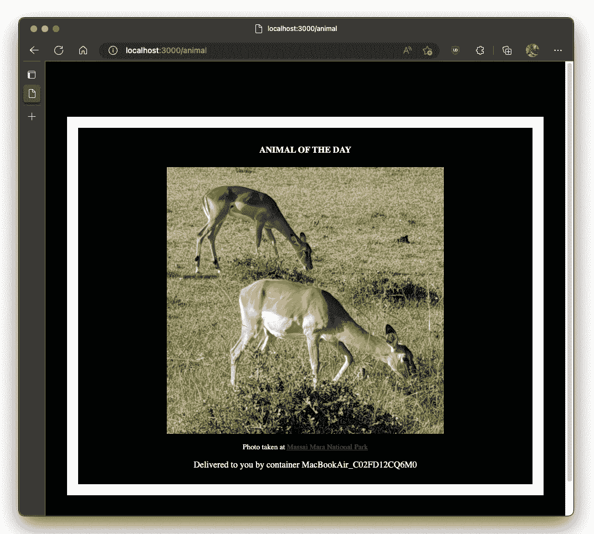

图 11.14 – Web 应用程序正在运行并显示一只野生动物

1.  刷新浏览器几次，注意每次都会显示一个新的随机动物。

1.  在你离开之前，确保停止 web 应用程序并使用 `docker` `compose down` 停止其他容器。

很棒，现在我们可以进入下一步，我们将 Docker 化 web 应用程序，并使用 Docker Compose 构建镜像：

1.  向 `web` 文件夹中添加一个名为 `Dockerfile` 的文件，并添加以下代码段：


图 11.15 – Web 应用程序的 Dockerfile

分析这个 Dockerfile，尝试理解它的具体作用。如有需要，请参考你在 *第四章* 中学到的内容，*创建和管理容器镜像*。

1.  打开 `step2` 文件夹中的 `docker-compose.yml` 文件，并在 `db` 和 `pgadmin` 服务之后、`volumes` 部分之前（即第 24 行之后）添加 `web` 服务的定义。要添加的代码段如下所示：

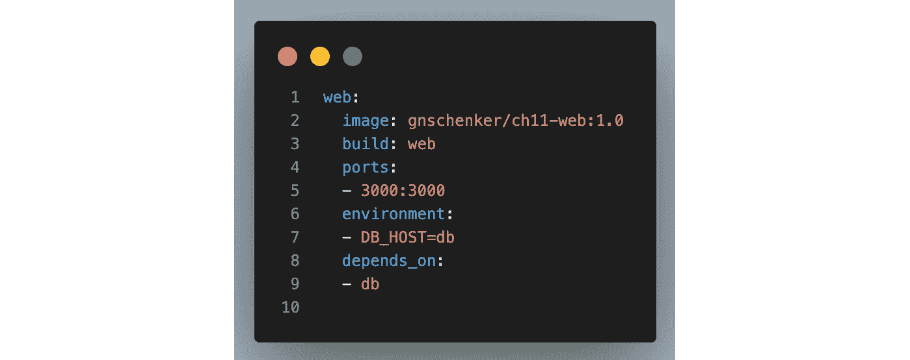

图 11.16 – 在 docker-compose.yml 文件中定义名为 web 的服务

确保在第 2 行，将 `gnschenker` 用户名替换为你自己的 Docker Hub 用户名。

1.  使用此命令构建镜像：

    ```
    $ docker compose build web
    ```

前面的命令假设你在 `step2` 文件夹中，并且该文件夹中有一个 `docker-compose.yml` 文件。

在构建镜像时，Docker 会查找并使用 `web` 文件夹中的 Dockerfile，如前面代码段第 3 行中的 `build: web` 指令所示。

使用 Docker Compose 构建镜像，使用以下指令：

1.  打开一个终端窗口。

1.  确保你在 `The-Ultimate-Docker-Container-Book` 文件夹的 `ch11/step2` 子文件夹中：

    ```
    $ cd ~/ The-Ultimate-Docker-Container-Book/ch11/step2
    ```

1.  然后，构建镜像：

    ```
    $ docker compose build
    ```

如果我们输入上述命令，工具会假定当前目录下必须有一个名为 `docker-compose.yml` 的文件，并会使用该文件来运行。在我们的案例中，确实如此，工具将构建镜像。

1.  观察终端窗口中的输出。你应该看到类似这样的内容：

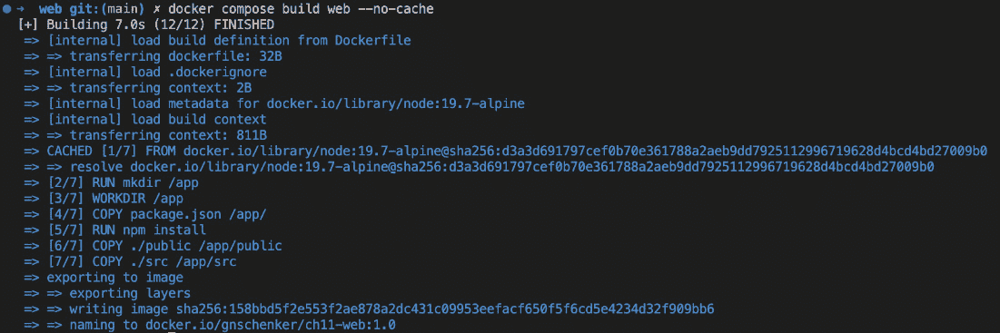

图 11.17 – 为 web 服务构建 Docker 镜像

在前面的截图中，你可以看到 docker-compose 首先从 Docker Hub 下载了基础镜像 `node:19.7-alpine`，这是我们为 `web` 镜像构建所用的镜像。随后，它使用位于 `web` 文件夹中的 Dockerfile 来构建镜像，并将其命名为 `gnschenker/ch11-web:2.0`。

在为 `web` 服务构建 Docker 镜像之后，我们已准备好使用 Docker Compose 来运行整个多服务应用程序。

# 使用 Docker Compose 运行应用程序

一旦我们构建了镜像，就可以使用 Docker Compose 启动应用程序：

```
$ docker compose up
```

输出内容与我们在上一节中讨论的 `db` 和 `pgadmin` 服务的输出类似，`web` 服务的输出如下：

```
step2-web-1      | DB_HOST: dbstep2-web-1      | Application listening on port 3000
```

这表明容器化的 `web` 服务已准备好，并正在监听端口 `3000`。巧合的是，我们在 `docker-compose.yml` 文件中已将容器端口 `3000` 映射到主机上的相同端口 `3000`。因此，我们只需打开一个新的浏览器标签页并导航到 URL [`localhost:3000/animal`](http://localhost:3000/animal)；我们应该再次看到一只野生动物展示出来。

刷新浏览器几次以查看其他动物图像。应用程序会从存储在数据库中的 12 张图像的 URL 集合中随机选择当前的图像。

由于应用程序正在以交互模式运行，因此我们运行 Docker Compose 的终端被阻塞，我们可以通过按 *Ctrl* + *C* 来取消应用程序。如果我们这样做，我们将看到以下内容：

```
^CGracefully stopping... (press Ctrl+C again to force)Aborting on container exit...
[+] Running 3/3
⠿ Container step2-pgadmin-1  Stopped                              1.4s
⠿ Container step2-web-1      Stopped                             10.2s
⠿ Container step2-db-1       Stopped                              0.1s
canceled
```

我们会注意到，`db` 和 `web` 服务会立即停止。然而，有时一些服务可能需要大约 10 秒钟才能停止。出现这种情况的原因是 `db` 和 `web` 服务会监听并响应 Docker 发送的 `SIGTERM` 信号，而其他服务则可能不会，因此 Docker 会在 10 秒的预定义超时间隔后强制终止它们。

如果我们再次使用 `docker compose up` 启动应用程序，启动速度将会更快，因为数据库不需要从头开始初始化，而是只重新使用之前运行时存储在 `pg-data` 卷中的数据。

我们也可以将应用程序在后台运行。所有容器将作为守护进程运行。为此，我们只需要使用 `-d` 参数，如下所示的代码：

```
$ docker compose up -d
```

Docker Compose 提供的命令远不止 `up`。我们还可以使用该工具列出作为应用程序一部分的所有服务：

```
$ docker compose ps
```

我们应该看到以下内容：

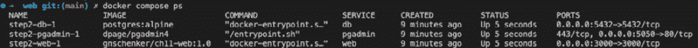

图 11.18 – docker compose ps 的输出

这个命令与 `docker container ls` 类似，唯一的区别是 docker-compose 只列出属于应用程序的容器或服务。

要停止并清理应用程序，我们使用 `docker compose` 的 `down` 命令：

```
$ docker compose down
```

这应该会输出类似于下面的内容：

```
⠿ Container step2-web-1      Removed                             10.2s⠿ Container step2-pgadmin-1  Removed                              0.9s
⠿ Container step2-db-1       Removed                              0.1s
⠿ Network step2_default      Removed                              0.1s
```

如果我们还想移除数据库的卷，可以使用以下命令：

```
$ docker volume rm step2_pd-data step2_pgadmin-data
```

或者，除了使用两个命令 `docker compose down` 和 `docker volume rm <volume name>`，我们可以将它们合并为一个命令：

```
$ docker compose down -v
```

这里，参数 `-v`（或 `--volumes`）移除 Docker Compose 文件 `volumes` 部分声明的命名卷和附加到容器的匿名卷。

为什么卷的名称中有一个 `step2` 前缀？在 `docker-compose.yml` 文件中，我们调用了 `pg-data` 和 `pgadmin-data` 作为要使用的卷。但正如我们之前提到的，Docker Compose 会在所有名称前加上 `docker-compose.yml` 文件所在父文件夹的名称，并加上下划线。在这个例子中，父文件夹名为 `step2`。如果你不喜欢这种方式，可以显式地定义项目名称，例如，像这样：

```
$ docker compose  --project-name demo up --detach
```

这样，所有资源（容器、网络和卷）将以项目名称为前缀，在本例中为 `demo`。

# 扩展服务

现在，让我们暂时假设我们的示例应用程序已经上线并且非常成功。很多人想查看我们可爱的动物图片。但现在我们面临一个问题：我们的应用程序开始变得缓慢。为了解决这个问题，我们希望运行多个 `web` 服务实例。使用 Docker Compose，这可以轻松实现。

运行更多实例也称为横向扩展。我们可以使用这个工具将 `web` 服务扩展到，例如，三实例：

```
$ docker compose up --scale web=3
```

如果我们这样做，会有一个惊喜等着我们。输出将会像下图所示：

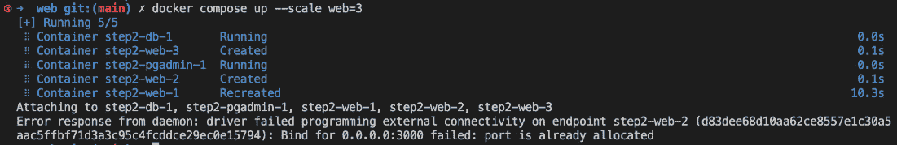

图 11.19 – docker-compose --scale 的输出

第二个和第三个 `web` 服务实例无法启动。错误信息告诉我们为什么不能多次使用相同的主机端口 `3000`。当实例 2 和 3 尝试启动时，Docker 发现端口 `3000` 已被第一个实例占用。我们该怎么办？嗯，我们可以让 Docker 自动选择每个实例使用的主机端口。

如果在 Docker Compose 文件的 `ports` 部分，我们只指定容器端口而省略主机端口，那么 Docker 会自动选择一个临时端口。我们就来做这个操作：

1.  首先，让我们拆除应用程序：

    ```
    $ docker compose down
    ```

1.  然后，我们修改 `docker-compose.yml` 文件。`web` 服务的端口映射原本是这样的：

    ```
    ports:- 3000:3000
    ```

我们将其更改为如下所示：

```
ports:– 3000
```

这样，Docker 将动态分配主机端口。

1.  现在，我们可以重新启动应用程序并立即扩展它：

    ```
    $ docker compose up -d$ docker compose up -d --scale web=3
    ```

我们应该看到如下内容：

```
[+] Running 5/5⠿ Container step2-pgadmin-1  Started                 0.3s
⠿ Container step2-db-1       Started                 0.3s
⠿ Container step2-web-1      Started                 0.6s
⠿ Container step2-web-3      Started                 0.8s
⠿ Container step2-web-2      Started                 1.0s
```

1.  如果我们现在执行`docker compose ps`，我们应该看到如下截图中的内容：

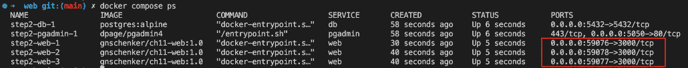

图 11.20 – docker compose ps 命令的输出

请注意，在你的情况下，主机端口可能与前面截图中显示的不同。那里，我们为三个`web`实例映射了端口`590076`、`59078`和`59077`。

1.  我们可以尝试检查那些端口映射是否有效，例如，使用`curl`。让我们测试第三个实例`step2_web-3`：

    ```
    $ curl -4 localhost:59077
    ```

我们应该看到如下内容：

```
Wild Animals of Massai Mara National Park%
```

答案告诉我们，实际上我们的应用程序仍然按预期工作。为确保正确，请对其他两个实例进行测试。

在接下来的章节中，我们将学习如何构建并随后将应用程序容器镜像推送到镜像仓库。

# 构建和推送应用程序

我们之前看到，我们也可以使用`docker-compose build`命令仅构建基础`docker-compose`文件中定义的应用程序镜像。但要使其生效，我们必须将构建信息添加到`docker-compose`文件中：

1.  打开一个新的浏览器窗口并导航到章节文件夹（`ch11`）：

    ```
    $ cd ~/The-Ultimate-Docker-Container-Book/ch11
    ```

1.  创建一个名为`step3`的子文件夹，并导航到该文件夹：

    ```
    $ mkdir step3 && cd step3
    ```

1.  将`docker-compose.yml`文件从`step2`文件夹复制到此新文件夹：

    ```
    $ cp ../step2/docker-compose.yml .
    ```

1.  打开复制的文件，请注意以下截图中第 3 行 web 服务的`build`键。该键的值指示 Docker 期望在何处找到 Dockerfile 来构建相应的镜像。

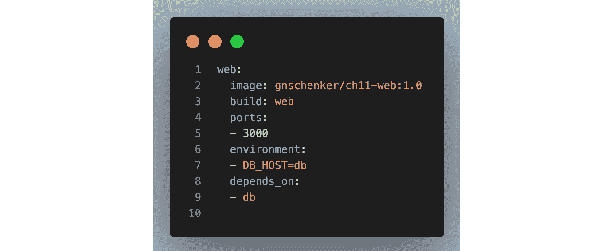

图 11.21 – docker-compose.yml 文件中 web 服务的 build 键

请注意第 8 和第 9 行中的`depends_on`部分。这指示 Docker Compose 确保`db`服务在`web`服务之前启动。

1.  如果我们想使用一个名称不同的 Dockerfile，例如`Dockerfile.dev`，用于`web`服务，那么`docker-compose`文件中的`build`块将如下所示：

    ```
    build:    context: web    dockerfile: Dockerfile.dev
    ```

    1.  将`step2`文件夹中的`web`和`db`文件夹及其内容复制到`step3`文件夹中：

    ```
    $ cp -r ../step2/web .$ cp -r ../step2/db .
    ```

    1.  在`web`文件夹中创建一个名为`Dockerfile.dev`的文件，它只是现有 Dockerfile 的副本：

    ```
    $ cp web/Dockerfile web/Dockerfile.dev
    ```

    1.  在`step3`文件夹中添加一个新文件`docker-compose.dev.yml`，它是`docker-compose.yml`文件的副本：

    ```
    $ cp ../step2/docker-compose.yml docker-compose.dev.yml
    ```

    1.  根据前面的代码片段修改`build`块。

1.  现在我们使用那个替代的`docker-compose.dev.yml`文件：

    ```
    $ docker-compose -f docker-compose.dev.yml build
    ```

`-f`参数将告诉 Docker Compose 应用程序使用哪个 Docker Compose 文件。

1.  要将所有镜像推送到 Docker Hub，我们可以使用`docker compose push`：

    1.  我们需要登录到 Docker Hub，才能使其成功；否则，在推送时会出现身份验证错误。因此，在我的情况下，我进行如下操作：

    ```
    $ docker login -u gnschenker -p <password>
    ```

    1.  假设登录成功，我就可以推送以下代码：

    ```
    $ docker-compose -f docker-compose.dev.yml push
    ```

根据您的互联网连接带宽，这可能需要一段时间。在推送过程中，您的屏幕可能会显示如下：

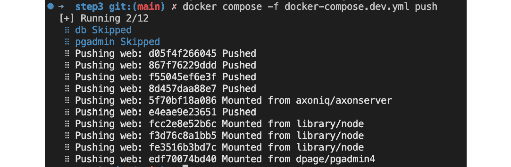

图 11.22 – 使用 docker-compose 将镜像推送到 Docker Hub

上述命令将 `web` 服务的 Docker 镜像推送到 Docker Hub 上的 `gnschenker` 账户。Docker Compose 文件中的另外两个服务 `db` 和 `pgadmin` 将被忽略。

注意

确保你使用的是自己的 Docker Hub 账户，而不是 `gnschenker`。

我们要讨论的 Docker Compose 的最后一个功能是覆盖设置。

# 使用 Docker Compose 覆盖设置

有时，我们需要在不同的环境中运行应用程序，这些环境需要特定的配置设置。Docker Compose 提供了一个便捷的功能来解决这个问题。

让我们通过一个具体的示例来说明：

1.  打开一个新的浏览器窗口，导航到本章的文件夹（`ch11`）：

    ```
    $ cd ~/The-Ultimate-Docker-Container-Book/ch11
    ```

1.  创建一个名为 `step4` 的子文件夹并进入该文件夹：

    ```
    $ mkdir step4 && cd step4
    ```

1.  将 `step2` 文件夹中的 `web` 和 `db` 文件夹及其内容复制到 `step4` 文件夹中：

    ```
    $ cp -r ../step2/web .$ cp -r ../step2/db .
    ```

1.  我们可以定义一个基础的 Docker Compose 文件，然后定义针对不同环境的覆盖设置。假设我们有一个名为 `dockercompose.base.yml` 的文件，其内容如下：

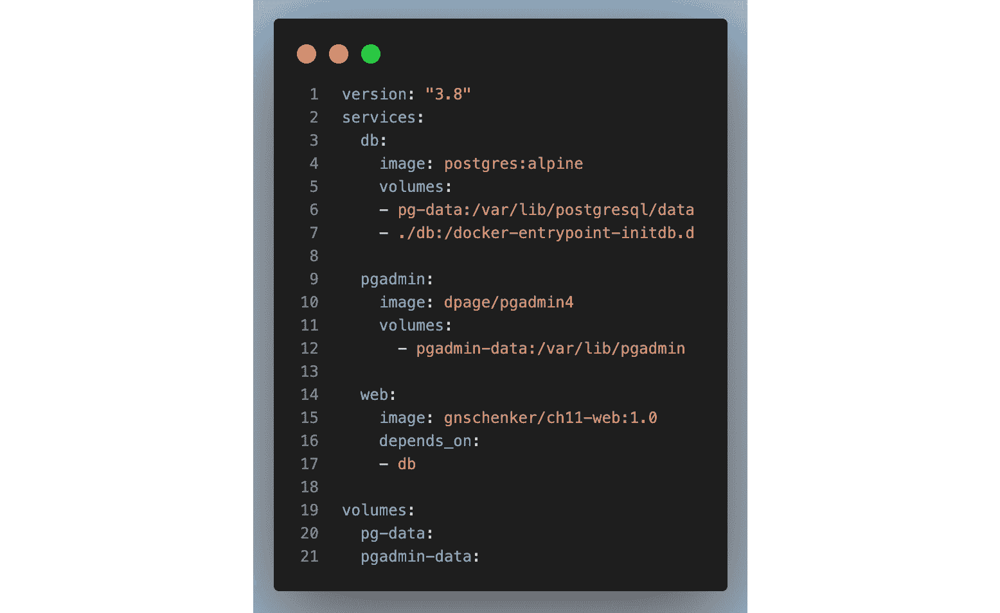

图 11.23 – 用作基础的 Docker Compose 文件

这仅定义了在所有环境中应该相同的部分。所有特定的设置都已被提取出来。

1.  现在假设我们要在 `docker-compose.ci.yml` 中运行该应用程序，并添加以下代码片段：

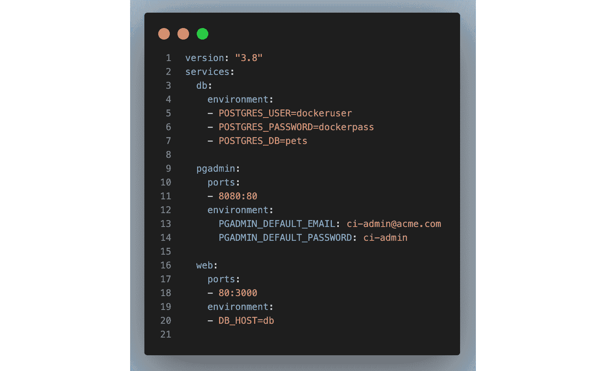

图 11.24 – 用于 CI 的 Docker Compose 文件

1.  我们可以使用以下命令运行该应用程序：

    ```
    $ docker compose -f docker-compose.base.yml \    -f docker-compose.ci.yml up \    -d --build
    ```

请注意，在第一个 `-f` 参数中，我们提供了基础的 Docker Compose 文件，而在第二个参数中，我们提供了覆盖文件。`--build` 参数指示 Docker Compose 在启动服务之前重新构建所有 Docker 镜像。

警告

使用环境变量时，请注意以下几点：

1) 在 Docker 文件中声明它们定义了一个默认值

2) 在 Docker Compose 文件中声明相同的变量会覆盖 Dockerfile 中的值

通过这一点，我们已经完成了关于 Docker Compose 的本章内容。但在结束之前，我们有一个小提示要给你。

提示

如果我们遵循标准命名约定，将基础文件命名为 `docker-compose.yml`，并将覆盖文件命名为 `docker-compose.override.yml`，那么我们就可以使用 `docker-compose up -d` 启动应用程序，而无需显式指定 Docker Compose 文件。在其他情况下，我们需要使用以下完整且更详细的语法：

`$ docker compose -f <基础 compose 文件> -f <覆盖 compose 文件> up`

# 总结

在本章中，我们介绍了 docker-compose 工具。该工具主要用于在单个 Docker 主机上运行和扩展多服务应用程序。通常，开发人员和 CI 服务器使用单一主机，而这两者是 Docker Compose 的主要用户。该工具使用 YAML 文件作为输入，文件以声明的方式描述应用程序。

该工具还可以用于构建和推送镜像，以及许多其他有用的任务。

在下一章中，我们将讨论为什么日志记录和监控非常重要，并展示如何收集容器日志并将其发送到一个中央位置，在那里可以解析聚合的日志以获取有用的信息。

你还将学习如何为应用程序添加监控功能，使其能够暴露度量数据，以及如何抓取这些度量数据并再次将其发送到中央位置。最后，你将学习如何将收集到的度量数据转换为图形化的仪表盘，用于监控容器化的应用程序。

# 进一步阅读

以下链接提供了本章讨论主题的更多信息：

+   *官方 YAML* *网站*: [`www.yaml.org/`](http://www.yaml.org/)

+   *Docker Compose* *文档*: [`dockr.ly/1FL2VQ6`](http://dockr.ly/1FL2VQ6)

+   *Docker Compose 文件版本 2* *参考资料*: [`docs.docker.com/compose/compose-file/compose-file-v2/`](https://docs.docker.com/compose/compose-file/compose-file-v2/)

+   *Docker Compose 文件版本 3* *参考资料*: [`docs.docker.com/compose/compose-file/compose-file-v3/`](https://docs.docker.com/compose/compose-file/compose-file-v3/)

+   *在文件和* *项目之间共享 Docker Compose 配置*: [`docs.docker.com/compose/extends/`](https://docs.docker.com/compose/extends/)

# 问题

为了评估你对 Docker Compose 的学习，请回答以下问题：

1.  Docker Compose 是什么，它的用途是什么？

1.  什么是 Docker Compose 文件，它可能包含哪些关键元素？

1.  如何使用 Docker Compose 启动和停止一个应用程序，并且一些关键的命令行选项有哪些？

1.  使用 Docker Compose 来管理多容器应用程序有什么一些好处？

1.  如何使用 docker-compose 以守护进程模式运行一个应用程序？

1.  如何使用 docker-compose 显示正在运行的服务的详细信息？

1.  如何将特定的 `web` 服务扩展到三实例？

# 答案

下面是一些 *第十一章* 问题的示例答案：

1.  Docker Compose 是一个用于定义和运行多容器 Docker 应用程序的工具。它允许你在一个 YAML 文件中定义构成应用程序的服务，然后通过一个命令来运行和管理这些服务。

1.  Docker Compose 文件是一个 YAML 文件，定义了构成 Docker 应用程序的服务，以及任何相关的配置选项。Docker Compose 文件可能包含的一些关键元素如下：

    +   `version`: 要使用的 Docker Compose 文件语法的版本。此字段是必需的。

    +   `services`: 应用程序所包含的服务列表，以及任何相关的配置选项。

    +   `ports`: 需要为相应服务打开并映射到相应容器端口的端口列表。

    +   `networks`: 需要为应用程序创建的任何自定义网络。请注意，服务可以同时连接到多个网络。

    +   `volumes`: 需要为应用程序创建的任何卷。

下面是一个使用多个网络的（缩短的）示例 `docker-compose.yml` 文件：

```
services:  web:
    image: <some image>
    network:
    - front
  accounting:
    image: <some other image>
    network:
    - front
    - back
  db:
    image: postgres:latest
    network:
    - back
networks:
  front:
  back:
```

1.  要使用 Docker Compose 启动应用程序，可以使用 `docker compose up` 命令。该命令读取 Docker Compose 文件，创建任何必要的容器，并启动服务。要停止应用程序，可以使用 `docker compose down` 命令。这些命令可以与以下关键命令行选项一起使用：

    +   `-d` 或 `--detach`: 在后台运行容器并打印新的容器名称。

    +   `-p` 或 `--project-name`: 指定替代项目名称。

    +   `--build`: 在启动容器之前构建镜像。

1.  使用 Docker Compose 管理多容器应用程序的一些好处包括以下内容：

    +   **简化部署过程**：Docker Compose 允许您在单个文件中定义应用程序的服务和配置，这可以简化部署过程，并使复杂应用程序的管理变得更加容易。

    +   **促进协作**：通过使用 Docker Compose 文件定义应用程序，开发人员可以轻松与他人共享其开发环境，并更有效地进行协作。

    +   **增强可移植性**：Docker Compose 允许您以便携方式定义应用程序的环境和依赖关系，这可以使应用程序在不同的环境和基础设施提供商之间更容易移动。

1.  要以守护程序（或 `detach`）模式运行应用程序服务，请使用以下命令：

    ```
    $ docker compose up --detach
    ```

1.  要显示 Docker Compose 应用程序中运行服务的详细信息，请使用以下命令：

    ```
    $ docker compose ps
    ```

1.  例如，要将 Docker Compose 应用程序的 `web` 服务扩展到三个实例，请使用以下命令：

    ```
    $ docker compose up web --scale 3
    ```
