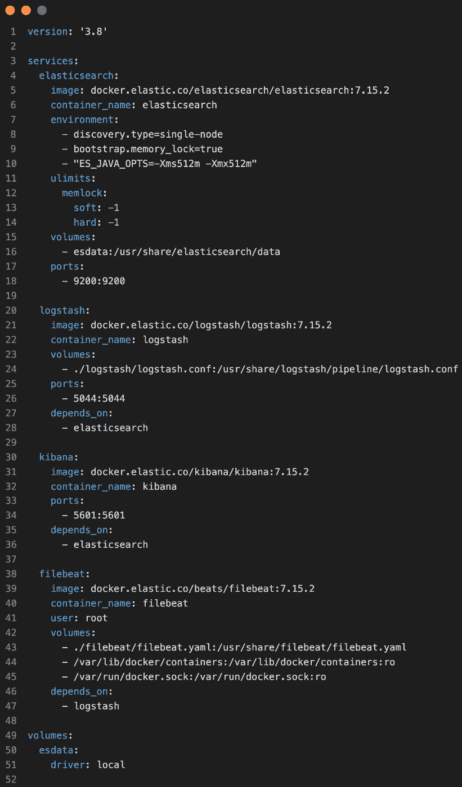
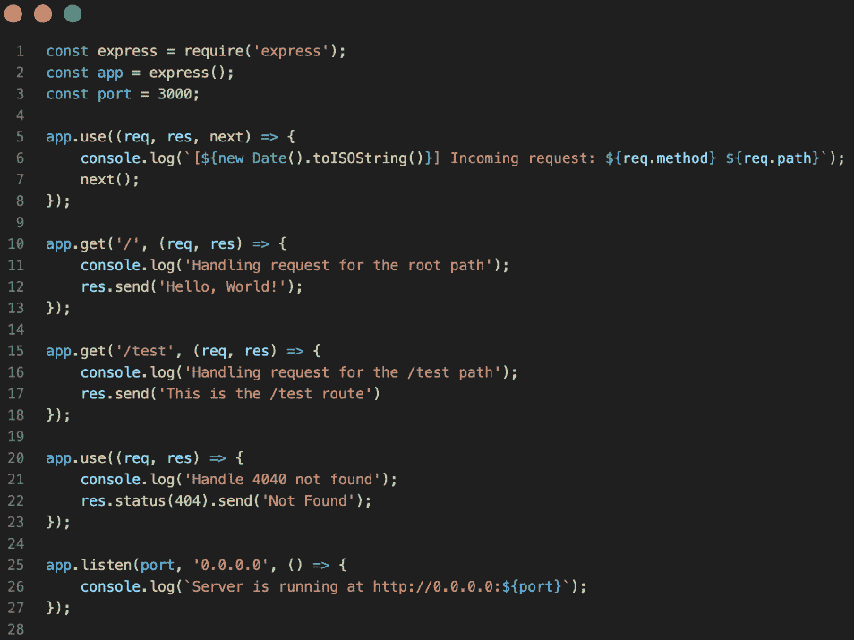
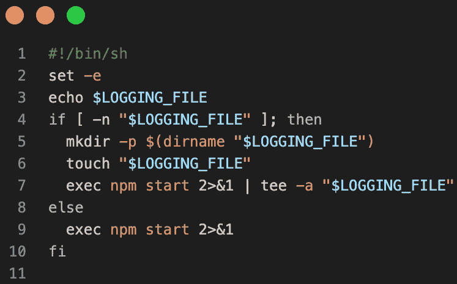
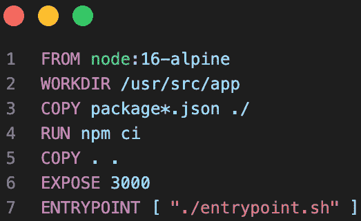
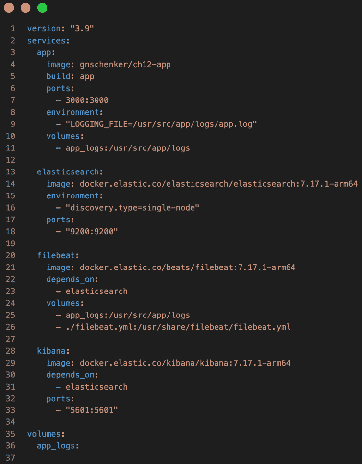
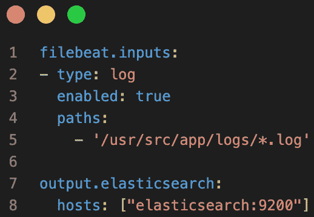
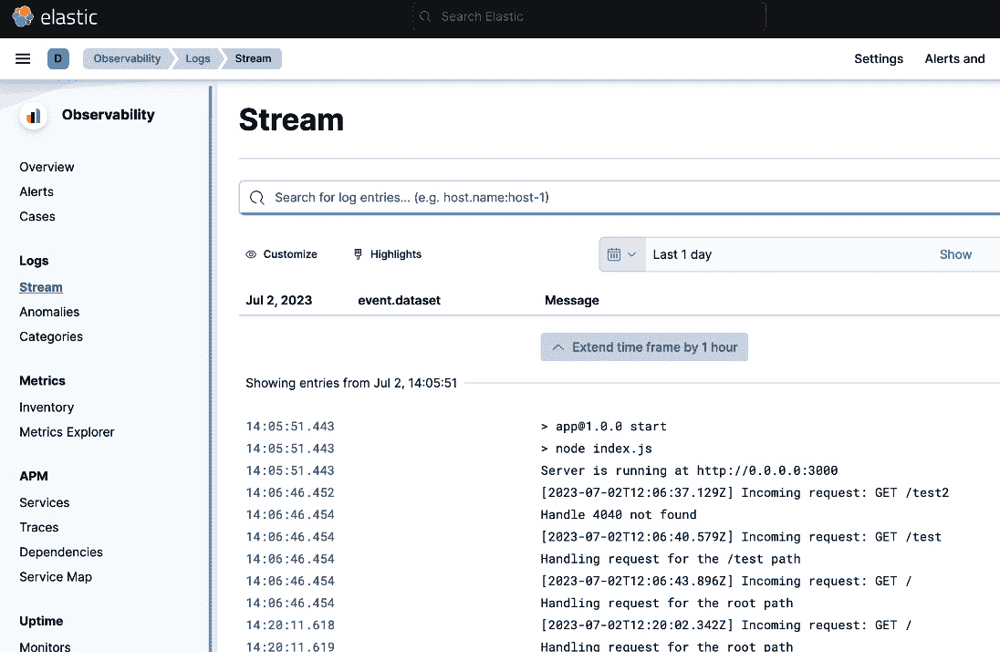
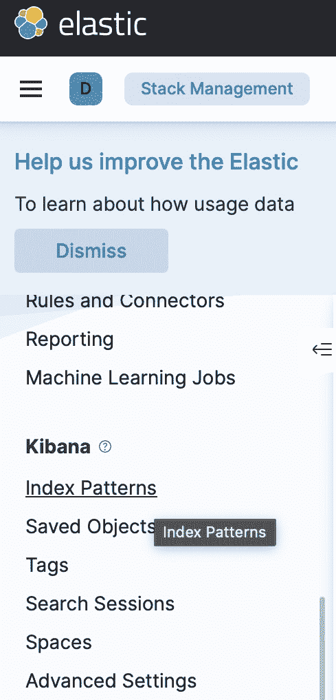
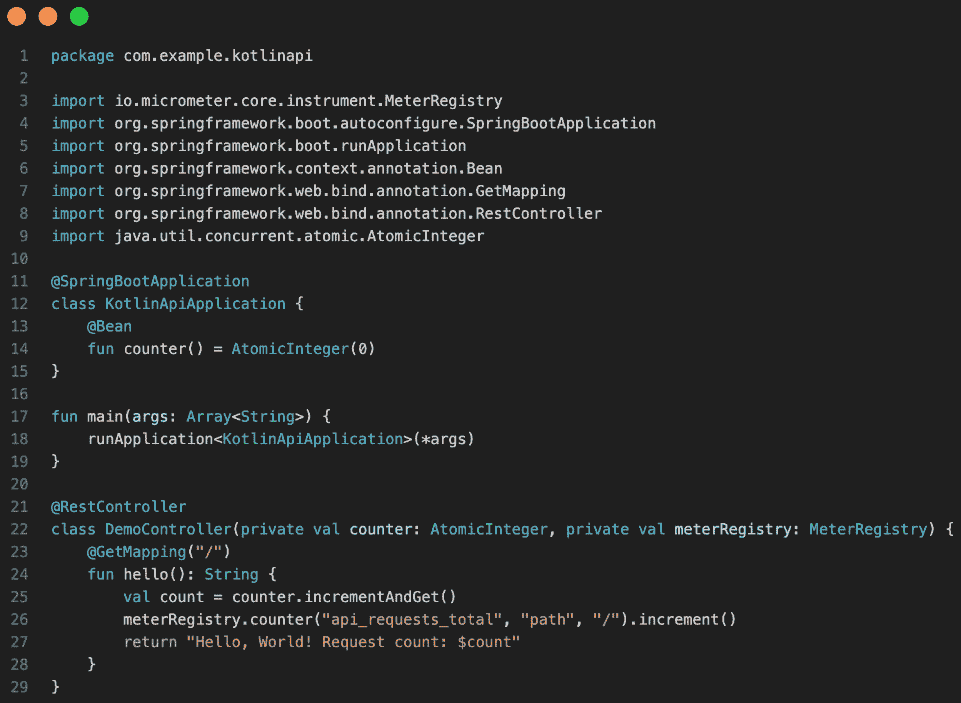
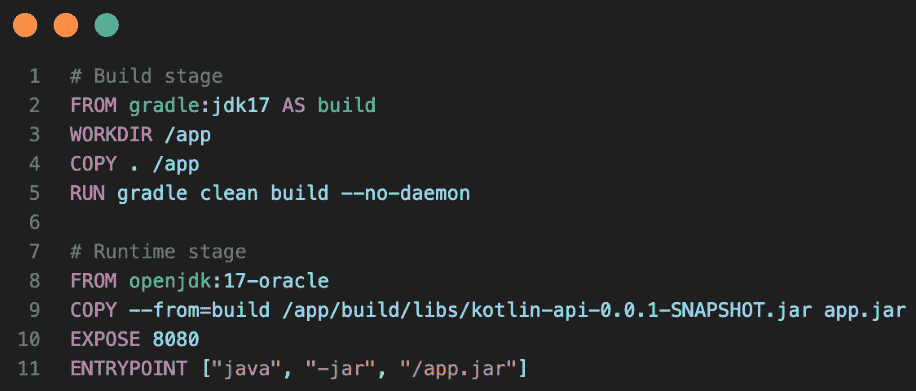

# 第十二章：12

# 发送日志和监控容器

在上一章中，我们介绍了 Docker Compose 工具。我们了解到，该工具主要用于在单一 Docker 主机上运行和扩展多服务应用。通常，开发人员和 CI 服务器使用单主机，它们是 Docker Compose 的主要用户。我们看到，该工具使用 YAML 文件作为输入，文件以声明式方式描述应用。我们探讨了该工具可用于的许多有用任务，例如构建和推送镜像，只是列举其中最重要的一些。

本章讨论了日志记录和监控为何如此重要，并展示了如何收集容器日志并将其发送到中央位置，在那里聚合的日志可以被解析以提取有用信息。

你还将学习如何为应用添加监控，使其暴露指标，以及如何抓取并再次将这些指标发送到中央位置。最后，你将学习如何将这些收集到的指标转换为图形仪表盘，用于监控容器化应用。

我们将使用 Filebeat 作为示例，从 Docker 将日志默认指向的`/var/lib/docker/containers`位置收集日志。在 Linux 上这非常简单。幸运的是，在生产环境或类似生产的系统中，我们通常会选择 Linux 作为操作系统。

在 Windows 或 Mac 机器上收集指标，较之 Linux 机器，稍微复杂一些。因此，我们将生成一个特殊的 Docker Compose 堆栈，包括 Filebeat，可以通过将标准日志输出重定向到一个文件，并将该文件的父文件夹映射到 Docker 卷来在 Mac 或 Windows 计算机上运行。这个卷随后会挂载到 Filebeat 上，Filebeat 再将日志转发到 Elasticsearch。

本章涵盖以下主题：

+   为什么日志记录和监控如此重要？

+   发送容器和 Docker 守护进程日志

+   查询集中日志

+   收集和抓取指标

+   监控容器化应用

阅读完本章后，你应该能够完成以下操作：

+   为你的容器定义日志驱动

+   安装代理以收集并发送容器和 Docker 守护进程日志

+   在聚合日志中执行简单的查询，找出有趣的信息

+   为你的应用服务添加监控，使其暴露基础设施和业务指标

+   将收集到的指标转换为仪表盘以监控你的容器

# 技术要求

本章相关的代码可以在[`github.com/PacktPublishing/The-Ultimate-Docker-Container-Book/tree/main/sample-solutions/ch12`](https://github.com/PacktPublishing/The-Ultimate-Docker-Container-Book/tree/main/sample-solutions/ch12)找到。

在我们开始之前，确保你已经准备好一个文件夹，用于存放你将在本章中实现的代码。

进入你克隆的代码库所在的文件夹，这个文件夹通常是位于你`home`文件夹中的`The-Ultimate-Docker-Container-Book`文件夹：

```
$ cd ~/The-Ultimate-Docker-Container-Book
```

创建一个名为`ch12`的子文件夹并进入该文件夹：

```
$ mkdir ch12 && cd ch12
```

不再多说，让我们深入探讨第一个话题：集装箱和守护进程日志。

# 为什么日志记录和监控很重要？

在处理生产环境或任何类似生产环境的分布式关键任务应用程序时，获取尽可能多的应用内部运行状况的洞察是至关重要的。你是否有机会调查过飞机的驾驶舱或核电站的指挥中心？飞机和电厂都是高度复杂的系统，提供关键任务服务。如果飞机坠毁或电厂意外停运，至少可以说会有很多人受到负面影响。因此，驾驶舱和指挥中心充满了仪器，显示着系统某些部分的当前状态或过去的状态。你在这里看到的，是一些放置在系统关键部分的传感器的视觉表现，这些传感器不断地收集诸如温度或流量等数据。

类似于飞机或电厂，我们的应用程序需要配备“传感器”，这些传感器能够感知我们应用服务或其运行基础设施的“温度”。我将“温度”一词加上了引号，因为它只是一个占位符，代表应用中真正重要的事物，比如某个 RESTful 接口每秒的请求数，或是对同一接口的请求的平均延迟。

我们收集到的结果值或读数，比如请求的平均延迟，通常被称为**指标**。我们的目标应该是暴露尽可能多的应用服务的有意义的指标。指标可以是功能性指标或非功能性指标。功能性指标是与应用服务的业务相关的值，例如，如果服务是电子商务应用的一部分，则每分钟的结账次数，或者如果我们谈论的是流媒体应用，则过去 24 小时内最受欢迎的 5 首歌曲。

非功能性指标是一些重要的值，这些值与应用程序用于的业务类型无关，例如某个特定 Web 请求的平均延迟、某个接口每分钟返回的 4xx 状态码数量，或者某个服务消耗的 RAM 或 CPU 周期数。

在一个分布式系统中，每个部分都暴露着指标，应该有一个总服务定期收集并聚合来自各个组件的值。或者，每个组件应该将其指标转发到一个中央指标服务器。只有当我们高度分布式系统中所有组件的指标可以在一个中央位置进行检查时，它们才有价值。否则，监控系统就变得不可能。这就像飞机驾驶员在飞行过程中不需要亲自检查飞机的每个重要部件一样；所有必要的读数都会收集并显示在驾驶舱中。

今天，最流行的服务之一是**Prometheus**，它用于暴露、收集和存储指标。它是一个开源项目，并已捐赠给**云原生计算基金会**（**CNCF**）。Prometheus 与 Docker 容器、Kubernetes 以及许多其他系统和编程平台具有一流的集成。在本章中，我们将使用 Prometheus 演示如何为一个简单的服务添加指标暴露功能。

在下一节中，我们将向您展示如何将容器和 Docker 守护进程日志发送到一个中央位置。

# 发送容器和 Docker 守护进程日志

在容器化的世界中，了解 Docker 环境生成的日志对于保持系统健康和正常运行至关重要。本节将概述您将遇到的两种关键日志类型：发送的**容器日志**和**Docker** **守护进程日志**。

## 发送容器日志

当应用程序在容器中运行时，它们会生成日志信息，这些信息提供了有关其性能和潜在问题的宝贵洞察。

可以使用`docker logs`命令来访问容器日志，后面跟上容器的 ID 或名称。这些日志可以帮助开发人员和系统管理员诊断问题、监控容器活动，并确保已部署应用程序的顺利运行。集中管理和分析容器日志对于优化资源使用、识别性能瓶颈以及排除应用程序问题至关重要。

管理运输容器日志的一些最佳实践包括以下内容：

+   配置日志轮换和保留策略以防止过度使用磁盘空间

+   使用日志管理系统将多个容器的日志集中管理

+   设置日志过滤和警报机制，以识别关键事件和异常

让我们详细了解这些建议，从日志轮换和保留策略开始。

### 配置日志轮换和保留策略

配置容器日志的日志轮换和保留策略对于防止过度使用磁盘空间并保持最佳性能非常重要。以下是如何为 Docker 容器日志设置这些策略的逐步指南。

#### 配置日志驱动程序

Docker 支持多种日志驱动程序，如 `json-file`、`syslog`、`journald` 等。要配置日志驱动程序，你可以选择全局设置整个 Docker 守护进程的日志驱动程序，或者为每个容器单独设置。在此示例中，我们将使用 `json-file` 日志驱动程序，这是 Docker 的默认驱动程序。

#### 全局设置日志驱动程序

要全局设置日志驱动程序，请编辑 `/etc/docker/daemon.json` 配置文件（如果文件不存在，则创建它），并执行以下操作：

1.  打开 Docker Desktop 的仪表板并导航至 **设置**，然后选择 **Docker 引擎**。你应该看到类似于以下内容的界面：


图 12.1 – Docker 守护进程配置

1.  分析现有的配置，并在其中添加以下键值对（如果尚未存在）：

    ```
    "log-driver": "json-file"
    ```

这里，（简化后的）结果将如下所示：

```
{  ...
  "experimental": true,
  "features": {
    "buildkit": true
  },
  "metrics-addr": "127.0.0.1:9323",
  "log-driver": "json-file"
}
```

1.  重新启动 Docker 守护进程以应用更改。

#### 本地设置日志驱动程序

如果你更倾向于为单个容器设置日志驱动程序而不是全局设置，请在启动容器时使用 `--log-driver` 选项：

```
docker run --log-driver=json-file <image_name>
```

现在，让我们学习如何指定日志轮换和保留策略。

#### 设置日志轮换和保留策略

我们可以通过为日志驱动程序指定 `max-size` 和 `max-file` 选项来配置日志轮换和保留策略：

+   `max-size`：此选项限制每个日志文件的大小。当日志文件达到指定大小时，Docker 会创建一个新文件并开始记录。例如，要将每个日志文件限制为 10 MB，设置 `max-size=10m`。

+   `max-file`：此选项限制要保留的日志文件数量。当达到限制时，Docker 会删除最旧的日志文件。例如，要只保留最近的五个日志文件，设置 `max-file=5`。

要全局设置这些选项，请将它们添加到 `/etc/docker/daemon.json` 配置文件中。我们可以在之前添加的 `log-driver` 节点后面添加 `log-opts` 部分：

```
{  ...
  "log-driver": "json-file",
  "log-opts": {
    "max-size": "10m",
    "max-file": "5"
  }
}
```

我们建议你通过 Docker Desktop 的仪表板再次修改守护进程配置。修改配置后，请重新启动 Docker 守护进程以应用更改。

要为单个容器设置这些选项，请在启动容器时使用 `--log-opt` 选项：

```
docker run --log-driver=json-file \    --log-opt max-size=10m \
    --log-opt max-file=5 \
    <image_name>
```

通过配置日志轮换和保留策略，你可以防止磁盘空间的过度使用，并保持 Docker 环境的正常运行。记得根据你的具体使用情况和存储容量选择合适的 `max-size` 和 `max-file` 值。

### 使用日志管理系统

使用日志管理系统将多个容器的日志集中管理，对于在 Docker 环境中进行高效监控和故障排除至关重要。这使得你可以将所有容器的日志集中分析，找出模式或问题。在本章中，我们将使用**Elasticsearch, Logstash 和 Kibana**（**ELK**）Stack 作为示例日志管理系统。

ELK Stack

ELK Stack，也称为 Elastic Stack，是一组开源软件产品，旨在促进大规模数据的摄取、存储、处理、搜索和可视化。

ELK 是 Elasticsearch、Logstash 和 Kibana 的缩写，它们是该堆栈的主要组件。

**Elasticsearch**：Elasticsearch 是一个分布式的、基于 REST 的搜索和分析引擎，建立在 Apache Lucene 之上。它提供了一个可扩展的、近实时的搜索平台，具备强大的全文搜索功能，同时支持聚合和分析。Elasticsearch 通常用于日志和事件数据分析、应用程序搜索，以及各种需要高性能搜索和索引功能的用例。

**Logstash**：Logstash 是一个灵活的服务器端数据处理管道，能够摄取、处理并将数据转发到多个输出，包括 Elasticsearch。Logstash 支持多种输入源，如日志文件、数据库和消息队列，并可以在转发数据前使用过滤器进行转换和增强。Logstash 通常用于收集和规范化来自不同源的日志和事件，使得在 Elasticsearch 中分析和可视化数据更加容易。

**Kibana**：Kibana 是一个基于 Web 的数据可视化和探索工具，提供了与 Elasticsearch 数据交互的用户界面。Kibana 提供多种可视化类型，如柱状图、折线图、饼图和地图，并支持创建自定义仪表板来展示和分析数据。Kibana 还包括 Dev Tools 用于 Elasticsearch 查询测试、监控和警报功能，并支持机器学习集成。

请注意，以下描述适用于 Linux 系统。如果你恰好是那些在开发机器上原生运行 Linux 的幸运人之一，那就直接开始*第 1 步 – 在 Linux 上设置 ELK Stack*吧。

如果你使用的是 Mac 或 Windows 机器进行工作，我们已经创建了详细的步骤说明，教你如何测试设置。特别需要注意的是*第 2 步 – 安装和配置 Filebeat*。请查看与你的设置相匹配的部分并尝试一下。

#### 第 1 步 – 在 Linux 上设置 ELK Stack

使用 Docker 容器部署 ELK，或将其直接安装在你的系统上。详细的安装说明，请参考官方的 ELK Stack 文档：[`www.elastic.co/guide/index.xhtml`](https://www.elastic.co/guide/index.xhtml)。

确保 Elasticsearch 和 Kibana 配置正确并正在运行。通过使用 web 浏览器访问 Kibana 仪表板来验证这一点。

#### 步骤 2 – 安装并配置 Filebeat

Filebeat 是一个轻量级的日志传输工具，可以将日志从 Docker 容器转发到 ELK Stack。你可以在 Docker 主机上安装 Filebeat，并配置它以收集容器日志：

1.  使用官方安装指南安装 Filebeat，针对你的操作系统进行安装。你可以在这里找到相关文档：[`www.elastic.co/guide/en/beats/filebeat/current/filebeat-installation-configuration.xhtml`](https://www.elastic.co/guide/en/beats/filebeat/current/filebeat-installation-configuration.xhtml)。

1.  通过编辑 `filebeat.yml` 配置文件来配置 Filebeat（通常位于 Linux 系统的 `/etc/filebeat` 中）。添加以下配置以收集 Docker 容器日志：

    ```
    filebeat.inputs:- type: container  paths:    - '/var/lib/docker/containers/*/*.log'
    ```

1.  配置输出将日志转发到 Elasticsearch。将 `<elasticsearch_host>` 和 `<elasticsearch_port>` 替换为适当的值：

    ```
    output.elasticsearch:  hosts: ["<elasticsearch_host>:<elasticsearch_port>"]
    ```

1.  保存配置文件并启动 Filebeat：

    ```
    $  sudo systemctl enable filebeat$  sudo systemctl start filebeat
    ```

请注意，这种配置仅适用于 Linux 系统。在 Mac 或 Windows 上，由于 Docker 在两个系统上都运行在虚拟机中，因此访问这个虚拟机中的 Docker 日志稍微复杂一些。如果你希望在 Mac 或 Windows 机器上本地安装 Filebeat，请查阅相关文档，因为这超出了本书的范围。

或者，我们可以将 Filebeat 运行在容器中，与 ELK Stack 并行使用。

这是一个完整的 Docker Compose 文件，将在 Linux 计算机上运行 ELK Stack 和 Filebeat：



图 12.2 – ELK Stack 和 Filebeat 的 Docker Compose 文件

现在我们已经学习了如何在 Linux 计算机或服务器上运行 Filebeat，接下来我们想展示如何在 Mac 或 Windows 计算机上使用 Filebeat，这在开发过程中非常重要。

#### 在 Mac 或 Windows 计算机上运行示例

上面的示例无法在 Mac 或 Windows 计算机上运行，因为 Docker 是透明地运行在虚拟机中，因此 Docker 日志文件将无法在 `/var/lib/docker/containers` 中找到。

我们可以通过一种变通方法来解决这个问题：我们可以配置所有容器将各自的日志写入一个属于 Docker 卷的文件中。然后，我们可以将这个卷挂载到 Filebeat 容器中，而不是在前面的 Docker Compose 文件的第 44 行做的那样。

这是一个示例，使用一个简单的 Node.js/Express.js 应用程序来演示这个过程。请按照以下步骤操作：

1.  在 `ch12` 章节文件夹中创建一个名为 `mac-or-windows` 的文件夹。

1.  在这个文件夹内，创建一个名为 `app` 的子文件夹，并进入该文件夹。

1.  在 `app` 文件夹内，使用以下命令初始化 Node.js 应用程序：

    ```
    $ npm init
    ```

接受所有默认设置。

1.  使用以下命令安装 Express.js：

    ```
    $ npm install --save express
    ```

1.  修改 `package.json` 文件，并添加一个名为 `start` 的脚本，值设置为 `node index.js`。

1.  向文件夹中添加一个名为 `index.js` 的文件，内容如下：



图 12.3 – index.js 应用文件

这个简单的 Express.js 应用程序有两个路由，`/` 和 `/test`。它还包含中间件，用于记录传入的请求，并在处理特定路由或出现 `404 Not` `Found` 错误时记录日志。

1.  向文件夹中添加一个名为 `entrypoint.sh` 的脚本文件，内容如下：



图 12.4 – 示例应用的 entrypoint.sh 文件

该脚本将用于运行我们的示例应用程序，并将其日志重定向到指定的 `LOGGING_FILE`。

使用以下命令将前面的文件设为可执行文件：

```
$ chmod +x ./entrypoint.sh
```

1.  向文件夹中添加一个 Dockerfile，内容如下：



图 12.5 – 示例应用的 Dockerfile

1.  向 `mac-or-windows` 文件夹中添加一个名为 `docker-compose.yml` 的文件，内容如下：



图 12.6 – Mac 或 Windows 使用场景的 Docker Compose 文件

请注意第 9 行中的环境变量，它定义了由 Node.js/Express.js 应用生成的日志文件的名称和位置。还请注意第 11 行中的卷映射，这将确保日志文件被导入到 Docker 的 `app_logs` 卷中。然后，这个卷会挂载到第 25 行的 `filebeat` 容器中。通过这种方式，我们确保 Filebeat 能够收集日志并将其转发到 Kibana。

1.  此外，向 `mac-or-windows` 文件夹中添加一个名为 `filebeat.yml` 的文件，包含以下 Filebeat 配置：



图 12.7 – Mac 或 Windows 上的 Filebeat 配置

1.  在 `docker-compose.yml` 文件所在的文件夹内，使用以下命令构建 Node.js 应用镜像：

    ```
    $ docker compose build app
    ```

1.  现在，你已经准备好运行整个栈了，像这样：

    ```
    $ docker compose up --detach
    ```

1.  使用 REST 客户端访问 `http://localhost:3000` 和 `http://localhost:3000/test` 端点几次，以使应用生成一些日志输出。

现在，我们准备好在 Kibana 中集中查看收集到的日志了。

#### 第 3 步 – 在 Kibana 中可视化日志

通过 Web 浏览器访问 Kibana 仪表板，网址为 `http://localhost:5601`。

如需更多详细信息，请参阅本章后面关于 *查询集中日志* 部分的内容。这里是一个简要概述。

进入 `filebeat-*`）开始分析收集到的日志。

进入 **Discover** 部分，搜索、筛选并可视化来自 Docker 容器的日志。

配置好 Kibana 仪表板后，你应该会看到如下内容：



图 12.8 – 由 Filebeat 提供的 Kibana 中的应用日志

按照这些步骤，你将拥有一个集中式日志管理系统，能够汇总来自多个 Docker 容器的日志，帮助你高效地分析和监控容器化应用程序。需要注意的是，还有其他日志管理系统和日志传输工具，如 Splunk、Graylog 和 Fluentd，设置这些系统的过程类似，但可能需要不同的配置步骤。

### 设置日志过滤和警报机制

设置日志过滤和警报机制有助于你集中精力处理重要的日志信息，减少噪音，并主动响应潜在问题。在这里，我们将使用 ELK Stack 配合 ElastAlert 插件来演示日志过滤和警报。

#### 第 1 步 – 设置 Elastic Stack

首先，按照 *设置 ELK Stack* 部分提供的说明，设置 Elastic Stack 进行集中式日志记录。这包括在 Docker 容器中运行 Elasticsearch、Logstash 和 Kibana。

#### 第 2 步 – 使用 Logstash 设置日志过滤

配置 Logstash 根据特定条件（如日志级别、关键词或模式）过滤日志。更新你的 `logstash.conf` 文件，在 `filter` 部分添加适当的过滤器。例如，要根据日志级别过滤日志，你可以使用以下配置：

```
filter {  if [loglevel] == "ERROR" {
    mutate {
      add_tag => ["error"]
    }
  }
}
```

此配置检查日志级别是否为 `ERROR`，并将 `error` 标签添加到日志事件中。重启 Logstash 容器以应用新配置：

```
docker restart logstash
```

#### 第 3 步 – 配置 ElastAlert 以进行警报

ElastAlert 是一个简单的框架，用于警报在 Elasticsearch 存储的数据中发现的异常、峰值或其他感兴趣的模式。让我们来设置它：

1.  克隆 ElastAlert 仓库并导航到 ElastAlert 目录：

    ```
    git clone https://github.com/Yelp/elastalert.gitcd elastalert
    ```

1.  安装 ElastAlert：

    ```
    pip install elastalert
    ```

1.  为 ElastAlert 创建一个配置文件 `config.yaml`，并使用以下内容更新它：

    ```
    es_host: host.docker.internales_port: 9200rules_folder: rulesrun_every:  minutes: 1buffer_time:  minutes: 15alert_time_limit:  days: 2
    ```

1.  创建一个 `rules` 目录，并定义你的警报规则。例如，要为带有 `error` 标签的日志创建警报，可以在 `rules` 目录中创建一个名为 `error_logs.yaml` 的文件，内容如下：

    ```
    name: Error Logsindex: logstash-*type: frequencynum_events: 1timeframe:  minutes: 1filter:- term:    tags: "error"alert:- "email"email:- "you@example.com"
    ```

这个规则会在 1 分钟内，如果至少有一个带有 `error` 标签的日志事件，触发邮件警报。

1.  启动 ElastAlert：

    ```
    elastalert --config config.yaml --verbose
    ```

现在，ElastAlert 将根据你定义的规则监控 Elasticsearch 数据，并在满足条件时发送警报。

#### 第 4 步 – 监控和响应警报

配置好日志过滤和警报机制后，你可以集中精力处理关键日志信息，并主动响应潜在问题。监控你的电子邮件或其他配置的通知渠道，接收警报并调查根本原因，以提高应用程序的可靠性和性能。

不断完善你的 Logstash 过滤器和 ElastAlert 规则，以减少噪音，检测重要的日志模式，并更有效地响应潜在问题。

在下一节中，我们将讨论如何传输 Docker 守护进程日志。

## 传输 Docker 守护进程日志

Docker 守护进程日志涉及 Docker 平台的整体功能。Docker 守护进程负责管理所有 Docker 容器，其日志记录了系统范围的事件和消息。这些日志有助于识别与 Docker 守护进程本身相关的问题，如网络问题、资源分配错误和容器编排挑战。

根据操作系统的不同，Docker 守护进程日志的位置和配置可能有所不同。例如，在 Linux 系统上，守护进程日志通常位于`/var/log/docker.log`，而在 Windows 系统上，它们位于`%programdata%\docker\logs\daemon.log`。

注意

Mac 上的守护进程日志将在下一节中介绍。

要有效管理 Docker 守护进程日志，可以考虑以下最佳实践：

+   定期查看守护进程日志，以识别潜在问题和异常

+   设置日志轮换和保留策略以管理磁盘空间使用

+   使用日志管理系统集中管理并分析日志，以更好地查看整体 Docker 环境。

总之，运输容器和 Docker 守护进程日志在监控和维护健康的 Docker 环境中起着至关重要的作用。通过有效地管理这些日志，系统管理员和开发人员可以确保最佳性能，最小化停机时间，并及时解决问题。

### Mac 上的 Docker 守护进程日志

在安装了 Docker Desktop 的 Mac 上，你可以使用 macOS 日志工具提供的`log stream`命令查看 Docker 守护进程日志。按照以下步骤操作：

1.  打开终端应用程序。

1.  运行以下命令：

    ```
    log stream --predicate 'senderImagePath CONTAINS "Docker"'
    ```

该命令将显示与 Docker Desktop 相关的日志的实时流，包括 Docker 守护进程日志。你可以通过按*Ctrl* + *C*来停止日志流。

1.  或者，你可以使用以下命令以文件格式查看 Docker 守护进程日志：

    ```
    log show --predicate 'senderImagePath CONTAINS "Docker"' \    --style syslog --info \    --last 1d > docker_daemon_logs.log
    ```

该命令将在当前目录创建一个名为`docker_daemon_logs.log`的文件，文件包含过去 1 天的 Docker 守护进程日志。你可以更改`--last 1d`选项来指定不同的时间范围（例如，`--last 2h`表示过去 2 小时）。使用任何文本编辑器打开`docker_daemon_logs.log`文件以查看日志。

请注意，执行这些命令可能需要管理员权限。如果遇到权限问题，请在命令前加上`sudo`。

### Windows 计算机上的 Docker 守护进程日志

在安装了 Docker Desktop 的 Windows 11 机器上，Docker 守护进程日志以文本文件的形式存储。你可以通过以下步骤访问这些日志：

1.  打开文件资源管理器。

1.  导航到以下目录：

    ```
    C:\ProgramData\DockerDesktop\service
    ```

在该目录中，你将找到包含 Docker 守护进程日志的`DockerDesktopVM.log`文件。

1.  使用任何文本编辑器打开`DockerDesktopVM.log`文件以查看日志。

请注意，`C:\ProgramData`文件夹可能默认是隐藏的。要在文件资源管理器中显示隐藏的文件夹，请点击**查看**选项卡并勾选**隐藏的项目**复选框。

另外，您可以使用 PowerShell 阅读日志：

1.  打开 PowerShell。

1.  执行以下命令：

    ```
    Get-Content -Path "C:\ProgramData\DockerDesktop\service\DockerDesktopVM.log" -Tail 50
    ```

此命令将显示 Docker 守护进程日志文件的最后 50 行。您可以更改`-Tail`后的数字来显示不同数量的行。

接下来，我们将学习如何查询集中式日志。

# 查询集中式日志

一旦您的容器化应用程序日志被收集并存储在 ELK Stack 中，您就可以使用 Elasticsearch 的查询**领域特定语言**（**DSL**）查询集中式日志，并在 Kibana 中可视化结果。

## 第 1 步 - 访问 Kibana

Kibana 提供了一个用户友好的界面来查询和可视化 Elasticsearch 数据。在提供的 `docker-compose.yml` 文件中，Kibana 可以通过端口 `5601` 进行访问。打开您的浏览器并导航到 `http://localhost:5601`。

## 第 2 步 - 设置索引模式

在查询日志之前，您需要在 Kibana 中创建一个索引模式，以识别包含日志数据的 Elasticsearch 索引。按照以下步骤创建索引模式：

1.  第一次访问 Kibana 时，系统会要求您添加集成。由于我们使用 Filebeat 来发送日志，因此可以安全地忽略此请求。

1.  相反，请在视图的左上角找到“汉堡菜单”，并点击它。

1.  在左侧导航菜单中找到**管理**选项卡并选择**堆栈管理**：


图 12.9 - Kibana 中的管理选项卡

1.  在**Kibana**部分，点击**索引模式**：



图 12.10 - Kibana 的索引模式条目

1.  点击**创建索引** **模式**按钮。

1.  输入与您的 Logstash 索引匹配的索引模式。例如，如果您的 Logstash 配置使用`logstash-%{+YYYY.MM.dd}`索引模式，请在**名称**字段中输入`logstash-*`。

1.  在`@``timestamp`字段中。

1.  点击**创建** **索引模式**。

现在，我们已经准备好查询我们的容器日志。

## 第 3 步 - 在 Kibana 中查询日志

现在，您已经准备好使用 Kibana 的**发现**功能来查询日志。按照以下步骤操作：

1.  再次在视图的左上角找到“汉堡菜单”，并点击它。

1.  找到**分析**选项卡并选择**发现**。

1.  从左上角的下拉菜单中选择您之前创建的索引模式。

1.  使用右上角的时间过滤器选择一个特定的时间范围进行查询。

1.  要搜索特定的日志条目，请在搜索框中输入查询并按*Enter*。Kibana 使用 Elasticsearch 查询 DSL 执行搜索。

以下是一些示例查询：

+   要查找包含`error`一词的日志：`error`

+   要查找具有特定字段值的日志：`container.name: "my-container"`

+   要使用通配符搜索（例如，查找以“`app`”开头的`container.name`日志）：`container.name: "app*"`

+   要使用布尔运算符进行更复杂的查询：`error` AND `container.name: "my-container"`

## 第 4 步 – 可视化日志

您可以在 Kibana 中创建可视化和仪表盘，以更有效地分析日志。要创建可视化，请按以下步骤操作：

1.  点击左侧导航菜单中的**可视化**选项卡。

1.  点击**创建** **可视化**按钮。

1.  选择一个可视化类型（例如，饼图、条形图、折线图等）。

1.  选择您之前创建的索引模式。

1.  通过选择字段和聚合类型来配置可视化。

1.  点击**保存**以保存您的可视化。

您可以创建多个可视化并将它们添加到仪表盘，以全面查看您的日志数据。要创建一个仪表盘，请执行以下操作：

1.  点击左侧导航菜单中的**仪表盘**选项卡。

1.  点击**创建** **仪表盘**按钮。

1.  点击**添加**以将可视化添加到仪表盘。

1.  根据需要调整可视化的大小和重新排列位置。

1.  点击**保存**以保存您的仪表盘。

现在，您可以集中查看容器化应用程序的日志，并可以使用 Kibana 查询、分析和可视化这些日志。

在接下来的章节中，我们将学习如何收集和抓取 Docker 和您的应用程序暴露的指标。

# 收集和抓取指标

要从运行在安装了 Docker Desktop 的系统上的容器中收集和抓取指标，您可以使用 Prometheus 和**容器顾问**（**cAdvisor**）。Prometheus 是一个强大的开源监控和告警工具集，而 cAdvisor 为容器用户提供有关其运行容器的资源使用情况和性能特征的理解。

在本节中，我们将提供逐步指南，帮助您设置 Prometheus 和 cAdvisor，从容器中收集和抓取指标。

## 第 1 步 – 在 Docker 容器中运行 cAdvisor

cAdvisor 是一个由 Google 开发的工具，用于收集、处理和导出容器指标。让我们来看看：

1.  在章节文件夹`ch12`中，创建一个名为`metrics`的新子文件夹：

    ```
    mkdir metrics
    ```

1.  在此文件夹中，创建一个名为`docker-compose.yml`的文件，并将以下代码片段添加到其中：

    ```
    version: '3.8'services:  cadvisor:    image: gcr.io/cadvisor/cadvisor:v0.45.0    container_name: cadvisor    restart: always    ports:    - 8080:8080    volumes:    - /:/rootfs:ro    - /var/run:/var/run:rw    - /sys:/sys:ro    - /var/lib/docker/:/var/lib/docker:ro
    ```

1.  使用以下命令在 Docker 容器中运行 cAdvisor：

    ```
    docker compose up cadvisor --detach
    ```

将`v0.45.0`替换为 cAdvisor 仓库中最新的版本。

该命令挂载主机系统所需的目录，并在端口`8080`上暴露 cAdvisor 的 Web 界面。

注意

版本低于此处显示的版本将无法运行，例如，在配备 M1 或 M2 处理器的 Mac 上。

1.  您可以通过在浏览器中导航到`http://localhost:8080`访问 cAdvisor 的 Web 界面。

## 第 2 步 – 设置并运行 Prometheus

接下来，让我们按照以下逐步说明设置 Prometheus：

1.  在`metrics`文件夹中创建一个名为`prometheus`的子文件夹。

1.  在这个新文件夹中，创建一个名为`prometheus.yml`的配置文件，内容如下：

    ```
    global:  scrape_interval: 15sscrape_configs:  - job_name: 'prometheus'    static_configs:      - targets: ['localhost:9090']  - job_name: 'cadvisor'    static_configs:      - targets: ['host.docker.internal:8080']
    ```

此配置指定了全局抓取间隔和两个抓取作业：一个用于 Prometheus 本身，另一个用于运行在端口`8080`上的 cAdvisor。

1.  在`docker-compose.yml`文件的末尾添加以下片段：

    ```
    prometheus:  image: prom/prometheus:latest  container_name: prometheus  restart: always  ports:    - 9090:9090  volumes:    - ./prometheus:/etc/prometheus    - prometheus_data:/prometheus
    ```

此指令挂载了`prometheus.yml`配置文件，并在端口`9090`上公开了 Prometheus。

1.  前述的`prometheus`服务使用了名为`prometheus_data`的卷。要定义这一点，请将以下两行添加到`docker-compose.yml`文件的末尾：

    ```
    volumes:  prometheus_data:
    ```

1.  您可以通过浏览器访问`http://localhost:9090`来访问 Prometheus Web 界面。

一旦 Prometheus 启动并运行，您可以验证它是否成功从 cAdvisor 获取指标：

1.  在`http://localhost:9090`打开 Prometheus Web 界面。

1.  在顶部导航栏中点击**状态**，然后选择**目标**。

1.  确保`prometheus`和`cadvisor`目标都列为`UP`。

现在，Prometheus 可以收集和存储运行在您的 Docker Desktop 系统上的容器的指标。您可以使用 Prometheus 内置的表达式浏览器查询指标或设置 Grafana 进行高级可视化和仪表板：

1.  在`query text`字段中输入类似`container_start_time_seconds`的内容，以获取所有容器的启动时间值。

1.  要细化查询并仅获取 cAdvisor 容器的值，请输入`container_start_time_seconds{job="cadvisor"}`。

请注意，在`query text`字段中，您可以获得智能感知（IntelliSense），当您不记得命令及其参数的所有细节时，这非常方便。

在继续之前，请使用以下命令停止 cAdvisor 和 Prometheus：

```
docker compose down -v
```

在本章的最后一节，您将学习如何使用 Grafana 等工具监控容器化应用程序。

# 监控容器化应用程序

监控容器化应用程序对理解应用程序的性能、资源使用情况和潜在瓶颈至关重要。本节将详细介绍使用 Prometheus、Grafana 和 cAdvisor 监控容器化应用程序的逐步过程。

## 第一步 – 设置 Prometheus

按照上一节的说明设置 Prometheus 和 cAdvisor，以从运行在 Docker Desktop 上的容器中收集和抓取指标。

## 第二步 – 使用 Prometheus 指标为您的应用程序进行仪表化

要监控容器化应用程序，您需要使用 Prometheus 指标为应用程序进行仪表化。这涉及向应用程序代码添加 Prometheus 客户端库，并在 HTTP 端点（通常为`/metrics`）上公开指标。

从官方列表[`prometheus.io/docs/instrumenting/clientlibs/`](https://prometheus.io/docs/instrumenting/clientlibs/)中选择适合您应用程序编程语言的适当 Prometheus 客户端库。

在遵循库的文档和示例时，将库添加到您的应用程序中。

暴露`/metrics`端点，这将由 Prometheus 进行抓取。

### 使用 Kotlin 和 Spring Boot 的示例

要从 Kotlin 和 Spring Boot API 暴露 Prometheus 指标，您需要遵循以下步骤：

1.  创建一个新的 Kotlin Spring Boot 项目。

1.  添加必要的依赖项。

1.  实现 API 并暴露 Prometheus 指标。

1.  暴露 actuator 端点。

1.  创建一个 Dockerfile。

1.  与 Docker Compose 文件集成。

#### 步骤 1 – 创建一个新的 Kotlin Spring Boot 项目

你可以使用 Spring Initializr（[`start.spring.io/`](https://start.spring.io/)）来创建一个新的 Kotlin Spring Boot 项目。将构件命名为`kotlin-api`，然后选择 Kotlin 作为语言，选择打包类型（JAR 或 WAR），并添加必要的依赖项。对于此示例，在**依赖项**部分选择**Web**、**Actuator**和**Prometheus**。

下载生成的项目并解压缩。

#### 步骤 2 – 验证必要的依赖项

在你的`build.gradle.kts`文件中，确保包含以下依赖项：

```
implementation("org.springframework.boot:spring-boot-starter-web")implementation("org.springframework.boot:spring-boot-starter-actuator")
implementation("io.micrometer:micrometer-registry-prometheus")
```

#### 步骤 3 – 实现 API 并暴露 Prometheus 指标

定位到`src/main/kotlin/com/example/kotlinapi/`子文件夹中的 Kotlin `KotlinApiApplication.kt`文件，并将其现有内容替换为以下内容：



图 12.11 – KotlinApiApplication.kt 文件中的代码

如果你不想自己输入示例代码，也可以在`sample-solutions/ch12/kotlin-api`子文件夹中找到这段代码。

在此示例中，实现了一个简单的 REST API，只有一个端点`/`。该端点递增计数器并将计数作为 Prometheus 指标`api_requests_total`暴露。

将以下行添加到`application.properties`文件，以使用不同于默认端口`8080`的端口，`8080`端口已被我们堆栈中的 cAdvisor 占用。在我们的示例中，端口为`7000`：

```
server.port=7000
```

#### 步骤 4 – 暴露指标

将以下行添加到`application.properties`文件：

```
management.endpoints.web.exposure.include=health,info,metrics,prometheus
```

注意

上述配置应全部放在一行上。由于空间限制，这里显示为两行。

这将暴露相应的指标，在`/actuator/health`、`/actuator/info`、`/actuator/metrics`和`/actuator/prometheus`端点上。

#### 步骤 5 – 创建 Dockerfile

在项目根目录中创建一个`multistage` Dockerfile，内容如下：



图 12.12 – Kotlin API 的 Dockerfile

在这个`multistage` Dockerfile 中，我们有两个阶段：

+   使用`gradle:jdk17`基础镜像来构建 Kotlin Spring Boot 应用程序。它设置工作目录，复制源代码，并运行 Gradle `build`命令。此阶段使用`AS`关键字命名为`build`。

+   `openjdk:17-oracle`基础镜像用于运行时环境，它是一个没有 JDK 的较小镜像。它从构建阶段复制构建的 JAR 文件，并将入口点设置为运行 Spring Boot 应用程序。

这个多阶段的 Dockerfile 允许你一次性构建 Kotlin Spring Boot 应用程序并创建最终的运行时镜像。它还通过排除不必要的构建工具和工件，帮助减少最终镜像的大小。

#### 第六步 – 与 Docker Compose 文件集成

更新你现有的`docker-compose.yml`文件，以便它包含 Kotlin Spring Boot API 服务，该服务位于`kotlin-api`子文件夹中：

```
version: '3.8'services:
  # ... other services (Elasticsearch, Logstash, Kibana, etc.) ...
  kotlin-spring-boot-api:
    build: ./kotlin-api
    container_name: kotlin-spring-boot-api
    ports:
      - 7000:7000
```

现在，你可以运行`docker compose up -d`来构建并启动 Kotlin Spring Boot API 服务以及其他服务。API 将通过`8080`端口访问，Prometheus 的度量标准可以被收集。

接下来，我们将配置 Prometheus 以抓取我们设置中的所有度量数据，包括我们刚创建的 Kotlin API。

## 第三步 – 配置 Prometheus 抓取你的应用程序指标

更新你在前一部分中提到的`prometheus.yml`配置文件，以便它包括一个新的抓取任务，针对你的应用程序。例如，由于我们的 Kotlin API 示例应用程序在 Docker 容器中运行并在`7000`端口暴露度量标准，我们将以下内容添加到`scrape_configs`部分：

```
- job_name: 'kotlin-api'  static_configs:
    - targets: ['host.docker.internal:7000']
  metrics_path: /actuator/prometheus
```

## 第四步 – 设置 Grafana 进行可视化

Grafana 是一个流行的开源可视化和分析工具，可以与 Prometheus 集成，创建适用于你的容器化应用程序的交互式仪表板：

1.  在前一部分的`docker-compose.yml`中，添加以下代码段以定义 Grafana 服务：

    ```
    grafana:  image: grafana/grafana:latest  container_name: grafana  restart: always  ports:    - 3000:3000  volumes:    - grafana_data:/var/lib/grafana
    ```

1.  在`volumes:`部分，添加一个名为`grafana_data`的卷。

1.  使用以下命令运行 cAdvisor、Prometheus 和 Grafana：

    ```
    docker compose up --detach
    ```

1.  通过在浏览器中导航到`http://localhost:3000`，你可以访问 Grafana。默认的用户名是`admin`，默认的密码也是`admin`。

1.  添加**Prometheus**作为数据源。

1.  点击左侧边栏中的齿轮图标（**Configuration**）。

1.  选择**Data Sources**，然后点击**Add** **data source**。

1.  选择`http://host.docker.internal:9090`作为 URL。

1.  点击**Save & Test**以验证连接。

1.  创建仪表板和面板以可视化你的应用程序指标。

1.  点击左侧边栏中的**+**图标（**Create**），然后选择**Dashboard**。

1.  点击**Add new panel**开始为你的度量数据创建面板。

1.  使用查询编辑器基于你的应用程序指标构建查询，并自定义可视化类型、外观和其他设置。

1.  点击右上角的磁盘图标保存仪表板。

使用 Grafana，你可以创建交互式仪表板，提供容器化应用程序的实时性能、资源使用情况和其他关键指标的洞察。

## 第五步 – 设置告警（可选）

Grafana 和 Prometheus 可以根据你的应用程序指标设置告警。这可以帮助你在问题影响用户之前主动处理问题：

1.  在 Grafana 中，创建一个新面板或编辑现有面板。

1.  在面板编辑器中切换到**Alert**标签页。

1.  点击**创建警报**并配置警报规则、条件和通知设置。

1.  保存面板和仪表板。

您可能还需要配置 Grafana 的通知渠道，通过电子邮件、Slack、PagerDuty 或其他支持的服务发送警报。要做到这一点，请按照以下步骤操作：

1.  在 Grafana 中，点击左侧边栏的铃铛图标（**警报**）。

1.  选择**通知渠道**并点击**添加渠道**。

1.  填入您偏好的通知服务所需的信息，然后点击**保存**。

现在，当您的面板中指定的警报条件满足时，Grafana 将通过配置的渠道发送通知。

## 第 6 步 – 监控您的容器化应用程序

配置了 Prometheus、Grafana 和 cAdvisor 后，您现在可以有效地监控您的容器化应用程序。请密切关注您的 Grafana 仪表板，设置适当的警报规则，并利用收集的数据识别性能瓶颈，优化资源使用，并改善应用程序的整体健康状况。

记得通过不断完善您的监控设置来持续迭代和改进，精炼应用程序的仪表化，调整警报规则，并随着应用程序的发展和增长，向仪表板中添加新的可视化内容。

# 总结

在本章中，我们了解了为什么记录日志并将其发送到中央位置是很重要的。接着我们展示了如何在本地计算机上设置 ELK Stack，它可以作为日志的集线器。我们生成了这个堆栈的一个特殊版本，其中包括 Filebeat，它可以通过重定向标准日志输出到一个文件并将其父文件夹映射到 Docker 卷，进而在 Mac 或 Windows 计算机上运行。在生产或类生产系统中，应用程序运行在 Linux 服务器或虚拟机上，因此 Filebeat 可以直接从 Docker 将日志收集到默认位置 `/var/lib/docker/containers`。

我们还学习了如何使用 Prometheus 和 Grafana 来抓取、收集并集中显示您应用程序的指标，并在仪表板上展示这些数据。我们使用了一个简单的 Kotlin 应用程序，暴露了一个计数器来演示这一过程。

最后，我们简要提到了如何根据收集的指标值定义警报。

在下一章中，我们将介绍容器编排器的概念。它将教我们为什么需要编排器，以及编排器的工作原理。该章节还将概述最流行的编排器，并列出它们的一些优缺点。

# 问题

这里有几个问题，您应该尝试回答它们以自我评估您的学习进度：

1.  Docker 容器日志是什么？它们为什么重要？

1.  Docker 中的守护进程日志是什么？它与容器日志有何不同？

1.  如何监控 Docker 容器？

1.  如何查看正在运行的 Docker 容器的日志？

1.  对于记录和监控 Docker 容器，有哪些最佳实践？

1.  如何从多个 Docker 容器收集日志？

# 答案

这里是本章问题的一些示例答案：

1.  Docker 容器日志是由容器内运行的应用程序生成的事件和消息记录。它们对于监控性能、故障排除问题以及确保 Docker 容器中部署的应用程序平稳运行至关重要。

1.  Docker 中的守护程序日志指的是由管理 Docker 容器的 Docker 守护程序生成的日志文件。这些日志记录了与 Docker 平台整体功能相关的系统范围事件和消息。相比之下，容器日志是针对单个容器及其应用程序的特定日志。

1.  可以通过多种方法监控 Docker 容器，包括命令行工具如 docker stats、第三方监控解决方案如 Prometheus，以及 Docker 的内置 API。这些工具帮助跟踪资源使用情况、性能指标和容器的健康状态。

1.  您可以使用 `docker logs` 命令查看运行中 Docker 容器的日志，后面跟上容器的 ID 或名称。该命令检索容器生成的日志消息，有助于诊断问题或监视容器的活动。

1.  记录和监控 Docker 容器的一些最佳实践包括以下几点：

    +   使用日志管理系统集中日志

    +   配置日志轮转和保留策略

    +   设置日志过滤和警报机制

    +   使用内置和第三方工具组合监控容器

    +   定期检查异常的日志和指标

1.  要从多个 Docker 容器收集日志，您可以使用日志管理系统，如 ELK Stack 或 Splunk。您还可以使用 Fluentd 或 Logspout 等工具，将所有容器的日志聚合并转发到集中的日志管理系统，进行分析和可视化。
