# 第十四章：14

# 介绍 Docker Swarm

在上一章中，我们介绍了编排工具。就像乐团中的指挥，编排工具确保我们所有的容器化应用服务能够和谐地一起工作，并为共同的目标做出贡献。这些编排工具有很多责任，我们已经详细讨论过。最后，我们简要概述了市场上最重要的容器编排工具。

本章介绍了 Docker 的原生编排工具**SwarmKit**。详细阐述了 SwarmKit 用来在集群中部署和运行分布式、弹性、稳健和高可用应用程序的所有概念和对象，不论是在本地环境还是云环境中。本章还介绍了 SwarmKit 如何通过使用**软件定义网络**（**SDN**）来隔离容器，从而确保应用程序的安全。我们将学习如何在本地、一个叫做**Play with Docker**（**PWD**）的特殊环境中，及在云中创建 Docker Swarm。最后，我们将部署一个由多个与 Docker Swarm 相关的服务组成的应用程序。

本章将讨论以下主题：

+   Docker Swarm 架构

+   堆栈、服务和任务

+   多主机网络

+   创建 Docker Swarm

+   部署第一个应用程序

完成本章后，你将能够做以下事情：

+   在白板上勾画出高可用 Docker Swarm 的关键部分

+   用两三句简单的语言向感兴趣的外行解释什么是（Swarm）服务

+   在 AWS、Azure 或 GCP 上创建一个高可用性的 Docker Swarm，其中包括三个管理节点和两个工作节点

+   成功部署一个像 Nginx 这样的复制服务到 Docker Swarm 中

+   扩展和缩减运行中的 Docker Swarm 服务

+   检索复制的 Docker Swarm 服务的聚合日志

+   为一个由至少两个交互服务组成的示例应用程序编写一个简单的堆栈文件

+   将堆栈部署到 Docker Swarm

让我们开始吧！

# Docker Swarm 架构

从 30,000 英尺的高度来看，Docker Swarm 的架构由两部分组成：一个奇数个管理节点的 Raft 共识组，以及一个通过 Gossip 网络相互通信的工作节点组，这个网络也被称为**控制平面**。下图展示了这一架构：

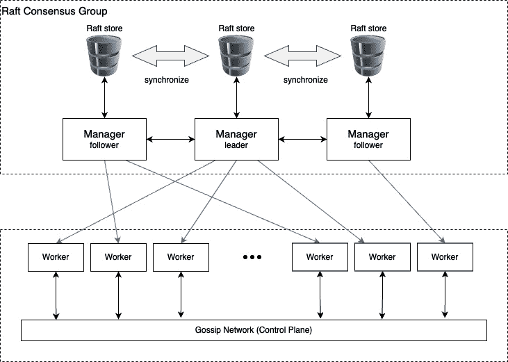

图 14.1 – Docker Swarm 的高级架构

管理节点负责管理 Swarm，而工作节点则执行部署到 Swarm 中的应用程序。每个管理节点都有 Swarm 完整状态的副本，存储在本地的 Raft 存储中。管理节点同步地相互通信，它们的 Raft 存储始终保持同步。

另一方面，工作节点为了可扩展性原因是异步地相互通信的。在一个 Swarm 中，工作节点的数量可以达到数百，甚至数千个。

现在我们对 Docker Swarm 有了一个高层次的概览，接下来让我们更详细地描述 Docker Swarm 的所有组成部分。

## Swarm 节点

Swarm 是一个节点集合。我们可以将节点分类为物理计算机或**虚拟机**（**VM**）。如今，物理计算机通常被称为裸金属。人们用“裸金属”来区分与虚拟机上的运行。

当我们在这样的节点上安装 Docker 时，我们称这个节点为 Docker 主机。以下图示更清楚地展示了节点和 Docker 主机的概念：

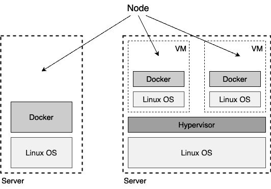

图 14.2 – Docker Swarm 节点的裸金属和虚拟机类型

要成为 Docker Swarm 的成员，节点必须是 Docker 主机。Docker Swarm 中的节点可以有两种角色：它可以是管理节点，也可以是工作节点。管理节点做它名字所暗示的工作；它们管理 Swarm。而工作节点则执行应用程序负载。

从技术上讲，管理节点也可以是工作节点，因此可以运行应用程序负载——尽管不推荐这样做，特别是当 Swarm 是一个运行关键任务应用程序的生产系统时。

### Swarm 管理节点

每个 Docker Swarm 至少需要包含一个管理节点。出于高可用性的考虑，我们应该在 Swarm 中有多个管理节点。这对于生产环境或类似生产的环境尤为重要。如果我们有多个管理节点，那么这些节点将使用 Raft 共识协议一起工作。Raft 共识协议是一种标准协议，通常用于多个实体需要共同工作，并始终需要就接下来执行哪个操作达成一致的场景。

为了良好运作，Raft 共识协议要求在所谓的**共识组**中有一个奇数数量的成员。因此，我们应该始终有 1、3、5、7 等个管理节点。在这样的共识组中，总是会有一个领导者。在 Docker Swarm 中，第一个启动 Swarm 的节点最初会成为领导者。如果领导者离开，剩余的管理节点会选举出一个新的领导者。共识组中的其他节点被称为跟随者。

Raft 领导者选举

Raft 使用心跳机制来触发领导者选举。当服务器启动时，它们会首先作为跟随者存在。只要服务器接收到来自领导者或候选者的有效**远程过程调用**（**RPCs**），它就保持在跟随者状态。领导者会定期向所有跟随者发送心跳，以维持其权威。如果跟随者在一段时间内没有收到任何通信（该时间段称为选举超时），它就假设没有可行的领导者，并开始选举一个新的领导者。在选举过程中，每台服务器都会启动一个随机选择的计时器。当计时器触发时，服务器将自己从跟随者变为候选者。同时，它会增加 term 值，并向所有对等节点发送投票请求，等待回应。

在 Raft 共识算法的上下文中，“term”对应于一次选举轮次，并作为系统的逻辑时钟，使 Raft 能够检测到过时的信息，如过期的领导者。每次发起选举时，term 值都会增加。

当服务器收到投票请求时，只有在候选者的 term 值较高或候选者的 term 与自身相同时，服务器才会投票。否则，投票请求将被拒绝。每个对等节点每个 term 只能投给一个候选者，但如果它收到的投票请求的 term 值比之前投票的候选者更高，它将放弃之前的投票。

在 Raft 和许多其他分布式系统的上下文中，“日志”指的是状态机日志或操作日志，而不是传统的应用程序日志。

如果候选者在下一个计时器触发前没有获得足够的票数，当前投票将作废，候选者将以更高的 term 值开始新一轮选举。一旦候选者获得大多数对等节点的票数，它就会将自己从候选者转为领导者，并立即广播其权威，以防止其他服务器开始领导者选举。领导者会定期广播这一信息。现在，假设我们因为维护原因关闭了当前的领导者节点，剩余的管理节点将选举新的领导者。当之前的领导者节点重新上线时，它将变为跟随者，而新的领导者将继续担任领导者职务。

所有共识组成员彼此之间同步通信。每当共识组需要做出决策时，领导者会向所有跟随者请求同意。如果大多数管理节点给予肯定回答，领导者就会执行任务。这意味着，如果我们有三个管理节点，那么至少一个跟随者必须同意领导者。如果我们有五个管理节点，那么至少两个跟随者必须同意领导者。

由于所有管理节点必须与领导节点同步通信以在集群中做出决策，随着我们形成共识组的管理节点数量增加，决策过程变得越来越慢。Docker 的推荐做法是在开发、演示或测试环境中使用一个管理节点。在小型到中型 Swarm 中使用三个管理节点，在大型到超大型 Swarm 中使用五个管理节点。在 Swarm 中使用超过五个管理节点几乎是没有必要的。

管理节点不仅负责管理 Swarm，还负责维护 Swarm 的状态。我们说的“状态”是什么意思？当我们谈论 Swarm 的状态时，我们指的是关于它的所有信息——例如，Swarm 中有多少个节点，每个节点的属性是什么，如名称或 IP 地址。我们还指的是哪些容器在 Swarm 中的哪个节点上运行等等。而 Swarm 的状态中不包含的是由在 Swarm 上运行的容器中的应用服务所产生的数据。这些被称为**应用数据**，绝对不属于由管理节点管理的状态：

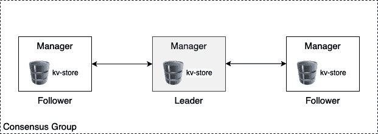

图 14.3 – 一个 Swarm 管理节点共识组

所有的 Swarm 状态都存储在每个管理节点上的高性能**键值存储**（**kv-store**）中。没错，每个管理节点都存储整个 Swarm 状态的完整副本。这种冗余使 Swarm 具有高度可用性。如果一个管理节点发生故障，其余的管理节点都可以快速访问完整的状态。

如果一个新的管理节点加入共识组，那么它会与该组的现有成员同步 Swarm 状态，直到它拥有完整的副本。在典型的 Swarm 中，这种复制通常非常快速，但如果 Swarm 很大并且上面运行着许多应用程序，它可能需要一些时间。

### Swarm 工作节点

正如我们之前提到的，Swarm 工作节点的任务是托管和运行包含实际应用服务的容器，这些是我们希望在集群中运行的服务。它们是 Swarm 的“工作马”。理论上，管理节点也可以是工作节点。但正如我们所说的，这在生产系统中并不推荐。在生产系统中，我们应该让管理节点专职管理。

工作节点通过所谓的控制平面相互通信。它们使用 gossip 协议进行通信。这种通信是异步的，这意味着在任何给定的时刻，不是所有工作节点都处于完美同步状态。

现在，你可能会问——工作节点交换哪些信息？这些信息主要是服务发现和路由所需的信息，也就是关于哪些容器正在运行在什么节点上的信息，等等：

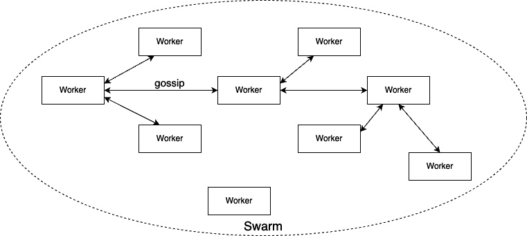

图 14.4 – 工作节点之间的通信

在前面的示意图中，你可以看到工作节点之间是如何相互通信的。为了确保在大规模 Swarm 中传播（gossip）能够良好扩展，每个工作节点仅与三个随机邻居同步自己的状态。对于熟悉大 O 符号的人来说，这意味着使用传播协议的工作节点同步的扩展是 O(0)。

大 O 符号解释

大 O 符号是一种描述给定算法的速度或复杂度的方式。它告诉你一个算法将执行多少次操作。它用于传达一个算法的速度，这在评估他人的算法和自己算法时都非常重要。

例如，假设你有一个数字列表，并且你想在列表中查找一个特定的数字。你可以使用不同的算法来完成这个任务，比如简单查找或二分查找。简单查找会逐个检查列表中的数字，直到找到你要找的数字。另一方面，二分查找则会反复将列表分成两半，直到找到你要找的数字。

现在，假设你有一个包含 100 个数字的列表。对于简单查找，最坏情况下，你需要检查所有 100 个数字，所以需要 100 次操作。而对于二分查找，最坏情况下，你只需检查大约 7 个数字（因为 log2(100) 大约是 7），所以只需要 7 次操作。

在这个例子中，二分查找比简单查找要快。但如果你有一个包含 10 亿个数字的列表呢？简单查找需要进行 10 亿次操作，而二分查找只需要大约 30 次操作（因为 log2(10 亿) 大约是 30）。因此，随着列表的增大，二分查找比简单查找要快得多。

大 O 符号用于描述算法之间速度的差异。在大 O 符号中，简单查找被描述为 O(n)，这意味着操作的数量随着列表大小（n）的增长呈线性增长。二分查找被描述为 O(log n)，这意味着操作的数量随着列表大小的增长呈对数增长。

工作节点是被动的。它们除了运行由管理节点分配的工作负载外，通常不会主动做其他任何事情。不过，工作节点会确保以其最大能力运行这些工作负载。在本章稍后部分，我们将详细了解管理节点分配给工作节点的具体工作负载。

现在我们知道了 Docker Swarm 中的主节点和工作节点，我们将介绍堆栈、服务和任务。

# 堆栈、服务和任务

使用 Docker Swarm 而非单个 Docker 主机时，出现了范式的变化。我们不再谈论运行进程的单个容器，而是将其抽象为表示每个进程副本集合的服务，通过这种方式实现高可用性。我们也不再谈论拥有固定名称和 IP 地址的单个 Docker 主机来部署容器；现在我们将谈论部署服务的主机集群。我们不再关心单个主机或节点，我们不再给它赋予有意义的名称；每个节点对我们来说只是一个数字。

我们现在不再关心单个容器以及它们的部署位置——我们只关心通过服务定义的期望状态。我们可以尝试通过下面的图示来表示这一点：

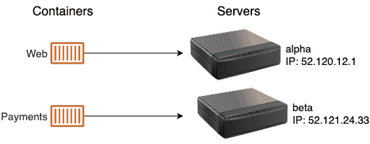

图 14.5 – 容器被部署到已知的服务器上

与前面图示中的做法不同，之前我们将 web 容器部署到 IP 地址为 `52.120.12.1` 的 alpha 服务器，将支付容器部署到 IP 为 `52.121.24.33` 的 beta 服务器，现在我们切换到这个新的服务和 Swarm（或者更广义的集群）范式：

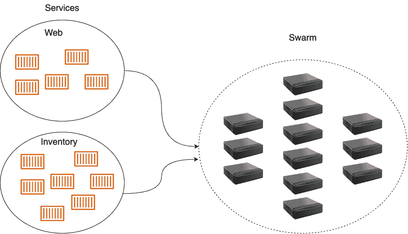

图 14.6 – 服务被部署到 Swarm 集群

在前面的图示中，我们看到一个 web 服务和一个库存服务都被部署到由多个节点组成的 Swarm 集群中。每个服务都有一定数量的副本：web 服务有五个副本，库存服务有七个副本。我们并不关心这些副本会在哪个节点上运行；我们只关心所请求的副本数量始终在 Swarm 调度器决定将它们放在哪些节点上时保持运行。

话虽如此，现在让我们介绍一下在 Docker Swarm 中服务的概念。

## 服务

Swarm 服务是一个抽象概念。它是我们希望在 Swarm 中运行的应用程序或应用服务的期望状态描述。Swarm 服务就像一个清单，描述以下内容：

+   服务的名称

+   用于创建容器的镜像

+   运行的副本数量

+   服务容器所连接的网络

+   应映射的端口

拥有这个服务清单后，Swarm 管理器会确保如果实际状态与期望状态发生偏差时，始终会将它们调整回期望状态。所以，例如，如果某个服务的实例崩溃了，Swarm 管理器上的调度器就会在有空闲资源的节点上调度该服务的一个新实例，以便重新建立期望的状态。

那么，任务是什么呢？这就是我们接下来要学习的内容。

## 任务

我们已经了解到，服务对应的是应用服务应始终处于的期望状态的描述。该描述的一部分是服务应运行的副本数量。每个副本由一个任务表示。在这方面，Swarm 服务包含一个任务集合。在 Docker Swarm 中，任务是一个原子部署单元。服务的每个任务都由 Swarm 调度器部署到一个工作节点。任务包含工作节点运行基于镜像的容器所需的所有信息，而镜像是服务描述的一部分。在任务和容器之间，存在一对一的关系。容器是运行在工作节点上的实例，而任务是容器作为 Swarm 服务一部分的描述。

最后，让我们在 Docker Swarm 的背景下讨论一下栈。

## 栈

现在我们对 Swarm 服务和任务有了很好的了解，接下来我们可以介绍栈。栈用于描述一组相关的 Swarm 服务，它们很可能是因为属于同一个应用程序而关联的。从这个意义上讲，我们也可以说栈描述的是一个由一个或多个服务组成的应用程序，我们希望在 Swarm 上运行这些服务。

通常，我们在一个使用 YAML 格式的文本文件中声明一个栈，并且该文件使用与已知的 Docker Compose 文件相同的语法。这导致了一种情况，人们有时会说栈是由 Docker Compose 文件描述的。更好的说法是，栈是在一个使用与 Docker Compose 文件相似语法的栈文件中描述的。

让我们尝试通过以下图示来说明栈、服务和任务之间的关系，并将其与栈文件的典型内容联系起来：

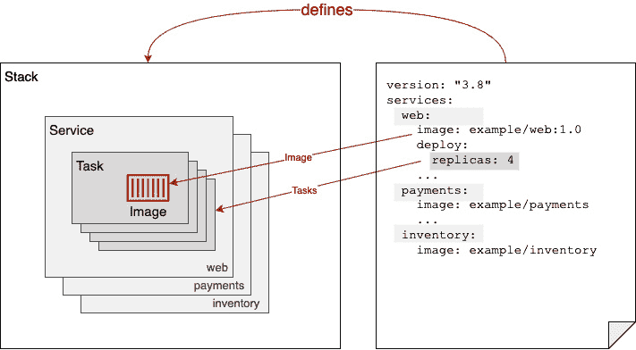

图 14.7 – 显示栈、服务和任务之间关系的图示

在前面的图示中，我们可以看到右侧是一个示例栈的声明式描述。该栈包含三个服务，分别是 `web`、`payments` 和 `inventory`。我们还看到，`web` 服务使用的是 `example/web:1.0` 镜像，并且有四个副本。在图示的左侧，我们看到栈包含了前面提到的三个服务。每个服务又包含了若干任务，副本数目就是任务的数量。在 `web` 服务的情况下，我们有一个包含四个任务的集合。每个任务包含将从其启动容器的镜像名称，一旦任务被调度到 Swarm 节点上，容器便会启动。

现在，既然你已经对 Docker Swarm 的主要概念有了很好的理解，比如节点、栈、服务和任务，让我们更仔细地看看在 Swarm 中使用的网络。

# 多主机网络

在*第十章*，*使用单主机网络*中，我们讨论了容器如何在单一 Docker 主机上进行通信。现在，我们有一个由多个节点或 Docker 主机构成的 Swarm 集群。位于不同节点上的容器需要能够相互通信。许多技术可以帮助我们实现这个目标。Docker 选择为 Docker Swarm 实现一个覆盖网络驱动程序。这个覆盖网络允许连接到同一覆盖网络的容器相互发现并自由通信。以下是覆盖网络工作原理的示意图：

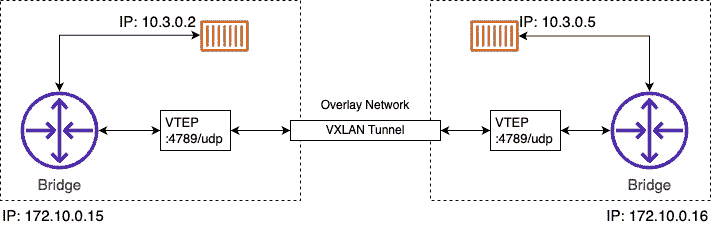

图 14.8 – 覆盖网络

我们有两个节点或 Docker 主机，IP 地址分别为`172.10.0.15`和`172.10.0.16`。我们选择的 IP 地址值并不重要；重要的是这两个主机有不同的 IP 地址，并且通过物理网络（网络电缆）连接，这个物理网络被称为**底层网络**。

在左侧的节点上，我们有一个运行中的容器，IP 地址为`10.3.0.2`；在右侧的节点上，我们有另一个容器，IP 地址为`10.3.0.5`。现在，前者容器想要与后者容器通信。这个过程怎么实现呢？在*第十章*，*使用单主机网络*中，我们已经看到当两个容器位于同一节点时，如何通过使用 Linux 桥接来实现这种通信。但 Linux 桥接仅在本地运行，无法跨节点工作。所以，我们需要其他机制。此时，Linux VXLAN 来到救援。VXLAN 从容器技术出现之前就已在 Linux 中可用。

VXLAN 解释

**VXLAN**，即**虚拟扩展局域网**，是一种网络协议，它通过使用 UDP 协议在 IP 网络上创建虚拟的二层域。它的设计目的是解决 IEEE 802.1q 中 VLAN ID 数量有限（4,096）的难题，通过将标识符的大小扩展到 24 位（16,777,216）。

简而言之，VXLAN 允许创建可以跨越不同物理位置的虚拟网络。例如，某些运行在不同主机上的虚拟机可以通过 VXLAN 隧道进行通信。这些主机可以位于不同的子网，甚至在全球不同的数据中心。从虚拟机的角度来看，同一 VXLAN 中的其他虚拟机在同一个二层域内。

当 *图 14.8* 中左侧的容器发送数据包时，桥接器意识到该数据包的目标不在此主机上。现在，每个参与 Overlay 网络的节点都会获得一个所谓的 **VXLAN 隧道端点**（**VTEP**）对象，它会拦截数据包（此时的数据包是 OSI 第 2 层的数据包），并用一个包含目标主机的 IP 地址的标头将其包装起来（这将其转变为 OSI 第 3 层的数据包），然后通过 VXLAN 隧道发送。隧道另一端的 VTEP 会解包数据包并将其转发给本地桥接器，本地桥接器再将其转发给目标容器。

Overlay 驱动程序包含在 SwarmKit 中，并且在大多数情况下是 Docker Swarm 推荐的网络驱动程序。还有其他可以支持多节点的第三方网络驱动程序，可以作为插件安装在每个参与的 Docker 主机中。经过认证的网络插件可以从 Docker 商店获得。

很好，我们已经掌握了关于 Docker Swarm 的所有基础知识。那么，接下来我们就来创建一个。

# 创建 Docker Swarm

创建 Docker Swarm 几乎是微不足道的。它非常简单，以至于如果你了解编排器的工作原理，可能会觉得这几乎难以置信。但这是真的，Docker 在使 Swarm 变得简单而优雅方面做得非常出色。同时，Docker Swarm 已被证明在大企业使用时非常稳健且可扩展。

## 创建一个本地单节点 Swarm

所以，够了，别再想象了——让我们演示一下如何创建一个 Swarm。在最简单的形式下，一个完全运行的 Docker Swarm 只包含一个节点。如果你使用 Docker Desktop，甚至是 Docker Toolbox，那么你的个人电脑或笔记本电脑就是这样的一个节点。因此，我们可以从这里开始，并演示一些 Swarm 的最重要功能。

让我们初始化一个 Swarm。在命令行中，只需输入以下命令：

```
$ docker swarm init
```

经过极短的时间后，你应该看到如下输出：

```
Swarm initialized: current node (zqzxn4bur43lywp55fysnymd4) is now a manager.To add a worker to this swarm, run the following command:
    docker swarm join --token SWMTKN-1-57ayqfyc8cdg09hi9tzuztzcg2gk2rd6abu71ennaide3r20q5-21j3wpm8scytn9u5n1jrvlbzf 192.168.0.13:2377
To add a manager to this swarm, run 'docker swarm join-token manager' and follow the instructions.
```

我们的计算机现在是一个 Swarm 节点。它的角色是管理者，并且是领导者（在管理者中是领导者，因为目前只有一个管理者）。虽然 `docker swarm init` 命令仅用了非常短的时间就完成，但在此期间，该命令做了很多事情。以下是其中的一些：

+   它创建了一个根 **证书** **授权中心**（**CA**）

+   它创建了一个 kv-store，用来存储整个 Swarm 的状态

现在，在前面的输出中，我们可以看到一个命令，可以用来将其他节点加入我们刚刚创建的 Swarm。该命令如下：

```
$ docker swarm join --token <join-token> <IP address>:2377
```

这里，我们有以下内容：

+   `<join-token>` 是 Swarm 领导者在初始化 Swarm 时生成的令牌

+   `<IP 地址>` 是领导者的 IP 地址

尽管我们的集群保持简单，因为它只包含一个成员，但我们仍然可以要求 Docker CLI 列出 Swarm 的所有节点，使用 `docker node ls` 命令。这将类似于以下截屏：

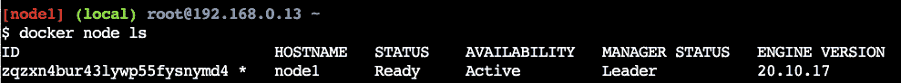

图 14.9 – 列出 Docker Swarm 的节点

在这个输出中，我们首先看到赋予节点的 ID。跟随 ID 的星号（`*`）表示这是执行了 `docker node ls` 命令的节点—基本上表明这是活动节点。然后，我们有节点的（人类可读的）名称及其状态、可用性和管理状态。正如前面提到的，这个 Swarm 的第一个节点自动成为了领导者，这在前面的截屏中已经显示出来了。最后，我们看到我们正在使用的 Docker Engine 版本。

要获取关于节点的更多信息，我们可以使用 `docker node inspect` 命令，如下截断输出所示：

```
$ docker node inspect node1[
    {
        "ID": "zqzxn4bur43lywp55fysnymd4",
        "Version": {
            "Index": 9
        },
        "CreatedAt": "2023-04-21T06:48:06.434268546Z",
        "UpdatedAt": "2023-04-21T06:48:06.955837213Z",
        "Spec": {
            "Labels": {},
            "Role": "manager",
            "Availability": "active"
        },
        "Description": {
            "Hostname": "node1",
            "Platform": {
                "Architecture": "x86_64",
                "OS": "linux"
            },
            "Resources": {
                "NanoCPUs": 8000000000,
                "MemoryBytes": 33737699328
            },
            "Engine": {
                "EngineVersion": "20.10.17",
                "Plugins": [
                    {
                        "Type": "Log",
                        "Name": "awslogs"
                    },
...
    }
]
```

该命令生成了大量信息，因此我们只呈现了输出的缩短版本。例如，在需要排除集群节点行为不端时，此输出非常有用。

在继续之前，请不要忘记使用以下命令关闭或解散该群集：

```
$ docker swarm leave --force
```

在接下来的部分，我们将使用 PWD 环境来生成和使用 Docker Swarm。

## 使用 PWD 生成 Swarm

要试验 Docker Swarm 而不必在本地计算机上安装或配置任何东西，我们可以使用 PWD。PWD 是一个可以通过浏览器访问的网站，提供了创建最多五个节点的 Docker Swarm 的能力。正如其名称所示，它绝对是一个游乐场，并且我们可以使用它的时间限制为每个会话四个小时。我们可以打开任意多个会话，但每个会话在四小时后会自动结束。除此之外，它是一个完全功能的 Docker 环境，非常适合玩弄 Docker 或展示一些功能。

现在访问该网站。在浏览器中导航至网站 [`labs.play-with-docker.com`](https://labs.play-with-docker.com)。您将看到一个欢迎和登录界面。使用您的 Docker ID 登录。成功登录后，您将看到一个类似以下截屏的界面：

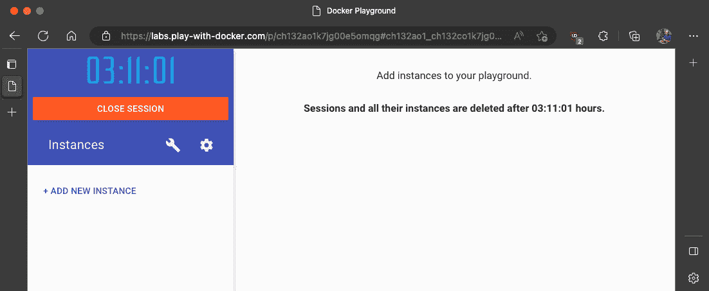

图 14.10 – PWD 窗口

我们立即可以看到一个大计时器，从四小时开始倒计时。这就是我们在此会话中可以使用的时间。此外，我们看到一个**+ 添加新实例**链接。点击它以创建一个新的 Docker 主机。当你这样做时，你的屏幕应该如下截屏所示：

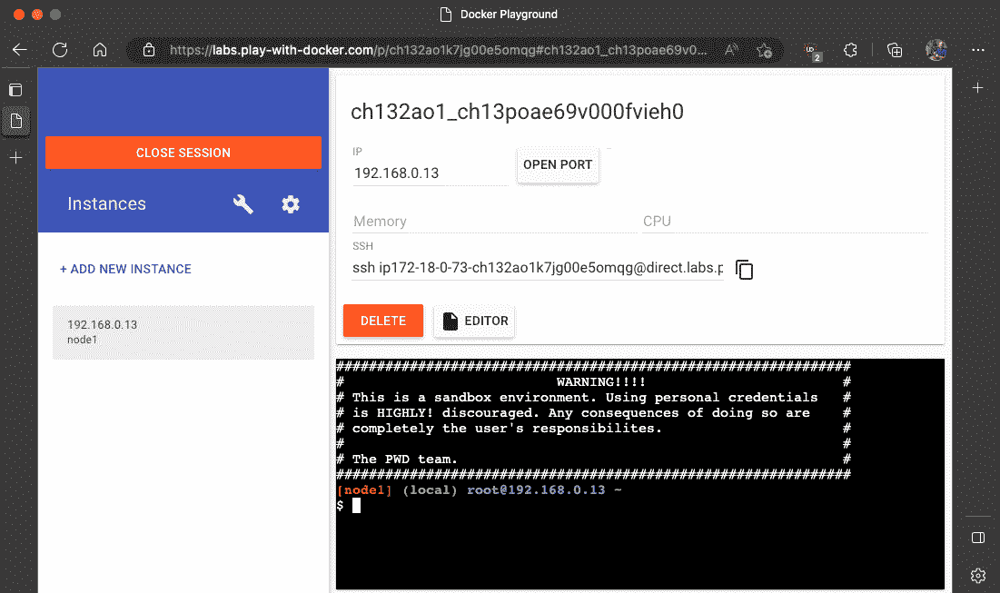

图 14.11 – PWD 带有一个新节点

在左侧，我们可以看到新创建的节点及其 IP 地址（`192.168.0.13`）和名称（`node1`）。在右侧，上半部分显示了该新节点的一些附加信息，底部是一个终端窗口。是的，这个终端窗口用于在我们刚创建的节点上执行命令。该节点已安装 Docker CLI，因此我们可以在其上执行所有熟悉的 Docker 命令，比如 Docker 版本命令。试试看。

但现在我们想创建一个 Docker Swarm。在浏览器的终端中执行以下命令：

```
$ docker swarm init --advertise-addr=eth0
```

前述命令生成的输出与我们在创建本地 Docker Swarm 时看到的类似。需要注意的是 `join` 命令，它是我们希望用来将其他节点加入到刚创建的集群中的命令。

你可能注意到我们在 Swarm `init` 命令中指定了 `--advertise-addr` 参数。为什么在这里需要这个呢？原因是 PWD 生成的节点关联了多个 IP 地址。我们可以通过在节点上执行 `ip` 命令轻松验证这一点。这个命令会显示出确实存在两个端点，`eth0` 和 `eth1`。因此，我们必须明确指定给新的 Swarm 管理节点使用哪个 IP 地址。在我们的例子中，是 `eth0`。

在 PWD 中创建四个额外的节点，通过点击 `node2`、`node3`、`node4` 和 `node5` 四次，它们将会在左侧列出。如果你点击左侧的某个节点，右侧将显示该节点的详细信息以及一个终端窗口。

选择每个节点（2 到 5），并在相应的终端中执行你从主节点（`node1`）复制过来的 `docker swarm join` 命令：

```
$ docker swarm join --token SWMTKN-1-4o1ybxxg7cv... 192.168.0.13:2377
```

这个节点作为工作节点加入了 Swarm。

一旦你将所有四个节点加入到 Swarm，切换回 `node1` 并列出所有节点：

```
$ docker node ls
```

这，毫不意外地，生成了如下输出（为了可读性稍作重新格式化）：

```
ID           HOSTNAME STATUS  AVAIL. MANAGER ST. ENGINE VER.Nb16ey2p... *  node1   Ready  Active   Leader     20.10.17
Kdd0yv15...    node2   Ready  Active              20.10.17
t5iw0clx...    node3   Ready  Active              20.10.17
Nr6ngsgs...    node4   Ready  Active              20.10.17
thbiwgft...    node5   Ready  Active              20.10.17
```

仍然在 `node1` 上，我们现在可以提升，比如将 `node2` 和 `node3` 提升为 Swarm 管理节点，以实现高度可用：

```
$ docker node promote node2 node3
```

这将生成以下输出：

```
Node node2 promoted to a manager in the swarm.Node node3 promoted to a manager in the swarm.
```

有了这个，我们在 PWD 上的 Swarm 就可以接受工作负载了。我们创建了一个高度可用的 Docker Swarm，包含三个管理节点，它们组成一个 Raft 共识组，以及两个工作节点。

## 在云中创建 Docker Swarm

到目前为止，我们创建的所有 Docker Swarm 都非常适合用于开发、实验或演示目的。不过，如果我们想创建一个可以作为生产环境的 Swarm，用来运行我们至关重要的应用程序，那么我们需要在云端或本地创建一个——我敢说——真正的 Swarm。在本书中，我们将演示如何在 AWS 中创建一个 Docker Swarm。

我们可以通过 AWS 控制台手动创建一个 Swarm：

1.  登录到你的 AWS 账户。如果你还没有账户，可以创建一个免费的。

1.  首先，我们创建一个 AWS `aws-docker-demo-sg`：

    1.  导航到你的默认 VPC。

    1.  在左侧，选择 `aws-docker-demo-sg`，如前所述，并添加描述，例如 `用于我们的 Docker 演示的 SG`。

    1.  现在，点击 `sg-030d0...`

    1.  **类型**：自定义 UDP，**协议**：UDP，**端口范围**：7946，**来源**：自定义

    1.  在值的选项中，选择刚刚创建的 SG。

    1.  **类型**：自定义 TCP，**协议**：TCP，**端口范围**：7946，**来源**：自定义

    1.  在值的选项中，选择刚刚创建的 SG。

    1.  **类型**：自定义 TCP，**协议**：TCP，**端口范围**：4789，**来源**：自定义

    1.  在值的选项中，选择刚刚创建的 SG。

    1.  **类型**：自定义 TCP，**协议**：TCP，**端口范围**：22，**来源**：我的 IP

    1.  这条规则是为了能够通过 SSH 从你的主机访问实例。

Docker Swarm 端口

**TCP 端口 2377**：这是 Swarm 模式的主要通信端口。Swarm 管理和编排命令通过此端口进行通信。它用于节点之间的通信，并在 Raft 共识算法中扮演着至关重要的角色，确保 Swarm 中的所有节点作为一个单一系统进行操作。

**TCP 和 UDP 端口 7946**：此端口用于节点之间的通信（容器网络发现）。它帮助 Swarm 中的节点交换有关在每个节点上运行的服务和任务的信息。

**UDP 端口 4789**：此端口用于覆盖网络流量。当你为服务创建覆盖网络时，Docker Swarm 使用此端口进行容器之间的数据流量传输。

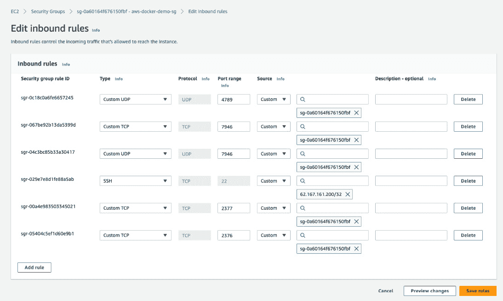

图 14.12 – AWS SG 的入站规则

1.  完成后，点击 **保存规则**。

1.  进入 EC2 控制面板。

1.  首先，我们为接下来要创建的所有 EC2 实例创建一个密钥对：

    1.  定位并点击 `aws-docker-demo`。

    1.  确保私钥文件的格式为 `.pem`。

    1.  点击 `.pem` 文件并保存在安全位置。

1.  回到 EC2 控制面板，使用以下设置启动一个新的 EC2 实例：

    1.  将实例命名为 `manager1`。

    1.  选择 `t2.micro` 作为实例类型。

    1.  使用我们之前创建的密钥对，名为 `aws-docker-demo`。

    1.  选择我们之前创建的现有 SG，`aws-docker-demo-sg`。

    1.  然后，点击 **启动** 按钮。

1.  重复前一步骤，创建两个工作节点，分别命名为 `worker1` 和 `worker2`。

1.  进入 EC2 实例列表。你可能需要等待几分钟，直到它们都准备好。

1.  从 `manager1` 实例开始，选择它并点击 `ssh`。仔细按照这些指令操作。

1.  一旦连接到 `manager1` 实例，让我们安装 Docker：

    ```
    $ sudo apt-get update && sudo apt -y install docker.io
    ```

这可能需要几分钟时间才能完成。

1.  现在，确保你可以在不使用 `sudo` 命令的情况下使用 Docker：

    ```
    $ sudo usermod -aG docker $USER
    ```

1.  为了应用前面的命令，你需要快速退出 AWS 实例：

    ```
    $ exit
    ```

然后，立即使用 *步骤 6* 中的 `ssh` 命令重新连接。

1.  回到 EC2 实例，确保你可以通过以下命令访问 Docker：

    ```
    $ docker version
    ```

如果一切安装和配置正确，您应该会看到 Docker 客户端和引擎的版本信息。

1.  现在对另外两个 EC2 实例`worker1`和`worker2`重复*步骤 6*到*步骤 10*。

1.  现在回到您的`manager1`实例并初始化 Docker Swarm：

    ```
    $ docker swarm init
    ```

输出应该与您在本地或 PWD 上创建 Swarm 时看到的情况相同。

1.  从前面的输出中复制`docker swarm join`命令。

1.  转到每个工作节点并运行该命令。节点应该会返回以下内容：

    ```
    This node joined a swarm as a worker.
    ```

1.  返回`manager1`节点并运行以下命令以列出 Swarm 的所有节点：

    ```
    $ docker node ls
    ```

您应该看到的内容类似于此：

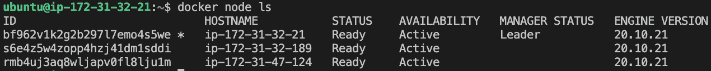

图 14.13 – AWS 上的 Swarm 节点列表

现在我们在(AWS)云中有了一个 Docker Swarm，让我们向其中部署一个简单的应用程序。

# 部署第一个应用程序

我们已经在各种平台上创建了一些 Docker Swarm。一旦创建，Swarm 在任何平台上的行为都是相同的。我们在 Swarm 上部署和更新应用程序的方式与平台无关。避免在使用 Swarm 时发生供应商锁定，一直是 Docker 的主要目标之一。Swarm 就绪的应用程序可以毫不费力地从本地运行的 Swarm 迁移到基于云的 Swarm。例如，技术上完全可以将 Swarm 的一部分运行在本地，另一部分运行在云端。当然，这样做时，我们必须考虑到地理上远距离节点之间可能带来的较高延迟。

现在我们已经有了一个高可用的 Docker Swarm，接下来是时候在上面运行一些工作负载了。我正在使用刚刚在 AWS 上创建的 Swarm。我们将首先通过创建一个服务来开始。为此，我们需要通过 SSH 连接到一个管理节点。我选择了`manager1`实例上的 Swarm 节点：

```
$ ssh -i "aws-docker-demo.pem" <public-dns-name-of-manager1>
```

我们通过创建一个服务来启动第一个应用程序的部署。

## 创建服务

服务可以作为堆栈的一部分或直接使用 Docker CLI 创建。让我们先来看一个定义单个服务的示例堆栈文件：

1.  使用 Vi 编辑器创建一个名为`stack.yml`的新文件，并添加以下内容：

    ```
    version: "3.7"services:  whoami:    image: training/whoami:latest    networks:    - test-net    ports:    - 81:8000    deploy:      replicas: 6      update_config:        parallelism: 2        delay: 10s      labels:         app: sample-app         environment: prod-southnetworks:  test-net:    driver: overlay
    ```

1.  通过先按*Esc*键，然后输入`:wq`，再按*Enter*键退出 Vi 编辑器。这将保存代码片段并退出 vi。

注意

如果您不熟悉 Vi 编辑器，也可以使用 nano 编辑器。

在前面的示例中，我们可以看到名为`whoami`的服务的期望状态：

+   它基于`training/whoami:latest`镜像

+   服务的容器连接到`test-net`网络

+   容器端口`8000`已发布到端口`81`

+   它运行了六个副本（或任务）

+   在滚动更新期间，单个任务按批次更新，每批次包含两个任务，并且每个成功批次之间有 10 秒的延迟。

+   服务（及其任务和容器）被分配了两个标签，`app`和`environment`，值分别为`sample-app`和`prod-south`

还有许多其他设置可以为服务定义，但上述设置是一些更为重要的设置。大多数设置都有有意义的默认值。例如，如果我们未指定副本数量，则 Docker 默认为 `1`。服务的名称和镜像当然是必需的。请注意，服务的名称在 Swarm 中必须是唯一的。

1.  要创建上述服务，我们使用 `docker stack deploy` 命令。假设包含上述内容的文件名为 `stack.yaml`，我们有以下内容：

    ```
    $ docker stack deploy -c stack.yaml sample-stack
    ```

这里，我们创建了一个名为 `sample-stack` 的堆栈，包含一个服务，`whoami`。

1.  我们可以列出在我们的 Swarm 中所有的堆栈：

    ```
    $ docker stack ls
    ```

完成后，我们应该会看到如下内容：

```
NAME                       SERVICESsample-stack            1
```

1.  我们可以列出在 Swarm 中定义的服务，如下所示：

    ```
    $ docker service ls
    ```

我们会得到如下输出：

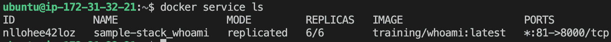

图 14.14 – 列出在 Swarm 中运行的所有服务

在输出中，我们可以看到目前只有一个服务在运行，这是预期的结果。该服务有一个 ID。与您之前用于容器、网络或卷的 ID 格式不同，该 ID 是字母数字组合（而之前的 ID 格式总是 SHA-256）。我们还可以看到，服务名称是我们在堆栈文件中定义的服务名称与堆栈名称的组合，堆栈名称作为前缀使用。这是合理的，因为我们希望能够通过相同的堆栈文件将多个（不同名称的）堆栈部署到我们的 Swarm 中。为了确保服务名称唯一，Docker 决定将服务名称和堆栈名称组合起来。

在第三列中，我们看到模式是“复制模式”。副本的数量显示为 `6/6`。这告诉我们，六个副本中有六个正在运行。这对应于期望的状态。在输出中，我们还可以看到服务使用的镜像和服务的端口映射。

## 检查服务及其任务

在上述输出中，我们看不到已创建的六个副本的详细信息。

为了深入了解这一点，我们可以使用 `docker service ps <service-id>` 命令。如果我们对我们的服务执行此命令，将获得如下输出：

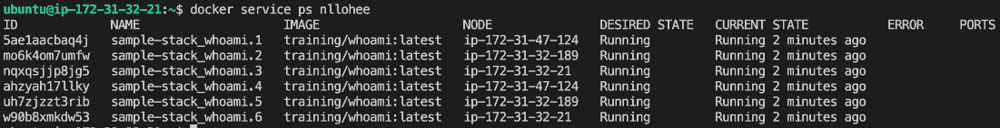

图 14.15 – whoami 服务的详细信息

在上面的输出中，我们可以看到六个任务的列表，这些任务对应我们请求的六个 `whoami` 服务副本。在 **NODE** 列中，我们还可以看到每个任务被部署到的节点。每个任务的名称是服务名称加上递增的索引。此外，注意到类似于服务本身，每个任务也会分配一个字母数字组合的 ID。

就我而言，显然任务 3 和 6，名称分别是 `sample-stack_whoami.3` 和 `sample-stack_whoami.6`，已经部署到 `ip-172-31-32-21`，这是我们 Swarm 的领导节点。因此，我应该会在此节点上找到一个正在运行的容器。让我们看看如果列出 `ip-172-31-32-21` 上的所有容器会得到什么：

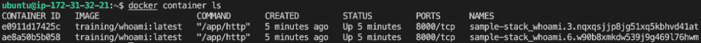

图 14.16 – 节点 ip-172-31-32-21 上的容器列表

正如预期的那样，我们发现一个容器正在运行，来自 `training/whoami:latest` 镜像，容器名称是其父任务名称和 ID 的组合。我们可以尝试可视化在部署我们的示例堆栈时生成的所有对象层次结构：

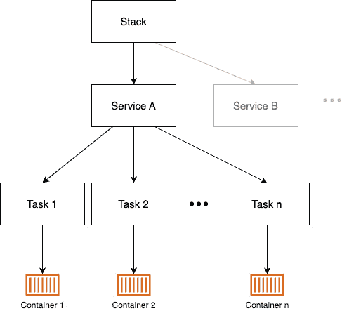

图 14.17 – Docker Swarm 堆栈的对象层次结构

一个堆栈可以由一个或多个服务组成。每个服务都有一组任务。每个任务与一个容器一一对应。堆栈和服务是在 Swarm 管理节点上创建和存储的。任务随后被调度到 Swarm 工作节点，在工作节点上创建相应的容器。我们还可以通过检查服务来获取更多关于服务的信息。执行以下命令：

```
$ docker service inspect sample-stack_whoami
```

这提供了关于服务所有相关设置的丰富信息。这些包括我们在 `stack.yaml` 文件中明确定义的设置，但也包括我们没有指定的设置，因此它们被分配了默认值。我们不会在此列出完整的输出，因为它太长，但我鼓励你在自己的机器上检查。我们将在 *第十五章* 的 *Swarm 路由网格* 部分中详细讨论部分信息。

## 测试负载均衡

为了查看 Swarm 如何将传入请求负载均衡到我们的示例 `whoami` 应用程序，我们可以使用 `curl` 工具。多次执行以下命令并观察答案的变化：

```
$ for i in {1..7}; do curl localhost:81; done
```

这会产生如下输出：

```
I'm ae8a50b5b058I'm 1b6b507d900c
I'm 83864fb80809
I'm 161176f937cf
I'm adf340def231
I'm e0911d17425c
I'm ae8a50b5b058
```

请注意，在第六项之后，序列开始重复。这是因为 Docker Swarm 使用轮询算法来进行负载均衡。

## 服务日志

在之前的章节中，我们处理过容器生成的日志。在这里，我们专注于服务。记住，最终，一个具有多个副本的服务会运行多个容器。因此，我们可以预计，如果我们请求该服务的日志，Docker 会返回该服务所有容器日志的汇总。事实上，当我们使用 `docker service` `logs` 命令时，我们会看到这一点：

```
$ docker service logs sample-stack_whoami
```

这是我们得到的结果：

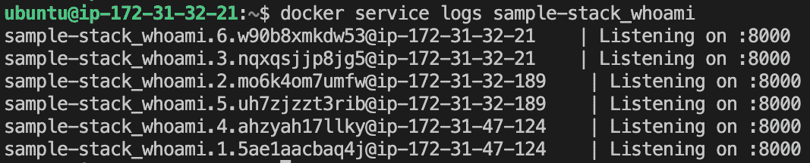

图 14.18 – whoami 服务的日志

此时日志中没有太多信息，但足以讨论我们得到的内容。日志中每一行的第一部分总是包含容器的名称，并与日志条目来源的节点名称结合。然后，通过竖线（`Listening` `on :8000`）分隔。

使用`docker service logs`命令获取的聚合日志没有按特定方式排序。因此，如果事件的关联发生在不同的容器中，你应该在日志输出中添加能使这种关联成为可能的信息。

通常，这个时间戳是每个日志条目的时间标记。但是这必须在源头进行；例如，生成日志条目的应用程序也需要确保添加时间戳。

我们还可以通过提供任务 ID 来查询服务中单个任务的日志，而不是服务 ID 或名称。所以，假设我们通过以下方式查询任务 6 的日志：

```
$ docker service logs w90b8
```

这给我们以下输出：

```
sample-stack_whoami.6.w90b8xmkdw53@ip-172-31-32-21    | Listening on :8000
```

在下一节中，我们将研究 Swarm 如何重新协调所需状态。

## 重新协调所需状态

我们已经了解到，Swarm 服务是我们希望应用程序或应用服务运行在的所需状态的描述或清单。现在，让我们看看 Docker Swarm 如何在我们做出一些操作导致服务的实际状态与所需状态不同时，重新协调这个所需状态。最简单的方式就是强制终止服务的一个任务或容器。

让我们使用已调度到`node-1`的容器来执行这个操作：

```
$ docker container rm -f sample-stack_whoami.3\. nqxqs...
```

如果我们这么做，然后立刻运行`docker service ps`，我们将看到以下输出：

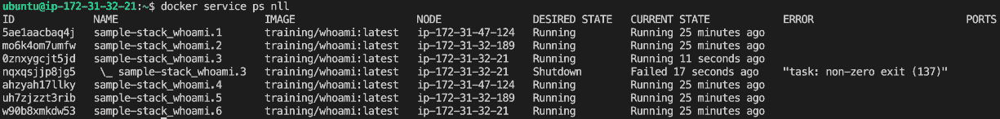

图 14.19 – Docker Swarm 在一个任务失败后重新协调所需状态

我们看到任务 2 因退出代码`137`失败，并且 Swarm 立即通过将失败的任务重新调度到具有空闲资源的节点上，协调了所需状态。在这种情况下，调度器选择了与失败任务相同的节点，但这并不总是如此。所以，在没有干预的情况下，Swarm 完全修复了问题，并且由于服务以多个副本运行，服务在任何时候都没有停机。

让我们尝试另一个失败场景。这一次，我们将关闭整个节点，看看 Swarm 如何反应。我们以节点`ip-172-31-47-124`为例，因为它上面运行了两个任务（任务 1 和任务 4）。为此，我们可以前往 AWS 控制台，在 EC2 仪表板中，停止名为`ip-172-31-47-124`的实例。

注意，我必须进入每个工作节点的详细信息，以找出哪个节点的主机名是`ip-172-31-47-124`；在我的案例中，它是`worker2`。

回到主节点，我们现在可以再次运行`docker service ps`来查看发生了什么：


图 14.20 – Swarm 重新调度所有失败节点的任务

在前面的截图中，我们可以看到，任务 1 已立即在节点`ip-172-31-32-189`上重新调度，而任务 4 则在节点`ip-172-31-32-21`上重新调度。即使是这种更为严重的故障，Docker Swarm 也能优雅地处理。

需要注意的是，如果节点`ip-172-31-47-124`在 Swarm 中重新上线，之前在其上运行的任务不会自动转移回该节点。

但是现在该节点已经准备好接受新的工作负载。

## 删除服务或堆栈

如果我们想从 Swarm 中删除一个特定的服务，可以使用`docker service rm`命令。另一方面，如果我们想从 Swarm 中删除一个堆栈，我们可以类比地使用`docker stack rm`命令。该命令会删除堆栈定义中的所有服务。以`whoami`服务为例，它是通过使用堆栈文件创建的，因此我们将使用后者命令：

```
$ docker stack rm sample-stack
```

这给出了以下输出：

```
Removing service sample-stack_whoamiRemoving network sample-stack_test-net
```

前面的命令将确保每个服务的所有任务都被终止，并且相应的容器在首先发送`SIGTERM`信号后被停止，如果失败，则在 10 秒超时后发送`SIGKILL`信号。

需要注意的是，停止的容器不会从 Docker 主机上删除。

因此，建议定期清理工作节点上的容器，以回收未使用的资源。可以使用`docker container purge -f`命令来实现这一目的。

**问题**：为什么在工作节点上保留停止或崩溃的容器而不自动删除它们是合理的？

## 部署多服务堆栈

在*第十一章*，《使用 Docker Compose 管理容器》中，我们使用了一个由两个服务组成的应用程序，这些服务在 Docker Compose 文件中以声明方式描述。我们可以使用这个 Compose 文件作为模板，创建一个堆栈文件，使我们能够将相同的应用程序部署到 Swarm 中：

1.  创建一个名为`pets-stack.yml`的新文件，并将以下内容添加到其中：

    ```
    version: "3.7"services:  web:    image: fundamentalsofdocker/ch11-web:2.0    networks:    - pets-net    ports:    - 3000:3000    deploy:      replicas: 3  db:    image: fundamentalsofdocker/ch11-db:2.0    networks:    - pets-net    volumes:    - pets-data:/var/lib/postgresql/datavolumes:  pets-data:networks:  pets-net:    driver: overlay
    ```

我们请求将 Web 服务配置为具有三个副本，并且两个服务都连接到覆盖网络`pets-net`。

1.  我们可以使用`docker stack`的`deploy`命令来部署此应用程序：

    ```
    $ docker stack deploy -c pets-stack.yml pets
    ```

这将产生以下输出：

```
Creating network pets_pets-netCreating service pets_db
Creating service pets_web
```

Docker 创建了`pets_pets-net`覆盖网络，然后创建了两个服务，`pets_web`和`pets_db`。

1.  然后，我们可以列出`pets`堆栈中的所有任务：


图 14.21 – 宠物堆栈中的所有任务列表

1.  最后，让我们使用 `curl` 测试该应用程序，以获取一个包含宠物的 HTML 页面。确实，应用程序按预期工作，返回了期望的页面：

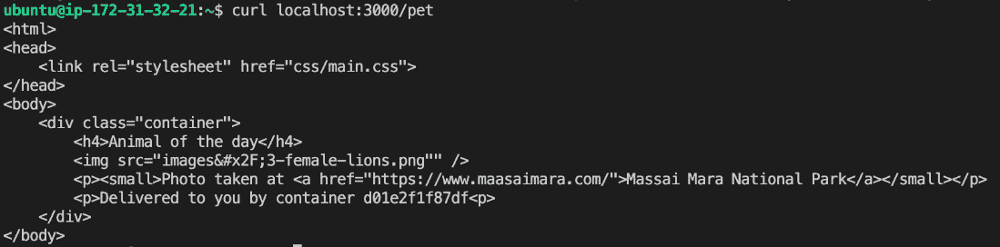

图 14.22 – 使用 curl 测试宠物应用程序

容器 ID 会出现在输出中，类似于 `Delivered to you by container d01e2f1f87df`。如果你多次运行 `curl` 命令，ID 应该在三个不同的值之间循环。这些是我们为 Web 服务请求的三个容器（或副本）的 ID。

1.  一旦我们完成操作，就可以使用 `docker stack rm pets` 命令移除该 stack。

一旦我们在 AWS 上完成了 Swarm 的操作，就可以将其移除。

## 移除 AWS 中的 Swarm

为了清理 AWS 云中的 Swarm 并避免产生不必要的费用，我们可以使用以下命令：

```
$ for NODE in `seq 1 5`; do    docker-machine rm -f aws-node-${NODE}
done
```

接下来，让我们总结一下本章的内容。

# 总结

在本章中，我们介绍了 Docker Swarm，它是仅次于 Kubernetes 的第二大容器编排工具。我们研究了 Swarm 的架构，讨论了 Swarm 中运行的各种资源类型，如服务、任务等，并在 Swarm 中创建了服务。我们学习了如何在本地、在名为 PWD 的特殊环境中以及在云中创建 Docker Swarm。最后，我们部署了一个由多个与 Docker Swarm 相关的服务组成的应用程序。

在下一章中，我们将介绍路由网格，它提供了 Docker Swarm 中的第 4 层路由和负载均衡。之后，我们将演示如何将由多个服务组成的第一个应用程序部署到 Swarm 中。我们还将学习如何在更新 Swarm 中的应用程序时实现零停机时间，最后，我们将了解如何在 Swarm 中存储配置数据，以及如何使用 Docker secrets 保护敏感数据。敬请关注。

# 问题

为了评估你的学习进度，请尝试回答以下问题：

1.  什么是 Docker Swarm？

1.  Docker Swarm 的主要组件有哪些？

1.  如何初始化 Docker Swarm？

1.  如何向 Docker Swarm 中添加节点？

1.  在 Docker Swarm 中，Docker 服务是什么？

1.  如何在 Docker Swarm 中创建和更新服务？

1.  什么是 Docker Stack，它与 Docker Swarm 有什么关系？

1.  如何在 Docker Swarm 中部署 Docker Stack？

1.  Docker Swarm 中的网络选项有哪些？

1.  Docker Swarm 如何处理容器的扩展和故障容忍？

# 答案

以下是前面问题的示例答案：

1.  Docker Swarm 是一个内置于 Docker 引擎的原生容器编排工具，它允许你创建、管理和扩展一组 Docker 节点，负责协调多个主机上容器的部署、扩展和管理。

1.  Docker Swarm 由两个主要组件组成：管理节点，负责管理集群的状态、协调任务并保持服务的期望状态；以及工作节点，执行任务并运行容器实例。

1.  你可以通过在 Docker 主机上运行 `docker swarm init` 命令来初始化 Docker Swarm，该主机将成为 Swarm 的第一个管理节点。该命令会提供一个令牌，可以用来将其他节点加入到 Swarm 中。

1.  要向 Docker Swarm 添加节点，请在新节点上使用`docker swarm join`命令，并提供令牌和现有管理节点的 IP 地址。

1.  Docker Service 是一个高级抽象，代表 Docker Swarm 中的容器化应用程序或微服务。它定义了应用程序的所需状态，包括容器镜像、副本数、网络和其他配置选项。

1.  你可以使用`docker service create`命令创建一个新的服务，使用`docker service update`命令更新现有服务，并随后指定所需的配置选项。

1.  Docker Stack 是一组一起部署并共享依赖项的服务，这些依赖项在 Docker Compose 文件中定义。Docker Stack 可以在 Docker Swarm 中部署，以管理和编排多服务应用程序。

1.  要在 Docker Swarm 中部署 Docker Stack，请使用`docker stack deploy`命令，后跟堆栈名称和 Docker Compose 文件的路径。

1.  Docker Swarm 支持多种网络选项，包括用于负载均衡和路由的默认入口网络、用于跨节点容器间通信的覆盖网络，以及用于特定用例的自定义网络。

1.  Docker Swarm 会通过调整副本数来自动管理容器的扩展，以符合在服务定义中指定的所需状态。它还会监控容器的健康状况，并替换任何失败的实例以保持容错性。
