# 15

# 在 Docker Swarm 上部署和运行分布式应用程序

在上一章中，我们详细介绍了 Docker 的原生调度器 SwarmKit。SwarmKit 是 Docker 引擎的一部分，一旦在系统中安装了 Docker，无需额外安装。我们了解了 SwarmKit 用于在集群中部署和运行分布式、弹性、稳健且高可用的应用程序的概念和对象，这些应用程序可以运行在本地或云端。我们还展示了 Docker 的调度器如何使用软件定义网络（SDN）保护应用程序。我们学习了如何在名为“Play with Docker”的特殊环境中以及在云端本地创建 Docker Swarm。最后，我们发现如何将一个由多个相关服务组成的应用程序部署到 Docker Swarm 上。

在本章中，我们将介绍路由网格，它提供第 4 层路由和负载均衡。接下来，我们将演示如何将一个由多个服务组成的第一个应用程序部署到 Swarm 中。我们还将学习如何在 Swarm 中更新应用程序时实现零停机，最后将介绍如何在 Swarm 中存储配置数据，以及如何使用 Docker 秘密保护敏感数据。

本章我们将讨论以下主题：

+   Swarm 路由网格

+   零停机部署

+   在 Swarm 中存储配置数据

+   使用 Docker Secrets 保护敏感数据

完成本章后，您将能够做到以下几点：

+   列出两到三种常见的部署策略，用于在不造成停机的情况下更新服务

+   在不引起服务中断的情况下批量更新服务

+   定义一个回滚策略，以防更新失败时用于恢复服务

+   使用 Docker 配置存储非敏感配置数据

+   使用 Docker 秘密与服务配合使用

+   更新秘密的值而不引起停机

让我们开始吧！

# Swarm 路由网格

如果你注意到的话，可能会在上一章中看到一些有趣的现象。我们已经部署了 `pets` 应用程序，并且该应用程序在三个节点——`node-1`、`node-2` 和 `node-3` 上安装了 Web 服务的实例。

然而，我们能够通过 `localhost` 访问 `node-1` 上的 Web 服务，并且从那里访问每个容器。这是如何实现的呢？这正是所谓的 Swarm 路由网格的功劳。路由网格确保，当我们发布服务的端口时，该端口会在 Swarm 的所有节点上发布。因此，任何访问 Swarm 节点并请求使用特定端口的网络流量，都将通过路由网格转发到其中一个服务容器。让我们看一下下面的图示，了解它是如何工作的：

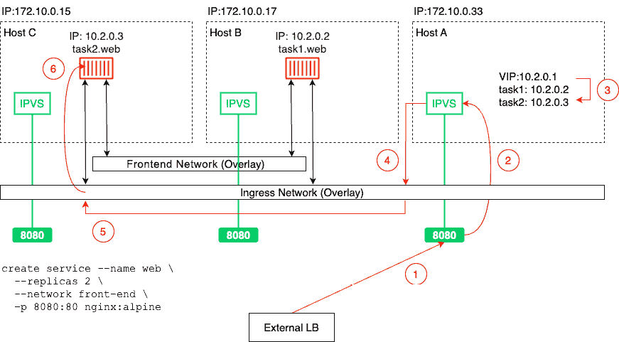

图 15.1 – Docker Swarm 路由网格

在这种情况下，我们有三个节点，分别为`172.10.0.15`、`172.10.0.17`和`172.10.0.33`。在图的左下角，我们看到创建了一个包含两个副本的网页服务的命令。相应的任务已经被调度到**Host B**和**Host C**上。**task1** 被安排在**Host B**，而**task2** 被安排在**Host C**。

当在 Docker Swarm 中创建服务时，它会自动获得一个`10.2.0.1`。

如果现在有一个来自外部的`8080`端口的请求，IP 表中会发现这个请求对应的是网页服务的 VIP。

现在，由于 VIP 并非真实目标，IPVS 服务将对与该服务关联的任务的 IP 地址进行负载均衡。在我们的案例中，它选择了`10.2.0.3`。最后，**Ingress 网络（Overlay）** 被用来将请求转发到**Host C**上的目标容器。

需要注意的是，**外部负载均衡器**将外部请求转发到哪个 Swarm 节点并不重要。路由网格始终会正确处理请求并将其转发到目标服务的某个任务。

我们已经学到了很多关于 Docker swarm 网络的知识。接下来我们要学习的主题是如何在不造成系统停机的情况下部署应用程序。

# 零停机部署

需要频繁更新的关键任务应用程序中，最重要的方面之一就是能够以不产生任何停机时间的方式进行更新。我们称之为零停机部署。更新中的应用程序必须始终保持完全可用。

## 常见的部署策略

实现这一目标有多种方法，其中一些方法如下：

+   滚动更新

+   蓝绿部署

+   金丝雀发布

Docker Swarm 开箱即支持滚动更新。其他两种部署方式需要我们付出额外的努力才能实现。

## 滚动更新

在关键任务应用中，每个应用服务必须运行多个副本。根据负载，这个数量可以少至两到三个实例，也可以多至几十、几百甚至上千个实例。在任何给定时刻，我们希望所有运行中的服务实例中有明确的大多数。所以，如果我们有三个副本，我们希望至少有两个副本始终运行。如果我们有 100 个副本，我们可以接受最少 90 个副本可用。通过这种方式，我们可以定义在升级时可以停机的副本的批次大小。在第一个案例中，批次大小为 1，而在第二个案例中，批次大小为 10。

当我们停用副本时，Docker Swarm 会自动将这些实例从负载均衡池中移除，所有流量将会被负载均衡到剩余的活动实例上。因此，这些剩余的实例将会经历流量的轻微增加。在下面的图示中，在滚动更新开始之前，如果**任务 A3**想要访问**服务 B**，它可以通过 SwarmKit 将流量负载均衡到**服务 B**的任意一个三个任务中。一旦滚动更新开始，SwarmKit 就会停用**任务 B1**进行更新。

自动地，这个任务会被从目标池中移除。所以，如果**任务 A3**现在请求连接到**服务 B**，负载均衡将只从剩余的任务中选择，也就是**任务 B2**和**任务 B3**。因此，这两个任务可能会暂时经历更高的负载：

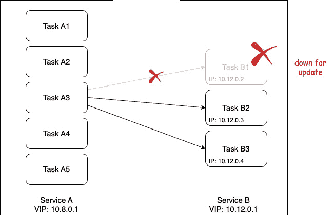

图 15.2 – 任务 B1 被停用以进行更新

停止的实例随后会被等量的新版本应用服务实例替代。一旦新实例启动并运行，我们可以让 Swarm 在给定时间内监控它们，确保它们是健康的。如果一切正常，那么我们可以继续通过停用下一批实例，并用新版本的实例替换它们。这个过程会一直重复，直到所有的应用服务实例都被替换。

在下面的图示中，我们可以看到**服务 B**的**任务 B1**已经更新到版本 2。**任务 B1**的容器被分配了一个新的 IP 地址，并且它被部署到了一个具有空闲资源的另一个工作节点：

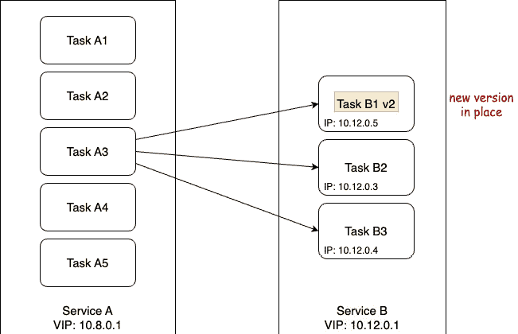

图 15.3 – 在滚动更新中，第一批任务正在更新

需要理解的是，当服务的任务被更新时，在大多数情况下，它会被部署到与原来不同的工作节点上，但只要相应的服务是无状态的，这应该是没问题的。如果我们有一个有状态的服务，它是位置或节点感知的，并且我们想要更新它，那么我们就必须调整方法，但这超出了本书的范围。

现在，让我们来看一下如何实际指示 Swarm 执行应用服务的滚动更新。当我们在`stack`文件中声明服务时，我们可以定义多个与此上下文相关的选项。让我们来看一个典型的`stack`文件片段：

```
version: "3.5"services:
  web:
    image: nginx:alpine
    deploy:
      replicas: 10
      update_config:
        parallelism: 2
        delay: 10s
...
```

在这个片段中，我们可以看到一个名为`update_config`的部分，其中包含`parallelism`和`delay`属性。`parallelism`定义了滚动更新时每次更新多少副本的批量大小。`delay`定义了 Docker Swarm 在更新单个批次之间将等待多长时间。在前面的例子中，我们有 10 个副本，每次更新 2 个实例，并且在每次成功更新后，Docker Swarm 会等待 10 秒。

让我们测试一下这样的滚动更新。导航到我们 `sample-solutions` 文件夹下的 `ch14` 子文件夹，使用 `web-stack.yaml` 文件创建一个已配置滚动更新的 web 服务。该服务使用基于 Alpine 的 Nginx 镜像，版本为 `1.12-alpine`。我们将把服务更新到更新版本，即 `1.13-alpine`。

首先，我们将把这个服务部署到我们在 AWS 上创建的 Swarm 集群中。

让我们来看一下：

1.  通过 SSH 登录到 AWS 上 Docker Swarm 的 `master1` 实例：

    ```
    $ ssh -i "aws-docker-demo.pem" <public-dns-of-manager1-instance>
    ```

1.  使用 `vi` 或 `nano` 创建一个名为 `web-stack.yml` 的文件，并包含以下内容：

    ```
    version: "3.7"services:  whoami:    image: nginx:1.12-alpine    ports:    - 81:80    deploy:      replicas: 10      update_config:        parallelism: 2        delay: 10s
    ```

1.  现在，我们可以使用 `stack` 文件来部署服务：

    ```
    $ docker stack deploy -c web-stack.yaml web
    ```

上述命令的输出如下所示：

```
Creating network web_defaultCreating service web_web
```

1.  一旦服务部署完成，我们可以使用以下命令来监控它：

    ```
    $ watch docker stack ps web
    ```

我们将看到以下输出：

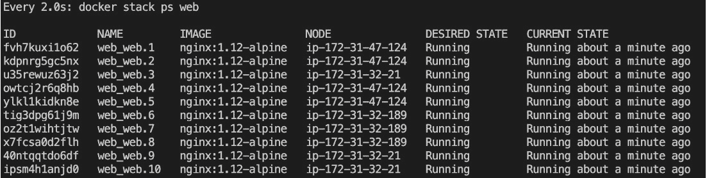

图 15.4 – 在 Swarm 中运行的 web 堆栈的 web 服务，包含 10 个副本

之前的命令将持续更新输出，并为我们提供滚动更新过程中发生的情况的概览。

1.  现在，我们需要打开第二个终端并为我们 Swarm 的管理节点配置远程访问。完成后，我们就可以执行 `docker` 命令，更新 `stack` 的 web 服务镜像，也叫 `web`：

    ```
    $ docker service update --image nginx:1.13-alpine web_web
    ```

上述命令会产生以下输出，表示滚动更新的进度：

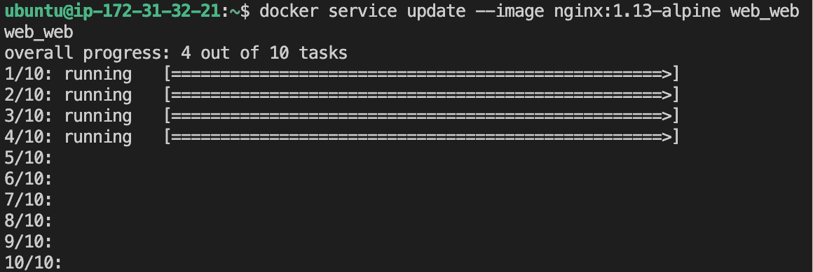

图 15.5 – 显示滚动更新进度的屏幕

前面的输出表示前两批任务（每批有两个任务）已经成功，第三批即将准备好。

在第一个终端窗口中，我们正在查看 `stack`，现在我们应该能看到 Docker Swarm 如何每 10 秒更新一次服务，每批更新后看起来应该像以下截图所示：

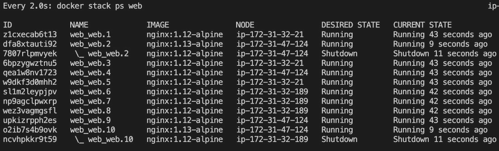

图 15.6 – Docker Swarm 中服务的滚动更新

在前面的截图中，我们可以看到任务 2 和任务 10 的第一批已更新。Docker Swarm 正在等待 10 秒钟，以便继续进行下一批任务。

有趣的是，在这个特定案例中，SwarmKit 将新版本的任务部署到与之前版本相同的节点上。这是偶然的，因为我们有五个节点，每个节点上有两个任务。SwarmKit 总是尽力平衡节点之间的工作负载。

所以，当 SwarmKit 停止一个任务时，相应的节点的工作负载会比其他节点小，因此新的实例会被调度到该节点。通常，你无法期望在同一个节点上找到一个新的任务实例。你可以通过删除 `stack`（命令：`docker stack rm web`）并将副本数更改为七来尝试一下，然后重新部署并更新它。

一旦所有任务更新完成，我们的 `docker stack ps web` 命令的输出将类似于以下截图：

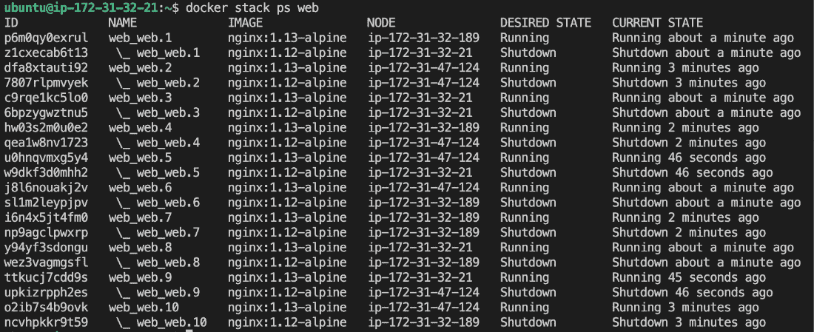

图 15.7 – 所有任务已成功更新

请注意，SwarmKit 不会立即从相应节点中移除前版本任务的容器。这是有道理的，因为我们可能需要从这些容器中获取日志进行调试，或者可能需要使用 `docker container inspect` 获取它们的元数据。SwarmKit 会保留最近四个终止的任务实例，在清除较旧的实例之前，以避免系统被未使用的资源阻塞。

我们可以使用 `--update-order` 参数指示 Docker 在停止旧容器之前先启动新容器副本。这可以提高应用程序的可用性。有效值为 `start-first` 和 `stop-first`。

后者是默认设置。

一旦完成，我们可以使用以下命令拆除 `stack`：

```
$ docker stack rm web
```

尽管使用 `stack` 文件来定义和部署应用程序是推荐的最佳实践，但我们也可以在 `service create` 语句中定义更新行为。如果我们只想部署一个单独的服务，这可能是更优的做法。让我们看看这样的 `create` 命令：

```
$ docker service create --name web \    --replicas 10 \
    --update-parallelism 2 \
    --update-delay 10s \
    nginx:alpine
```

这个命令定义了与前面的`stack`文件相同的期望状态。我们希望服务运行 10 个副本，并且希望滚动更新一次更新两项任务，并且每批任务之间有 10 秒的间隔。

## 健康检查

为了做出明智的决策，例如在 Swarm 服务的滚动更新过程中，判断刚安装的新服务实例批次是否正常运行，或者是否需要回滚，SwarmKit 需要一种方式来了解系统的整体健康状况。就其本身而言，SwarmKit（和 Docker）能够收集相当多的信息，但也有一定的限制。想象一下，一个包含应用程序的容器。从外部看，容器可能看起来非常健康并且运行良好，但这并不意味着容器内部运行的应用程序也同样运行良好。应用程序可能处于无限循环或损坏状态，但仍然在运行。然而，只要应用程序还在运行，容器就会继续运行，从外部看一切看起来都很完美。

因此，SwarmKit 提供了一个接口，我们可以通过它为 SwarmKit 提供一些帮助。我们，作为在 Swarm 中运行的容器应用服务的开发者，最清楚我们的服务是否处于健康状态。SwarmKit 让我们有机会定义一个命令来测试我们的应用服务的健康状态。这个命令具体执行什么操作对 Swarm 来说并不重要；它只需要返回 *OK*、*NOT OK* 或 *time out*。后两种情况，即 *NOT OK* 或超时，会告诉 SwarmKit 正在调查的任务可能不健康。

这里，我故意用了“可能”这个词，稍后我们会看到为什么：

```
FROM alpine:3.6…
HEALTHCHECK --interval=30s \
    --timeout=10s
    --retries=3
    --start-period=60s
    CMD curl -f http://localhost:3000/health || exit 1
...
```

在前面的 Dockerfile 代码片段中，我们可以看到 `HEALTHCHECK` 关键字。它有几个选项或参数以及一个实际的命令，即 `CMD`。我们来讨论一下这些选项：

+   `--interval`：定义健康检查之间的等待时间。因此，在我们的案例中，调度器每 30 秒执行一次检查。

+   `--timeout`：此参数定义了如果健康检查未响应，Docker 应该等待多久才会超时并返回错误。在我们的示例中，设置为 10 秒。现在，如果某个健康检查失败，SwarmKit 会重试几次，直到放弃并将相应的任务标记为不健康，并允许 Docker 终止该任务并用新实例替换它。

+   重试次数由 `--retries` 参数定义。在前面的代码中，我们希望进行三次重试。

+   接下来是启动周期。某些容器启动需要一些时间（虽然这不是推荐的模式，但有时是不可避免的）。在此启动时间内，服务实例可能无法响应健康检查。通过启动周期，我们可以定义 SwarmKit 在执行第一次健康检查之前应等待多长时间，从而为应用程序初始化提供时间。为了定义启动时间，我们使用 `--start-period` 参数。在我们的例子中，我们在 60 秒后进行第一次检查。启动周期需要多长时间取决于应用程序及其启动行为。建议从一个较小的值开始，如果出现大量假阳性并且任务被多次重启，您可能希望增加时间间隔。

+   最后，我们在最后一行使用 `CMD` 关键字定义实际的探测命令。在我们的例子中，我们定义了一个向 `localhost` 上的 `/health` 端点（端口为 `3000`）发送请求的探测命令。这个调用预计会有三种可能的结果：

    +   命令成功

    +   命令失败

    +   命令超时

后两个任务会被 SwarmKit 以相同的方式处理。这是调度器在告诉我们相应的任务可能处于不健康状态。我故意用了*可能*这个词，因为 SwarmKit 并不会立刻假设最坏的情况，而是认为这可能只是任务的暂时异常，任务会从中恢复。这也是我们需要`--retries`参数的原因。在这里，我们可以定义 SwarmKit 在假设任务确实不健康之前应尝试多少次，然后它会终止该任务并重新调度一个新实例到另一个空闲节点，以便恢复服务的期望状态。

为什么我们可以在探测命令中使用`localhost`？这是一个非常好的问题，原因是 SwarmKit 在探测一个运行在 Swarm 中的容器时，会在容器内部执行该探测命令（也就是说，它会执行类似`docker container exec <containerID> <probing command>`的操作）。因此，命令会在与容器内部应用程序相同的网络命名空间中执行。在下面的示意图中，我们可以看到一个服务任务从开始到结束的生命周期：

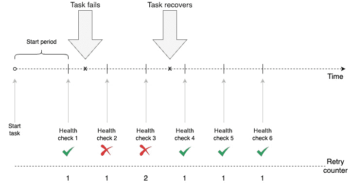

图 15.8 – 服务任务与暂时性健康失败

首先，SwarmKit 会等到启动期结束后才开始探测。然后，我们进行第一次健康检查。不久之后，任务在探测时失败。它连续两次失败，但随后恢复。因此，**健康检查 4**是成功的，SwarmKit 保持任务运行。

在这里，我们可以看到一个任务永久失败的情况：

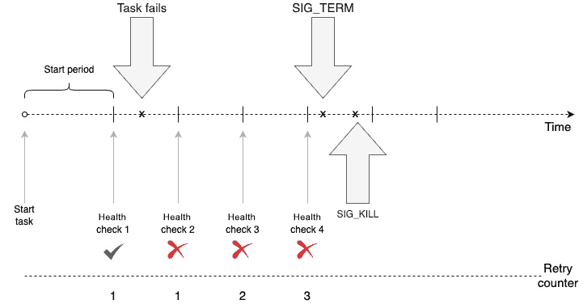

图 15.9 – 任务的永久失败

我们刚刚学习了如何在其镜像的 Dockerfile 中定义服务的健康检查，但这并不是我们能做到的唯一方式。我们还可以在我们用来将应用程序部署到 Docker Swarm 中的`stack`文件中定义健康检查。以下是一个`stack`文件的简短示例：

```
version: "3.8"services:
  web:
    image: example/web:1.0
    healthcheck:
      test: ["CMD", "curl", "-f", http://localhost:3000/health]
      interval: 30s
      timeout: 10s
      retries: 3
      start_period: 60s
...
```

在前面的代码片段中，我们可以看到如何在`stack`文件中定义与健康检查相关的信息。首先，要明确的一点是，我们需要为每个服务单独定义健康检查。在应用程序层面或全局层面并没有健康检查。

与我们之前在 Dockerfile 中定义的相似，SwarmKit 用来执行健康检查的命令是`curl -f http://localhost:3000/health`。我们还定义了`interval`、`timeout`、`retries`和`start_period`，这四个键值对与我们在 Dockerfile 中使用的对应参数意义相同。如果在镜像中定义了与健康检查相关的设置，那么在`stack`文件中定义的设置将覆盖 Dockerfile 中的设置。

现在，让我们尝试使用一个已定义健康检查的服务：

1.  使用`vi`或`nano`创建一个名为`stack-health.yml`的文件，内容如下：

    ```
    version: "3.8"services:  web:    image: nginx:alpine    deploy:      replicas: 3    healthcheck:      test: ["CMD", "wget", "-qO", "-", "http://localhost"]      interval: 5s      timeout: 2s      retries: 3      start_period: 15s
    ```

1.  让我们部署这个：

    ```
    $ docker stack deploy -c stack-health.yml myapp
    ```

1.  我们可以使用`docker stack ps myapp`查看每个集群节点上单个任务的部署情况。因此，在任何特定节点上，我们可以列出所有容器，找到我们堆栈中的一个。在我的示例中，任务 3 被部署到了节点`ip-172-31-32-21`，该节点恰好是主节点。

1.  现在，列出该节点上的容器：

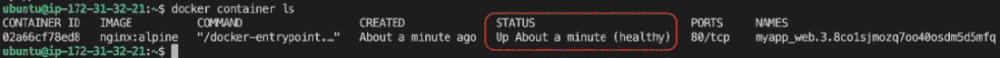

图 15.10 – 显示正在运行的任务实例的健康状态

这个截图中有趣的地方是**状态（STATUS）**列。Docker，或者更准确地说，SwarmKit，已经识别到该服务定义了健康检查功能，并正在使用它来确定服务中每个任务的健康状况。

接下来，让我们看看如果发生问题会怎么样。

## 回滚

有时，事情并不会按预期进行。一个临时修复可能无意中引入了一个新 bug，或者新版本可能显著降低了组件的吞吐量，等等。在这种情况下，我们需要有一个计划 B，这通常意味着能够将更新回滚到先前的良好版本。

与更新一样，回滚必须发生，以确保应用程序没有中断；它需要实现零停机时间。从这个意义上说，回滚可以看作是一个反向更新。我们正在安装一个新版本，但这个新版本实际上是之前的版本。

与更新行为一样，我们可以在`stack`文件中或者在 Docker `service create`命令中声明，系统在需要执行回滚时应该如何行为。在这里，我们使用了之前的`stack`文件，不过这次添加了一些与回滚相关的属性：

```
version: "3.8"services:
  web:
    image: nginx:1.12-alpine
    ports:
    - 80:80
    deploy:
      replicas: 10
    update_config:
      parallelism: 2
      delay: 10s
      failure_action: rollback
      monitor: 10s
    healthcheck:
      test: ["CMD", "wget", "-qO", "-", http://localhost]
      interval: 2s
      timeout: 2s
      retries: 3
      start_period: 2s
```

我们可以创建一个名为`stack-rollback.yaml`的堆栈文件，并将前面的内容添加到其中。在这个内容中，我们定义了滚动更新的细节、健康检查和回滚时的行为。健康检查被定义为在初始等待时间 2 秒后，调度器开始每 2 秒轮询一次`http://localhost`上的服务，并在认为任务不健康之前重试 3 次。

如果我们算一下时间，那么至少需要 8 秒钟，如果任务因为 bug 而不健康，它才会被停止。所以，在`deploy`下，我们有一个新的条目叫做`monitor`。该条目定义了新部署的任务应该监控健康状况多长时间，以及是否继续进行滚动更新的下一个批次。在这个示例中，我们设定了 10 秒钟。这比我们计算出来的发现一个缺陷服务已被部署需要的 8 秒钟稍多一些，所以这是合适的。

我们还定义了一个新的条目，`failure_action`，它定义了在滚动更新过程中遇到故障（例如服务不健康）时编排器将采取的措施。默认情况下，该操作是停止整个更新过程，并将系统置于中间状态。系统并不会完全宕机，因为这是滚动更新，至少一些健康的实例仍然在运行，但运维工程师会更适合检查并修复问题。

在我们的案例中，我们已将该操作定义为回滚。因此，如果发生故障，SwarmKit 将自动将所有已更新的任务恢复到先前的版本。

## 蓝绿部署

在*第九章*，*学习分布式应用架构*中，我们以抽象的方式讨论了蓝绿部署是什么。结果发现，在 Docker Swarm 中，我们无法真正为任意服务实现蓝绿部署。Docker Swarm 中两项服务之间的服务发现和负载均衡是 Swarm 路由网格的一部分，无法（轻松）自定义。

如果**服务 A**想调用**服务 B**，Docker 会隐式地完成这一操作。Docker 会根据目标服务的名称，使用 Docker DNS 服务将该名称解析为 VIP 地址。当请求定向到 VIP 时，Linux IPVS 服务将再次在 Linux 内核 IP 表中查找 VIP，并将请求负载均衡到 VIP 所表示的服务任务的物理 IP 地址之一，如下图所示：

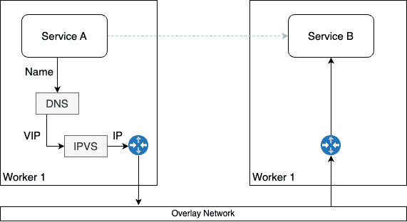

图 15.11 – Docker Swarm 中服务发现和负载均衡是如何工作的

不幸的是，没有简单的方法来拦截这个机制并用自定义行为替换它，但这是实现**服务 B**的真正蓝绿部署所需要的，就如我们在*第十七章*中看到的那样，*使用 Kubernetes 部署、更新和保护应用程序*，Kubernetes 在这方面更为灵活。

话虽如此，我们始终可以以蓝绿方式部署面向公众的服务。我们可以使用**interlock 2**产品及其 7 层路由机制来实现真正的蓝绿部署。

## 金丝雀发布

从技术上讲，滚动更新是一种金丝雀发布（canary release），但由于它们缺乏插入自定义逻辑的接缝，滚动更新仅仅是金丝雀发布的一个非常有限的版本。

真正的金丝雀发布要求我们对更新过程有更细粒度的控制。此外，真正的金丝雀发布在 100%的流量都已经通过新版本时，才会停止使用旧版本的服务。从这个角度来看，它们像蓝绿部署（blue-green deployments）一样被处理。

在金丝雀发布场景中，我们不仅希望使用健康检查等因素作为决定是否将更多流量导向新版本服务的决定因素；我们还希望在决策过程中考虑外部输入，如通过日志聚合器收集和汇总的度量数据或追踪信息。作为决策依据的一个例子是是否符合**服务水平协议**（**SLA**），即新版本的服务响应时间是否超出了容忍带。如果我们向现有服务添加新功能，但这些新功能降低了响应时间，就可能发生这种情况。

现在我们知道如何实现零停机时间部署应用程序，接下来我们想讨论如何在 Swarm 中存储应用程序使用的配置数据。

# 在 Swarm 中存储配置数据

如果我们想要在 Docker Swarm 中存储非敏感数据，比如配置文件，那么我们可以使用 Docker 配置。Docker 配置与 Docker 密钥非常相似，后者我们将在下一节讨论。主要的区别是配置值在静态时不会加密，而密钥会。像 Docker 密钥一样，Docker 配置只能在 Docker Swarm 中使用——也就是说，它们不能在非 Swarm 开发环境中使用。Docker 配置会直接挂载到容器的文件系统中。配置值可以是字符串或二进制值，最大支持 500 KB 大小。

使用 Docker 配置，您可以将配置与 Docker 镜像和容器分离。这样，您的服务就可以轻松地使用特定环境的值进行配置。生产环境的 Swarm 配置与临时环境的 Swarm 配置不同，临时环境的配置与开发或集成环境的配置也不同。

我们可以将配置添加到服务中，也可以从正在运行的服务中移除它们。配置甚至可以在 Swarm 中运行的不同服务之间共享。

现在，让我们创建一些 Docker 配置：

1.  首先，我们从一个简单的字符串值开始：

    ```
    $ echo "Hello world" | docker config create hello-config –
    ```

请注意 `docker config create` 命令末尾的连字符。这意味着 Docker 期望从标准输入获取配置的值。这正是我们通过将 `Hello world` 值通过管道传递给 `create` 命令所做的。

上述命令的输出结果如下所示：

```
941xbaen80tdycup0wm01nspr
```

上述命令创建了一个名为 `hello-config` 的配置，值为“`Hello world`”。该命令的输出是此新配置在 Swarm 中存储的唯一 ID。

1.  让我们看看结果，并使用 `list` 命令查看：

    ```
    $ docker config ls
    ```

这将输出以下内容（已被缩短）：

```
ID       NAME        CREATED            UPDATEDrrin36..  hello-config  About a minute ago   About a minute ago
```

`list` 命令的输出将显示我们刚创建的配置的 `ID` 和 `NAME` 信息，以及其 `CREATED` 和（最后）更新时间。然而，配置是非机密的。

1.  因此，我们可以做更多的操作，甚至输出配置的内容，像这样：

    ```
    $ docker config inspect hello-config
    ```

输出看起来像这样：

```
[    {
        "ID": "941xbaen80tdycup0wm01nspr",
        "Version": {
            "Index": 557
        },
        "CreatedAt": "2023-05-01T15:58:15.873515031Z",
        "UpdatedAt": "2023-05-01T15:58:15.873515031Z",
        "Spec": {
            "Name": "hello-config",
            "Labels": {},
            "Data": "SGVsbG8gd29ybGQK"
        }
    }
]
```

嗯，有趣。在上述 JSON 格式的输出的`Spec`子节点中，我们有一个`Data`键，其值为`SGVsbG8gd29ybGQK`。我们刚刚说配置数据并没有在静止时加密？

1.  结果证明，该值只是我们的字符串编码为`base64`，我们可以轻松验证：

    ```
    $ echo 'SGVsbG8gd29ybGQK' | base64 --decode
    ```

我们得到以下结果：

```
Hello world
```

到目前为止，一切都很顺利。

现在，让我们定义一个稍微复杂一些的 Docker 配置。假设我们正在开发一个 Java 应用程序。Java 传递配置数据到应用程序的首选方式是使用所谓的`properties`文件。`properties`文件只是一个包含键值对列表的文本文件。让我们看一下：

1.  让我们创建一个名为`my-app.properties`的文件，并添加以下内容：

    ```
    username=pguserdatabase=productsport=5432dbhost=postgres.acme.com
    ```

1.  保存文件并从中创建名为`app.properties`的 Docker 配置：

    ```
    $ docker config create app.properties ./my-app.properties
    ```

这给我们一个类似于这样的输出：

```
2yzl73cg4cwny95hyft7fj80u
```

1.  为准备下一个命令，首先安装`jq`工具：

    ```
    $ sudo apt install –y jq
    ```

1.  现在，我们可以使用这个（有点牵强的）命令来获取我们刚刚创建的配置的明文值：

    ```
    $ docker config inspect app.properties | jq .[].Spec.Data | xargs echo | base64 --decode
    ```

我们得到了这个输出：

```
username=pguserdatabase=products
port=5432
dbhost=postgres.acme.com
```

这正是我们预期的。

1.  现在，让我们创建一个使用上述配置的 Docker 服务。为了简单起见，我们将使用`nginx`镜像来实现：

    ```
    $ docker service create \     --name nginx \    --config source=app.properties,target=/etc/myapp/conf/app.properties,mode=0440 \    nginx:1.13-alpine
    ```

这导致类似以下的输出：

```
svf9vmsjdttq4tx0cuy83hpgfoverall progress: 1 out of 1 tasks
1/1: running [==================================================>]
verify: Service converged
```

在上述的`service create`命令中，有趣的部分是包含`--config`参数的那一行。通过这一行，我们告诉 Docker 使用名为`app.properties`的配置，并将其挂载为一个文件到容器内的`/etc/myapp/conf/app.properties`。此外，我们希望该文件被赋予`0440`的权限模式，以赋予所有者（root）和组读取权限。

让我们看看我们得到了什么：

```
$ docker service ps nginxID   NAME     IMAGE              NODE            DESIRED STATE   CURRENT STATE           ERROR      PORTS
pvj  nginx.1  nginx:1.13-alpine  ip-172-31-32-21   Running  Running 2 minutes ago
```

在上述输出中，我们可以看到唯一一个服务实例正在节点`ip-172-31-32-21`上运行。在这个节点上，我现在可以列出容器以获取`nginx`实例的 ID：

```
$ docker container lsCONTAINER ID    IMAGE                COMMAND                 CREATED         STATUS               PORTS …
44417e1a70a1    nginx:1.13-alpine    "nginx -g 'daemon of…"   5 minutes ago   Up 5 minutes         80/tcp …
```

最后，我们可以`exec`进入该容器，并输出位于`/etc/myapp/conf/app.properties`文件中的值：

```
$ docker exec 44417 cat /etc/my-app/conf/app.properties
```

请注意，在上述命令中，`44417`代表容器哈希的第一部分。

然后这将给我们预期的值：

```
username=pguserdatabase=products
port=5432
dbhost=postgres.acme.com
```

这一点毫不奇怪；这正是我们预期的。

Docker 配置当然也可以从集群中移除，但前提是它们没有被使用。如果我们尝试移除之前正在使用的配置，而没有先停止并移除服务，我们将会得到以下输出：

```
$ docker config rm app.properties
```

哦不，这不起作用，我们可以从以下输出看到：

```
Error response from daemon: rpc error: code = InvalidArgument desc = config 'app.properties' is in use by the following service: nginx
```

我们得到一个错误消息，Docker 告诉我们该配置正在被我们称为 nginx 的服务使用。这种行为在使用 Docker 卷时我们已经习惯了。

因此，首先我们需要移除服务，然后才能移除配置：

```
$ docker service rm nginxnginx
```

现在应该可以工作了：

```
$ docker config rm app.propertiesapp.properties
```

再次强调，非常重要的一点是 Docker 配置不应该用于存储诸如密码、访问密钥或关键秘密等机密数据。

在下一节中，我们将讨论如何处理机密数据。

# 使用 Docker 秘密保护敏感数据

秘密用于以安全的方式处理机密数据。Swarm 的秘密在静止时和传输中都是安全的。也就是说，当在管理节点上创建一个新秘密时，并且它只能在管理节点上创建，其值会被加密并存储在 raft 一致性存储中。这就是为什么它在静止时是安全的原因。如果一个服务被分配了秘密，那么管理节点会从存储中读取该秘密，解密后将其转发给所有请求该秘密的 swarm 服务实例的容器。由于 Docker Swarm 中的节点间通信使用 `tmpFS` 将数据传递到容器内。默认情况下，秘密会挂载到容器中的 `/run/secrets` 目录，但你可以将其更改为任何自定义文件夹。

需要注意的是，秘密在 Windows 节点上不会被加密，因为 Windows 上没有类似 `tmpfs` 的概念。为了实现与 Linux 节点相同的安全级别，管理员应该加密相应 Windows 节点的磁盘。

## 创建秘密

首先，让我们看看如何实际创建一个秘密：

```
$ echo "sample secret value" | docker secret create sample-secret -
```

该命令创建了一个名为 `sample-secret` 的秘密，其值为 `sample secret value`。请注意，`docker secret create` 命令末尾有一个连字符。这意味着 Docker 期望从标准输入中获取秘密的值。这正是我们通过将 `sample secret value` 管道传递给 `create` 命令所做的。

或者，我们也可以使用文件作为秘密值的来源：

1.  创建一个 `secret-value.txt` 文件，如下所示：

    ```
    $ echo "other secret" > secret-value.txt
    ```

1.  使用以下命令从这个文件创建 Docker 秘密：

    ```
    $ docker secret create other-secret ./secret-value.txt
    ```

在这里，名为 `other-secret` 的秘密值是从名为 `./secret-value.txt` 的文件中读取的。

1.  一旦秘密被创建，就无法访问其值。例如，我们可以列出所有的秘密，得到以下输出：

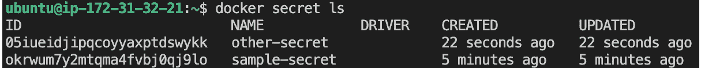

图 15.12 – 所有秘密的列表

在这个列表中，我们只能看到秘密的 `ID` 和 `NAME` 信息，以及一些其他元数据，但秘密的实际值是不可见的。

1.  我们还可以使用 `inspect` 命令来查看一个秘密的更多信息，例如查看 `other-secret`：

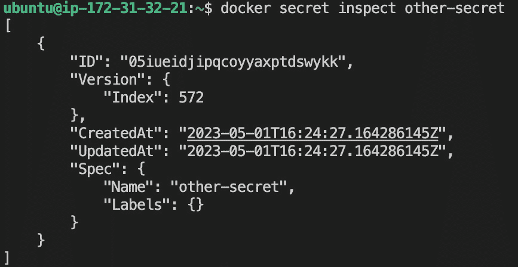

图 15.13 – 检查 swarm 秘密

即使在这里，我们也无法得到秘密的值。这显然是故意的：秘密就是秘密，因此必须保持机密。如果我们愿意，我们可以为秘密分配标签，甚至可以使用不同的驱动程序来加密和解密秘密，如果我们不满意 Docker 默认提供的加密方法。

## 使用秘密

秘密由在 swarm 中运行的服务使用。通常，秘密在创建服务时分配给该服务。因此，如果我们想运行一个名为 `web` 的服务并为其分配一个秘密，比如 `api-secret-key`，语法如下所示：

```
$ docker service create --name web \    --secret api-secret-key \
    --publish 8000:8000 \
    training/whoami:latest
```

该命令基于`fundamentalsofdocker/whoami:latest`镜像创建一个名为`web`的服务，将容器端口`8000`发布到所有集群节点的`8000`端口，并分配给它名为`api-secret-key`的机密。

这只有在`api-secret-key`机密已在集群中定义的情况下才有效；否则，将生成以下错误信息：

```
secret not found: api-secret-key.
```

因此，让我们现在创建这个机密：

```
$ echo "my secret key" | docker secret create api-secret-key -
```

现在，如果我们重新运行`service create`命令，它将成功执行。

现在，我们可以使用`docker service ps web`查找唯一的服务实例部署在哪个节点上，然后`exec`进入这个容器。在我的情况下，实例已部署到`ip-172-31-32-21`节点，这恰好是我正在使用的`manager1` EC2 实例。否则，我需要先 SSH 到另一个节点。

然后，我使用`docker container ls`列出该节点上的所有容器，找到属于我的服务的实例并复制其容器 ID。接下来，我们可以运行以下命令，确保机密确实在容器内以包含机密值的预期文件名可用：

```
$ docker exec -it <container ID> cat /run/secrets/api-secret-key
```

再次说明，在我的情况下，生成的输出如下所示：

```
my secret key
```

这显然是我们预期的结果。我们可以看到机密以明文形式显示。

如果由于某种原因，Docker 在容器内挂载机密的默认位置不符合你的要求，你可以定义一个自定义位置。在以下命令中，我们将机密挂载到`/app/my-secrets`：

```
$ docker service create --name web \    --name web \
    -p 8000:8000 \
    --secret source=api-secret-key,target=/run/my-secrets/api-secret-key \
    fundamentalsofdocker/whoami:latest
```

在这个命令中，我们使用了扩展语法来定义一个包括目标文件夹的机密。

## 在开发环境中模拟机密

在开发过程中，我们通常在机器上没有本地集群。然而，机密仅在集群中有效。那么，我们该怎么办呢？幸运的是，这个答案非常简单。

由于机密被当作文件处理，我们可以轻松地将包含机密的卷挂载到容器的预期位置，默认情况下，该位置是`/run/secrets`。

假设我们在本地工作站上有一个名为`./dev-secrets`的文件夹。对于每个机密，我们都有一个与机密名称相同的文件，文件内容是该机密的未加密值。例如，我们可以通过在工作站上执行以下命令，模拟一个名为`demo-secret`、值为`demo secret value`的机密：

```
$ echo "demo secret value" > ./dev-secrets/sample-secret
```

然后，我们可以创建一个挂载此文件夹的容器，如下所示：

```
$ docker container run -d --name whoami \    -p 8000:8000 \
    -v $(pwd)/dev-secrets:/run/secrets \
    fundamentalsofdocker/whoami:latest
```

容器内运行的进程将无法区分这些挂载的文件和来源于机密的文件。因此，例如，`demo-secret`作为文件`/run/secrets/demo-secret`出现在容器内，并具有预期的值`demo secret value`。让我们在接下来的步骤中更详细地了解这一点：

1.  为了测试这一点，我们可以在前面的容器中`exec`一个 shell：

    ```
    $ docker container exec -it whoami /bin/bash
    ```

1.  现在，我们可以导航到`/run/secrets`文件夹并显示`demo-secret`文件的内容：

    ```
    /# cd /run/secrets/# cat demo-secretdemo secret value
    ```

接下来，我们将讨论秘密和遗留应用程序。

## 秘密和遗留应用程序

有时，我们想要容器化一个我们无法轻易更改，或者不想更改的遗留应用程序。这个遗留应用程序可能希望一个秘密值作为环境变量可用。那么现在我们该怎么处理呢？Docker 将秘密呈现为文件，但该应用程序期望它们以环境变量的形式存在。

在这种情况下，定义一个在容器启动时运行的脚本（所谓的入口点或启动脚本）是非常有帮助的。这个脚本将从相应的文件中读取秘密值，并定义一个与文件同名的环境变量，将读取到的值分配给该变量。对于名为`demo-secret`的秘密，其值应作为名为`DEMO_SECRET`的环境变量可用，启动脚本中的必要代码片段可以如下所示：

```
export DEMO_SECRET=$(cat /run/secrets/demo-secret)
```

类似地，假设我们有一个遗留应用程序，期望秘密值作为条目存在于位于`/app/bin`文件夹中的 YAML 配置文件中，名为`app.config`，其相关部分如下所示：

```
…secrets:
demo-secret: "<<demo-secret-value>>"
other-secret: "<<other-secret-value>>"
yet-another-secret: "<<yet-another-secret-value>>"
…
```

现在，我们的初始化脚本需要从秘密文件中读取秘密值，并将配置文件中相应的占位符替换为秘密值。对于`demo_secret`，可以如下所示：

```
file=/app/bin/app.confdemo_secret=$(cat /run/secret/demo-secret)
sed -i "s/<<demo-secret-value>>/$demo_secret/g" "$file"
```

在前面的代码片段中，我们使用`sed`工具来替换占位符，将其替换为实际值。我们可以对配置文件中的另外两个秘密使用相同的技巧。

我们将所有初始化逻辑放入一个名为`entrypoint.sh`的文件中，使其可执行，并且例如将其添加到容器文件系统的根目录中。然后，我们在 Dockerfile 中将此文件定义为`ENTRYPOINT`，或者我们也可以在`docker container`的`run`命令中覆盖镜像的现有`ENTRYPOINT`。

让我们做个示例。假设我们有一个在容器中运行的遗留应用程序，该容器由`fundamentalsofdocker/whoami:latest`镜像定义，并且该应用程序需要在名为`whoami.conf`的文件中定义一个名为`db_password`的秘密。

让我们来看看这些步骤：

1.  我们可以在本地机器上定义一个名为`whoami.conf`的文件，其中包含以下内容：

    ```
    database:    name: demo    db_password: "<<db_password_value>>"others:    val1=123    val2="hello world"
    ```

重要的是这个代码片段的第 3 行。它定义了启动脚本必须将秘密值放置的位置。

1.  让我们向本地文件夹添加一个名为`entrypoint.sh`的文件，并包含以下内容：

    ```
    file=/app/whoami.confdb_pwd=$(cat /run/secret/db-password)sed -i "s/<<db_password_value>>/$db_pwd/g" "$file" /app/http
    ```

前面脚本的最后一行源自原始 Dockerfile 中使用的启动命令。

1.  现在，改变该文件的权限，使其可执行：

    ```
    $ sudo chmod +x ./entrypoint.sh
    ```

1.  现在，我们定义一个从`fundamentalsofdocker/whoami:latest`镜像继承的 Dockerfile。向当前文件夹添加一个名为`Dockerfile`的文件，其中包含以下内容：

    ```
    FROM fundamentalsofdocker/whoami:latestCOPY ./whoami.conf /app/COPY ./entrypoint.sh /CMD ["/entrypoint.sh"]
    ```

1.  让我们从这个 Dockerfile 中构建镜像：

    ```
    $ docker image build -t secrets-demo:1.0 .
    ```

1.  一旦镜像构建完成，我们可以从中运行服务，但在此之前，我们需要在 Swarm 中定义密钥：

    ```
    $ echo "passw0rD123" | docker secret create demo-secret -
    ```

1.  现在，我们可以创建一个使用以下密钥的服务：

    ```
    $ docker service create --name demo \--secret demo-secret \secrets-demo:1.0
    ```

## 更新密钥

有时，我们需要更新正在运行的服务中的密钥，因为密钥可能会被泄露或被恶意人员（如黑客）窃取。在这种情况下，一旦我们的机密数据被泄露给不可信的实体，它就必须被视为不安全的，因此我们需要更改它。

更新密钥与任何其他更新一样，都需要实现零停机时间。Docker SwarmKit 在这方面提供了支持。

首先，我们在 swarm 中创建一个新的密钥。建议在创建时使用版本控制策略。在我们的示例中，我们将版本作为密钥名称的后缀。我们最初使用名为 `db-password` 的密钥，现在这个密钥的新版本叫做 `db-password-v2`：

```
$ echo "newPassw0rD" | docker secret create db-password-v2 -
```

假设原始服务使用密钥时是这样创建的：

```
$ docker service create --name web \    --publish 80:80
    --secret db-password
    nginx:alpine
```

容器内运行的应用程序可以访问位于 `/run/secrets/db-password` 的密钥。现在，SwarmKit 不允许我们在运行的服务中更新现有密钥，因此我们必须先删除现有的过时版本密钥，然后再添加新的版本。让我们使用以下命令开始删除：

```
$ docker service update --secret-rm db-password web
```

现在，我们可以使用以下命令添加新密钥：

```
$ docker service update \    --secret-add source=db-password-v2,target=db-password \
    web
```

请注意 `--secret-add` 命令的扩展语法，其中包含源和目标参数。

# 总结

在本章中，我们介绍了路由网格，它为 Docker Swarm 提供了第 4 层路由和负载均衡。然后，我们学习了 SwarmKit 如何在不需要停机的情况下更新服务。此外，我们还讨论了 SwarmKit 在零停机部署方面的当前限制。接着，我们展示了如何在 Swarm 中存储配置数据，在本章的最后部分，我们介绍了使用密钥作为提供机密数据给服务的安全方式。

在下一章中，我们将介绍目前最流行的容器编排工具——Kubernetes。我们将讨论在 Kubernetes 集群中定义和运行分布式、具有韧性、稳健性和高可用性的应用程序所使用的对象。此外，本章还将帮助我们了解 MiniKube，这是一个用于在本地部署 Kubernetes 应用程序的工具，并展示 Kubernetes 与 Docker Desktop 的集成。

# 问题

为了评估你的学习进度，请尝试回答以下问题：

1.  用简洁的几句话向感兴趣的外行解释什么是零停机部署。

1.  SwarmKit 如何实现零停机部署？

1.  与传统（非容器化）系统不同，为什么在 Docker Swarm 中回滚操作能够顺利进行？用简短的几句话解释一下。

1.  描述 Docker 密钥的两到三项特性。

1.  你需要推出一个新的库存服务版本。你的命令会是什么样子？以下是一些额外的信息：

    +   新的镜像名为`acme/inventory:2.1`

    +   我们希望使用滚动更新策略，批次大小为两个任务

    +   我们希望系统在每批次之后等待一分钟

1.  你需要通过 Docker 机密更新一个名为`inventory`的现有服务，新的密码通过 Docker 机密提供。新的机密名为`MYSQL_PASSWORD_V2`。服务中的代码期望机密名为`MYSQL_PASSWORD`。更新命令是什么样子的？（请注意，我们不希望更改服务代码！）

# 答案

以下是前面问题的示例答案：

1.  零停机部署意味着分布式应用中的一个服务的新版本可以更新到新的版本，而不需要应用停止工作。通常，使用 Docker SwarmKit 或 Kubernetes（如我们将看到的那样）是以滚动方式完成的。一个服务由多个实例组成，这些实例按批次更新，以确保大多数实例始终处于运行状态。

1.  默认情况下，Docker SwarmKit 使用滚动更新策略来实现零停机部署。

1.  容器是自包含的部署单元。如果部署了一个新的服务版本且未按预期工作，我们（或系统）只需回滚到之前的版本。之前的服务版本也是以自包含的容器形式进行部署的。从概念上讲，向前推进（更新）或向后回滚（撤销）没有区别。一个版本的容器被另一个版本替代。主机本身不会受到这种变化的影响。

1.  Docker 机密在静态存储时是加密的。它们仅传输到使用这些机密的服务和容器。由于 swarm 节点之间的通信使用 mTLS，因此机密是加密传输的。机密永远不会物理存储在工作节点上。

1.  实现这一目标的命令如下：

    ```
    $ docker service update \    --image acme/inventory:2.1 \    --update-parallelism 2 \    --update-delay 60s \    inventory
    ```

1.  首先，我们需要从服务中删除旧的机密，然后我们需要将新版本的机密添加进去（直接更新机密是不可能的）：

    ```
    $ docker service update \    --secret-rm MYSQL_PASSWORD \    inventory$ docker service update \    --secret-add source=MYSQL_PASSWORD_V2, target=MYSQL_PASSWORD \    inventory
    ```

# 第四部分：Docker、Kubernetes 和云

这一部分介绍了当前最流行的容器编排工具。它介绍了用于在集群中定义和运行分布式、弹性、可靠和高可用性应用的核心 Kubernetes 对象。最后，它介绍了 minikube 作为一种在本地部署 Kubernetes 应用的方式，并涵盖了 Kubernetes 与 Mac 的 Docker 和 Docker Desktop 的集成。

+   *第十六章*，*介绍 Kubernetes*

+   *第十七章*，*使用 Kubernetes 部署、更新和保护应用*

+   *第十八章*，*在云中运行容器化应用*

+   *第十九章*，*在生产环境中监控与排查应用程序故障*
