# 16

# 介绍 Kubernetes

本章介绍当前最流行的容器编排工具。它介绍了用于定义和运行分布式、弹性、稳健和高度可用应用程序的 Kubernetes 核心对象。最后，它介绍了 minikube 作为本地部署 Kubernetes 应用程序的一种方式，以及 Kubernetes 与 Docker Desktop 的集成。

我们将讨论以下主题：

+   理解 Kubernetes 架构

+   Kubernetes 主节点

+   集群节点

+   Play with Kubernetes 简介

+   Kubernetes 在 Docker Desktop 中的支持

+   Pod 简介

+   Kubernetes ReplicaSets

+   Kubernetes 部署

+   Kubernetes 服务

+   基于上下文的路由

+   比较 SwarmKit 和 Kubernetes

阅读完本章后，你应该掌握以下技能：

+   在餐巾纸上草拟 Kubernetes 集群的高级架构

+   解释 Kubernetes Pod 的三到四个主要特性

+   用两到三句话描述 Kubernetes ReplicaSets 的作用

+   解释 Kubernetes 服务的两到三个主要职责

+   在 minikube 中创建一个 Pod

+   配置 Docker Desktop 以使用 Kubernetes 作为编排工具

+   在 Docker Desktop 中创建一个 Deployment

+   创建一个 Kubernetes 服务来暴露应用程序服务（内部或外部）到集群中

# 技术要求

在本章中，如果你想跟随代码示例，你需要安装 Docker Desktop 和一个代码编辑器——最好是 Visual Studio Code：

1.  请导航到你克隆示例代码库的文件夹。通常，这应该是`~/The-Ultimate-Docker-Container-Book`：

    ```
    $ cd ~/The-Ultimate-Docker-Container-Book
    ```

1.  创建一个名为`ch16`的新子文件夹，并进入该文件夹：

    ```
    $ mkdir ch16 && cd ch16
    ```

本章讨论的所有示例的完整解决方案可以在`sample-solutions/ch16`文件夹中找到，或者直接访问 GitHub：[`github.com/PacktPublishing/The-Ultimate-Docker-Container-Book/tree/main/sample-solutions/ch16`](https://github.com/PacktPublishing/The-Ultimate-Docker-Container-Book/tree/main/sample-solutions/ch16)。

# 理解 Kubernetes 架构

一个 Kubernetes 集群由一组服务器组成。这些服务器可以是虚拟机或物理服务器，后者也叫裸金属服务器。集群的每个成员都可以有两种角色之一。它要么是 Kubernetes 主节点，要么是（工作）节点。前者用于管理集群，而后者则运行应用程序工作负载。我将工作节点放在括号中，因为在 Kubernetes 术语中，只有在谈到运行应用程序工作负载的服务器时才会提到节点。但在 Docker 和 Swarm 的术语中，相当于工作节点。我认为“工作节点”这一概念更好地描述了服务器的角色，而不仅仅是一个简单的节点。

在一个集群中，你有一个小且奇数数量的主节点，以及根据需要的多个工作节点。小型集群可能只有几个工作节点，而更现实的集群可能有几十个甚至上百个工作节点。从技术上讲，集群可以拥有的工作节点数量没有限制。然而，实际上，当处理成千上万个节点时，某些管理操作可能会出现显著的性能下降。

在 Kubernetes 工作节点上，我们运行的是 Pods。这是一个在 Docker 或 Docker Swarm 中没有的概念。Pod 是 Kubernetes 集群中的原子执行单元。在很多情况下，一个 Pod 只包含一个容器，但一个 Pod 也可以由多个容器共同运行。我们将在本节稍后对 Pods 进行更详细的描述。

集群中的所有成员需要通过物理网络连接，所谓的**底层网络**。Kubernetes 为整个集群定义了一个平面网络。Kubernetes 本身并不提供任何网络实现，而是依赖于第三方的插件。

Kubernetes 只是定义了**容器网络接口**（**CNI**），并将实现留给其他人。CNI 非常简单。它规定，集群中运行的每个 Pod 必须能够与集群中任何其他 Pod 相互连接，而不会发生任何**网络地址转换**（**NAT**）。同样的要求也适用于集群节点和 Pods 之间，即，直接在集群节点上运行的应用程序或守护进程必须能够访问集群中的每个 Pod，反之亦然。

下图展示了 Kubernetes 集群的高级架构：

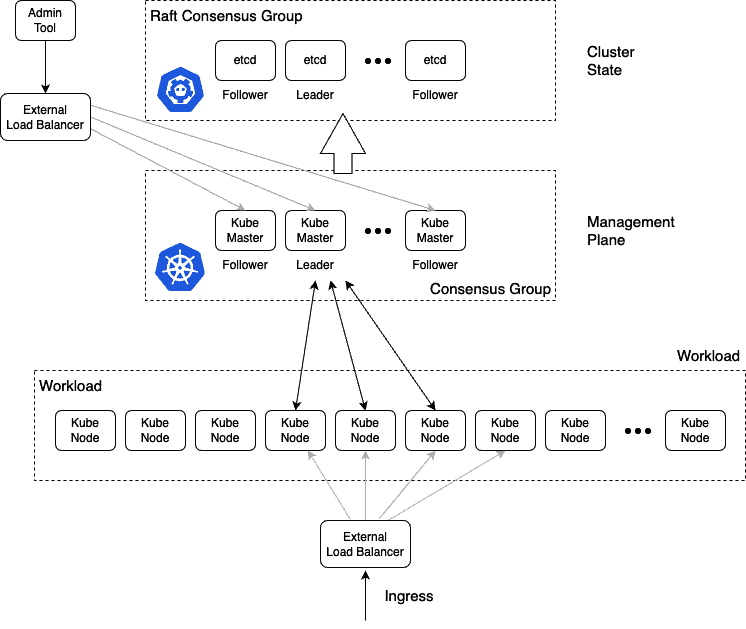

图 16.1 – Kubernetes 的高级架构图

上图的解释如下：

在顶部框中间，我们有一个 `etcd` 节点集群。`etcd` 节点是一个分布式键值存储，在 Kubernetes 集群中用于存储集群的所有状态。`etcd` 节点的数量必须是奇数，正如 Raft 一致性协议所要求的那样，该协议指定了哪些节点用于相互协调。我们谈论集群状态时，并不包括由运行在集群中的应用程序产生或消耗的数据。相反，我们指的是关于集群拓扑、运行的服务、网络设置、使用的密钥等所有信息。也就是说，这个 `etcd` 集群对整个集群至关重要，因此，我们永远不应在生产环境或任何需要高可用性的环境中仅运行单个 `etcd` 服务器。

然后，我们有一个 Kubernetes 主节点集群，它们也在彼此之间形成一个共识组，类似于`etcd`节点。主节点的数量也必须是奇数。我们可以运行一个单主节点的集群，但在生产环境或关键任务系统中，我们绝不应该这样做。在这种情况下，我们应该始终至少有三个主节点。由于主节点用于管理整个集群，因此我们也在讨论管理平面。

主节点使用`etcd`集群作为其后端存储。将**负载均衡器**（**LB**）放在主节点前面，并使用一个知名的**完全限定域名**（**FQDN**），如[`admin.example.com`](https://admin.example.com)，是一种良好的实践。所有用于管理 Kubernetes 集群的工具应该通过这个负载均衡器访问，而不是直接使用其中一个主节点的公共 IP 地址。这在前面图的左上方有展示。

在图的底部，我们有一个工作节点集群。节点的数量可以少到一个，并且没有上限。

Kubernetes 主节点和工作节点彼此通信。这是一种双向通信方式，不同于我们在 Docker Swarm 中看到的那种通信方式。在 Docker Swarm 中，只有管理节点与工作节点通信，而不会有反向通信。所有访问集群中运行的应用程序的入口流量都应该通过另一个负载均衡器。

这是应用程序负载均衡器或反向代理。我们永远不希望外部流量直接访问任何工作节点。

现在我们对 Kubernetes 集群的高层架构有了一个大致的了解，让我们更深入地探讨 Kubernetes 主节点和工作节点。

# Kubernetes 主节点

Kubernetes 主节点用于管理 Kubernetes 集群。以下是这样的主节点的高层次图示：

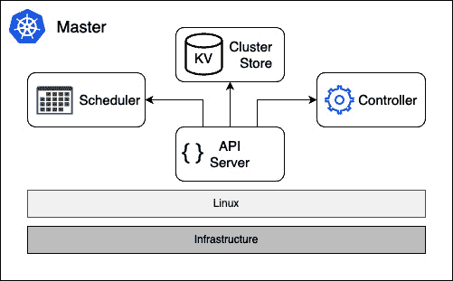

图 16.2 – Kubernetes 主节点

在前面的图的底部，我们有基础设施，它可以是本地或云端的虚拟机，或者本地或云端的服务器（通常称为裸金属）。

目前，Kubernetes 主节点仅在 Linux 上运行。支持最流行的 Linux 发行版，如 RHEL、CentOS 和 Ubuntu。在这台 Linux 机器上，我们至少有以下四个 Kubernetes 服务在运行：

+   `kubectl`用于管理集群和集群中的应用程序。

+   **控制器**：控制器，或者更准确地说是控制器管理器，是一个控制循环，它通过 API 服务器观察集群的状态并进行更改，尝试将当前状态或有效状态调整为所需状态，如果它们不同的话。

+   **调度器**：调度器是一项服务，它尽力在工作节点上调度 Pods，同时考虑各种边界条件，如资源需求、策略、服务质量要求等。

+   用于存储集群状态所有信息的`etcd`。更准确地说，作为集群存储的`etcd`不一定需要与其他 Kubernetes 服务安装在同一个节点上。有时，Kubernetes 集群配置为使用独立的`etcd`服务器集群，如*图 16.1*所示。但选择使用哪种变体是一个高级管理决策，超出了本书的范围。

我们至少需要一个主节点，但为了实现高可用性，我们需要三个或更多主节点。这与我们在学习 Docker Swarm 的管理节点时学到的非常相似。在这方面，Kubernetes 主节点相当于 Swarm 管理节点。

Kubernetes 主节点从不运行应用工作负载。它们的唯一目的是管理集群。Kubernetes 主节点构建了一个 Raft 共识组。Raft 协议是一种标准协议，通常用于一组成员需要做出决策的场景。它被许多知名的软件产品所使用，如 MongoDB、Docker SwarmKit 和 Kubernetes。有关 Raft 协议的更详细讨论，请参见*进一步阅读*部分中的链接。

在主节点上运行工作负载

有时，特别是在开发和测试场景中，使用单节点 Kubernetes 集群是有意义的，这样它自然就成了主节点和工作节点。但这种场景应该避免在生产环境中使用。

如前所述，Kubernetes 集群的状态存储在`etcd`节点中。如果 Kubernetes 集群需要高可用性，则`etcd`节点也必须配置为 HA 模式，通常意味着我们至少在不同的节点上运行三个`etcd`实例。

我们再一次声明，整个集群状态存储在`etcd`节点中。这包括所有关于集群节点的信息、所有 ReplicaSets、Deployments、Secrets、网络策略、路由信息等。因此，拥有一个强大的备份策略来保护这个键值存储至关重要。

现在，让我们看看将实际运行集群工作负载的节点。

# 集群节点

集群节点是 Kubernetes 调度应用工作负载的节点。它们是集群的工作马。一个 Kubernetes 集群可以有几个、几十个、几百个，甚至几千个集群节点。Kubernetes 从一开始就为高扩展性而构建。别忘了，Kubernetes 是以 Google Borg 为模型构建的，后者已经运行了数万个容器多年：

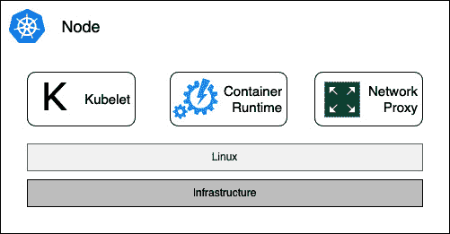

图 16.3 – Kubernetes 工作节点

工作节点——它是集群节点，就像主节点一样——可以在虚拟机、裸金属、内部部署或云中运行。最初，工作节点只能配置在 Linux 上。但自 Kubernetes 1.10 版本以来，工作节点也可以在 Windows Server 2010 或更高版本上运行。拥有包含 Linux 和 Windows 工作节点的混合集群是完全可以接受的。

在每个节点上，我们需要运行以下三项服务：

+   `YAML` 或 `JSON` 格式，它们声明性地描述了一个 Pod。我们将在下一部分了解 Pod 是什么。`PodSpecs` 主要通过 API 服务器提供给 Kubelet。

+   从版本 1.9 起，`containerd` 被用作容器运行时。在此之前，它使用的是 Docker 守护进程。还可以使用其他容器运行时，如 `rkt` 或 `CRI-O`。容器运行时负责管理和运行 Pod 中的各个容器。

+   **kube-proxy**：最后是 kube-proxy。它作为一个守护进程运行，是一个简单的网络代理和负载均衡器，用于所有在该节点上运行的应用服务。

现在我们已经了解了 Kubernetes 的架构以及主节点和工作节点，接下来是介绍我们可以用来开发针对 Kubernetes 应用的工具。

# Play with Kubernetes 介绍

Play with Kubernetes 是一个由 Docker 赞助的免费沙盒，用户可以在其中学习如何使用 Docker 容器并将其部署到 Kubernetes：

1.  访问 [`labs.play-with-k8s.com/`](https://labs.play-with-k8s.com/)。

1.  使用您的 GitHub 或 Docker 凭据登录。

1.  成功登录后，通过点击屏幕左侧的**+ 添加新实例**按钮，创建第一个集群节点或实例。

1.  按照屏幕上的指示创建您的 Kubernetes 沙盒集群的第一个主节点。

1.  使用终端窗口中*步骤 1*中指示的命令初始化集群主节点。最好直接从那里复制命令。命令应如下所示：

    ```
    $ kubeadm init --apiserver-advertise-address \   $(hostname -i) --pod-network-cidr 10.5.0.0/16
    ```

第一个命令参数使用主机名称来广告 Kubernetes API 服务器的地址，第二个命令定义了集群应使用的子网。

1.  接下来，如控制台中的步骤 2 所示，在我们的 Kubernetes 集群中初始化网络（注意，以下命令应为单行）：

    ```
    $ kubectl apply -f https://raw.githubusercontent.com/cloudnativelabs/kube-router/master/daemonset/kubeadm-kuberouter.yaml
    ```

1.  通过再次点击**添加新实例**按钮，创建第二个集群节点。

1.  一旦节点准备就绪，运行在*步骤 4*中输出的`join`命令，其中 `<token-1>` 和 `<token-2>` 是特定于您集群的：

    ```
    $ kubeadm join 192.168.0.13:6443 --token <token-1> \>     --discovery-token-ca-cert-hash <token-2>
    ```

最好直接从 Play with Kubernetes 中的命令行复制正确的命令。

1.  一旦第二个节点加入集群，请在第一个节点上运行以下命令，该节点是您初始化集群的地方，用于列出新集群中的节点集合：

    ```
    $ kubectl get nodes
    ```

输出应该类似于以下内容：

```
NAME    STATUS   ROLES                  AGE     VERSIONnode1   Ready    control-plane,master   6m28s   v1.20.1
node2   Ready    <none>                 32s     v1.20.1
```

请注意，撰写本文时，Play with Kubernetes 使用的是 Kubernetes 1.20.1 版本，这个版本现在已经比较旧了。目前可用的最新稳定版本是 1.27.x。但不用担心，我们示例使用的 1.20.x 版本已经足够。

现在，让我们尝试在这个集群上部署一个 pod。暂时不用担心 *pod* 是什么，我们将在本章后面详细讲解。此时，只需要按现状理解即可。

1.  在你的章节代码文件夹中，创建一个名为 `sample-pod.yaml` 的新文件，并添加以下内容：

    ```
    apiVersion: v1kind: Podmetadata:  name: nginx  labels:    app: nginxspec:  containers:  - name: nginx    image: nginx:alpine    ports:    - containerPort: 80    - containerPort: 443
    ```

1.  现在，为了在 Play with Kubernetes 上运行前述的 pod，我们需要复制前面的 `yaml` 文件内容，并在我们集群的 `node1` 上创建一个新文件：

1.  使用 `vi` 创建一个名为 `sample-pod.yaml` 的新文件。

1.  按下 *I*（字母 “i”）进入 `vi` 编辑器的插入模式。

1.  将复制的代码片段用 *Ctrl* + *V*（或在 Mac 上使用 *Command* + *V*）粘贴到此文件中。

1.  按下 *Esc* 键进入 `vi` 的命令模式。

1.  输入 `:wq` 并按 *Enter* 键保存文件并退出 `vi`。

提示

为什么在示例中使用 Vi 编辑器？它是任何 Linux（或 Unix）发行版中都已安装的编辑器，因此始终可用。你可以在这里找到 Vi 编辑器的快速教程：[`www.tutorialspoint.com/unix/unix-vi-editor.htm`](https://www.tutorialspoint.com/unix/unix-vi-editor.htm)。

1.  现在让我们使用名为 `kubectl` 的 Kubernetes CLI 来部署这个 pod。`kubectl` CLI 已经安装在你 Play with Kubernetes 集群的每个节点上：

    ```
    $ kubectl create -f sample-pod.yaml
    ```

这样做会产生以下输出：

```
pod/nginx created
```

1.  现在列出所有的 pods：

    ```
    $ kubectl get pods
    ```

我们应该看到以下内容：

```
NAME      READY   STATUS    RESTARTS  AGEnginx     1/1     Running      0      51s
```

1.  为了能够访问这个 pod，我们需要创建一个 Service。让我们使用 `sample-service.yaml` 文件，其中包含以下内容：

    ```
    apiVersion: v1kind: Servicemetadata:  name: nginx-servicespec:  type: NodePort  selector:    app: nginx  ports:  - name: nginx-port    protocol: TCP    port: 80    targetPort: http-web-svc
    ```

再次提醒，不必担心此时*Service*究竟是什么，我们稍后会解释。

1.  让我们创建这个 Service：

    ```
    $ kubectl create -f sample-service.yaml
    ```

1.  现在让我们看看 Kubernetes 创建了什么，并列出集群上定义的所有服务：

    ```
    $ kubectl get services
    ```

我们应该看到类似这样的内容：

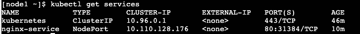

图 16.4 – 服务列表

请注意 `PORT(S)` 列。在我的情况下，Kubernetes 将 Nginx 的 `80` 容器端口映射到 `31384` 节点端口。我们将在下一条命令中使用这个端口。确保你使用的是系统上分配的端口号！

1.  现在，我们可以使用 `curl` 访问该服务：

    ```
    $ curl -4 http://localhost:31384
    ```

我们应该收到 Nginx 欢迎页面作为回应。

1.  在继续之前，请删除你刚才创建的两个对象：

    ```
    $ kubectl delete po/nginx$ kubectl delete svc/nginx-service
    ```

请注意，在前述命令中，`po` 快捷方式相当于 `pod` 或 `pods`。`kubectl` 工具非常灵活，允许使用这样的缩写。同样，`svc` 是 `service` 或 `services` 的缩写。

在接下来的部分，我们将使用 Docker Desktop 及其对 Kubernetes 的支持，运行与本部分相同的 pod 和服务。

# Docker Desktop 中的 Kubernetes 支持

从 18.01-ce 版本开始，Docker Desktop 开始支持开箱即用的 Kubernetes。开发人员如果希望将容器化应用程序部署到 Kubernetes 中，可以使用这个编排工具，而不是 SwarmKit。Kubernetes 支持默认是关闭的，需要在设置中启用。第一次启用 Kubernetes 时，Docker Desktop 需要一些时间来下载创建单节点 Kubernetes 集群所需的所有组件。与 minikube（它也是单节点集群）不同，Docker 工具提供的版本使用了所有 Kubernetes 组件的**容器化**版本：

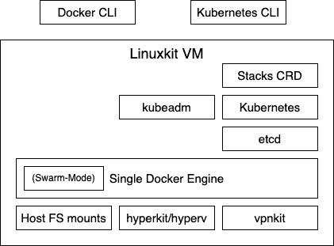

图 16.5 – Docker Desktop 中的 Kubernetes 支持

上述图表大致展示了 Kubernetes 支持是如何被添加到 Docker Desktop 中的。macOS 上的 Docker Desktop 使用 hyperkit 来运行基于 LinuxKit 的虚拟机。Windows 上的 Docker Desktop 使用 Hyper-V 来实现这一结果。在虚拟机内部，安装了 Docker 引擎。引擎的一部分是 SwarmKit，它启用了 Swarm 模式。Docker Desktop 使用 `kubeadm` 工具在虚拟机中设置和配置 Kubernetes。以下三个事实值得一提：Kubernetes 将其集群状态存储在 `etcd` 中；因此，我们在这个虚拟机上运行了 `etcd`。接着，我们有构成 Kubernetes 的所有服务，最后，还有一些支持从 Docker CLI 部署 Docker 堆栈到 Kubernetes 的服务。这个服务不是 Kubernetes 官方发行版的一部分，但它是特定于 Docker 的。

所有 Kubernetes 组件都在 LinuxKit 虚拟机中的容器中运行。这些容器可以通过 Docker Desktop 中的设置进行隐藏。稍后我们将在本节中提供一份完整的 Kubernetes 系统容器列表，前提是你已启用 Kubernetes 支持。

启用 Kubernetes 的 Docker Desktop 相对于 minikube 的一个大优势是，前者允许开发人员使用单一工具构建、测试和运行面向 Kubernetes 的容器化应用程序。甚至可以使用 Docker Compose 文件将多服务应用部署到 Kubernetes 中。

现在让我们动手操作：

1.  首先，我们需要启用 Kubernetes。在 macOS 上，点击菜单栏中的 Docker 图标。在 Windows 上，前往任务栏并选择**首选项**。在弹出的对话框中，选择**Kubernetes**，如以下截图所示：

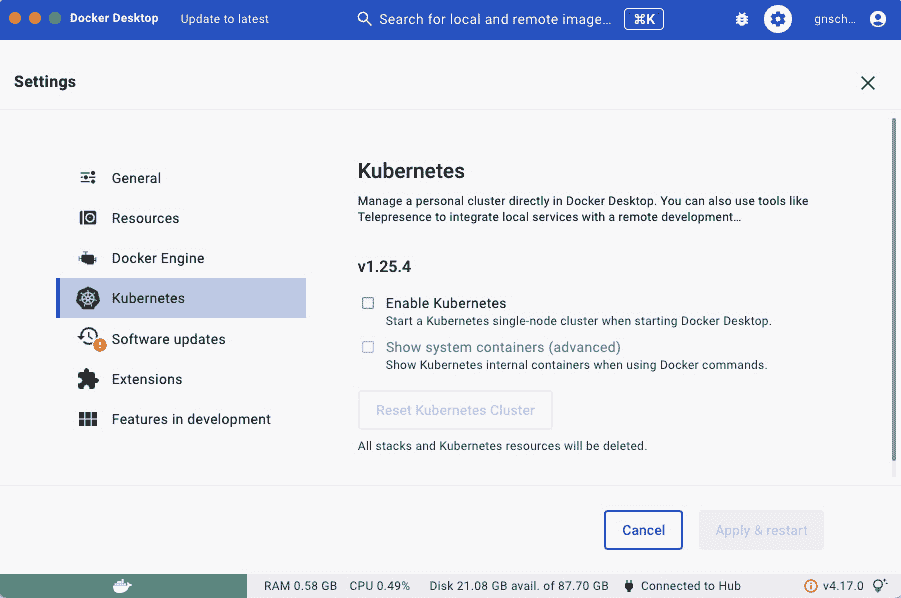

图 16.6 – 在 Docker Desktop 中启用 Kubernetes

1.  然后，勾选**启用 Kubernetes**复选框。还需要勾选**显示系统容器（**高级）**复选框。

1.  然后，点击**应用并重启**按钮。安装和配置 Kubernetes 需要几分钟时间。是时候休息一下，享受一杯好茶了。

1.  安装完成后（Docker 会通过在 `kubectl` 中显示绿色状态图标来通知我们），以便访问后者。

1.  首先，让我们列出我们拥有的所有上下文。我们可以使用以下命令来完成：

    ```
    $ kubectl config get-contexts
    ```

在作者的笔记本电脑上，我们得到以下输出：


图 16.7 - kubectl 的上下文列表

在这里，我们可以看到，在作者的笔记本电脑上，我们有三个上下文，其中两个来自于他使用`kind`。目前，名为`kind-demo`的`kind`上下文仍然处于活动状态，通过`CURRENT`列中的星号标记。

1.  我们可以使用以下命令切换到`docker-desktop`上下文：

    ```
    $ kubectl config use-context docker-desktop
    ```

执行此操作后，会得到以下输出：

```
Switched to context "docker-desktop"
```

1.  现在我们可以使用`kubectl`访问 Docker Desktop 刚创建的集群：

    ```
    $ kubectl get nodes
    ```

我们应该看到类似以下的内容：

```
NAME    STATUS   ROLES             AGE      VERSIONnode1     Ready    control-plane  6m28s   v1.25.9
```

好的，这看起来很熟悉。它与我们在使用 Play with Kubernetes 时看到的几乎相同。作者的 Docker Desktop 使用的 Kubernetes 版本是 1.25.9。我们还可以看到节点是一个`master`节点，由`control-plane`角色指示。

1.  如果我们列出当前在 Docker Desktop 上运行的所有容器，我们会得到以下截图所示的列表（注意，我们使用了`--format`参数来输出容器 ID 和容器名称）：

    ```
    $ docker container list --format "table {{.ID}\t{{.Names}}"
    ```

这将导致以下输出：

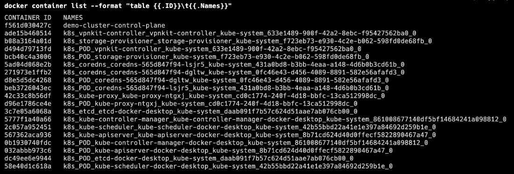

图 16.8 - Kubernetes 系统容器列表

在前面的列表中，我们可以识别出所有组成 Kubernetes 的现在熟悉的组件，如下所示：

+   API 服务器

+   `etcd`

+   `kube-proxy`

+   DNS 服务

+   `kube-controller`

+   `kube-scheduler`

通常，我们不希望将这些系统容器混入我们的容器列表中。因此，我们可以在 Kubernetes 的设置中取消选中**显示系统容器（高级）**复选框。

现在，让我们尝试将 Docker Compose 应用程序部署到 Kubernetes。

1.  进入我们`~/``The-Ultimate-Docker-Container-Book`文件夹的`ch16`子文件夹。

1.  将`docker-compose.yml`文件从示例解决方案复制到此位置：

    ```
    $ cp ../sample-solutions/ch16/docker-compose.yml .
    ```

1.  按照 https://kompose.io/installation/上的说明，在你的机器上安装`kompose`工具：

    +   在 Mac 上，可以通过`$ brew` `install kompose`安装

    +   在 Windows 上，使用`$ choco` `install kubernetes-kompose`

1.  按照以下方式运行`kompose`工具：

    ```
    $ kompose convert
    ```

该工具应该创建四个文件：

+   `db-deployment.yaml`

+   `pets-data-persistentvolumeclaim.yaml`

+   `web-deployment.yaml`

+   `web-service.yaml`

1.  打开`web-service.yaml`文件，在第 11 行（`spec`条目）后，添加`NodePort`条目类型，使其如下所示：

    ```
    ...spec:  type: NodePort  ports:    - name: "3000"...
    ```

1.  现在我们可以使用`kubectl`将这四个资源部署到我们的 Kubernetes 集群：

    ```
    $ kubectl apply –f '*.yaml'
    ```

我们应该看到这个：

```
deployment.apps/db createdpersistentvolumeclaim/pets-data created
deployment.apps/web created
service/web created
```

1.  我们需要找出 Kubernetes 将`3000`服务端口映射到哪个主机端口。使用以下命令来实现：

    ```
    $ kubectl get service
    ```

你应该看到类似以下内容：

```
NAME       TYPE      CLUSTER-IP   EXTERNAL-IP PORT(S)       AGEkubernetes ClusterIP 10.96.0.1    <none>      443/TCP       10d
web        NodePort  0.111.98.154 <none>   3000:32134/TCP   5m33s
```

在我的例子中，我们可以看到服务 web 将 `3000` 端口映射到 `32134` 主机（或节点）端口。在下面的命令中，我必须使用这个端口。在你的情况下，端口号可能会不同。使用你从上一条命令中得到的数字！

1.  我们可以使用 `curl` 测试应用程序：

    ```
    $ curl localhost:32134/pet
    ```

我们将看到它按预期运行：

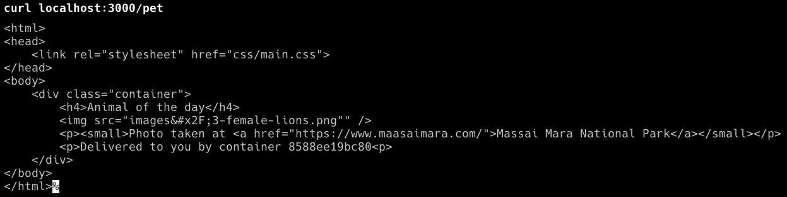

图 16.9 – 宠物应用程序在 Docker Desktop 上的 Kubernetes 环境中运行

现在，让我们看看在前面的部署之后，Kubernetes 上到底有哪些资源。

1.  我们可以使用 `kubectl` 来查看：

    ```
    $ kubectl get all
    ```

这给我们带来了以下输出：

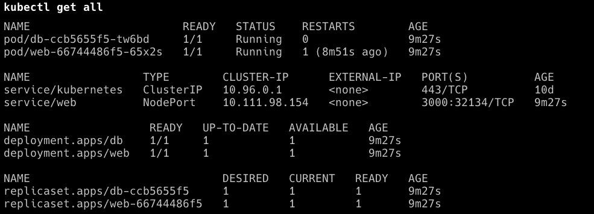

图 16.10 – 列出 Docker stack deploy 创建的所有 Kubernetes 对象

Docker 为 `web` 服务和 `db` 服务创建了一个 Deployment。它还自动为 `web` 创建了一个 Kubernetes 服务，以便在集群内访问。

这可以说相当酷，极大地减少了面向 Kubernetes 作为编排平台的团队在开发过程中遇到的摩擦。

1.  在继续之前，请从集群中删除该堆栈：

    ```
    $ kubectl delete –f '*.yaml'
    ```

现在，我们已经了解了可以用来开发最终将在 Kubernetes 集群中运行的应用程序的工具，接下来是时候了解所有重要的 Kubernetes 对象，这些对象用于定义和管理这样的应用程序。我们将从 pod 开始。

# Pod 介绍

与 Docker Swarm 中的可能性相反，你不能直接在 Kubernetes 集群中运行容器。在 Kubernetes 集群中，你只能运行 pod。**Pod** 是 Kubernetes 中 Deployment 的基本单元。一个 pod 是一个或多个共址容器的抽象，这些容器共享相同的内核命名空间，例如网络命名空间。Docker SwarmKit 中没有类似的概念。多个容器可以共址并共享相同的网络命名空间是一个非常强大的概念。下图展示了两个 pod：

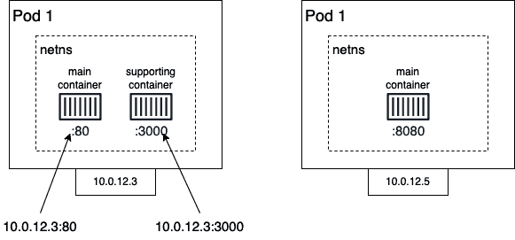

图 16.11 – Kubernetes pods

在前面的图示中，我们有两个 pod，`10.0.12.3` 和 `10.0.12.5`。这两个 pod 都是由 Kubernetes 网络驱动管理的私有子网的一部分。

一个 pod 可以包含一个或多个容器。所有这些容器共享相同的 Linux 内核命名空间，特别是它们共享网络命名空间。这一点通过围绕容器的虚线矩形表示。由于在同一个 pod 中运行的所有容器共享网络命名空间，每个容器需要确保使用自己的端口，因为在一个网络命名空间中不允许重复端口。在这种情况下，在 Pod 1 中，主容器使用的是 `80` 端口，而辅助容器使用的是 `3000` 端口。

来自其他 Pod 或节点的请求可以使用 Pod 的 IP 地址结合相应的端口号来访问单个容器。例如，你可以通过 `10.0.12.3:80` 访问运行在 Pod 1 主容器中的应用程序。

## 比较 Docker 容器和 Kubernetes Pod 网络

现在，让我们比较 Docker 的容器网络与 Kubernetes 的 Pod 网络。在下面的图示中，左边是 Docker，右边是 Kubernetes：

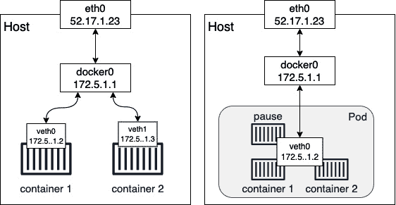

图 16.12 – Pod 中共享同一网络命名空间的容器

当创建 Docker 容器且未指定特定网络时，Docker Engine 会创建一个虚拟以太网（`veth`）端点。第一个容器获得 `veth0`，下一个获得 `veth1`，以此类推。这些虚拟以太网端点连接到 Docker 在安装时自动创建的 Linux 桥接器 `docker0`。流量从 `docker0` 桥接器路由到每个连接的 `veth` 端点。每个容器都有自己的网络命名空间。没有两个容器使用相同的命名空间。这是故意的，目的是将容器内运行的应用程序彼此隔离。

对于 Kubernetes Pod，情况则不同。当创建一个新 Pod 时，Kubernetes 首先创建一个所谓的 `pause` 容器，其目的是创建和管理 Pod 将与所有容器共享的命名空间。除此之外，它没有做任何实际的工作；它只是处于休眠状态。`pause` 容器通过 `veth0` 连接到 `docker0` 桥接器。任何后续加入 Pod 的容器都会使用 Docker Engine 的特殊功能，允许它重用现有的网络命名空间。实现的语法如下所示：

```
$ docker container create --net container:pause ...
```

重要部分是 `--net` 参数，其值为 `container:<container name>`。如果我们以这种方式创建一个新容器，那么 Docker 不会创建一个新的 `veth` 端点；该容器将使用与暂停容器相同的 `veth` 端点。

多个容器共享相同网络命名空间的另一个重要后果是它们相互通信的方式。我们来考虑以下情况：一个 Pod 中包含两个容器，一个监听 `80` 端口，另一个监听 `3000` 端口：

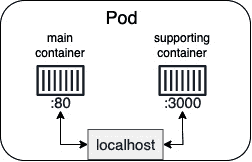

图 16.13 – Pod 中的容器通过 localhost 进行通信

当两个容器使用相同的 Linux 内核网络命名空间时，它们可以通过 `localhost` 相互通信，类似于当两个进程在同一主机上运行时，它们也可以通过 `localhost` 进行通信。

这一点在前面的图示中得到了说明。从 `main` 容器中，容器化的应用程序可以通过 http://localhost:3000 访问支持容器内运行的服务。

## 共享网络命名空间

在了解了这些理论之后，你可能会想知道 Kubernetes 实际上是如何创建一个 Pod 的。

Kubernetes 仅使用 Docker 提供的功能。那么，这种网络命名空间共享是如何工作的呢？首先，Kubernetes 创建了前面提到的所谓 `pause` 容器。

这个容器的唯一作用就是为该 Pod 保留内核命名空间，并保持它们的存活，即使 Pod 内没有其他容器运行。接下来，让我们模拟创建一个 Pod。我们从创建 pause 容器开始，并使用 Nginx 来实现：

```
$ docker container run –detach \    --name pause nginx:alpine
```

现在我们添加第二个容器，命名为 `main`，并将其连接到与 pause 容器相同的网络命名空间：

```
$ docker container run --name main \ -d -it \    --net container:pause \
    alpine:latest ash
```

由于 `pause` 和示例 `containers` 都是同一网络命名空间的一部分，它们可以通过 `localhost` 互相访问。为了证明这一点，我们必须进入主容器执行操作：

```
$ docker exec -it main /bin/sh
```

现在我们可以测试连接到运行在 pause 容器中并监听 `80` 端口的 Nginx。使用 `wget` 工具进行测试时，我们会得到如下结果：

```
/ # wget -qO – localhost
```

这样做会给我们以下输出：

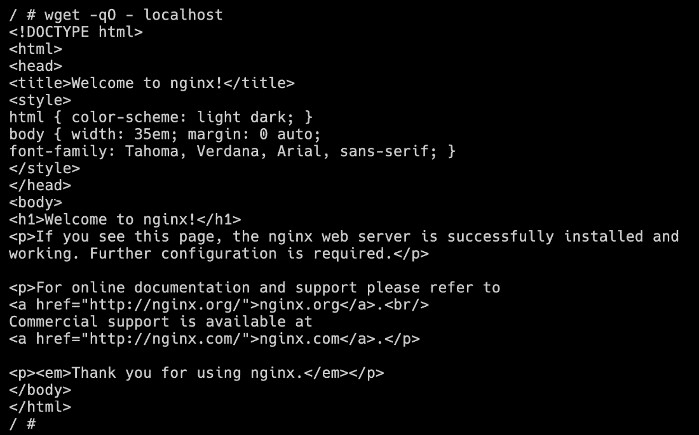

图 16.14 – 两个容器共享相同的网络命名空间

输出结果显示我们确实可以在 `localhost` 上访问 Nginx。这证明了这两个容器共享相同的命名空间。如果这还不够，我们可以使用 `ip` 工具在两个容器中显示 `eth0`，并且会得到完全相同的结果，具体来说，就是相同的 IP 地址，这是 Pod 的一个特征：所有容器共享相同的 IP 地址：

```
/ # ip a show eth0
```

这将显示以下输出：

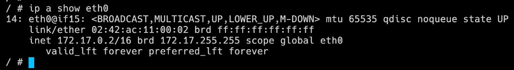

图 16.15 – 使用 ip 工具显示 eth0 的属性

我们使用以下命令检查 `bridge` 网络：

```
$ docker network inspect bridge
```

之后，我们可以看到只列出了 pause 容器：

```
[    {
        "Name": "bridge",
        "Id": "c7c30ad64...",
        "Created": "2023-05-18T08:22:42.054696Z",
        "Scope": "local",
        "Driver": "bridge",
…
        "Containers": {
            "b7be6946a9b...": {
                "Name": "pause",
                "EndpointID": "48967fbec...",
                "MacAddress": "02:42:ac:11:00:02",
                "IPv4Address": "172.17.0.2/16",
                "IPv6Address": ""
            }
        },
...
     }
]
```

上面的输出已被简化以提高可读性。

由于 main 容器复用了 pause 容器的端点，因此它没有在 `Containers` 列表中出现。

在继续之前，请删除两个 `pause` 和 `main` 容器：

```
$ docker container rm pause main
```

接下来，我们将讨论 Pod 的生命周期。

## Pod 生命周期

本书前面提到过，容器有生命周期。容器首先初始化，运行，然后最终退出。当容器退出时，它可以通过退出代码零优雅地退出，或者通过非零退出代码终止，后者相当于发生了错误。

同样，Pod 也有生命周期。由于一个 Pod 可以包含多个容器，因此其生命周期比单一容器的生命周期稍微复杂一些。Pod 的生命周期可以在下图中看到：

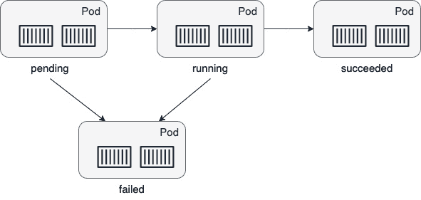

图 16.16 – Kubernetes Pod 的生命周期

当 Pod 在集群节点上创建时，它首先进入 *待处理* 状态。一旦 Pod 的所有容器都启动并运行，Pod 就进入 *运行中* 状态。只有当所有容器成功运行时，Pod 才会进入此状态。如果要求 Pod 终止，它将请求所有容器终止。如果所有容器以退出代码零终止，则 Pod 进入 *成功* 状态。这是理想路径。

现在，让我们看看一些导致 Pod 处于 *失败* 状态的场景。可能有三种情况：

+   如果在 Pod 启动期间，至少有一个容器无法运行并失败（即它退出时返回非零退出代码），则 Pod 会从*待处理*状态转入失败状态。

+   如果 Pod 处于 *运行中* 状态，而其中一个容器突然崩溃或以非零退出代码退出，则 Pod 将从 *运行中* 状态转换为 *失败* 状态。

+   如果要求 Pod 终止，并且在关闭过程中，至少有一个容器以非零退出代码退出，则 Pod 也会进入 *失败* 状态。

现在让我们看看 Pod 的规范。

## Pod 规范

在 Kubernetes 集群中创建 Pod 时，我们可以使用命令式或声明式的方法。我们在本书前面已经讨论过这两种方法的区别，但为了重新表述最重要的方面，使用声明式方法意味着我们编写一个描述我们想要实现的最终状态的清单。我们将省略协调器的细节。我们想要实现的最终状态也被称为期望状态。一般来说，声明式方法在所有成熟的协调器中都受到强烈推荐，Kubernetes 也不例外。

因此，在本章中，我们将专注于声明式方法。Pod 的清单或规范可以使用 `YAML` 或 `JSON` 格式编写。在本章中，我们将专注于 `YAML`，因为它对我们人类来说更易于阅读。让我们来看一个示例规范。以下是 `pod.yaml` 文件的内容，该文件可以在我们 `labs` 文件夹的 `ch16` 子文件夹中找到：

```
apiVersion: v1kind: Pod
metadata:
  name: web-pod
spec:
  containers:
  - name: web
    image: nginx:alpine
    ports:
    - containerPort: 80
```

Kubernetes 中的每个规范都以版本信息开头。Pod 已经存在了一段时间，因此 API 版本是 `v1`。第二行指定了我们想要定义的 Kubernetes 对象或资源类型。显然，在这个例子中，我们想要指定一个 pod。接下来是一个包含元数据的块。最基本的要求是给 pod 起个名字。这里我们称其为 `web-pod`。接下来的块是 `spec` 块，包含 pod 的规范。最重要的部分（也是这个简单示例中唯一的部分）是列出所有属于该 pod 的容器。我们这里只有一个容器，但也可以有多个容器。我们为容器选择的名字是 `web`，容器镜像是 `nginx:alpine`。最后，我们定义了容器暴露的端口列表。

一旦我们编写了这样的规范，就可以使用 Kubernetes CLI `kubectl` 将其应用到集群中：

1.  打开一个新的终端窗口，导航到 `ch16` 子文件夹：

    ```
    $ cd ~/The-Ultimate-Docker-Contianer-Book/ch16
    ```

1.  在这个示例中，我们将使用 Docker Desktop 的 Kubernetes 集群。因此，确保你正在使用正确的 `kubectl` CLI 上下文：

    ```
    $ kubectl config use-context docker-desktop
    ```

这将切换上下文到由 Docker Desktop 提供的 Kubernetes 集群。

1.  在此文件夹中，创建一个名为 `pod.yml` 的新文件，并将提到的 pod 规范添加到该文件中。保存该文件。

1.  执行以下命令：

    ```
    $ kubectl create -f pod.yaml
    ```

这将回应 `pod "web-pod" created`。

1.  然后我们可以列出集群中的所有 pod：

    ```
    $ kubectl get pods
    ```

这样做将为我们提供以下输出：

```
NAME          READY      STATUS     RESTARTS     AGEweb-pod       1/1        Running        0        2m
```

正如预期的那样，我们有一个处于 `Running` 状态的 pod，名称为 `web-pod`，正如定义的那样。

1.  我们可以通过使用 `describe` 命令来获取有关运行中的 pod 的更详细信息：

    ```
    $ kubectl describe pod/web-pod
    ```

这会给我们类似这样的输出：

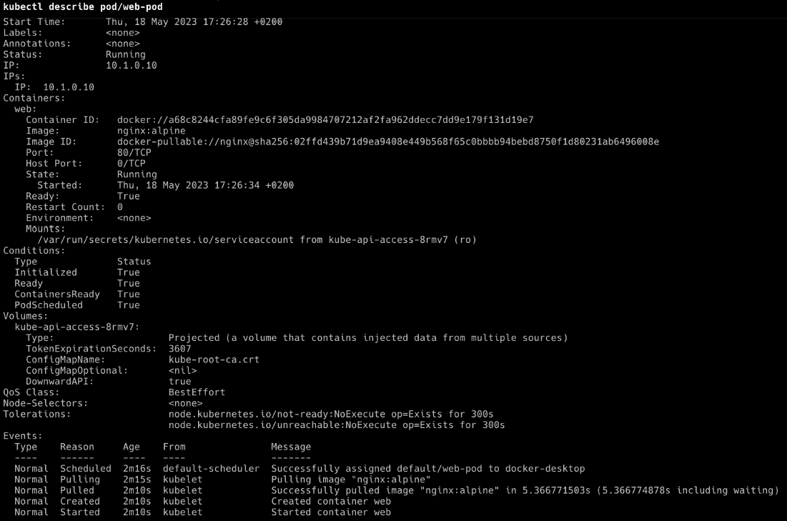

图 16.17 – 描述运行在集群中的 pod

注意

前面部分的 `pod/web-pod` 表示法包括 `describe` 命令。其他变体也是可能的。例如，`pods/web-pod`、`po/web-pod`、`pod` 和 `po` 都是 `pods` 的别名。

`kubectl` 工具定义了许多别名，以使我们的生活更加轻松。

`describe` 命令为我们提供了大量有关 pod 的有价值的信息，其中之一是发生并影响该 pod 的事件列表。该列表会显示在输出的最后。

`Containers` 部分中的信息与我们在 `docker container` `inspect` 输出中找到的非常相似。

我们还可以看到一个 `Volumes` 部分，其中有一个 `Projected` 条目类型。它包含集群的根证书作为机密。我们将在下一章讨论 Kubernetes 的机密。另一方面，卷将在接下来讨论。

## Pod 和卷

在关于容器的章节中，我们了解了卷及其作用：访问和存储持久数据。由于容器可以挂载卷，因此 pod 也可以。实际上，真正挂载卷的是 pod 中的容器，但这只是一个语义上的细节。首先，让我们看看如何在 Kubernetes 中定义一个卷。Kubernetes 支持各种卷类型，因此我们不会深入探讨这个话题。

让我们通过定义一个名为`my-data-claim`的`PersistentVolumeClaim`声明，隐式地创建一个本地卷：

1.  创建一个名为`volume-claim.yaml`的文件，并将以下规范添加到文件中：

    ```
    apiVersion: v1kind: PersistentVolumeClaimmetadata:  name: my-data-claimspec:  accessModes:  - ReadWriteOnce  resources:    requests:      storage: 2Gi
    ```

我们定义了一个请求 2GB 数据的声明。

1.  让我们创建这个声明：

    ```
    $ kubectl create -f volume-claim.yaml
    ```

这将产生如下输出：

```
persistentvolumeclaim/my-data-claim created
```

1.  我们可以使用`kubectl`列出声明（`pvc`是`PersistentVolumeClaim`的快捷方式），命令如下：

    ```
    $ kubectl get pvc
    ```

这将产生如下输出：

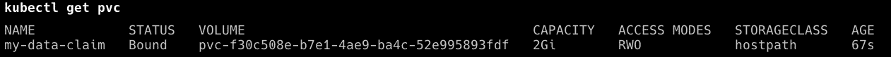

图 16.18 – 集群中 PersistentStorageClaim 对象的列表

在输出中，我们可以看到该声明已经隐式地创建了一个名为`pvc-<ID>`的卷。

1.  在继续之前，请先移除该 pod：

    ```
    $ kubectl delete pod/web-pod
    ```

或者，使用定义 pod 的原始文件，命令如下：

```
$ kubectl delete -f pod.yaml
```

我们现在可以在 pod 中使用该声明创建的卷了。让我们使用之前使用的修改版 pod 规范：

1.  创建一个名为`pod-with-vol.yaml`的文件，并将以下规范添加到文件中：

    ```
    apiVersion: v1kind: Podmetadata:  name: web-podspec:  containers:  - name: web    image: nginx:alpine    ports:    - containerPort: 80    volumeMounts:    - name: my-data      mountPath: /data  volumes:  - name: my-data    persistentVolumeClaim:      claimName: my-data-claim
    ```

在最后四行的`volumes`块中，我们定义了一个我们希望在该 pod 中使用的卷列表。我们在这里列出的卷可以被 pod 的任何容器使用。在我们的例子中，我们只有一个卷。我们指定了一个名为`my-data`的卷，它是一个持久卷声明，声明名称就是我们刚刚创建的那个。

然后，在容器规范中，我们有`volumeMounts`块，在这里我们定义了要使用的卷，以及容器内卷将挂载的（绝对）路径。在我们的例子中，我们将卷挂载到容器文件系统的`/data`文件夹。

1.  让我们创建这个 pod：

    ```
    $ kubectl create -f pod-with-vol.yaml
    ```

我们也可以使用声明式的方式：

```
$ kubectl apply -f pod-with-vol.yaml
```

1.  然后，我们可以`exec`进入容器，通过导航到`/data`文件夹，创建一个文件并使用以下命令退出容器，以检查卷是否已经挂载：

    ```
    $ kubectl exec -it web-pod -- /bin/sh/ # cd /data/data # echo "Hello world!" > sample.txt/data # exit
    ```

如果我们没错的话，那么这个容器中的数据应该在 pod 的生命周期结束后仍然存在。

1.  因此，让我们删除这个 pod：

    ```
    $ kubectl delete pod/web-pod
    ```

1.  然后，我们将重新创建它：

    ```
    $ kubectl create -f pod-with-vol.yaml
    ```

1.  然后，我们将`exec`进入 pod 的容器：

    ```
    $ kubectl exec -it web-pod  -- ash
    ```

1.  最后，我们输出数据：

    ```
    / # cat /data/sample.txt
    ```

这是前面命令产生的输出：

```
Hello world!
```

这是我们所预期的。

1.  按*Ctrl* + *D*退出容器。

1.  在继续之前，请删除 pod 和持久卷声明。到现在为止，你应该知道怎么做。如果不知道，请回头查看*步骤 4*。

现在我们已经对 Pods 有了较好的理解，让我们研究一下 ReplicaSets 如何帮助管理这些 Pods。

# Kubernetes ReplicaSets

在一个对高可用性有要求的环境中，仅有一个 Pod 是远远不够的。如果 Pod 崩溃了怎么办？如果我们需要更新 Pod 内部的应用程序，但又不能承受任何服务中断怎么办？这些问题表明仅有 Pods 是不足够的，我们需要一个更高级的概念来管理多个相同的 Pod 实例。在 Kubernetes 中，ReplicaSet 用于定义和管理在不同集群节点上运行的多个相同 Pod 的集合。ReplicaSet 定义了容器在 Pod 中运行时使用的容器镜像，以及在集群中运行的 Pod 实例数量等。这些属性以及其他许多属性被称为**期望状态**。

ReplicaSet 负责始终确保实际状态与期望状态的一致性，如果实际状态偏离期望状态。以下是一个 Kubernetes ReplicaSet：

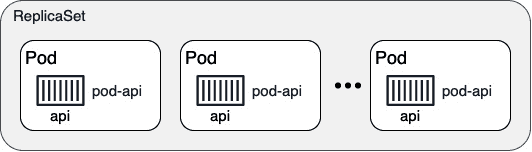

图 16.19 – Kubernetes ReplicaSet

在前面的示意图中，我们可以看到一个 ReplicaSet 管理着多个 Pods。这些 Pods 被称为`pod-api`。ReplicaSet 负责确保在任何给定时间，始终有期望数量的 Pods 在运行。如果某个 Pod 因为某种原因崩溃，ReplicaSet 会在一个有空闲资源的节点上调度一个新的 Pod 替代它。如果 Pod 的数量超过了期望的数量，ReplicaSet 会杀死多余的 Pod。通过这种方式，我们可以说 ReplicaSet 保证了一个自愈且可扩展的 Pod 集合。ReplicaSet 可以包含的 Pod 数量没有上限。

## ReplicaSet 规格

类似于我们对 Pods 的学习，Kubernetes 也允许我们以命令式或声明式的方式定义和创建 ReplicaSet。由于在大多数情况下声明式方法是最推荐的方式，我们将专注于这种方法。让我们来看看一个 Kubernetes ReplicaSet 的示例规格：

1.  创建一个名为`replicaset.yaml`的新文件，并在其中添加以下内容：

    ```
    apiVersion: apps/v1kind: ReplicaSetmetadata:  name: rs-webspec:  selector:    matchLabels:      app: web  replicas: 3  template:    metadata:      labels:        app: web    spec:      containers:      - name: nginx        image: nginx:alpine        ports:        - containerPort: 80
    ```

这看起来与我们之前介绍的 Pod 规格非常相似。那么，我们来集中注意其区别。首先，在第 2 行，我们看到的是`kind`，之前是 Pod，现在是`ReplicaSet`。接着，在第 6 到第 8 行，我们有一个选择器，它决定哪些 Pods 将成为 ReplicaSet 的一部分。在这个例子中，它选择所有标签为`app`且值为`web`的 Pods。然后，在第 9 行，我们定义了希望运行的 Pod 副本数量；在这个例子中是三个副本。最后，我们有`template`部分，它首先定义了元数据，然后定义了规格，其中包含运行在 Pod 内部的容器。在我们的例子中，我们有一个使用`nginx:alpine`镜像并暴露`80`端口的单一容器。

其中真正重要的元素是副本数和选择器，选择器指定了由 ReplicaSet 管理的 Pod 集合。

1.  让我们使用这个文件来创建 ReplicaSet：

    ```
    $ kubectl create -f replicaset.yaml
    ```

这将产生以下结果：

```
replicaset "rs-web" created
```

1.  现在我们列出集群中所有的 ReplicaSets（`rs`是 ReplicaSet 的快捷方式）：

    ```
    $ kubectl get rs
    ```

我们得到了以下结果：

```
NAME        DESIRED  CURRENT   READY    AGErs-web         3       3         3      51s
```

在前面的输出中，我们看到有一个名为`rs-web`的 ReplicaSet，其期望状态是三个（Pod）。当前状态也显示了三个 Pod，并告诉我们所有三个 Pod 都已准备就绪。

1.  我们还可以列出系统中的所有 Pod：

    ```
    $ kubectl get pods
    ```

这将生成以下输出：

```
NAME                       READY   STATUS      RESTARTS   AGErs-web-nbc8m    1/1        Running   0                    4m
rs-web-6bxn5    1/1        Running   0                    4m
rs-web-lqhm5    1/1        Running   0                    4m
```

在这里，我们可以看到我们预期的三个 Pod。Pod 的名称使用了`ReplicaSet`的名称，并附加了一个唯一的 ID。在`READY`列中，我们可以看到 Pod 中定义了多少个容器以及它们中有多少个已准备就绪。在我们的案例中，每个 Pod 只有一个容器，并且每个容器都已准备好。因此，Pod 的整体状态是`Running`。我们还可以看到每个 Pod 被重启了多少次。在我们的例子中，没有任何 Pod 被重启。

接下来，让我们看看 ReplicaSet 是如何帮助我们实现自愈的。

## 自愈

现在，让我们通过随机杀死其中一个 Pod 来测试自愈 ReplicaSet 的魔力，并观察会发生什么：

1.  让我们删除前面列表中的第一个 Pod。确保将 Pod 的名称（`rs-web-nbc8m`）替换为您自己示例中的名称：

    ```
    $ kubectl delete po/rs-web-nbc8m
    ```

上一个命令生成了以下输出：

```
pod "rs-web-nbc8m" deleted
```

1.  现在，让我们再次列出所有 Pod。我们期望只看到两个 Pod，对吗？你错了：

    ```
    NAME                       READY   STATUS      RESTARTS   AGErs-web-4r587    1/1        Running   0                    5srs-web-6bxn5    1/1        Running   0                    4m30srs-web-lqhm5    1/1        Running   0                    4m30
    ```

好的，显然，列表中的第一个 Pod 已经被重新创建，正如我们从`AGE`列中看到的那样。这是自愈功能在起作用。

1.  让我们看看描述 ReplicaSet 时会发现什么：

    ```
    $ kubectl describe rs
    ```

这将给我们以下输出：

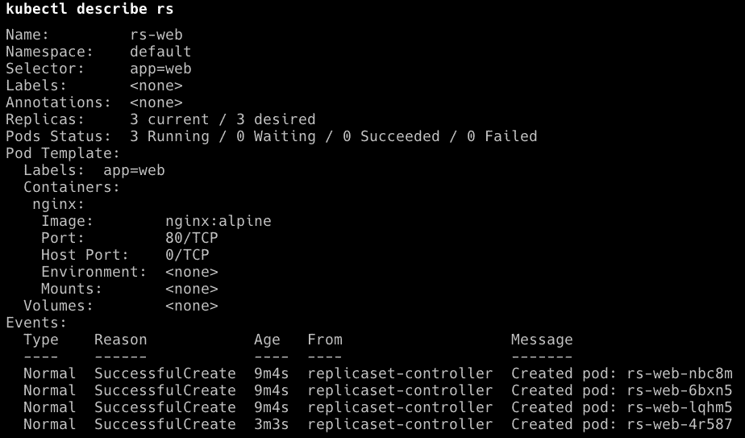

图 16.20 – 描述 ReplicaSet

结果，我们在`Events`下找到了一个条目，告诉我们 ReplicaSet 创建了一个名为`rs-web-4r587`的新 Pod。

1.  在继续之前，请删除 ReplicaSet：

    ```
    $ kubectl delete rs/rs-web
    ```

现在是时候讨论 Kubernetes 的 Deployment 对象了。

# Kubernetes 部署

Kubernetes 非常重视单一职责原则。所有 Kubernetes 对象都被设计为执行一项任务，而且只执行这一项任务，而且它们的设计目标是非常出色地完成这项任务。在这方面，我们必须理解 Kubernetes 的 ReplicaSets 和 Deployments。正如我们所学，ReplicaSet 负责实现和协调应用服务的期望状态。这意味着 ReplicaSet 管理一组 Pod。

**部署（Deployment）**通过在 ReplicaSet 基础上提供滚动更新和回滚功能来增强 ReplicaSet。在 Docker Swarm 中，Swarm 服务结合了 ReplicaSet 和 Deployment 的功能。从这个角度来看，SwarmKit 比 Kubernetes 更加单体化。以下图示展示了 Deployment 与 ReplicaSet 的关系：

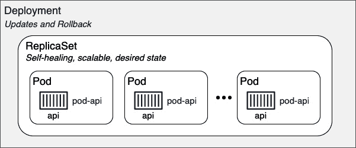

图 16.21 – Kubernetes 部署

在前面的图示中，ReplicaSet 定义并管理一组相同的 pods。ReplicaSet 的主要特点是自我修复、可扩展，并始终尽最大努力使其状态与期望状态一致。而 Kubernetes 部署（Deployment）则在此基础上增加了滚动更新和回滚功能。在这方面，Deployment 是 ReplicaSet 的封装对象。

我们将在 *第十七章* 中深入学习滚动更新和回滚，*使用 Kubernetes 部署、更新和保护应用程序*。

在接下来的章节中，我们将深入了解 Kubernetes 服务以及它们如何实现服务发现和路由。

# Kubernetes 服务

一旦我们开始处理由多个应用服务组成的应用程序，就需要服务发现。以下图示说明了这个问题：

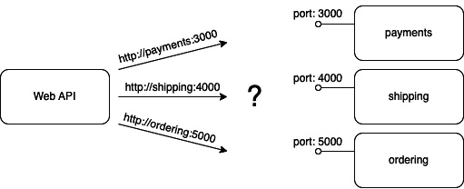

图 16.22 – 服务发现

在前面的图示中，我们有一个 `Web API` 服务，需要访问另外三个服务：`payments`、`shipping` 和 `ordering`。`Web API` 服务不应关心如何以及在哪里找到这三个服务。在 API 代码中，我们只需要使用我们想要访问的服务名称和其端口号。一个示例是以下 URL，[`payments:3000`](http://payments:3000)，它用于访问 `payments` 服务的一个实例。

在 Kubernetes 中，支付应用服务由一个 ReplicaSet 的 pods 表示。由于高度分布式系统的特性，我们不能假设 pods 拥有稳定的端点。pod 可以随时出现或消失。如果我们需要从内部或外部客户端访问相应的应用服务，这将是个问题。如果我们不能依赖 pod 端点的稳定性，我们还能做什么呢？

这就是 **Kubernetes 服务** 发挥作用的地方。它们旨在为 ReplicaSets 或 Deployments 提供稳定的端点，如下所示：

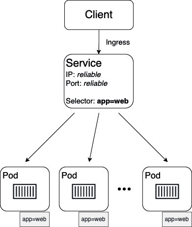

图 16.23 – Kubernetes 服务为客户端提供稳定的端点

在前面的图示中，我们可以看到一个 Kubernetes 服务。它提供了一个可靠的集群级 IP 地址，也叫做 `app=web`；也就是说，所有具有名为 `app` 且值为 `web` 的标签的 pod 都会被代理。

在接下来的章节中，我们将深入了解基于上下文的路由以及 Kubernetes 如何减轻这一任务。

# 基于上下文的路由

我们经常需要为 Kubernetes 集群配置基于上下文的路由。Kubernetes 提供了多种方式来实现这一点。目前，首选且最具可扩展性的方法是使用 IngressController。以下图示尝试说明这个 ingress 控制器是如何工作的：

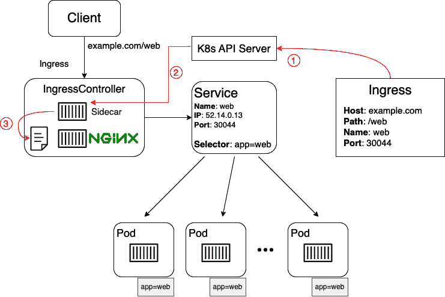

图 16.24 – 使用 Kubernetes Ingress 控制器的基于上下文的路由

在前面的图中，我们可以看到当使用 IngressController（如 Nginx）时，基于上下文（或第七层）路由是如何工作的。在这里，我们有一个名为 `web` 的应用服务的部署。这个应用服务的所有 Pod 都有以下标签：`app=web`。然后，我们有一个名为 `web` 的 Kubernetes 服务，它为这些 Pod 提供一个稳定的端点。该服务的虚拟 IP 是 `52.14.0.13`，并且暴露了 `30044` 端口。也就是说，如果有请求到达 Kubernetes 集群的任何节点，并请求 `web` 名称和 `30044` 端口，那么这个请求会被转发到这个服务。然后，服务会将请求负载均衡到其中一个 Pod。

到目前为止，一切顺利，但如何将来自客户端的 ingress 请求路由到 `http[s]://example.com/web` URL 并定向到我们的 Web 服务呢？首先，我们必须定义从基于上下文的请求到相应的 `<服务名>/<端口>` 请求的路由。这是通过 Ingress 对象实现的：

1.  在 Ingress 对象中，我们将 Host 和 Path 定义为源，(服务) 名称和端口为目标。当 Kubernetes API 服务器创建这个 Ingress 对象时，作为 sidecar 运行的 IngressController 进程会拾取这个变化。

1.  修改 Nginx 反向代理的配置文件。

1.  通过添加新路由，要求 Nginx 重新加载其配置，因此，它将能够正确地将任何传入的请求路由到 `http[s]://example.com/web`。

在下一节中，我们将通过对比每种调度引擎的一些主要资源，来比较 Docker SwarmKit 和 Kubernetes。

# 比较 SwarmKit 和 Kubernetes

现在我们已经了解了 Kubernetes 中一些最重要资源的许多细节，接下来比较这两种调度器 SwarmKit 和 Kubernetes 时，通过匹配重要资源来帮助理解。让我们来看看：

| **SwarmKit** | **Kubernetes** | **描述** |
| --- | --- | --- |
| Swarm | 集群 | 由各自的调度器管理的服务器/节点集。 |
| 节点 | 集群成员 | 作为 Swarm/集群成员的单个主机（物理或虚拟）。 |
| 管理节点 | 主节点 | 管理 Swarm/集群的节点。这是控制平面。 |
| 工作节点 | 节点 | 运行应用工作负载的 Swarm/集群成员。 |
| 容器 | 容器** | 运行在节点上的容器镜像实例。**注：在 Kubernetes 集群中，我们不能直接运行容器。 |
| 任务 | Pod | 运行在节点上的服务实例（Swarm）或副本集（Kubernetes）。一个任务管理一个容器，而一个 Pod 包含一个或多个容器，这些容器共享相同的网络命名空间。 |
| 服务 | 副本集 | 定义并协调由多个实例组成的应用服务的期望状态。 |
| 服务 | 部署 | 部署是带有滚动更新和回滚功能的 ReplicaSet。 |
| 路由网格 | 服务 | Swarm 路由网格提供基于 IPVS 的 L4 路由和负载均衡。Kubernetes 服务是一个抽象，定义了一组逻辑上的 pods 和一种可用于访问它们的策略。它是一个稳定的端点，指向一组 pods |
| 堆栈 | 堆栈** | 应用程序的定义由多个（Swarm）服务组成。**注意：虽然堆栈在 Kubernetes 中并不是原生支持的，但 Docker 工具 Docker Desktop 会将它们转换为 Kubernetes 集群的部署 |
| 网络 | 网络策略 | Swarm **软件定义网络**（**SDNs**）用于防火墙容器。Kubernetes 只定义了一个单一的扁平网络。除非显式定义网络策略来约束 pod 之间的通信，否则每个 pod 都可以访问其他 pod 和/或节点 |

这就结束了我们对 Kubernetes 的介绍，它目前是最流行的容器编排引擎。

# 总结

在本章中，我们学习了 Kubernetes 的基础知识。我们概述了其架构，并介绍了用于在 Kubernetes 集群中定义和运行应用程序的主要资源。我们还介绍了 minikube 和 Docker Desktop 中的 Kubernetes 支持。

在下一章中，我们将把应用程序部署到 Kubernetes 集群中。然后，我们将使用零停机策略更新该应用程序的某个服务。最后，我们将使用密钥对在 Kubernetes 中运行的应用程序服务进行敏感数据的加密。敬请期待！

# 进一步阅读

以下是包含有关我们在本章中讨论的各种主题的详细信息的文章列表：

+   *Raft 共识* *算法*：[`raft.github.Io/`](https://raft.github.Io/)

+   *Kubernetes* *文档*：[`kubernetes.io/docs/home/`](https://kubernetes.io/docs/home/)

# 问题

请回答以下问题以评估您的学习进度：

1.  Kubernetes 集群的高层次架构是什么？

1.  用几句话简要解释 Kubernetes master 的角色。

1.  列出每个 Kubernetes（工作节点）节点上需要具备的元素。

1.  我们无法在 Kubernetes 集群中运行单独的容器。

    1.  正确

    1.  错误

1.  Kubernetes pod 的三个主要特性是什么？

1.  解释为什么 pod 中的容器可以使用 `localhost` 相互通信。

1.  pod 中所谓的 `pause` 容器的作用是什么？

1.  Bob 告诉你：“我们的应用程序由三个 Docker 镜像组成：`web`、`inventory` 和 `db`。由于我们可以在 Kubernetes pod 中运行多个容器，所以我们打算将应用程序的所有服务部署到一个 pod 中。”列出三到四个原因，解释为什么这是一个不好的主意。

1.  用您自己的话解释为什么我们需要 Kubernetes ReplicaSets。

1.  在什么情况下我们需要 Kubernetes Deployments？

1.  Kubernetes 服务的主要职责是什么？

1.  列出至少三种 Kubernetes 服务类型，并解释它们的目的及其差异。

1.  如何创建一个 Kubernetes 服务，将应用程序服务内部暴露在集群中？

# 答案

以下是本章中提出问题的一些示例答案：

1.  Kubernetes 集群由控制平面（Kubernetes Master）和多个工作节点组成。控制平面负责维持集群的期望状态，例如正在运行的应用程序和它们使用的容器镜像。工作节点是应用程序部署和运行的服务器。

1.  Kubernetes master 负责管理集群。所有创建对象、重新调度 Pod、管理 ReplicaSet 等请求都发生在 master 上。master 不在生产环境或类似生产环境的集群中运行应用程序工作负载。

1.  在每个工作节点上，我们有 kubelet、代理和容器运行时。

1.  答案是 *A. 正确*。你不能在 Kubernetes 集群上运行独立的容器。Pod 是该集群中部署的最小单元。

1.  Kubernetes Pod 是 Kubernetes 中最小的可部署单元。它可以运行一个或多个共址的容器。以下是三个主要特点：

    1.  一个 Pod 可以封装多个紧密耦合且需要共享资源的容器。

    1.  Pod 中的所有容器共享相同的网络命名空间，这意味着它们可以使用 `localhost` 相互通信。

    1.  每个 Pod 在集群内都有一个独特的 IP 地址。

1.  所有在 Pod 内运行的容器共享相同的 Linux 内核网络命名空间。因此，这些容器内运行的所有进程可以通过 `localhost` 互相通信，类似于在主机上直接运行的进程或应用程序如何通过 `localhost` 进行通信。

1.  `pause` 容器的唯一作用是为在 Pod 中运行的容器保留命名空间。

1.  这是一个不好的想法，因为一个 Pod 的所有容器是共址的，这意味着它们运行在同一个集群节点上。而且，如果多个容器运行在同一个 Pod 中，它们只能一起扩展或缩减。然而，应用程序的不同组件（即 `web`、`inventory` 和 `db`）通常在可扩展性或资源消耗方面有非常不同的需求。`web` 组件可能需要根据流量进行扩展和缩减，而 `db` 组件则有其他组件没有的存储特殊需求。如果我们将每个组件都运行在各自的 Pod 中，我们在这方面会更具灵活性。

1.  我们需要一种机制来在集群中运行多个 Pod 实例，并确保实际运行的 Pod 数量始终与期望数量相符，即使个别 Pod 由于网络分区或集群节点故障而崩溃或消失。ReplicaSet 是提供任何应用程序服务可扩展性和自愈能力的机制。

1.  当我们希望在 Kubernetes 集群中更新应用服务而不导致服务停机时，需要使用 Deployment 对象。Deployment 对象为 ReplicaSets 增加了滚动更新和回滚功能。

1.  Kubernetes 服务是一种抽象方式，用于将运行在一组 Pods 上的应用暴露为网络服务。Kubernetes 服务的主要职责包括以下几点：

    1.  为一组 Pods 提供稳定的 IP 地址和 DNS 名称，帮助发现服务，并支持负载均衡。

    1.  路由网络流量，将其分发到一组 Pods 上，从而提供相同的功能。

    1.  如有必要，允许将服务暴露给外部客户端。

1.  Kubernetes 服务对象用于使应用服务参与服务发现。它们为一组 Pods 提供稳定的端点（通常由 ReplicaSet 或 Deployment 管理）。Kubernetes 服务是定义逻辑 Pods 集合和访问策略的抽象。Kubernetes 服务有四种类型：

    +   每个集群节点上的 `30000` 到 `32767`。

    +   **LoadBalancer**：此类型通过云服务提供商的负载均衡器（如 AWS 上的 ELB）将应用服务暴露到外部。

    +   **ExternalName**：当需要为集群的外部服务（例如数据库）定义代理时使用。

1.  创建 Kubernetes 服务时，通常会创建一个服务配置文件（`YAML` 或 `JSON`），该文件指定所需的服务类型（例如，ClusterIP 用于内部通信），以及选择器标签以识别目标 Pods 和网络流量的端口。然后使用 `kubectl apply` 命令应用此文件。这将创建一个服务，将流量路由到匹配选择器标签的 Pods。
