# 17

# 使用 Kubernetes 部署、更新和保护应用

在上一章中，我们学习了关于容器编排器 Kubernetes 的基础知识。我们对 Kubernetes 的架构进行了概览，并了解了 Kubernetes 用来定义和管理容器化应用的许多重要对象。

在本章中，我们将学习如何将应用程序部署、更新和扩展到 Kubernetes 集群中。我们还将解释如何实现零停机部署，以便无干扰地更新和回滚关键任务应用。最后，我们将介绍 Kubernetes 秘密，作为配置服务和保护敏感数据的一种手段。

本章涵盖以下主题：

+   部署我们的第一个应用

+   定义存活性和就绪性

+   零停机部署

+   Kubernetes 秘密

完成本章后，你将能够完成以下任务：

+   将一个多服务应用部署到 Kubernetes 集群中

+   为你的 Kubernetes 应用服务定义存活探针和就绪探针

+   更新在 Kubernetes 中运行的应用服务，而不会造成停机

+   在 Kubernetes 集群中定义秘密

+   配置应用服务以使用 Kubernetes 秘密

# 技术要求

在本章中，我们将使用本地计算机上的 Docker Desktop。有关如何安装和使用 Docker Desktop 的更多信息，请参阅 *第二章*，*设置工作环境*。

本章的代码可以在这里找到：`main/sample-solutions/ch17`。

请确保你已经按照 *第二章* 中描述的方式克隆了本书的 GitHub 仓库。

在你的终端中，导航到 `~/The-Ultimate-Docker-Container-Book` 文件夹，并创建一个名为 `ch17` 的子文件夹并进入它：

```
$ mkdir ch17 & cd ch17
```

# 部署我们的第一个应用

我们将把我们的宠物应用——我们在 *第十一章* 中首次介绍的，*使用 Docker Compose 管理容器*——部署到 Kubernetes 集群中。我们的集群将使用 Docker Desktop，它提供了一个单节点的 Kubernetes 集群。然而，从部署的角度来看，集群的规模和集群位于云端、公司数据中心或你的工作站并不重要。

## 部署 Web 组件

提醒一下，我们的应用程序由两个应用服务组成：基于 Node 的 Web 组件和后台 PostgreSQL 数据库。在上一章中，我们学习了需要为每个我们想要部署的应用服务定义一个 Kubernetes 部署对象。我们将首先为 Web 组件执行此操作。和本书中一贯的做法一样，我们将选择声明式方式来定义我们的对象：

1.  我们将使用由 Docker Desktop 提供的本地 Kubernetes 单节点集群。确保你的 Docker Desktop 安装中已启用 Kubernetes：

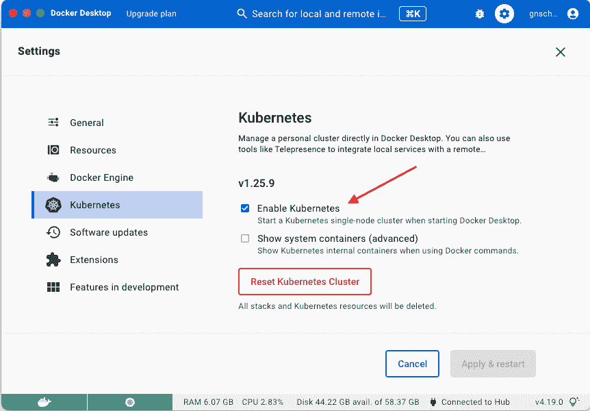

图 17.1 – 在 Docker Desktop 上运行 Kubernetes

1.  在您的代码子文件夹（`ch17`）中，添加一个名为`web-deployment.yaml`的文件，内容如下：


图 17.2 – `web`组件的 Kubernetes 部署定义

前面的部署定义可以在`sample-solutions/ch17`子文件夹中的`web-deployment.yaml`文件中找到。它包含了部署`web`组件所需的指令。代码行如下：

+   第 7 行：我们将`Deployment`对象的名称定义为`web`。

+   第 9 行：我们声明希望运行一个`web`组件的实例。

+   第 11 到 13 行：通过`Selector`，我们定义了哪些 Pods 将成为我们部署的一部分，即那些具有`app`和`service`标签，且值分别为`pets`和`web`的 Pods。

+   第 14 行：在从第 11 行开始的 Pod 模板中，我们定义了每个 Pod 将应用`app`和`service`标签。

+   从第 20 行开始：我们定义了将在 Pod 中运行的唯一容器。容器的镜像是我们熟悉的`fundamentalsofdocker/ch11-web:2.0`镜像，容器的名称将为`web`。

+   第 23 行和第 24 行：值得注意的是，我们声明容器将端口`3000`暴露给传入流量。

1.  请确保您已将`kubectl`的上下文设置为 Docker Desktop。有关如何设置的详细信息，请参见*第二章*，《设置工作环境》。使用以下命令：

    ```
    $ kubectl config use-context docker-desktop
    ```

您将收到以下输出：

```
Switched to context "docker-desktop".
```

1.  我们可以使用以下命令部署此`Deployment`对象：

    ```
    $ kubectl create -f web-deployment.yaml
    ```

前面的命令输出如下信息：

```
deployment.apps/web created
```

1.  我们可以通过 Kubernetes CLI 再次确认该部署是否已创建：

    ```
    $ kubectl get all
    ```

我们应该看到以下输出：

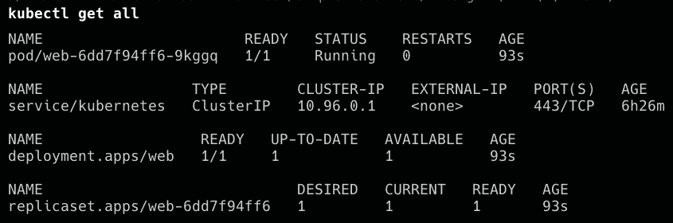

图 17.3 – 列出所有在 Kind 中运行的资源

在前面的输出中，我们可以看到 Kubernetes 创建了三个对象——部署（deployment）、相关的`ReplicaSet`，以及一个 Pod（记住我们指定了只需要一个副本）。当前状态与这三个对象的期望状态一致，所以到目前为止我们没问题。

1.  现在，web 服务需要公开给外部访问。为此，我们需要定义一个 Kubernetes 类型为`NodePort`的`Service`对象。创建一个名为`web-service.yaml`的新文件，并向其中添加以下代码：

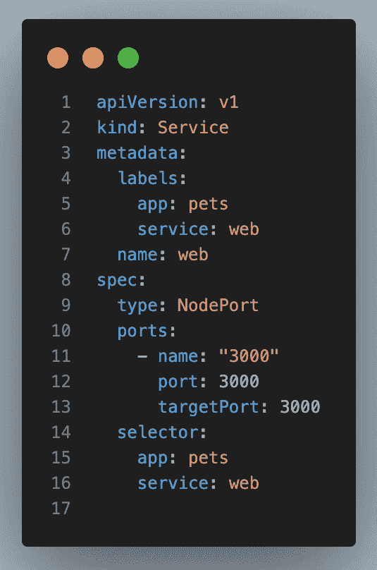

图 17.4 – 我们的 web 组件的 Service 对象定义

再次提醒，相同的文件可以在`sample-solutions/ch17`子文件夹中的`web-service.yaml`文件中找到。

前面的代码行如下：

+   第 7 行：我们将此`Service`对象的名称设置为`web`。

+   第 9 行：我们定义了使用的`Service`对象类型。由于`web`组件必须能够从集群外部访问，因此不能是`ClusterIP`类型的`Service`对象，必须是`NodePort`或`LoadBalancer`类型。在前一章中我们讨论了 Kubernetes 服务的各种类型，因此这里不再详细说明。在我们的示例中，我们使用的是`NodePort`类型的服务。

+   第 10 到 13 行：我们指定希望通过 TCP 协议暴露端口`3000`供访问。Kubernetes 会自动将容器端口`3000`映射到 30,000 到 32,768 范围内的一个空闲主机端口。Kubernetes 最终选择的端口可以通过在服务创建后使用`kubectl get service`或`kubectl describe`命令来确定。

+   第 14 到 16 行：我们定义了此服务将作为稳定端点的 pods 的过滤条件。在这种情况下，它是所有具有`app`和`service`标签且值分别为`pets`和`web`的 pods。

1.  现在我们已经有了`Service`对象的规格说明，我们可以使用`kubectl`来创建它：

    ```
    $ kubectl apply -f web-service.yaml
    ```

1.  我们可以列出所有服务，以查看前面命令的结果：

    ```
    $ kubectl get services
    ```

上述命令会产生以下输出：

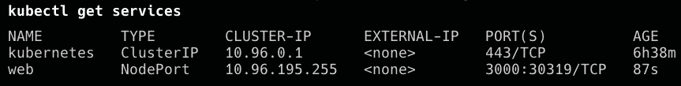

图 17.5 – 为 Web 组件创建的 Service 对象

在前面的输出中，我们可以看到一个名为`web`的服务已被创建。该服务被分配了一个唯一的`ClusterIP`值`10.96.195.255`，并且容器端口`3000`已在所有集群节点的端口`30319`上发布。

1.  如果我们想测试这个部署，可以使用`curl`：

    ```
    $ curl localhost:30319/
    ```

这将导致以下输出：

```
Pets Demo Application
```

正如我们所看到的，响应是`Pets Demo Application`，这是我们预期的结果。Web 服务已在 Kubernetes 集群中启动并运行。接下来，我们将部署数据库。

## 部署数据库

数据库是一个有状态组件，必须与无状态组件（如我们的 Web 组件）不同对待。我们在*第九章*《*学习分布式应用架构*》和*第三章*《*容器编排介绍*》中详细讨论了分布式应用架构中有状态和无状态组件的区别。

Kubernetes 为有状态组件定义了一种特殊类型的`ReplicaSet`对象，这种对象叫做`StatefulSet`。我们使用这种类型的对象来部署数据库。

1.  创建一个名为`db-stateful-set.yaml`的新文件，并将以下内容添加到该文件中：

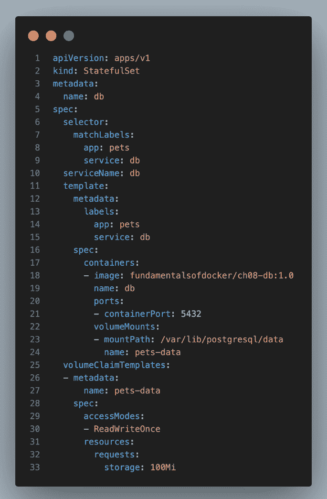

图 17.6 – 用于 DB 组件的 StatefulSet 对象

定义也可以在`sample-solutions/ch17`子文件夹中找到。

好的，看起来有点吓人，但其实不是。它比 web 组件的部署定义稍长，因为我们还需要定义一个卷，用于 PostgreSQL 数据库存储数据。卷索赔定义在第 25 至 33 行。

我们想要创建一个名为 `pets-data` 的卷，其最大大小为 100 MB。在第 22 至 24 行，我们使用此卷，并将其挂载到容器中的 `/var/lib/postgresql/data`，这是 PostgreSQL 期望的位置。在第 21 行，我们还声明 PostgreSQL 正在端口 `5432` 上监听。

1.  像往常一样，我们使用 `kubectl` 部署我们的 `StatefulSet`：

    ```
    $ kubectl apply -f db-stateful-set.yaml
    ```

1.  现在，如果我们列出集群中的所有资源，我们将能够看到创建的额外对象：

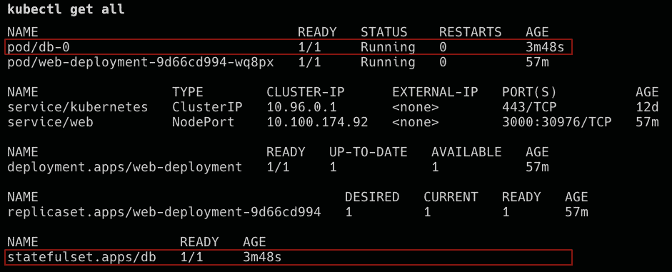

图 17.7 – StatefulSet 及其 pod

在这里，我们可以看到已创建了 `StatefulSet` 和一个 pod。对于两者来说，当前状态与期望状态相符，因此系统是健康的，但这并不意味着此时 `web` 组件可以访问数据库。服务发现不起作用。请记住，`web` 组件希望使用 `db` 服务的名称来访问 `db`。我们在 `server.js` 文件中硬编码了 `db` 主机名。

1.  为了使集群内的服务发现正常工作，我们还必须为数据库组件定义一个 Kubernetes `Service` 对象。由于数据库应仅能从集群内部访问，因此我们需要的 `Service` 对象类型是 `ClusterIP`。

创建一个名为 `db-service.yaml` 的新文件，并将以下规范添加到其中。它可以在 `sample-solutions/ch17` 子文件夹中找到：

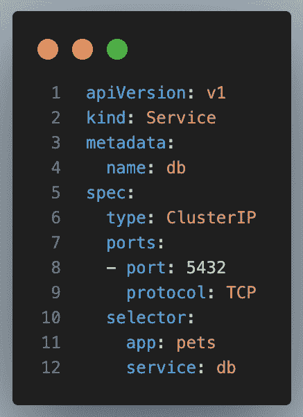

图 17.8 – 为数据库定义的 Kubernetes Service 对象

数据库组件将由此 `Service` 对象表示。它可以通过名称 `db` 进行访问，这是服务的名称，如第 4 行所定义。数据库组件不必公开访问，因此我们决定使用 `ClusterIP` 类型的 `Service` 对象。第 10 至 12 行的选择器定义了该服务代表具有必要标签的所有 pod 的稳定端点 – 即 `app: pets` 和 `service: db`。

1.  让我们使用以下命令部署此服务：

    ```
    $ kubectl apply -f db-service.yaml
    ```

1.  现在，我们应该准备好测试该应用程序了。这次我们可以使用浏览器，欣赏肯尼亚马赛马拉国家公园美丽的动物图像：


图 17.9 – 在 Kubernetes 中运行 pets 应用程序的测试

在这种情况下，端口号 `30317` 是 Kubernetes 自动为我的 `web` `Service` 对象选择的端口号。请将此数字替换为 Kubernetes 分配给您的服务的端口号。您可以使用 `kubectl get services` 命令获取该数字。

这样，我们就成功将宠物应用程序部署到了 Docker Desktop 提供的单节点 Kubernetes 集群中。我们需要定义四个构件才能完成这一操作，它们如下所示：

+   `Deployment` 和 `Service` 对象用于 `web` 组件

+   `StatefulSet` 和 `Service` 对象用于 `database` 组件

要从集群中移除应用程序，我们可以使用以下小脚本：

```
kubectl delete svc/webkubectl delete deploy/web
kubectl delete svc/db
kubectl delete statefulset/db
kubectl delete pvc/pets-data-db-0
```

请注意该脚本的最后一行。我们正在删除 Kubernetes 自动为 `db` 部署创建的持久卷声明。当我们删除 `db` 部署时，这个声明不会被自动删除！持久卷声明与 Docker 卷有点相似（但请注意，它们并不相同）。

使用 `kubectl get pvc` 命令查看机器上所有声明的列表。

接下来，我们将优化部署。

### 精简部署过程

到目前为止，我们已经创建了四个需要部署到集群中的构件。这只是一个非常简单的应用程序，由两个组件组成。试想如果是一个更加复杂的应用程序，它会迅速变成一场维护噩梦。幸运的是，我们有几个方法可以简化部署。我们将在这里讨论的方法是，将组成 Kubernetes 应用程序的所有组件定义在一个文件中。

本书未涉及的其他解决方案包括使用包管理器，例如 Helm（[`helm.sh/`](https://helm.sh/)）或 Kustomize（[`kubernetes.io/docs/tasks/manage-kubernetes-objects/kustomization/`](https://kubernetes.io/docs/tasks/manage-kubernetes-objects/kustomization/)），这是 Kubernetes 的原生解决方案。

如果我们的应用程序包含多个 Kubernetes 对象，例如 `Deployment` 和 `Service` 对象，那么我们可以将它们都保存在一个文件中，并通过三个破折号分隔各个对象定义。例如，如果我们想在一个文件中包含 `web` 组件的 `Deployment` 和 `Service` 定义，文件内容将如下所示：

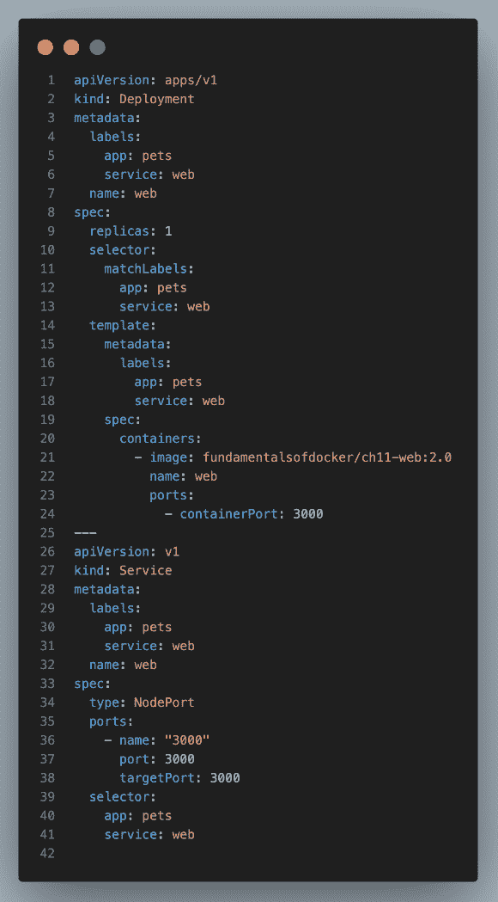

图 17.10 – 单个文件中的 web 组件部署和服务

您可以在 `sample-solutions/ch17/install-web.yaml` 文件中找到此文件。

接下来，我们将所有四个对象定义收集到 `sample-solutions/ch17/install-pets.yaml` 文件中，并可以一次性部署该应用程序：

```
$ kubectl apply -f install-pets.yaml
```

这将给出如下输出：

```
deployment "web" createdservice "web" created
deployment "db" created
service "db" created
```

类似地，我们创建了一个名为 `sample-solutions/ch17/remove-pets.sh` 的脚本，用于从 Kubernetes 集群中删除所有宠物应用程序的构件。请注意，该文件在使用之前已通过 `chmod +x ./remove-pets.sh` 命令设置为可执行文件。现在，我们可以使用以下命令：

```
$ ./remove-pets.sh
```

这将产生如下输出：

```
deployment.apps "web" deletedservice "web" deleted
statefulset.apps "db" deleted
service "db" deleted
persistentvolumeclaim "pets-data-db-0" deleted
```

或者，您可以使用以下命令：

```
$ kubectl delete -f install-pets.yaml
```

这将删除除持久卷声明外的所有资源，而持久卷声明需要手动删除：

```
$ kubectl delete pvc/pets-data-db-0
```

在这一部分，我们已经使用在*第十一章*《使用 Docker Compose 管理容器》中介绍的宠物应用程序，定义了将此应用程序部署到 Kubernetes 集群中所需的所有 Kubernetes 对象。在每个步骤中，我们确保得到了预期的结果，并且一旦所有的工件存在于集群中，我们展示了运行中的应用程序。

# 定义存活性和就绪性

像 Kubernetes 和 Docker Swarm 这样的容器编排系统大大简化了部署、运行和更新高度分布式、关键任务应用程序的过程。编排引擎自动化了许多繁琐的任务，例如上下扩展、确保所需状态始终得到维护等。

然而，编排引擎不能自动完成所有事情。有时，我们开发人员需要提供一些只有我们才能了解的信息来支持引擎。那么，我说的是什么意思呢？

我们来看一个单一的应用服务。假设它是一个微服务，我们称之为服务 A。如果我们将服务 A 容器化并运行在 Kubernetes 集群上，那么 Kubernetes 可以确保我们在服务定义中要求的五个实例始终运行。如果一个实例崩溃，Kubernetes 可以快速启动一个新实例，从而保持所需状态。但是，如果一个服务实例没有崩溃，而是不健康或还没有准备好处理请求呢？Kubernetes 应该知道这两种情况。但它不能，因为从应用服务的角度来看，健康与否超出了编排引擎的知识范畴。只有我们应用程序的开发人员知道我们的服务何时健康，何时不健康。

比如，应用服务可能正在运行，但由于某些 bug 其内部状态可能已经损坏，可能处于无限循环中，或者可能处于死锁状态。

类似地，只有我们这些应用程序开发人员才知道我们的服务是否准备好工作，或者它是否还在初始化中。虽然强烈建议将微服务的初始化阶段尽可能缩短，但如果某些服务需要较长的时间才能准备好工作，通常也无法避免。在初始化状态下并不意味着不健康。初始化阶段是微服务或任何其他应用服务生命周期中的预期部分。

因此，如果我们的微服务处于初始化阶段，Kubernetes 不应尝试杀死它。但是，如果我们的微服务不健康，Kubernetes 应该尽快将其杀死并替换为一个新的实例。

Kubernetes 有探针的概念，提供了协调引擎和应用开发者之间的连接。Kubernetes 使用这些探针来获取有关当前应用服务内部状态的更多信息。探针在每个容器内本地执行。服务的健康状况探针（也叫存活探针）、启动探针和服务的就绪探针都有对应的定义。我们逐一来看它们。

## Kubernetes 存活探针

Kubernetes 使用存活探针来决定何时杀死一个容器，以及何时启动另一个实例来替代它。由于 Kubernetes 在 Pod 层面上操作，如果至少有一个容器报告为不健康，则相应的 Pod 会被杀死。

或者，我们可以换个角度来说：只有当一个 Pod 中的所有容器都报告健康时，Pod 才会被视为健康。

我们可以在 Pod 的规格说明中定义存活探针，如下所示：

```
apiVersion: v1kind: Pod
metadata:
…
spec:
  containers:
  - name: liveness-demo
    image: postgres:12.10
…
    livenessProbe:
      exec:
        command: nc localhost 5432 || exit –1
      initialDelaySeconds: 10
      periodSeconds: 5
```

相关部分在 `livenessProbe` 部分。首先，我们定义一个 Kubernetes 会在容器内执行的命令作为探针。在我们的例子中，我们有一个 `PostreSQL` 容器，使用 `netcat` Linux 工具来探测 `5432` 端口的 TCP。命令 `nc localhost 5432` 成功时，表示 Postgres 已经开始监听此端口。

另外两个设置项，`initialDelaySeconds` 和 `periodSeconds`，定义了 Kubernetes 在启动容器后应该等待多长时间才执行第一次探针，以及之后探针应该以多频繁的间隔执行。在我们的例子中，Kubernetes 等待 10 秒钟后执行第一次探针，然后每隔 5 秒执行一次探针。

还可以使用 HTTP 端点来替代命令进行探测。假设我们运行一个来自镜像 `acme.com/my-api:1.0` 的微服务，且该 API 的端点 `/api/health` 返回状态 `200 (OK)` 表示微服务健康，返回 `50x (Error)` 表示微服务不健康。在这种情况下，我们可以这样定义存活探针：

```
apiVersion: v1kind: Pod
metadata:
…
spec:
  containers:
  - name: liveness
    image: acme.com/my-api:1.0
…
    livenessProbe:
      httpGet:
        path: /api/health
        port: 3000
      initialDelaySeconds: 5
      periodSeconds: 3
```

在上面的代码片段中，我定义了存活探针，使其使用 HTTP 协议，并对 `localhost` 的 `5000` 端口上的 `/api/health` 端点执行 `GET` 请求。记住，探针是在容器内执行的，这意味着我可以使用 localhost。

我们还可以直接使用 TCP 协议来探测容器上的端口。但稍等一下——我们不就是在第一个例子中使用了基于命令的通用存活探针吗？没错，我们确实使用了，但是我们依赖的是容器中是否存在 `netcat` 工具。我们不能假设这个工具总是存在。因此，依赖 Kubernetes 本身来为我们执行基于 TCP 的探测会更好。修改后的 Pod 规格如下：

```
apiVersion: v1kind: Pod
metadata:
…
spec:
  containers:
  - name: liveness-demo
    image: postgres:12.10
…
    livenessProbe:
      tcpSocket:
        port: 5432
      initialDelaySeconds: 10
      periodSeconds: 5
```

这个看起来非常相似。唯一的变化是，探针的类型从 `exec` 更改为 `tcpSocket`，并且我们不再提供命令，而是提供要探测的端口。

请注意，我们也可以在这里使用 Kubernetes 的 `livenessProbe` 配置项中的 `failureThreshold`。在 Kubernetes 中，`livenessProbe` 的失败阈值是指容器重启前必须连续发生的最小失败次数。默认值是 `3`。最小值是 `1`。如果处理程序返回失败代码，`kubelet` 会杀死容器并重新启动它。任何大于或等于 `200` 且小于 `400` 的代码表示成功，其他任何代码表示失败。

让我们试试这个：

1.  将 `sample-solutions/ch17` 文件夹中的 `probes` 子文件夹复制到你的 `ch17` 文件夹中。

1.  使用以下命令构建 Docker 镜像：

    ```
    $ docker image build -t demo/probes-demo:2.0 probes
    ```

1.  使用 `kubectl` 部署在 `probes-demo.yaml` 中定义的示例 pod：

    ```
    $ kubectl apply -f probes/probes-demo.yaml
    ```

1.  描述 pod，并具体分析输出中的日志部分：

    ```
    $ kubectl describe pods/probes-demo
    ```

在大约前半分钟内，你应该看到以下输出：

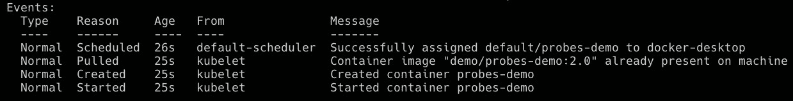

图 17.11 – 健康 pod 的日志输出

1.  等待至少 30 秒，然后再次描述 pod。这时，你应该看到以下输出：

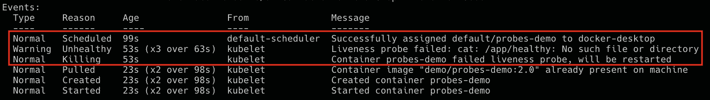

图 17.12 – pod 状态变为不健康后的日志输出

标记的行表示探针失败，并且 pod 即将被重启。

1.  如果你获取 pod 列表，你会看到 pod 已经重启了多次：

    ```
    $ kubectl get pods
    ```

这将导致以下输出：

```
NAME                   READY  STATUS     RESTARTS       AGEprobes-demo  1/1        Running  5 (49s ago)   7m22s
```

1.  完成示例后，使用以下命令删除 pod：

    ```
    $ kubectl delete pods/probes-demo
    ```

接下来，我们将查看 Kubernetes 的就绪探针（readiness probe）。

## Kubernetes 就绪探针（readiness probes）

Kubernetes 使用就绪探针来决定服务实例——即容器——何时准备好接收流量。现在，我们都知道 Kubernetes 部署和运行的是 pod 而非容器，因此讨论 pod 的就绪状态是有意义的。只有当 pod 中的所有容器都报告为“就绪”时，pod 才会被认为是“就绪”的。如果 pod 报告为“未就绪”，Kubernetes 将会把它从服务负载均衡器中移除。

就绪探针的定义与存活探针相同：只需将 pod 配置中的 `livenessProbe` 键切换为 `readinessProbe`。以下是使用我们之前的 pod 配置的示例：

```
…spec:
  containers:
  - name: liveness-demo
    image: postgres:12.10
…
    livenessProbe:
       tcpSocket:
         port: 5432
      failureThreshold: 2
      periodSeconds: 5
    readinessProbe:
      tcpSocket:
        port: 5432
      initialDelaySeconds: 10
      periodSeconds: 5
```

请注意，在这个例子中，由于我们现在有了就绪探针（readiness probe），我们不再需要为存活探针设置初始延迟。因此，我已将存活探针的初始延迟条目替换为一个名为 `failureThreshold` 的条目，表示在发生故障时 Kubernetes 应该重复探测多少次，直到它认为容器不健康。

## Kubernetes 启动探针（startup probes）

对 Kubernetes 来说，知道一个服务实例何时启动通常是很有帮助的。如果我们为容器定义了启动探针，那么只要容器的启动探针未成功，Kubernetes 就不会执行存活探针或就绪探针。一旦所有 Pod 容器的启动探针成功，Kubernetes 就会开始执行容器的存活探针和就绪探针。

鉴于我们已经有了存活探针和就绪探针，什么时候我们需要使用启动探针？可能有一些情况需要考虑异常长的启动和初始化时间，例如在将传统应用程序容器化时。我们本可以通过配置就绪探针或存活探针来解决这个问题，但那样做会违背这些探针的目的。后者的探针旨在快速反馈容器的健康状况和可用性。如果我们配置了长时间的初始延迟或持续时间，反而会影响预期效果。

不出所料，启动探针的定义与就绪探针和存活探针相同。以下是一个示例：

```
spec:  containers:
...
    startupProbe:
      tcpSocket:
        port: 3000
      failureThreshold: 30
      periodSeconds: 5
...
```

确保你定义了`failureThreshold * periodSeconds`的乘积，以便它足够大，能够应对最差的启动时间。

在我们的示例中，最大启动时间不应超过 150 秒。

# 零停机部署

在关键任务环境中，应用程序必须始终保持运行。这些天，我们已经无法容忍停机了。Kubernetes 为我们提供了多种实现这一目标的方法。对集群中的应用程序进行更新而不导致停机被称为**零停机部署**。在本节中，我们将介绍实现这一目标的两种方法，具体如下：

+   滚动更新

+   蓝绿部署

让我们从讨论滚动更新开始。

## 滚动更新

在上一章中，我们了解到 Kubernetes 的`Deployment`对象与`ReplicaSet`对象的区别在于，它在后者的功能基础上增加了滚动更新和回滚功能。让我们使用我们的 Web 组件来演示这一点。我们将需要修改 Web 组件的部署清单或描述。

我们将使用与上一节相同的部署定义，唯一的区别是——我们将运行`web`组件。以下定义也可以在`sample-solutions/ch17/web-deployment-rolling-v1.yaml`文件中找到：

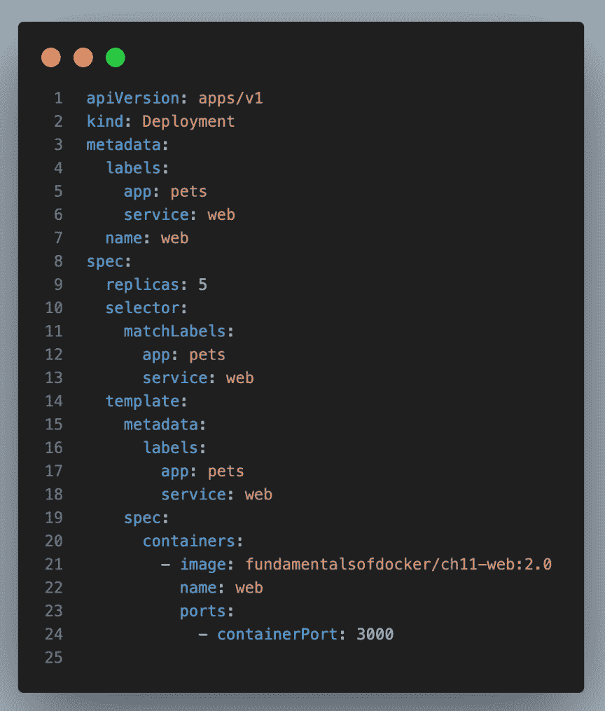

图 17.13 – 带有五个副本的 Web 组件部署

现在，我们可以像往常一样创建这个部署，同时也创建使我们的组件可访问的服务：

```
$ kubectl apply -f web-deployment-rolling-v1.yaml$ kubectl apply -f web-service.yaml
```

一旦我们部署了 Pod 和服务，就可以测试我们的 Web 组件。首先，我们可以使用以下命令获取分配的节点端口：

```
$ PORT=$(kubectl get svc/web -o jsonpath='{.spec.ports[0].nodePort}')
```

接下来，我们可以在`curl`语句中使用`$PORT`环境变量：

```
$ curl localhost:${PORT}/
```

这将提供预期的输出：

```
Pets Demo Application
```

如我们所见，应用程序已经启动并运行，返回了预期的消息，`Pets` `Demo Application`。

我们的开发人员已经创建了 Web 组件的新版本 2.1。新版本的代码可以在`sample-solutions/ch17/web`文件夹中找到，唯一的变化位于`server.js`文件的第 12 行：

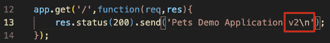

图 17.14 – Web 组件版本 2.0 的代码更改

我们现在可以按如下方式构建新的镜像（将`demo`替换为你的 GitHub 用户名）：

```
$ docker image build -t demo/ch17-web:2.1 web
```

随后，我们可以将镜像推送到 Docker Hub，步骤如下（将`demo`替换为你的 GitHub 用户名）：

```
$ docker image push demo/ch17-web:2.1
```

现在，我们希望更新由属于`web` `Deployment`对象的 pod 使用的镜像。我们可以通过使用`kubectl`的`set image`命令来实现：

```
$ kubectl set image deployment/web \    web=demo/ch17-web:2.1
```

如果我们再次测试该应用程序，我们将得到一个确认，证明更新确实已发生：

```
$ curl localhost:${PORT}/
```

输出显示现在已经安装了版本 2：

```
Pets Demo Application v2
```

那么，我们怎么知道在这次更新过程中没有任何停机时间呢？更新是以滚动方式进行的吗？滚动更新到底是什么意思呢？让我们来探讨一下。首先，我们可以通过使用`rollout` `status`命令，从 Kubernetes 获取确认，确保部署确实已成功完成：

```
$ kubectl rollout status deploy/web
```

命令将返回以下响应：

```
deployment "web" successfully rolled out
```

如果我们使用`kubectl describe deploy/web`描述`web`部署对象，在输出的末尾，我们将看到以下事件列表：

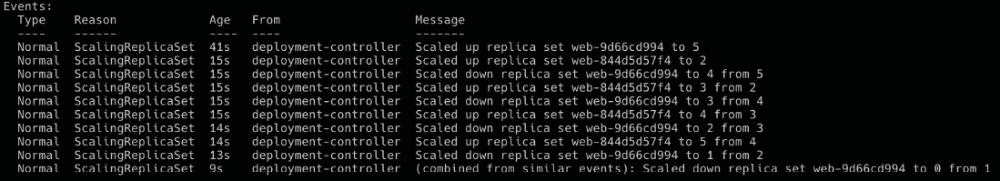

图 17.15 – 在 Web 组件部署描述输出中找到的事件列表

第一个事件告诉我们，在创建部署时，创建了一个名为`web-769b88f67`的`ReplicaSet`对象，包含五个副本。然后，我们执行了`update`命令。事件列表中的第二个事件告诉我们，这意味着创建了一个新的`ReplicaSet`对象，名为`web-55cdf67cd`，最初只有一个副本。因此，在那个特定时刻，系统上存在六个 pod：五个初始 pod 和一个新的版本的 pod。但是，由于`Deployment`对象的期望状态要求只有五个副本，Kubernetes 现在将旧的`ReplicaSet`对象缩减为四个实例，这一点可以从第三个事件中看到。

然后，新的`ReplicaSet`对象被扩展到两个实例，随后，旧的`ReplicaSet`对象被缩减到三个实例，依此类推，直到我们得到了五个新的实例，并且所有旧的实例都被淘汰。尽管我们无法看到发生这些变化的具体时间（除了 3 分钟），但事件的顺序告诉我们，整个更新过程是以滚动方式进行的。

在短时间内，一些 web 服务的调用会从旧版本的组件中得到响应，而另一些调用则会从新版本的组件中得到响应，但服务在任何时候都不会中断。

我们还可以列出集群中的 `ReplicaSet` 对象，以确认我在前面提到的内容：

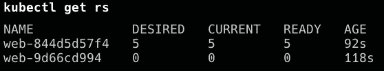

图 17.16 – 列出集群中的所有 ReplicaSet 对象

在这里，我们可以看到新的 `ReplicaSet` 对象有五个实例正在运行，而旧的 `ReplicaSet` 对象已缩减为零实例。旧的 `ReplicaSet` 对象仍然存在的原因是 Kubernetes 允许我们回滚更新，在这种情况下，它会重用该 `ReplicaSet`。

如果在更新镜像时出现一些未检测到的 bug 渗入新代码，我们可以使用 `rollout` `undo` 命令回滚更新：

```
$ kubectl rollout undo deploy/web
```

这将输出以下内容：

```
deployment.apps/web rolled back
```

我们可以像这样测试回滚是否成功：

```
$ curl localhost:${PORT}/
```

如我们所见，输出显示了这一点：

```
Pets Demo Application
```

如果我们列出 `ReplicaSet` 对象，我们将看到以下输出：

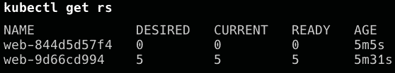

图 17.17 – 回滚后列出 ReplicaSet 对象

这确认了旧的 `ReplicaSet`（`web-9d66cd994`）对象已被重用，而新的 `ReplicaSet` 对象已缩减为零实例。

在继续之前，请删除部署和服务：

```
$ kubectl delete deploy/web$ kubectl delete service/web
```

但是，有时我们无法或不想容忍旧版本与新版本共存的混合状态。我们希望采取全有或全无的策略。这时，蓝绿部署就派上用场了，我们将在接下来的内容中讨论。

## 蓝绿部署

如果我们想为宠物应用程序的 `web` 组件进行蓝绿式部署，可以通过巧妙地使用标签来实现。首先，让我们回顾一下蓝绿部署是如何工作的。以下是一个大致的步骤指南：

1.  将 `web` 组件的第一个版本作为 `blue` 部署。我们将为 pods 添加 `color: blue` 的标签来实现这一点。

1.  为这些带有 `color: blue` 标签的 pods 在 `selector` 部分部署 Kubernetes 服务。

1.  现在，我们可以部署版本 2 的 web 组件，但这次，pods 会有一个 `color: green` 的标签。

1.  我们可以测试服务的绿色版本，以检查它是否按预期工作。

1.  现在，我们可以通过更新 Kubernetes 服务来将流量从 `blue` 切换到 `green`，我们将修改选择器，使其使用 `color:` `green` 标签。

让我们为版本 1 定义一个 `Deployment` 对象，标记为 `blue`：

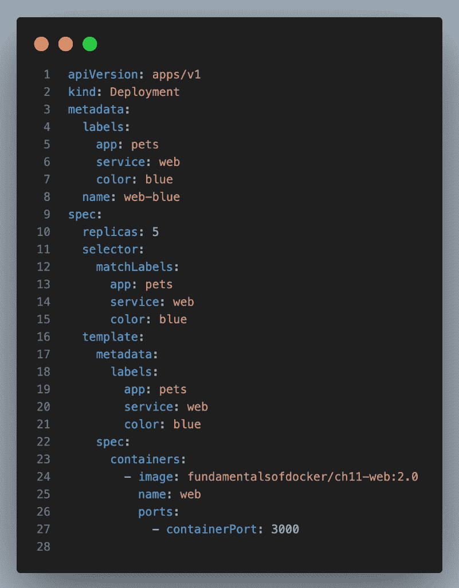

图 17.18 – 为 web 组件指定蓝色部署

上述定义可以在`sample-solutions/ch17/web-deployment-blue.yaml`文件中找到。

请注意第 8 行，在那里我们将部署的名称定义为`web-blue`，以便与即将到来的`web-green`部署区分开来。另外，请注意我们在第 7、15 和 21 行添加了`color: blue`标签。其他内容与之前相同。

现在，我们可以为网页组件定义`Service`对象。它将与我们之前使用的相同，但有一个小的改动，如下图所示：

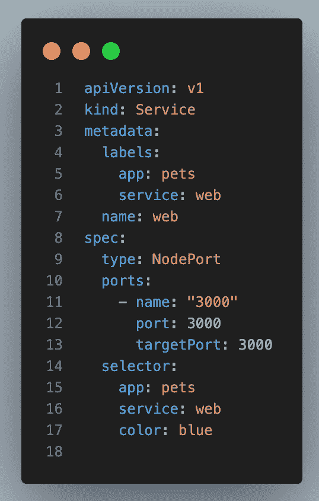

图 17.19 – 支持蓝绿部署的网页组件 Kubernetes 服务

关于本章早些时候使用的服务定义，唯一的区别是第 17 行，它将`color: blue`标签添加到了选择器中。我们可以在`sample-solutions/ch17/web-service-blue-green.yaml`文件中找到上述定义。

然后，我们可以使用以下命令部署蓝色版本的`web`组件：

```
$ kubectl apply -f web-deploy-blue.yaml
```

我们可以使用此命令部署其服务：

```
$ kubectl apply -f web-service-blue-green.yaml
```

一旦服务启动并运行，我们可以确定其 IP 地址和端口号并进行测试：

```
$ PORT=$(kubectl get svc/web -o jsonpath='{.spec.ports[0].nodePort}')
```

然后，我们可以使用`curl`命令访问它：

```
$ curl localhost:${PORT}/
```

这将给我们预期的结果：

```
Pets Demo Application
```

现在，我们可以部署`web`组件的绿色版本。其`Deployment`对象的定义可以在`sample-solutions/ch17/web-deployment-green.yaml`文件中找到，内容如下：

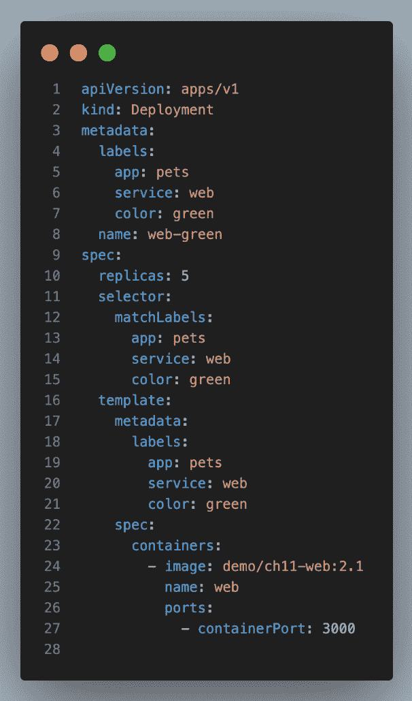

图 17.20 – 网页组件绿色部署规范

有趣的行如下：

+   第 8 行：命名为`web-green`，以便与`web-blue`区分，并支持并行安装

+   第 7、15 和 21 行：颜色为绿色

+   第 24 行：现在使用的是本章前面构建的网页镜像版本 2.1

请不要忘记在第 24 行将`‘’demo‘’`改为你自己的 GitHub 用户名。

现在，我们准备部署这个绿色版本的服务。它应与蓝色服务分开运行：

```
$ kubectl apply -f web-deployment-green.yaml
```

我们可以确保两个部署并存，如下所示：


图 17.21 – 显示集群中运行的部署对象列表

如预期的那样，我们有蓝色和绿色两个版本在运行。我们可以验证蓝色仍然是活跃的服务：

```
$ curl localhost:${PORT}/
```

我们应该仍然收到以下输出：

```
Pets Demo Application
```

现在是有趣的部分：我们可以通过编辑现有的网页组件服务，将流量从`blue`切换到`green`。为此，请执行以下命令：

```
$ kubectl edit svc/web
```

将标签的颜色值从`blue`更改为`green`。然后，保存并退出编辑器。Kubernetes CLI 将自动更新服务。现在，当我们再次查询网页服务时，将得到如下内容：

```
$ curl localhost:${PORT}/
```

这时，我们应该得到以下输出：

```
Pets Demo Application v2
```

这证明了流量确实已经切换到`web`组件的绿色版本（注意`curl`命令响应末尾的`v2`）。

注意

如果我们希望坚持声明式的形式，那么最好更新`web-service-blue-green.yaml`文件并应用新版本，这样所需的状态仍然保存在文件中，避免现实与文件之间可能的不匹配。然而，为了说明，展示的方式是可以接受的。

如果我们意识到绿色部署出现了问题，新版本有缺陷，我们可以通过再次编辑 web 服务并将`color`标签的值替换为蓝色来轻松切换回蓝色版本。这个回滚是瞬时的，并且应该总是有效。然后，我们可以删除有缺陷的绿色部署并修复组件。一旦我们修复了问题，就可以再次部署绿色版本。

一旦组件的绿色版本按照预期运行并且性能良好，我们可以停用蓝色版本：

```
$ kubectl delete deploy/web-blue
```

当我们准备部署新版本 3.0 时，这个版本将成为蓝色版本。我们必须相应地更新`ch17/web-deployment-blue.yaml`文件并部署它。然后，我们必须将 web 服务从`green`切换到`blue`，依此类推。

通过这一点，我们成功地展示了如何在 Kubernetes 集群中实现蓝绿部署，使用的是我们宠物应用程序的`web`组件。

接下来，我们将学习如何处理 Kubernetes 中应用程序使用的秘密。

# Kubernetes 秘密

有时，我们希望在 Kubernetes 集群中运行的服务必须使用机密数据，比如密码、API 密钥或证书，仅举几例。我们希望确保只有授权或专用服务能够查看这些敏感信息。集群中的所有其他服务不应访问这些数据。

出于这个原因，Kubernetes 引入了秘密管理。一个秘密是一个键值对，其中键是秘密的唯一名称，值是实际的敏感数据。秘密存储在`etcd`中。Kubernetes 可以配置为在静态存储时加密秘密——也就是在`etcd`中——以及在传输时加密秘密——也就是当秘密从主节点传输到工作节点，这些节点上运行着使用此秘密的服务的 pod 时。

## 手动定义秘密

我们可以像创建 Kubernetes 中的任何其他对象一样声明式地创建一个秘密。以下是这样一个秘密的 YAML 配置：

```
apiVersion: v1kind: Secret
metadata:
  name: pets-secret
type: Opaque
data:
  username: am9obi5kb2UK
  password: c0VjcmV0LXBhc1N3MHJECg==
```

上面的定义可以在`sample-solutions/ch17/pets-secret.yaml`文件中找到。现在，你可能会想知道这些值是什么。这些是实际的（未加密的）值吗？不是的。它们也不是加密值，而只是`base64`编码的值。

因此，它们并不完全安全，因为`base64`编码的值可以轻松还原为明文值。我是如何获得这些值的？这很简单——只需按照以下步骤操作：

1.  使用 `base64` 工具按如下方式编码值：

    ```
    $ echo "john.doe" | base64
    ```

这将导致以下输出：

```
am9obi5kb2UK
```

另外，尝试以下操作：

```
$ echo "sEcret-pasSw0rD" | base64
```

这将给我们带来以下输出：

```
c0VjcmV0LXBhc1N3MHJECg==
```

1.  使用前面的值，我们可以创建密钥：

    ```
    $ kubectl create -f pets-secret.yaml
    ```

在这里，命令输出如下：

```
secret/pets-secret created
```

1.  我们可以使用以下命令描述密钥：

    ```
    $ kubectl describe secrets/pets-secret
    ```

前面的命令输出如下：

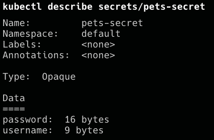

图 17.22 – 创建和描述 Kubernetes 密钥

1.  在密钥描述中，值被隐藏，只有它们的长度会显示。所以，也许密钥现在是安全的了。其实不然。我们可以通过 `kubectl` 的 `get` 命令轻松解码这个密钥：

    ```
    $ kubectl get secrets/pets-secret -o yaml
    ```

输出如下：

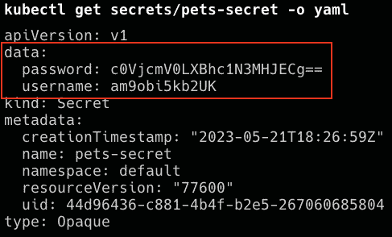

图 17.23 – 解码 Kubernetes 密钥

如前面的截图所示，我们已经恢复了原始的密钥值。

1.  解码你之前得到的值：

    ```
    $ echo "c0VjcmV0LXBhc1N3MHJECg==" | base64 –decode
    ```

这将导致以下输出：

```
sEcret-pasSw0rD
```

因此，结果是这种创建 Kubernetes 密钥的方法只适用于开发环境，在那里我们处理的是非敏感数据。在所有其他环境中，我们需要一种更好的方式来处理密钥。

## 使用 kubectl 创建密钥

定义密钥的更安全方式是使用 `kubectl`。首先，我们必须创建包含 base64 编码密钥值的文件，类似于前一节所做的，但这次，我们必须将值存储在临时文件中：

```
$ echo "sue-hunter" | base64 > username.txt$ echo "123abc456def" | base64 > password.txt
```

现在，我们可以使用 `kubectl` 从这些文件创建密钥，如下所示：

```
$ kubectl create secret generic pets-secret-prod \    --from-file=./username.txt \
    --from-file=./password.txt
```

这将导致以下输出：

```
secret "pets-secret-prod" created
```

然后，密钥可以像手动创建的密钥一样使用。

你可能会问，为什么这种方法比另一种更安全？首先，没有 YAML 文件定义密钥，并且它存储在某些源代码版本控制系统中，例如 GitHub，很多人都可以访问这些系统，因此他们可以看到并解码这些密钥。

只有授权了解密钥的管理员才能看到密钥的值，并使用它们直接在（生产）集群中创建密钥。集群本身受到基于角色的访问控制保护，因此没有授权的人无法访问它，也无法解码集群中定义的密钥。

现在，让我们看看如何使用我们定义的密钥。

## 在 pod 中使用密钥

假设我们要创建一个 `Deployment` 对象，其中 `web` 组件使用我们在前一节中介绍的密钥 `pets-secret`。我们可以使用以下命令在集群中创建密钥：

```
$ kubectl apply -f pets-secret.yaml
```

在 `sample-solutions/ch17/web-deployment-secret.yaml` 文件中，我们可以找到 `Deployment` 对象的定义。我们需要将从第 23 行开始的部分添加到原始的 `Deployment` 对象定义中：

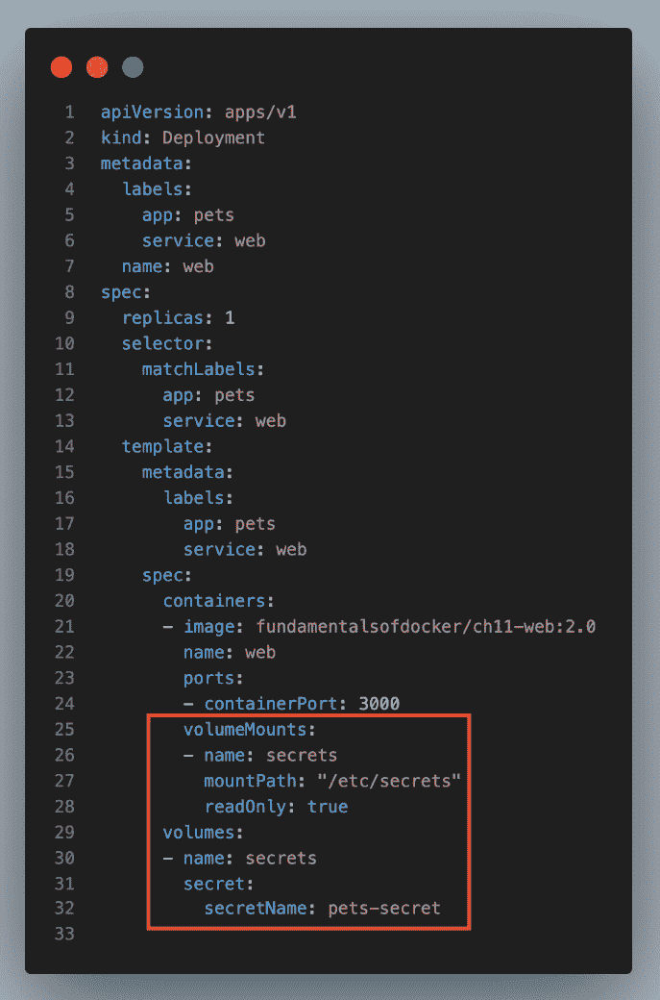

图 17.24 – 带有密钥的 Web 组件的部署对象

在第 29 到 32 行，我们定义了一个名为`secrets`的卷，该卷来自我们的密钥`pets-secret`。然后，我们按照第 25 到 28 行的描述，在容器中使用该卷。

我们将密钥挂载到容器文件系统的`/etc/secrets`路径，并以只读模式挂载该卷。因此，密钥值将作为文件提供给容器，并存放在该文件夹中。文件名将对应于键名，文件内容将是对应键的值。密钥值将以未加密的形式提供给运行在容器内的应用程序。

使用以下命令应用部署：

```
$ kubectl apply -f web-deployment-secret.yaml
```

在我们的例子中，由于密钥中有用户名和密码的键，我们将在容器文件系统的`/etc/secrets`文件夹中找到两个文件，分别名为`username`和`password`。`username`文件应该包含`john.doe`值，`password`文件应该包含`sEcret-pasSw0rD`值。让我们确认一下：

+   首先，我们将获取 Pod 的名称：

    ```
    $ kubectl get pods
    ```

这将给我们以下输出：

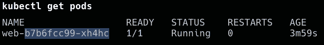

图 17.25 – 查找 Pod 的名称

+   使用 Pod 的名称，我们可以执行以下屏幕截图中显示的命令来获取密钥：

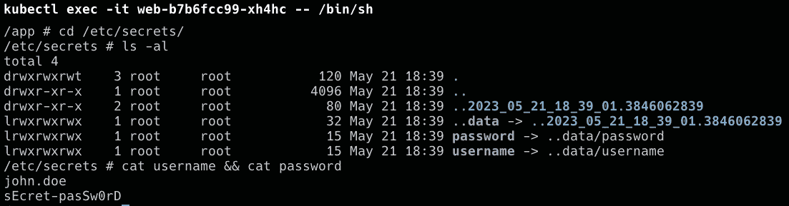

图 17.26 – 确认容器内可以访问密钥

在前面的输出的第 1 行，我们`exec`进入运行`web`组件的容器。然后，在第 2 到 5 行，我们列出了`/etc/secrets`文件夹中的文件，最后，在最后 3 行，我们展示了两个文件的内容，毫无意外地，显示了明文的密钥值。

由于任何语言编写的应用程序都可以读取简单的文件，因此使用密钥的这种机制非常向后兼容。即使是一个旧的 Cobol 应用程序也能从文件系统中读取明文文件。

离开之前，请删除 Kubernetes 部署：

```
$ kubectl delete deploy/web
```

然而，有时应用程序期望密钥在环境变量中可用。

让我们看看 Kubernetes 在这种情况下为我们提供了什么。

## 环境变量中的密钥值

假设我们的 Web 组件期望`PETS_USERNAME`环境变量中有用户名，`PETS_PASSWORD`环境变量中有密码。如果是这样，我们可以修改部署的 YAML 文件，使其如下所示：

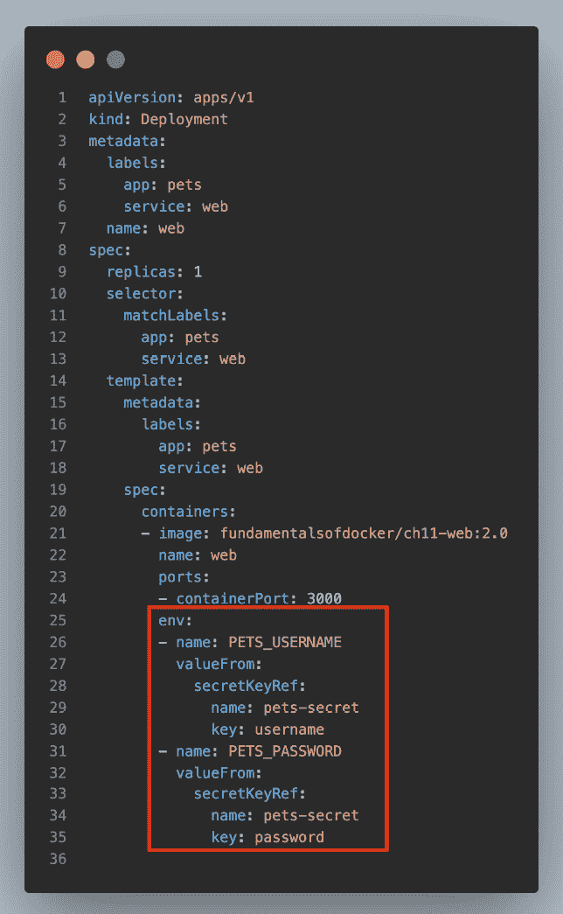

图 17.27 – 部署映射密钥值到环境变量

在第 25 到 35 行，我们定义了两个环境变量`PETS_USERNAME`和`PETS_PASSWORD`，并将`pets-secret`中的相应键值对映射到它们。

应用更新后的部署：

```
$ kubectl apply -f web-deployment-secret.yaml
```

请注意，我们不再需要使用卷；相反，我们直接将 `pets-secret` 的各个密钥映射到容器内有效的环境变量。以下命令序列显示了秘密值确实可用，并且已经映射到相应的环境变量中：

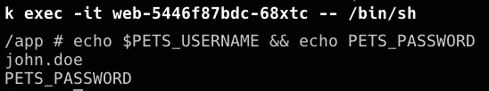

图 17.28 – 秘密值已经映射到环境变量

在本节中，我们展示了如何在 Kubernetes 集群中定义秘密，以及如何在作为部署的一部分运行的容器中使用这些秘密。我们展示了秘密如何在容器内部映射的两种变体——使用文件和使用环境变量。

# 总结

在本章中，我们学习了如何将应用程序部署到 Kubernetes 集群，并为该应用程序设置应用层路由。此外，我们还学习了如何在不引起任何停机的情况下更新 Kubernetes 集群中运行的应用服务。最后，我们使用秘密为集群中运行的应用服务提供敏感信息。

在下一章中，我们将学习不同的技术，这些技术用于监控在 Kubernetes 集群中运行的单个服务或整个分布式应用程序。我们还将学习如何在不更改集群或服务所在集群节点的情况下，排查生产环境中运行的应用服务问题。敬请期待。

# 进一步阅读

这里有一些链接，提供了本章讨论主题的更多信息：

+   *执行滚动* *更新*：[`bit.ly/2o2okEQ`](https://bit.ly/2o2okEQ)

+   *蓝绿* *部署*：[`bit.Ly/2r2IxNJ`](https://bit.Ly/2r2IxNJ)

+   *Kubernetes 中的秘密*：[`bit.ly/2C6hMZF`](https://bit.ly/2C6hMZF)

# 问题

为了评估你的学习进度，请回答以下问题：

1.  你有一个由两个服务组成的应用程序，第一个是 Web API，第二个是数据库，如 MongoDB。你想将这个应用程序部署到 Kubernetes 集群中。用简短的几句话解释你会如何进行。

1.  在 Kubernetes 应用服务的上下文中，liveness 和 readiness 探针是什么？

1.  请用自己的话描述你需要哪些组件来为你的应用程序建立第七层（或应用层）路由。

1.  简要列出实施蓝绿部署所需的主要步骤。避免过多细节。

1.  列举三到四种你会通过 Kubernetes 秘密提供给应用服务的信息类型。

1.  列出 Kubernetes 在创建秘密时接受的来源。

1.  如何配置应用服务以使用 Kubernetes 秘密？

# 答案

下面是本章问题的答案：

1.  假设我们在注册表中有一个用于两个应用服务的 Docker 镜像——网页 API 和 MongoDB——我们需要做如下操作：

    1.  使用`StatefulSet`对象定义 MongoDB 的部署；我们将这个部署命名为`db-deployment`。`StatefulSet`对象应该有一个副本（复制 MongoDB 稍微复杂一些，超出了本书的范围）。

    1.  定义一个名为`db`的 Kubernetes 服务，类型为`ClusterIP`，用于`db-deployment`。

    1.  定义一个网页 API 的部署，命名为`web-deployment`。

    1.  我们将这个服务扩展为三个实例。

    1.  定义一个名为`api`的 Kubernetes 服务，类型为`NodePort`，用于`web-deployment`。

    1.  如果我们使用密钥，那么直接在集群中通过`kubectl`定义这些密钥。

    1.  使用`kubectl`部署应用。

1.  存活探针和就绪探针是 Kubernetes 为容器提供的健康检查。存活探针检查容器是否仍在运行，如果没有，Kubernetes 会自动重启它。就绪探针检查容器是否准备好接受请求。如果容器未通过就绪检查，它不会被移除，但在通过就绪探针之前，不会接收任何传入请求。

1.  为了实现应用的第 7 层路由，我们理想情况下使用`IngressController`。这是一种反向代理，如 Nginx，它有一个侧车容器监听 Kubernetes 服务器 API 的相关变化，并在检测到变化时更新反向代理的配置并重启它。然后，我们需要在集群中定义 Ingress 资源，定义路由，例如从基于上下文的路由如`https://example.com/pets`到`<服务名称>/<端口>`或类似`api/32001`的配对。当 Kubernetes 创建或更改此`Ingress`对象时，`IngressController`的侧车容器会捕捉并更新代理的路由配置。

1.  假设这是一个集群内部的库存服务，那么我们做如下操作：

    1.  部署 1.0 版本时，我们定义一个名为`inventory-deployment-blue`的部署，并将 Pods 标记为`color:blue`。

    1.  我们为前述部署部署一个类型为`ClusterIP`的 Kubernetes 服务，名为`inventory`，并且选择器包含`color:blue`。

    1.  当我们准备部署新版本的`payments`服务时，我们定义一个该服务的 2.0 版本的部署，并将其命名为`inventory-deployment-green`。我们给 Pods 添加一个`color:green`标签。

    1.  现在我们可以对“绿色”服务进行冒烟测试，当一切正常时，我们可以更新库存服务，使选择器包含`color:green`。

1.  一些形式的信息是机密的，因此应该通过 Kubernetes 密钥提供给服务，包括密码、证书、API 密钥 ID、API 密钥秘密和令牌。

1.  密钥值的来源可以是文件或 base64 编码的值。

1.  要配置应用程序使用 Kubernetes 密钥，必须创建一个包含敏感数据的`Secret`对象。然后，必须修改你的`Pod`规格，使其包含对`Secret`对象的引用。此引用可以作为容器规格中的环境变量，或者作为卷挂载，这样你的应用程序就可以使用这些密钥数据。
