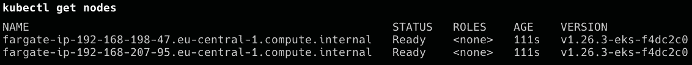
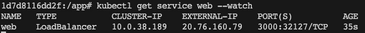

# 18

# 在云中运行容器化应用程序。

在上一章中，我们学习了如何将应用程序部署、更新和扩展到 Kubernetes 集群中。我们了解了如何实现零停机部署，以实现不中断的更新和回滚关键应用程序。最后，我们介绍了 Kubernetes 机密作为配置服务和保护敏感数据的手段。

在本章中，我们将概述在云中运行容器化应用程序的三种最流行的方式。我们将探讨每种托管解决方案，并讨论它们的优缺点。

以下是本章中我们将讨论的主题：

+   为什么选择托管 Kubernetes 服务？

+   在 **Amazon Elastic Kubernetes Service** (**Amazon EKS**) 上运行一个简单的容器化应用程序。

+   探索 Microsoft 的 **Azure Kubernetes Service** (**AKS**)。

+   理解 **Google Kubernetes Engine** (**GKE**)。

阅读完本章后，您将能够执行以下操作：

+   分析托管 Kubernetes 服务与自管理 Kubernetes 集群相比的优缺点。

+   在 Amazon EKS 中部署并运行一个简单的分布式应用程序。

+   部署并在 Microsoft 的 **AKS** 上运行一个简单的分布式应用程序。

+   在 GKE 上部署并运行一个简单的分布式应用程序。

# 技术要求

我们将在本章节中使用 **亚马逊网络服务** (**AWS**)，Microsoft Azure 和 Google Cloud；因此，每个平台都需要有一个账户。如果您没有现有账户，可以申请这些云服务提供商的试用账户。

我们还将使用我们实验室在 GitHub 存储库的 `~/The-Ultimate-Docker-Container-Book/sample-solutions/ch18` 文件夹中的文件，网址为 [`github.com/PacktPublishing/The-Ultimate-Docker-Container-Book/tree/main/sample-solutions/ch18`](https://github.com/PacktPublishing/The-Ultimate-Docker-Container-Book/tree/main/sample-solutions/ch18)。

准备放置您自己代码的文件夹。首先，导航至源文件夹，如下所示：

```
$ cd ~/The-Ultimate-Docker-Container-Book
```

然后，创建一个 `ch18` 子文件夹并导航至该文件夹，如下所示：

```
$ mkdir ch18 & cd ch18
```

# 为什么选择托管 Kubernetes 服务？

目前，AWS、Microsoft Azure 和 Google Cloud 是最受欢迎的三大云服务提供商，每个都提供了托管 Kubernetes 服务，如下所述：

+   **Amazon EKS**：Amazon EKS 是一个托管服务，使您能够在 AWS 上运行 Kubernetes，无需安装、操作和维护自己的 Kubernetes 控制平面或节点。

+   **AKS**：AKS 是 Microsoft 的托管 Kubernetes 服务。它提供了与 **持续集成和持续部署** (**CI/CD**) 能力以及 Kubernetes 工具集成的开发人员生产力。它还具有完整的容器 CI/CD 平台的 Azure DevOps 项目。

+   **GKE**：Google 是 Kubernetes 的原始创造者，GKE 是市场上第一个可用的托管 Kubernetes 服务。它提供了先进的集群管理功能，并与 Google Cloud 服务集成。

其他提供商也提供 **Kubernetes 即服务**（**KaaS**），例如 IBM Cloud Kubernetes 服务、Oracle Kubernetes 容器引擎和 **DigitalOcean Kubernetes**（**DOKS**）。鉴于云市场发展迅速，查看最新的产品和功能始终是一个好主意。

管理一个 Kubernetes 集群，无论是在本地还是在云中，都涉及相当复杂的操作工作，并且需要专业知识。以下是使用托管 Kubernetes 服务通常是首选解决方案的一些原因：

+   **设置和管理的简易性**：托管 Kubernetes 服务处理底层基础设施，减少了管理 Kubernetes 集群的操作负担。它们会自动处理 Kubernetes 控制平面的供应、升级、补丁和扩展。

+   **高可用性（HA）和高可扩展性**：托管服务通常为你的应用提供开箱即用的高可用性和高可扩展性。它们处理必要的协调工作，以将应用分布到不同的节点和数据中心。

+   **安全与合规性**：托管服务通常包括内置的安全功能，如网络策略、**基于角色的访问控制**（**RBAC**）和与云提供商 **身份与访问管理**（**IAM**）服务的集成。它们还负责 Kubernetes 软件本身的安全更新。

+   **监控与诊断**：托管的 Kubernetes 服务通常包括与监控和日志服务的集成，使得观察和排除应用程序故障变得更加容易。

+   **成本**：虽然使用托管服务会产生一定的费用，但其成本通常低于为高效、安全地运营一个 Kubernetes 集群所需的专职人员和基础设施成本。

+   **支持**：使用托管 Kubernetes 服务时，你将能够获得云服务提供商的支持。如果你在运行生产工作负载并需要快速解决任何问题，这尤其有价值。

相比之下，运行你自己的 Kubernetes 集群涉及大量的设置和维护工作。从 Kubernetes 的安装和配置，到集群升级、安全补丁、节点供应和扩展的持续任务，再到设置监控和告警，你都需要负责。

管理自己的集群虽然提供了更多的控制和灵活性，但需要大量的时间、资源和专业知识投入。对于许多组织来说，托管服务的好处远远超过了自主管理集群所带来的控制力提升。

# 在 Amazon EKS 上运行一个简单的容器化应用程序

在这一部分，我们希望在 Amazon EKS 上使用 Fargate 创建一个完全托管的 Kubernetes 集群。创建新集群的过程在 AWS 文档中有详细描述，我们将参考相关页面，以避免重复过多信息。话虽如此，让我们从以下步骤开始。

什么是 Fargate？

AWS Fargate 是由 AWS 提供的无服务器计算引擎，用于容器。它消除了管理底层服务器的需要，让你可以专注于设计和构建应用程序。Fargate 处理容器的部署、扩展和管理，使你可以在无需担心基础设施的情况下启动应用程序。

让我们首先处理一些前提条件，如下所示：

1.  确保你可以访问一个 AWS 账户。如果没有，你可以在这里获得一个免费的 1 年试用账户：[`aws.amazon.com/free`](https://aws.amazon.com/free)。

1.  登录到你的 AWS 账户。

1.  为你的账户创建一对新的*访问密钥*和*访问密钥秘密*，你将用它们来配置你的 AWS CLI，从而可以通过命令行访问你的账户。

1.  在屏幕右上角找到你的个人资料，从下拉菜单中选择**安全凭证**。

选择**访问密钥**（访问密钥 ID 和秘密访问密钥），然后点击**创建** **访问密钥**：


图 18.1 – 将访问密钥 ID 和秘密配对记录在安全位置

1.  打开一个新的终端。

1.  确保你已安装 AWS CLI。

在 Mac 上，使用以下命令：

```
$ brew install awscli
```

在 Windows 上，使用以下命令：

```
$ choco install awscli
```

1.  在两种情况下，都可以使用以下命令来测试安装是否成功：

    ```
    $ aws --version
    ```

1.  配置你的 AWS CLI。为此，你需要你在前面*步骤 3*中创建的*AWS 访问密钥 ID*和*AWS 秘密访问密钥*，以及你的默认*区域*。

然后，使用以下命令：

```
$ aws configure
```

在被询问时输入适当的值。对于默认输出格式，选择 `JSON`，如下所示：


图 18.2 – 配置 AWS CLI

1.  尝试使用如下命令访问你的账户：

    ```
    $ aws s3 ls
    ```

这应该列出为你的账户定义的所有**简单存储服务**（**S3**）存储桶。你的列表可能为空。这里需要注意的是，命令成功执行即可。

1.  最后，运行以下命令来再次检查是否已安装 `kubectl`：

    ```
    $ kubectl version
    ```

现在，我们已经准备好创建 Amazon EKS 集群。按照以下步骤操作：

1.  定义几个环境变量，以便后续使用，如下所示：

    ```
    $ export AWS_REGION=eu-central-1$ export AWS_STACK_NAME=animals-stack$ export AWS_CLUSTER_ROLE=animals-cluster-role
    ```

确保将 `eu-central-1` 替换为离你最近的 AWS 区域。

1.  现在，你可以使用以下命令创建所需的 AWS 堆栈，其中包括 VPC、私有和公共子网以及安全组—为了简化操作，使用 AWS 提供的一个示例 YAML 文件：

    ```
    $ aws cloudformation create-stack --region $AWS_REGION \    --stack-name $AWS_STACK_NAME \    --template-url https://s3.us-west-2.amazonaws.com/amazon-eks/cloudformation/2020-10-29/amazon-eks-vpc-private-subnets.yaml
    ```

请花点时间下载并查看前面的 YAML 文件，以了解该命令具体在配置什么内容。

1.  在接下来的几个步骤中，您需要定义正确的设置，以授予集群所需的访问权限：

    1.  首先使用以下命令创建一个 IAM 角色：

    ```
    $ aws iam create-role \    --role-name $AWS_CLUSTER_ROLE \    --assume-role-policy-document file://"eks-cluster-role-trust-policy.json"
    ```

    1.  继续通过此命令将必要的 Amazon EKS 管理的 IAM 策略附加到刚刚创建的角色：

    ```
    $ aws iam attach-role-policy \    --policy-arn arn:aws:iam::aws:policy/AmazonEKSClusterPolicy \    --role-name $AWS_CLUSTER_ROLE
    ```

1.  现在，我们继续进行一些交互步骤，使用 Amazon EKS 控制台：[`console.aws.amazon.com/eks/home#/clusters`](https://console.aws.amazon.com/eks/home#/clusters)。

注意

确保控制台右上角显示的 AWS 区域是您要创建集群的 AWS 区域（例如，在作者的案例中是`eu-central-1`）。如果不是，请选择 AWS 区域名称旁边的下拉菜单并选择您要使用的 AWS 区域。

1.  若要创建集群，请选择**添加集群**命令，然后选择**创建**。如果您没有看到此选项，请首先在左侧导航窗格中选择**集群**。

1.  在`animals-cluster`上。

1.  选择`animals-cluster-role`。

1.  所有其他设置可以保持为默认值。

1.  选择**下一步**。

+   在`vpc-00x0000x000x0x000 | animals-stack-VPC`上。注意名称的后缀，表示它是我们刚刚定义的那个。*同样，您可以保持其他设置为默认值。*选择**下一步**继续。*我们无需更改**配置日志记录**页面上的任何内容，因此请选择**下一步**。*同样的情况适用于**选择插件**页面，因此选择**下一步**。*再一次，在**配置已选择的插件**设置页面上，无需做任何操作，因此请选择**下一步**。*最后，在**审查并创建**页面，选择**创建**。*在集群名称的右侧，集群状态为**创建中**，持续几分钟，直到集群配置过程完成，如下图所示。在状态变为**活动**之前，请勿继续进行下一步：

图 18.3 – 创建 EKS 集群

1.  不幸的是，我们还没有完成。我们需要创建一个信任策略并将其附加到我们的集群。为此，按照以下步骤操作：

    1.  首先创建一个`pod-execution-role-trust-policy.json`文件，并将以下内容添加到其中：

    ```
    {  "Version": "2012-10-17",  "Statement": [    {      "Effect": "Allow",      "Condition": {        "ArnLike": {          "aws:SourceArn": "arn:aws:eks:<region-code>:<account-no>:fargateprofile/animals-cluster/*"        }      },      "Principal": {        "Service": "eks-fargate-pods.amazonaws.com"      },      "Action": "sts:AssumeRole"    }  ]}
    ```

在前面的代码中，将`<region-code>`替换为您的 AWS 区域代码（在我的案例中是`eu-central-1`），将`<account-no>`替换为您的账户号码。您可以在 AWS 控制台左上角的个人资料中找到后者。

1.  使用刚刚配置的信任策略，使用以下命令创建一个**Pod 执行 IAM 角色**：

```
$ aws iam create-role \    --role-name AmazonEKSFargatePodExecutionRole \
    --assume-role-policy-document file://"pod-execution-role-trust-policy.json"
```

1.  最后，使用以下命令将所需的角色和策略连接在一起：

```
$ aws iam attach-role-policy \    --policy-arn arn:aws:iam::aws:policy/AmazonEKSFargatePodExecutionRolePolicy \
    --role-name AmazonEKSFargatePodExecutionRole
```

1.  在`animals-cluster`集群上。

1.  在`animals-cluster`页面上，执行以下操作：

    1.  选择`animals-profile`。

    1.  对于在前一步创建的`AmazonEKSFargatePodExecutionRole`角色。

    1.  选择**子网**下拉框，并取消选择名称中包含**Public**的任何子网。仅支持在 Fargate 上运行的 Pods 使用私有子网。

    1.  选择**下一步**。

+   在`default`下。* 然后选择**下一步**。* 在**审查并创建页面**，审查你的 Fargate 配置文件的信息，并选择**创建**。* 几分钟后，**Fargate 配置文件配置**部分的状态将从**创建中**变为**活动**。在状态变为**活动**之前，不要继续执行下一步。* 如果你计划将所有 Pods 部署到 Fargate（不使用 Amazon EC2 节点），请按以下步骤创建另一个 Fargate 配置文件并在 Fargate 上运行默认的名称解析器（CoreDNS）。

注意

如果你不这样做，目前将不会有任何节点。

1.  在`animals-profile`下。

1.  在**Fargate 配置文件**下，选择**添加** **Fargate 配置文件**。

1.  在**名称**字段中输入**CoreDNS**。

1.  对于你在*步骤 13*中创建的`AmazonEKSFargatePodExecutionRole`角色。

1.  单击其名称中的`Public`。Fargate 仅支持私有子网中的 Pods。

1.  选择**下一步**。

1.  在`kube-system`下。

1.  选择**匹配标签**，然后选择**添加标签**。

1.  在**值**字段中输入`k8s-app`作为`kube-dns`。这是必要的，以便将默认的名称解析器（CoreDNS）部署到 Fargate。

1.  选择**下一步**。

1.  在**审查并创建**页面，审查 Fargate 配置文件的信息并选择**创建**。

1.  运行以下命令，删除 CoreDNS Pods 上的默认`eks.amazonaws.com/compute-type : ec2`注解：

    ```
    kubectl patch deployment coredns \    -n kube-system \    --type json \    -p='[{"op": "remove", "path": "/spec/template/metadata/annotations/eks.amazonaws.com~1compute-type"}]'
    ```

注意

系统会根据你添加的 Fargate 配置文件标签创建并部署两个节点。你不会在**节点组**中看到任何列出的内容，因为 Fargate 节点不适用，但你将在**计算**标签中看到新的节点。

若需更详细的解释，可以按照以下链接中的逐步指南来创建集群：

[`docs.aws.amazon.com/eks/latest/userguide/getting-started-console.xhtml`](https://docs.aws.amazon.com/eks/latest/userguide/getting-started-console.xhtml) (*开始使用 Amazon EKS – AWS 管理控制台和* *AWS CLI*)

当你的集群准备好后，可以继续执行以下步骤：

1.  配置`kubectl`以访问 AWS 上的新集群，如下所示：

    ```
    $ aws eks update-kubeconfig --name animals-cluster
    ```

响应应类似于以下内容：

```
Added new context arn:aws:eks:eu-central-...:cluster/animals-cluster to /Users/<user-name>/.kube/config
```

这里，`<user-name>`对应于你正在使用的机器上的用户名。

1.  双重检查`kubectl`是否使用了正确的上下文——即刚为 AWS 上的集群创建并添加到你的`~/.kube/config`文件中的上下文：

    ```
    $ kubectl config current-context
    ```

答案应类似于以下内容：

```
arn:aws:eks:eu-central-...:cluster/animals-cluster
```

如果另一个上下文是活动状态，请使用`kubectl config use-context`命令，并结合正确的 AWS 上下文。

1.  使用`kubectl`列出集群上的所有资源，像这样：

    ```
    $ kubectl get all
    ```

此时的答案应如下所示：


图 18.4 – Amazon EKS – kubectl get all

1.  要查看集群的节点，请使用以下命令：

    ```
    $ kubectl get nodes
    ```

然后你应该看到类似以下的内容：



图 18.5 – EKS 集群中节点的列表

1.  导航到本章的`ch18`文件夹，创建一个`aws-eks`子文件夹，然后进入该文件夹：

    ```
    $ cd ~/The-Ultimate-Docker-Container-Book/ch18$ mkdir aws-eks && cd aws-eks
    ```

1.  在此子文件夹中，创建一个名为`deploy-nginx.yaml`的文件，内容如下：


图 18.6 – 在 Amazon EKS 上部署 nginx 的规范

1.  使用`kubectl`将我们的部署部署到集群，如下所示：

    ```
    $ kubectl apply -f deploy-nginx.yaml
    ```

1.  使用以下命令观察 Pod 的创建过程：

    ```
    $ kubectl get pods -w
    ```

然后等待它们准备就绪：


图 18.7 – 列出部署到 AWS 的 Pods

1.  等待它们在`1/1`的值。

1.  在 AWS 控制台中，导航到你的集群。

1.  在`web` Pods 和两个`coredns` Pods 已创建。

1.  在**计算**选项卡中，观察到已创建多个 Fargate 节点。

1.  深入到节点以查看已部署到其上的 Pod。

1.  进一步深入到 Pod，并观察其**详细信息**视图中显示的事件列表。

恭喜你——你已在 AWS 上创建了一个完全托管的 Kubernetes 集群，并使用`kubectl`在其上创建了第一个部署！正如你所知，这是一项相当了不起的成就。结果表明，在讨论的所有云提供商中，AWS 需要远远比其他更多的步骤才能运行一个 Kubernetes 集群。

在离开之前，并为了避免意外费用，请确保清理掉在此练习期间创建的所有资源。为此，请按照以下步骤操作：

1.  使用`kubectl`删除先前的部署：

    ```
    $ kubectl delete -f deploy-nginx.yaml
    ```

1.  定位你的`animals-cluster`集群并选择它。

1.  在`animals-profile`和`CoreDNS`配置文件中删除它们。

1.  当删除这两个配置文件时（可能需要几分钟），然后点击**删除集群**按钮以摆脱该集群。

1.  删除你创建的 VPC AWS CloudFormation 堆栈。

1.  打开**AWS CloudFormation**控制台，网址为[`console.aws.amazon.com/cloudformation`](https://console.aws.amazon.com/cloudformation)。

1.  选择`animals-stack`堆栈，然后选择**删除**。

1.  在**删除 animals-stack**确认对话框中，选择**删除堆栈**。

1.  删除你创建的 IAM 角色。

1.  打开 IAM 控制台，网址为[`console.aws.amazon.com/iam/`](https://console.aws.amazon.com/iam/)。

1.  在左侧导航窗格中，选择**角色**。

1.  从列表中选择你创建的每个角色（`myAmazonEKSClusterRole`，以及`AmazonEKSFargatePodExecutionRole`或`myAmazonEKSNodeRole`）。选择**删除**，输入请求的确认文本，然后选择**删除**。

或者，按照 AWS 文档中*第 5 步：删除资源*部分的步骤执行：

[`docs.aws.amazon.com/eks/latest/userguide/getting-started-console.xhtml`](https://docs.aws.amazon.com/eks/latest/userguide/getting-started-console.xhtml)

这是一次相当了不起的成就！创建和管理一个 EKS 集群需要比我们预期更多的细节知识。我们将看到，其他提供商在这方面更加用户友好。

现在我们大致了解了 Amazon EKS 的功能，接下来让我们看看全球第二大云服务提供商的产品组合。

# 探索微软的 AKS

要在 Azure 中实验微软的容器相关服务，我们需要一个 Azure 账户。你可以创建一个试用账户或使用现有账户。你可以在这里获得免费试用账户：[`azure.microsoft.com/en-us/free/`](https://azure.microsoft.com/en-us/free/)。

微软在 Azure 上提供了不同的容器相关服务。最易使用的可能是 Azure 容器实例，它承诺是运行容器的最快和最简单方式，无需配置任何**虚拟机**（**VMs**），也不需要采用更高级的服务。如果你只想在托管环境中运行单个容器，这项服务非常有用。设置非常简单。在 Azure 门户（[`portal.azure.com`](https://portal.azure.com)）中，你首先创建一个新的资源组，然后创建一个 Azure 容器实例。你只需要填写一个简短的表格，填写容器名称、使用的镜像和要打开的端口等属性。容器可以通过公共或私有 IP 地址提供，并且如果容器崩溃，它会自动重启。这里有一个不错的管理控制台，例如用于监控资源消耗，如 CPU 和内存。

第二个选择是**Azure 容器服务**（**ACS**），它提供了一种简化集群虚拟机创建、配置和管理的方式，这些虚拟机经过预配置可运行容器化应用。ACS 使用 Docker 镜像，并提供三种编排工具的选择：Kubernetes、Docker Swarm 和**分布式云操作系统**（**DC/OS**）（由 Apache Mesos 提供支持）。微软声称其服务能够扩展到数万个容器。ACS 是免费的，只有计算资源会收费。

在这一部分，我们将重点讨论基于 Kubernetes 的最流行的产品。它叫做 AKS，可以在这里找到：[`azure.microsoft.com/en-us/services/kubernetes-service/`](https://azure.microsoft.com/en-us/services/kubernetes-service/)。AKS 使你可以轻松地在云中部署应用并在 Kubernetes 上运行它们。所有复杂和繁琐的管理任务都由微软处理，你可以完全专注于你的应用程序。这意味着你永远不必处理安装和管理 Kubernetes、升级 Kubernetes 或升级底层 Kubernetes 节点操作系统等任务。这些都由 Microsoft Azure 的专家处理。此外，你永远不必处理 `etc` 或 Kubernetes 主节点。这些都被隐藏起来，你唯一需要交互的是运行你应用的 Kubernetes 工作节点。

## 准备 Azure CLI

话虽如此，让我们开始。我们假设你已经创建了一个免费试用账户，或者正在使用 Azure 上的现有账户。有多种方式可以与 Azure 账户进行交互。我们将使用在本地计算机上运行的 Azure CLI。我们可以将 Azure CLI 下载并安装到本地计算机，或者在本地 Docker Desktop 上的容器内运行它。由于本书的主题是容器，我们选择后者。

最新版本的 Azure CLI 可以在 Docker Hub 上找到。让我们拉取它：

```
$ docker image pull mcr.microsoft.com/azure-cli:latest
```

我们将从这个 CLI 运行一个容器，并在这个容器内部的 shell 中执行所有后续命令。现在，我们需要克服一个小问题——这个容器中没有安装 Docker 客户端。但是我们还需要运行一些 Docker 命令，因此我们必须创建一个从前面提到的镜像派生的自定义镜像，其中包含 Docker 客户端。为此所需的 Dockerfile 可以在 `sample-solutions/ch18` 子文件夹中找到，其内容如下：

```
FROM mcr.microsoft.com/azure-cli:latestRUN apk update && apk add docker
```

在 *第 2 行*，我们仅使用 Alpine 包管理器 `apk` 来安装 Docker。然后我们可以使用 Docker Compose 来构建并运行这个自定义镜像。对应的 `docker-compose.yml` 文件如下：

```
version: "2.4"services:
  az:
    image: fundamentalsofdocker/azure-cli
    build: .
    command: tail -F anything
    working_dir: /app
    volumes:
    - /var/run/docker.sock:/var/run/docker.sock
    - .:/app
```

注意

`tail -F anything` 命令用于保持容器运行，并且用于挂载 Docker 套接字和当前文件夹到 `volumes` 部分。

提示

如果你在 Windows 上运行 Docker Desktop，则需要定义 `COMPOSE_CONVERT_WINDOWS_PATHS` 环境变量，才能挂载 Docker 套接字。你可以在 Bash shell 中使用 `export COMPOSE_CONVERT_WINDOWS_PATHS=1`，或在运行 PowerShell 时使用 `$Env:COMPOSE_CONVERT_WINDOWS_PATHS=1`。更多详情请参见以下链接：[`github.com/docker/compose/issues/4240`](https://github.com/docker/compose/issues/4240)。

现在，让我们构建并运行这个容器，步骤如下：

```
$ docker compose up --build -d
```

接下来，让我们进入 `az` 容器并在其中运行 Bash shell，使用以下命令：

```
$ docker compose exec az /bin/bash
```

你应该会看到如下输出：

```
376f1e715919:/app #
```

注意，你的哈希码（`376f1e...`）代表容器内的主机名将会不同。为了简化后续命令的阅读，我们将省略哈希码。

正如你所注意到的，我们发现自己正在容器内的 Bash shell 中运行。首先，我们来检查 CLI 的版本：

```
# az --version
```

这将生成类似如下的输出：

```
azure-cli                         2.49.0core                              2.49.0
telemetry                          1.0.8
Dependencies:
msal                              1.20.0
azure-mgmt-resource               22.0.0
Python location '/usr/local/bin/python'
Extensions directory '/root/.azure/cliextensions'
Python (Linux) 3.10.11 (main, May 11 2023, 23:59:31) [GCC 12.2.1 20220924]
Legal docs and information: aka.ms/AzureCliLegal
Your CLI is up-to-date.
```

好的——我们运行的版本是 2.49.0。接下来，我们需要登录我们的账户。执行此命令：

```
# az login
```

你将看到以下消息：

```
To sign in, use a web browser to open the page https://microsoft.com/devicelogin and enter the code <code> to authenticate.
```

按照指示通过浏览器登录。一旦成功认证了 Azure 账户，你可以返回终端并且应该已成功登录，输出结果会显示如下：

```
[  {
    "cloudName": "AzureCloud",
    "id": "<id>",
    "isDefault": true,
    "name": "<account name>",
    "state": "Enabled",
    "tenantId": "<tenant-it>",
    "user": {
      "name": <your-email>,
      "type": "user"
    }
  }
]
```

现在，我们已经准备好将容器镜像首先迁移到 Azure。

## 在 Azure 上创建容器注册表

首先，我们创建一个名为 `animal-rg` 的新资源组。在 Azure 中，资源组用于逻辑上将一组相关资源归为一类。为了获得最佳的云体验并保持低延迟，选择一个靠近您的数据中心位置非常重要。请按照以下步骤操作：

1.  你可以使用以下命令列出所有区域：

    ```
    # az account list-locations
    ```

输出应如下所示：

```
[  {
    "displayName": "East Asia",
    "id": "/subscriptions/186760.../locations/eastasia",
    "latitude": "22.267",
    "longitude": "114.188",
    "name": "eastasia",
    "subscriptionId": null
  },
...
]
```

这将给你一长串所有可供选择的区域。使用名称——例如，`eastasia`——来标识你选择的区域。在我的例子中，我将选择 `westeurope`。请注意，并非所有列出的区域都有效用于资源组。

1.  创建资源组的命令很简单；我们只需要为组指定名称和位置，如下所示：

    ```
    # az group create --name animals-rg --location westeurope{  "id": "/subscriptions/186.../resourceGroups/animals-rg",  "location": "westeurope",  "managedBy": null,  "name": "animals-rg",  "properties": {    "provisioningState": "Succeeded"  },  "tags": null,  "type": "Microsoft.Resources/resourceGroups"}
    ```

确保你的输出显示 `"``provisioningState": "Succeeded"`。

注意

在生产环境中运行容器化应用时，我们希望确保能够从容器注册表中自由地下载相应的容器镜像。到目前为止，我们一直从 Docker Hub 下载镜像，但这通常是不可行的。出于安全原因，生产系统的服务器通常无法直接访问互联网，因此无法连接到 Docker Hub。让我们遵循这一最佳实践，并假设我们即将创建的 Kubernetes 集群也面临相同的限制。

那么，我们该怎么办呢？解决方案是使用一个接近我们集群并且处于相同安全上下文中的容器镜像注册表。在 Azure 中，我们可以创建一个 **Azure 容器注册表**（**ACR**）实例并在其中托管我们的镜像，接下来我们将执行以下操作：

1.  让我们首先创建一个注册表，如下所示：

    ```
    # az acr create --resource-group animals-rg \    --name <acr-name> --sku Basic
    ```

请注意 `<acr-name>` 必须是唯一的。在我的例子中，我选择了 `gnsanimalsacr` 这个名称。缩短后的输出如下所示：

```
Registration succeeded.{
  "adminUserEnabled": false,
  "creationDate": "2023-06-04T10:31:14.848776+00:00",
...
  "id": "/subscriptions/186760ad...",
  "location": "westeurope",
  "loginServer": "gnsanimalsacr.azurecr.io",
  "name": " gnsanimalsacr ",
...
  "provisioningState": "Succeeded",
```

1.  成功创建容器注册表后，我们需要使用以下命令登录该注册表：

    ```
    # az acr login --name <acr-name>
    ```

对前述命令的响应应为：

```
Login Succeeded
```

一旦我们成功登录到 Azure 上的容器注册表，我们需要正确标记我们的容器，以便我们能够将其推送到 ACR。接下来将描述如何标记和推送镜像到 ACR。

## 将我们的镜像推送到 ACR

一旦成功登录到 ACR，我们可以标记我们的镜像，以便它们可以推送到注册表中。为此，我们需要知道 ACR 实例的 URL。它如下所示：

```
<acr-name>.azurecr.io
```

我们现在使用前面提到的 URL 来标记我们的镜像：

```
# docker image tag fundamentalsofdocker/ch11-db:2.0 \    <acr-name>.azurecr.io/db:2.0
# docker image tag fundamentalsofdocker/ch11-web:2.0 \
    <acr-name>.azurecr.io/web:2.0
```

然后，我们可以将其推送到我们的 ACR 实例：

```
# docker image push <acr-name>.azurecr.io/db:2.0# docker image push <acr-name>.azurecr.io/web:2.0
```

为了确认我们的镜像确实位于 ACR 实例中，我们可以使用此命令：

```
# az acr repository list --name <acr-name> --output table
```

这应该会给你以下输出：

```
Result--------
Db
web
```

事实上，我们刚刚推送的两个镜像已列出。

到此，我们已准备好创建 Kubernetes 集群。

## 创建一个 Kubernetes 集群

我们将再次使用自定义的 Azure CLI，运行在 Docker 容器中来创建 Kubernetes 集群。我们需要确保集群能够访问我们刚刚创建的 ACR 实例，镜像就在其中。所以，创建名为 `animals-cluster` 的集群，并配置两个工作节点的命令如下所示：

```
# az aks create \    --resource-group animals-rg \
    --name animals-cluster \
    --node-count 2 \
    --generate-ssh-keys \
    --attach-acr <acr-name>
```

这个命令需要一些时间，但几分钟后，我们应该会收到一份 JSON 格式的输出，包含有关新创建集群的所有详细信息。

要访问集群，我们需要 `kubectl`。我们可以通过以下命令轻松地在 Azure CLI 容器中安装它：

```
# az aks install-cli
```

安装了 `kubectl` 后，我们需要必要的凭证来使用该工具操作我们在 Azure 上的新 Kubernetes 集群。我们可以通过以下命令获取所需的凭证：

```
# az aks get-credentials --resource-group animals-rg \    --name animals-cluster
```

命令应返回以下内容：

```
Merged "animals-cluster" as current context in /root/.kube/config
```

在前面命令成功执行后，我们可以列出集群中的所有节点，如下所示：

```
# kubectl get nodes
```

这将为我们提供以下列表：

```
NAME STATUS ROLES AGE VERSIONaks-nodepool1-12528297-vmss000000 Ready agent 4m38s v1.25.68
aks-nodepool1-12528297-vmss000001 Ready agent 4m32s v1.25.68
```

正如预期的那样，我们有两个工作节点正在运行。这些节点上运行的 Kubernetes 版本是 `v1.25.68`。

我们现在准备将应用程序部署到这个集群。在接下来的部分，我们将学习如何将应用程序部署到 Kubernetes。

## 将我们的应用程序部署到 Kubernetes 集群

为了部署应用程序，我们可以使用 `kubectl` `apply` 命令：

```
# kubectl apply -f animals.yaml
```

上述命令的输出应该类似于此：

```
deployment.apps/web createdservice/web created
deployment.apps/db created
service/db created
```

现在，我们要测试应用程序。记住，我们为 Web 组件创建了一个类型为 `LoadBalancer` 的服务。该服务将应用程序暴露到互联网。

该过程可能需要一些时间，因为 AKS 需要为此服务分配一个公共 IP 地址，这只是其中的一项任务。我们可以通过以下命令来观察：

```
# kubectl get service web --watch
```

请注意，上述命令中的 `--watch` 参数。它允许我们监控命令的执行进度。最初，我们应该看到类似这样的输出：

```
NAME   TYPE           CLUSTER-IP    EXTERNAL-IP  PORT(S)          AGEweb    LoadBalancer   10.0.38.189   <pending>    3000:32127/TCP   5s
```

公共 IP 地址标记为 `pending`。几分钟后，它应该会变成这样：



图 18.8 – Microsoft AKS 上动物应用的 LoadBalancer 服务

现在我们的应用已经准备好，可以通过 IP 地址 `20.76.160.79` 和端口号 `3000` 访问。

请注意，负载均衡器将内部端口 `32127` 映射到外部端口 `3000`；这点我第一次并未注意到。

让我们来看看。在新的浏览器标签页中，访问 `http://20.76.160.79:3000/pet`，你应该能够看到我们熟悉的应用：


图 18.9 – 我们的示例应用在 AKS 上运行

至此，我们已成功将分布式应用部署到 Azure 托管的 Kubernetes 上。我们无需担心安装或管理 Kubernetes，可以专注于应用本身。

请注意，你还可以通过 Azure 门户 [`portal.azure.com/`](https://portal.azure.com/) 管理你的 Azure 资源组、容器注册表和集群。它的界面与此类似：


图 18.10 – 显示动物资源组的 Microsoft Azure 门户

请熟悉该门户，并尝试深入了解集群、节点和部署情况。

现在我们已经完成了应用的实验，不应忘记删除 Azure 上的所有资源，以避免产生不必要的费用。我们可以通过删除资源组来删除所有已创建的资源，操作如下：

```
# az group delete --name animal-rg --yes --no-wait
```

Azure 在容器工作负载方面有一些很有吸引力的服务，并且由于 Azure 主要提供开源的编排引擎，如 Kubernetes、Docker Swarm、DC/OS 和 Rancher，其锁定效应不像 AWS 那么明显。

从技术角度看，如果我们最初在 Azure 上运行容器化应用，后来决定迁移到其他云服务提供商，我们依然可以保持灵活性。成本应该是有限的。

注意

值得注意的是，当你删除资源组时，AKS 集群使用的**Azure Active Directory**（**AAD**）服务主体并不会被删除。

有关如何删除服务主体的详细信息，请参阅在线帮助页面。你可以在这里找到相关信息：[`learn.microsoft.com/en-us/powershell/module/azuread/remove-azureadserviceprincipal?view=azureadps-2.0`](https://learn.microsoft.com/en-us/powershell/module/azuread/remove-azureadserviceprincipal?view=azureadps-2.0)。

接下来是 Google 的 GKE 服务。

# 了解 GKE

Google 是 Kubernetes 的发明者，并且至今仍是其背后的推动力。因此，你可以合理预期，Google 会提供一个吸引人的托管 Kubernetes 服务。

现在让我们快速看一下。要继续，你需要有一个 Google Cloud 账户，或者在此处创建一个测试账户：[`console.cloud.google.com/freetrial`](https://console.cloud.google.com/freetrial)。请按照以下步骤操作：

1.  在主菜单中，选择**Kubernetes 引擎**。第一次操作时，它会花费几分钟初始化 Kubernetes 引擎。

1.  接下来，创建一个新项目并命名为`massai-mara`；这可能需要一些时间。

1.  一旦准备好，我们可以通过点击弹出窗口中的**创建集群**来创建一个集群。

1.  在`animals-cluster`上选择离你最近的区域。在作者的例子中，这是`europe-west1`。然后点击**下一步：网络**。

1.  保持所有设置为默认值，并点击**下一步：** **高级设置**。

1.  再次保持所有设置为默认值，然后点击**下一步：审核** **并创建**。

1.  审核你的集群设置，如果一切看起来正常，就点击**创建集群**，如下图所示：


图 18.11 – GKE 集群创建向导的审核和创建视图

这将再次花费一些时间来为我们配置集群。

1.  集群创建完毕后，我们可以通过点击视图右上角的云端终端图标来打开 Cloud Shell。它应该是这样显示的：


图 18.12 – 第一个 Kubernetes 集群已准备好，并且 GKE 中打开了 Cloud Shell

1.  现在我们可以通过以下命令将实验室的 GitHub 仓库克隆到这个环境中：

    ```
    $ git clone https://github.com/PacktPublishing/The-Ultimate-Docker-Container-Book.git ~/src
    ```

1.  切换到正确的文件夹，你将在其中找到示例解决方案：

    ```
    $ cd ~/src/sample-solutions/ch18/gce
    ```

现在你应该能在当前文件夹中找到一个`animals.yaml`文件，你可以使用它将`animals`应用部署到我们的 Kubernetes 集群中。

1.  通过运行以下命令查看文件内容：

    ```
    $ less animals.yaml
    ```

它与我们在上一章中使用的相同文件几乎内容一致。两者的区别在于：

+   我们使用`LoadBalancer`类型的服务（而不是`NodePort`）来公开`web`组件。请注意，我们在 Azure AKS 上也做了相同的操作。

+   我们没有为 PostgreSQL 数据库使用卷，因为在 GKE 上正确配置`StatefulSet`比在 Minikube 或 Docker Desktop 这样的产品中更复杂。其结果是，如果`db` Pod 崩溃，我们的`animals`应用将不会持久化状态。如何在 GKE 上使用持久卷超出了本书的范围。

同时请注意，我们没有使用**Google 容器注册表**（**GCR**）来托管容器镜像，而是直接从 Docker Hub 拉取它们。这非常简单——就像我们在关于 AKS 的章节中学到的内容一样——在 Google Cloud 中创建这样的容器注册表非常容易。

1.  在继续之前，我们需要设置`gcloud`和`kubectl`凭证。以下是我们需要执行的代码：

    ```
    $ gcloud container clusters \   get-credentials animals-cluster --zone <zone>
    ```

请将`<zone>`替换为你在*第 5 步*创建集群时选择的相同区域。

前面命令的响应应该是这样的：

```
Fetching cluster endpoint and auth data.kubeconfig entry generated for animals-cluster.
```

1.  让我们通过运行以下命令查看为该集群创建了哪些节点：

    ```
    $ kubectl get nodes
    ```

你应该会看到类似这样的内容：


图 18.13 – GCE 上的集群节点

我们可以看到在集群中创建了两个节点，并且部署的 Kubernetes 版本显然是`v1.25.8`。

1.  完成这些之后，是时候部署应用程序了，运行以下命令：

    ```
    $ kubectl apply -f animals.yaml
    ```

输出应如下所示：


图 18.14 – 在 GKE 上部署应用程序

1.  一旦对象创建完成，我们可以观察`LoadBalancer web`服务，直到它分配到一个公共 IP 地址，如下所示：

    ```
    $ kubectl get svc/web –watch
    ```

前面的命令输出如下：

```
NAME TYPE CLUSTER-IP EXTERNAL-IP PORT(S) AGEweb LoadBalancer 10.57.129.72 <pending> 3000: 32384/TCP 32s
web LoadBalancer 10\. 57.129.72 35.195.160.243 3000: 32384/TCP 39s
```

输出中的第二行显示了负载均衡器创建仍在待处理状态时的情况，而第三行则显示了最终状态。按*Ctrl* + *C*退出`–watch`命令。显然，我们已经分配到了公共 IP 地址`35.195.160.243`，端口是`3000`。

1.  然后，我们可以使用这个 IP 地址并导航到`http://<IP 地址>:3000/pet`，我们应该会看到熟悉的动物图片。

1.  花点时间，使用你熟悉的各种`kubectl`命令来分析 GKE 集群中的情况。

1.  同时，花点时间使用 GCE 的网页门户，深入查看你的集群详情。特别是，查看集群的**可观测性**标签。

1.  一旦你完成了与应用程序的交互，删除 Google Cloud 控制台中的集群和项目，以避免不必要的费用。

1.  你可以在 Cloud Shell 中使用`gcloud`命令行界面来删除集群，如下所示：

    ```
    $ gcloud container clusters delete animals-cluster
    ```

这会花费一点时间。或者，你也可以通过网页门户进行相同的操作。

1.  接下来列出你所有的项目，如下所示：

    ```
    $ gcloud projects list
    ```

1.  接下来，你可以使用以下命令删除之前创建的项目：

    ```
    $ gcloud projects delete <project-id>
    ```

在这里，你应该从之前的`list`命令中获得正确的`<project-id>`值。

我们在 GKE 上创建了一个托管的 Kubernetes 集群。然后，我们使用通过 GKE 门户提供的 Cloud Shell，首先克隆我们实验室的 GitHub 仓库，然后使用`kubectl`工具将`animals`应用程序部署到 Kubernetes 集群中。

在查看托管的 Kubernetes 解决方案时，GKE 是一个极具吸引力的选择。它让你轻松启动项目，并且由于 Google 是 Kubernetes 的主要推动者，我们可以放心，始终能利用 Kubernetes 的全部功能。

# 总结

本章首先介绍了如何在 Amazon EKS 上使用 Fargate 创建一个完全托管的 Kubernetes 集群，并在该集群上部署一个简单的应用程序。然后，你学习了如何在 Azure AKS 上创建托管的 Kubernetes 集群，并运行`animals`应用程序，随后又进行了相同的操作来使用 Google 的托管 Kubernetes 解决方案——GKE。

你准备好解锁保持生产环境健康的秘密了吗？在下一章中，我们将深入探讨监控和排查在生产环境中运行的应用程序。我们将探索多种技术，用于对单个服务和整个分布式应用程序进行监控，尤其是它们在 Kubernetes 集群上运行时的情况。但这还不是全部——你还将学习如何基于关键指标创建警报。而当事情出现问题时，我们将指导你如何在不干扰集群或节点的情况下，排查运行中的应用程序。敬请期待，因为这一章将为你提供必要的工具，让你自信地在大规模环境中维护应用程序。

# 问题

为了评估你的知识，请回答以下问题：

1.  列出几个你会选择托管 Kubernetes 服务（如 Amazon EKS、Microsoft 的 AKS 或 Google 的 GKE）来运行应用程序的原因。

1.  列举使用托管 Kubernetes 解决方案（如 Amazon EKS、Azure AKS 或 Google GKE）时，考虑将容器镜像托管在相应云服务提供商的容器注册表中的两个原因。

# 答案

以下是本章问题的一些示例答案：

1.  以下是考虑托管 Kubernetes 服务的一些原因：

    +   你不想，或者没有资源来安装和管理 Kubernetes 集群。

    +   你希望集中精力在为你的业务带来价值的事情上，而大多数情况下，这些事情是应该在 Kubernetes 上运行的应用程序，而不是 Kubernetes 本身。

    +   你更倾向于选择按需付费的成本模型。

    +   你的 Kubernetes 集群节点会自动修补和更新。

    +   升级 Kubernetes 版本且不产生停机时间是简单且直接的。

1.  将容器镜像托管在云服务提供商的容器注册表（例如 Microsoft Azure 上的 ACR）的两个主要原因如下：

    +   镜像离你的 Kubernetes 集群地理位置较近，因此延迟和传输网络成本最低。

    +   生产或类似生产的集群理想情况下应该与互联网隔离，因此 Kubernetes 集群节点无法直接访问 Docker Hub。
